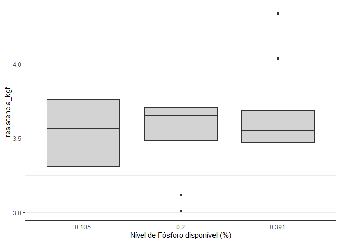
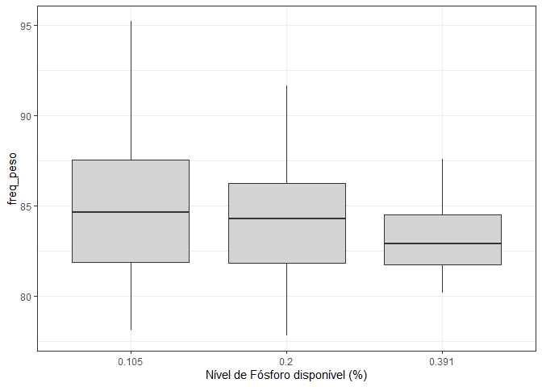
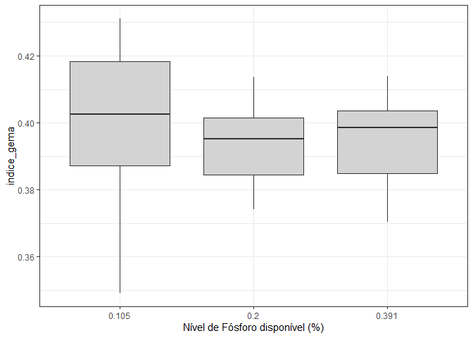
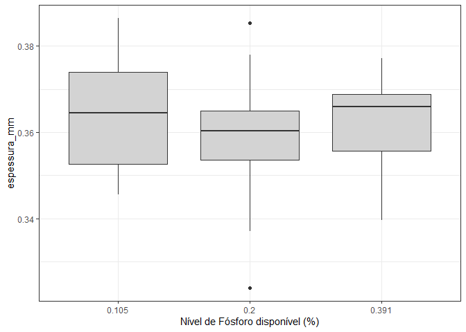

<!-- README.md is generated from README.Rmd. Please edit that file -->

# Análise qualidade da casca - mestrado João

## Carregando os pacotes no R

``` r
library(tidyverse)
library(lubridate)
library(skimr)
library(GGally)
library(ExpDes.pt)
```

## Pré-tratamento dos dados

-carregando o banco de dados; -mudando os nomes das colunas;

``` r
dados<- readxl::read_excel("data-raw/Dados Mestrado João.xlsx") |>
  janitor::clean_names()
dplyr::glimpse(dados)
#> Rows: 1,415
#> Columns: 23
#> $ data                  <dttm> 2021-05-14, 2021-05-14, 2021-05-14, 2021-05-14,~
#> $ no_ovo_egg_tester     <dbl> 2, 3, 4, 5, 6, 7, 8, 9, 10, 11, 12, 13, 14, 15, ~
#> $ linhagem              <chr> "H&N", "H&N", "H&N", "H&N", "H&N", "H&N", "H&N",~
#> $ box                   <dbl> 117, 117, 135, 135, 135, 152, 152, 152, 166, 166~
#> $ tratamento            <dbl> 1, 1, 1, 1, 1, 1, 1, 1, 1, 1, 1, 1, 1, 1, 1, 1, ~
#> $ repeticao             <dbl> 1, 1, 3, 3, 3, 5, 5, 5, 7, 7, 7, 8, 8, 8, 10, 10~
#> $ no_ovo                <dbl> 2, 3, 1, 2, 3, 1, 2, 3, 1, 2, 3, 1, 2, 3, 1, 2, ~
#> $ nivel_de_fosforo_disp <dbl> 0.391, 0.391, 0.391, 0.391, 0.391, 0.391, 0.391,~
#> $ frequencia_ressonante <dbl> 4679, 5560, 5568, 5087, 6197, 5222, 5653, 4870, ~
#> $ eixo_x_mm             <dbl> 44.59, 42.60, 44.75, 42.57, 44.76, 43.54, 43.31,~
#> $ eixo_y_mm             <dbl> 59.38, 59.04, 58.60, 56.67, 59.53, 58.65, 59.07,~
#> $ shape_index           <dbl> 75.09262, 72.15447, 76.36519, 75.11911, 75.18898~
#> $ peso_g                <dbl> 66.3, 64.3, 66.8, 61.0, 69.4, 64.5, 65.6, 70.3, ~
#> $ altura_de_albumen     <dbl> 5.8, 5.8, 7.5, 7.8, 5.9, 4.4, 6.5, 8.0, 6.5, 7.0~
#> $ cor_de_gema           <dbl> 4, 5, 5, 5, 4, 7, 7, 7, 5, 5, 5, 6, 6, 6, 4, 5, ~
#> $ uh                    <dbl> 73.0, 73.8, 84.8, 88.2, 72.7, 60.8, 78.6, 86.9, ~
#> $ resistencia_kgf       <chr> "3.4", "3.56", "5.22", "4.2300000000000004", "4.~
#> $ espessura_mm          <dbl> 0.37, 0.36, 0.39, 0.36, 0.39, 0.39, 0.33, 0.37, ~
#> $ altura_de_gema        <dbl> 16.6, 17.9, 17.3, 16.5, 18.0, 15.6, 19.6, 20.8, ~
#> $ diametro_de_gema      <dbl> 43.7, 43.7, 43.3, 43.0, 44.3, 44.3, 45.3, 43.7, ~
#> $ indice_gema           <dbl> 0.380, 0.410, 0.400, 0.384, 0.406, 0.352, 0.433,~
#> $ peso_casca            <dbl> 6.10, 5.99, 6.45, 5.49, 6.63, 6.77, 5.44, 6.59, ~
#> $ percent_casca         <dbl> 0.09200603, 0.09315708, 0.09655689, 0.09000000, ~
dados <- dados |> 
  filter(frequencia_ressonante <= 8000)
dados <- dados |> 
  mutate(
    class_peso = case_when(
      peso_g < 50 ~ "pequeno",
      peso_g < 55 ~ "medio",
      peso_g < 60 ~ "grande",
      peso_g < 65 ~ "extra_grande",
      TRUE ~ "jumbo"
    ),
    freq_peso = frequencia_ressonante / peso_g
  )
nd_filter <- c(0.105, 0.200, 0.391)
dados <- dados |> 
  filter(nivel_de_fosforo_disp %in% nd_filter)
# table(dados$class_peso)
```

-   lidando com os valores perdidos de `resistencia_kgf`;
-   definindo as datas da amostragem.

``` r
dados <-dados |>
  dplyr::mutate(
    resistencia_kgf = ifelse(resistencia_kgf == "Perdi", NA, resistencia_kgf),
    resistencia_kgf = as.numeric(resistencia_kgf),
    dia=round(as.numeric(difftime(data,"2021-05-13",units = "days"))),
    dia = dplyr::case_when(
      dia < 3 ~ 1,
      dia < 20 ~15,
      dia < 30 ~ 30,
      dia < 45 ~ 45,
      dia < 60 ~ 60
    )
  )
dplyr::glimpse(dados)
#> Rows: 681
#> Columns: 26
#> $ data                  <dttm> 2021-05-14, 2021-05-14, 2021-05-14, 2021-05-14,~
#> $ no_ovo_egg_tester     <dbl> 2, 3, 4, 5, 6, 7, 8, 9, 10, 11, 12, 13, 14, 15, ~
#> $ linhagem              <chr> "H&N", "H&N", "H&N", "H&N", "H&N", "H&N", "H&N",~
#> $ box                   <dbl> 117, 117, 135, 135, 135, 152, 152, 152, 166, 166~
#> $ tratamento            <dbl> 1, 1, 1, 1, 1, 1, 1, 1, 1, 1, 1, 1, 1, 1, 1, 1, ~
#> $ repeticao             <dbl> 1, 1, 3, 3, 3, 5, 5, 5, 7, 7, 7, 8, 8, 8, 10, 10~
#> $ no_ovo                <dbl> 2, 3, 1, 2, 3, 1, 2, 3, 1, 2, 3, 1, 2, 3, 1, 2, ~
#> $ nivel_de_fosforo_disp <dbl> 0.391, 0.391, 0.391, 0.391, 0.391, 0.391, 0.391,~
#> $ frequencia_ressonante <dbl> 4679, 5560, 5568, 5087, 6197, 5222, 5653, 4870, ~
#> $ eixo_x_mm             <dbl> 44.59, 42.60, 44.75, 42.57, 44.76, 43.54, 43.31,~
#> $ eixo_y_mm             <dbl> 59.38, 59.04, 58.60, 56.67, 59.53, 58.65, 59.07,~
#> $ shape_index           <dbl> 75.09262, 72.15447, 76.36519, 75.11911, 75.18898~
#> $ peso_g                <dbl> 66.3, 64.3, 66.8, 61.0, 69.4, 64.5, 65.6, 70.3, ~
#> $ altura_de_albumen     <dbl> 5.8, 5.8, 7.5, 7.8, 5.9, 4.4, 6.5, 8.0, 6.5, 7.0~
#> $ cor_de_gema           <dbl> 4, 5, 5, 5, 4, 7, 7, 7, 5, 5, 5, 6, 6, 6, 4, 5, ~
#> $ uh                    <dbl> 73.0, 73.8, 84.8, 88.2, 72.7, 60.8, 78.6, 86.9, ~
#> $ resistencia_kgf       <dbl> 3.40, 3.56, 5.22, 4.23, 4.07, 5.02, 3.32, 4.97, ~
#> $ espessura_mm          <dbl> 0.37, 0.36, 0.39, 0.36, 0.39, 0.39, 0.33, 0.37, ~
#> $ altura_de_gema        <dbl> 16.6, 17.9, 17.3, 16.5, 18.0, 15.6, 19.6, 20.8, ~
#> $ diametro_de_gema      <dbl> 43.7, 43.7, 43.3, 43.0, 44.3, 44.3, 45.3, 43.7, ~
#> $ indice_gema           <dbl> 0.380, 0.410, 0.400, 0.384, 0.406, 0.352, 0.433,~
#> $ peso_casca            <dbl> 6.10, 5.99, 6.45, 5.49, 6.63, 6.77, 5.44, 6.59, ~
#> $ percent_casca         <dbl> 0.09200603, 0.09315708, 0.09655689, 0.09000000, ~
#> $ class_peso            <chr> "jumbo", "extra_grande", "jumbo", "extra_grande"~
#> $ freq_peso             <dbl> 70.57315, 86.46967, 83.35329, 83.39344, 89.29395~
#> $ dia                   <dbl> 1, 1, 1, 1, 1, 1, 1, 1, 1, 1, 1, 1, 1, 1, 1, 1, ~
```

-   seleção das variáveis para a análise.

``` r
dados <- dados |>
  select(dia,
         repeticao,
         linhagem,
         nivel_de_fosforo_disp,
         class_peso,
         resistencia_kgf,
         frequencia_ressonante,
         freq_peso,
         shape_index,
         peso_g,
         altura_de_albumen,
         uh,
         altura_de_albumen,
         indice_gema,
         espessura_mm
         ) #|> 
  # mutate(log_frequencia_ressonante = log(frequencia_ressonante))
```

## Corrigindo os outliers

-   definindo uma função para o input de valores perdidos a partir da
    média do tratamento (Pd e Linhage).

``` r
input_na <- function(y,trat){
  df <- tibble(trat, y)
  vl <- is.na(y)
  df <- df[vl,]
  if(nrow(df) != 0){
    vetor_medias <- tapply(y,trat,mean,na.rm=TRUE)
    for(j in 1:nrow(df)){
      df[j,2] <- 
      vetor_medias[which(df$trat[j] == names(vetor_medias))]
    }
  }
  return(df$y)
}
```

``` r
dias <- unique(dados$dia)
linhagens <- unique(dados$linhagem)
for(k in 6:length(dados)){ # para cada variável no BD
  for(i in seq_along(dias)){
    da <- dados |>
      filter(dia == dias[i])
    Pd <- da$nivel_de_fosforo_disp
    Pd <- forcats::as_factor(Pd)
    Lin <- da$linhagem
    Lin <- forcats::as_factor(Lin)
    trat <- paste0(Lin,"_",Pd)
    y<-da[k] |>  pull()
    y[is.na(y)] <- input_na(y, trat)
    
    # boxplot_original <- tibble(trat,y) |>
    #   ggplot(aes(x=y, y=trat)) +
    #   geom_boxplot() +
    #   labs(title = paste0("ORIGINAL - Dia: ", dias[i],"; Variável: ",names(dados[k])))
    # print(boxplot_original)
    
    mod <- aov(y~trat)
    rs<-rstudent(mod)
    yp <- predict(mod)
    
    li<-quantile(rs, .25) - IQR(rs) *1.5
    ls<-quantile(rs, .75) + IQR(rs) *1.5
    # print({
    #   plot(rs ~yp)
    #   abline(h=c(li, ls), lty=2, col="red")
    # })
    regra <- rs >= ls | rs <= li
    da[da$dia == dias[i] & regra, k] <- yp[regra]
    
    # y <- da[k] |> pull()
    # boxplot_arrumado<-tibble(trat,y) |>
    #   ggplot(aes(x=y, y=trat)) +
    #   geom_boxplot() +
    #   labs(title = paste0("TRATADA - Dia: ", dias[i],"; Variável: ",names(dados[k])))
    # print(boxplot_arrumado)
    dados[dados$dia == dias[i],k] <- y
    
  }
}
```

## Análise de regressão linear

A análise foi realizada independete dos tratamentos para descrever o
comportamento das variáveis ao longo do dias por linhagem.

``` r
parametros <- names(dados)[6:(length(dados))]

for(i in 1:length(parametros)){
  da <- dados |>
    select(dia, linhagem, class_peso, parametros[i]) 
  names(da) <- c("dia","linhagem","class_peso","y")
  plot<-da |> 
    dplyr::group_by(dia, linhagem, class_peso) |>
    dplyr::summarise(re=mean(y, na.rm=TRUE)) |>
    ggplot(aes(x=dia, y=re, color=linhagem)) +
    geom_point() +
    geom_smooth(method = "lm")+
    labs(x="Dias",y=parametros[i]) +
    facet_wrap(~linhagem)
  print(plot)

  # tab <- da |>
  #   dplyr::group_by(dia,linhagem) |>
  #   dplyr::summarise(y=mean(y, na.rm=TRUE))
  # 
  # mod <- lm(y~dia + linhagem, data=tab)
  # print(summary.lm(mod))
  # plot(mod)
}
```

<!-- --><!-- --><!-- --><!-- --><!-- --><!-- --><!-- --><!-- --><!-- -->

## Estatística descritiva do banco de dados

-   resumo estatístico para todas as variáveios do banco de dados

``` r
skim(dados)
```

|                                                  |       |
|:-------------------------------------------------|:------|
| Name                                             | dados |
| Number of rows                                   | 681   |
| Number of columns                                | 14    |
| \_\_\_\_\_\_\_\_\_\_\_\_\_\_\_\_\_\_\_\_\_\_\_   |       |
| Column type frequency:                           |       |
| character                                        | 2     |
| numeric                                          | 12    |
| \_\_\_\_\_\_\_\_\_\_\_\_\_\_\_\_\_\_\_\_\_\_\_\_ |       |
| Group variables                                  | None  |

Data summary

**Variable type: character**

| skim\_variable | n\_missing | complete\_rate | min | max | empty | n\_unique | whitespace |
|:---------------|-----------:|---------------:|----:|----:|------:|----------:|-----------:|
| linhagem       |          0 |              1 |   3 |   6 |     0 |         2 |          0 |
| class\_peso    |          0 |              1 |   5 |  12 |     0 |         5 |          0 |

**Variable type: numeric**

| skim\_variable           | n\_missing | complete\_rate |    mean |     sd |      p0 |     p25 |     p50 |     p75 |    p100 | hist  |
|:-------------------------|-----------:|---------------:|--------:|-------:|--------:|--------:|--------:|--------:|--------:|:------|
| dia                      |          0 |              1 |   29.48 |  20.80 |    1.00 |   15.00 |   30.00 |   45.00 |   60.00 | ▇▇▇▇▇ |
| repeticao                |          0 |              1 |    8.42 |   4.52 |    1.00 |    4.00 |    8.00 |   12.00 |   16.00 | ▇▆▆▆▆ |
| nivel\_de\_fosforo\_disp |          0 |              1 |    0.23 |   0.12 |    0.10 |    0.10 |    0.20 |    0.39 |    0.39 | ▇▇▁▁▇ |
| resistencia\_kgf         |          0 |              1 |    3.59 |   0.86 |    0.89 |    2.99 |    3.63 |    4.17 |    6.23 | ▁▅▇▅▁ |
| frequencia\_ressonante   |          0 |              1 | 5313.72 | 426.22 | 4055.00 | 4961.00 | 5279.00 | 5578.00 | 7709.00 | ▁▇▅▁▁ |
| freq\_peso               |          0 |              1 |   84.09 |   9.66 |   66.08 |   77.49 |   82.68 |   89.25 |  137.40 | ▆▇▂▁▁ |
| shape\_index             |          0 |              1 |   74.85 |   2.91 |   63.26 |   73.00 |   74.70 |   76.68 |   84.04 | ▁▂▇▅▁ |
| peso\_g                  |          0 |              1 |   63.57 |   4.75 |   49.60 |   60.40 |   63.60 |   66.80 |   78.50 | ▁▅▇▃▁ |
| altura\_de\_albumen      |          0 |              1 |    6.58 |   1.27 |    3.10 |    5.80 |    6.50 |    7.30 |   14.00 | ▁▇▂▁▁ |
| uh                       |          0 |              1 |   78.96 |   8.78 |   39.70 |   73.90 |   79.60 |   84.50 |  112.30 | ▁▁▇▃▁ |
| indice\_gema             |          0 |              1 |    0.40 |   0.04 |    0.12 |    0.38 |    0.40 |    0.42 |    0.54 | ▁▁▂▇▁ |
| espessura\_mm            |          0 |              1 |    0.36 |   0.03 |    0.26 |    0.35 |    0.36 |    0.38 |    0.44 | ▁▂▇▇▁ |

## Gráfico de linhas

-   Análise para todas as variáveis do banco de dados, por nível de `P`.

``` r
for(i in 1:length(parametros)){
  da <- dados |>
    select(dia, linhagem, nivel_de_fosforo_disp, parametros[i]) 
  names(da) <- c("dia","linhagem","nivel_de_fosforo_disp","y")
  plot <- da |>
    group_by(dia, nivel_de_fosforo_disp) |> 
    drop_na() |> 
    mutate( y = mean(y), na.rm=TRUE) |> 
    ggplot(aes(x = dia, y = y, color=as.factor(nivel_de_fosforo_disp))) +
    geom_line() +
    labs(color="Nível de Fósforo disponível (%)", x="Dias",y=parametros[i])
  print(plot)
}
```

<!-- --><!-- --><!-- --><!-- --><!-- --><!-- --><!-- --><!-- --><!-- -->

### Independente do dia

``` r
for(i in 1:length(parametros)){
  da <- dados |>
    select(dia, repeticao, linhagem, nivel_de_fosforo_disp, parametros[i]) 
  names(da) <- c("dia","repeticao","linhagem","nivel_de_fosforo_disp","y")
  plot <- da |> 
    group_by(nivel_de_fosforo_disp, linhagem, repeticao) |>
    summarise(re = mean(y, na.rm=TRUE)) |>
    ggplot(aes(x = as.factor(nivel_de_fosforo_disp), y = re)) +
    geom_boxplot(fill="lightgray") +
    theme_bw() +
    labs(x="Nível de Fósforo disponível (%)",
         y = parametros[i])
  print(plot)
}
```

<!-- --><!-- --><!-- --><!-- --><!-- --><!-- --><!-- --><!-- --><!-- -->

## Matriz de correlação para linhagem **DEKALB**

``` r
classes<-c("grande", "extra_grande", "jumbo")
for(i in 1:length(classes)){
  dados  |>
    filter(linhagem == "Dekalb", 
           class_peso == classes[i],
           dia <= 30) |>
    drop_na() |> 
    select(resistencia_kgf:espessura_mm)  |>
    cor(use = "p")  |>
    corrplot::corrplot.mixed(lower.col = "black")
}
```

<!-- --><!-- --><!-- -->

## Matriz de correlação para linhagem **H&N**

``` r
for(i in 1:length(classes)){
  dados  |>
    filter(linhagem == "H&N", class_peso == classes[i]) |>
    drop_na() |> 
    select(resistencia_kgf:espessura_mm)  |>
    cor(use = "p")  |>
    corrplot:::corrplot.mixed(lower.col = "black")
}
```

<!-- --><!-- --><!-- -->

## Análise de variância

``` r
for(i in 1:length(parametros)){
  da <- dados |>
    select(dia, repeticao, linhagem, nivel_de_fosforo_disp, parametros[i]) 
  names(da) <- c("dia","repeticao","linhagem","nivel_de_fosforo_disp","y")
  
  da<- da |> 
    group_by(repeticao, linhagem, nivel_de_fosforo_disp) |> 
    summarise(y = mean(y, na.rm=TRUE))
  linhagem<-da$linhagem
  nivel_de_fosforo <- da$nivel_de_fosforo_disp
  y <- da$y
  print("-------------------------------------------------")
  print(paste0("Variável: ",parametros[i]))
  print("-------------------------------------------------")
  fat2.dic(linhagem,nivel_de_fosforo,y,quali = c(TRUE, FALSE), mcomp = "tukey",
           fac.names = c("Linhagem","Fosforo"))
}
#> `summarise()` has grouped output by 'repeticao', 'linhagem'. You can override using the `.groups` argument.
#> [1] "-------------------------------------------------"
#> [1] "Variável: resistencia_kgf"
#> [1] "-------------------------------------------------"
#> ------------------------------------------------------------------------
#> Legenda:
#> FATOR 1:  Linhagem 
#> FATOR 2:  Fosforo 
#> ------------------------------------------------------------------------
#> 
#> 
#> Quadro da analise de variancia
#> ------------------------------------------------------------------------
#>                  GL     SQ      QM     Fc   Pr>Fc
#> Linhagem          1 0.0221 0.02211 0.3272 0.57042
#> Fosforo           2 0.0493 0.02466 0.3650 0.69640
#> Linhagem*Fosforo  2 0.6842 0.34208 5.0630 0.01084
#> Residuo          41 2.7701 0.06756               
#> Total            46 3.5257                       
#> ------------------------------------------------------------------------
#> CV = 7.25 %
#> 
#> ------------------------------------------------------------------------
#> Teste de normalidade dos residuos (Shapiro-Wilk)
#> valor-p:  0.9937734 
#> De acordo com o teste de Shapiro-Wilk a 5% de significancia, os residuos podem ser considerados normais.
#> ------------------------------------------------------------------------
#> 
#> 
#> 
#> Interacao significativa: desdobrando a interacao
#> ------------------------------------------------------------------------
#> 
#> Desdobrando  Linhagem  dentro de cada nivel de  Fosforo 
#> ------------------------------------------------------------------------
#> ------------------------------------------------------------------------
#> Quadro da analise de variancia
#> ------------------------------------------------------------------------
#>                        GL      SQ      QM     Fc  Pr.Fc
#> Fosforo                 2 0.04933 0.02466 0.3650 0.6964
#> Linhagem:Fosforo 0.105  1 0.49368 0.49368 7.3068 0.0100
#> Linhagem:Fosforo 0.2    1 0.00010 0.00010 0.0015 0.9697
#> Linhagem:Fosforo 0.391  1 0.21437 0.21437 3.1728 0.0823
#> Residuo                41 2.77015 0.06756     NA     NA
#> Total                  46 3.52574 0.07665     NA     NA
#> ------------------------------------------------------------------------
#> 
#> 
#> 
#>  Linhagem  dentro do nivel  0.105  de  Fosforo 
#> ------------------------------------------------------------------------
#> Teste de Tukey
#> ------------------------------------------------------------------------
#> Grupos Tratamentos Medias
#> a     Dekalb      3.724969 
#>  b    H   3.373658 
#> ------------------------------------------------------------------------
#> 
#> 
#>  Linhagem  dentro do nivel  0.2  de  Fosforo 
#> 
#> De acordo com o teste F, as medias desse fator sao estatisticamente iguais.
#> ------------------------------------------------------------------------
#>     Niveis     Medias
#> 1   Dekalb   3.584874
#> 2        H   3.579903
#> ------------------------------------------------------------------------
#> 
#> 
#>  Linhagem  dentro do nivel  0.391  de  Fosforo 
#> 
#> De acordo com o teste F, as medias desse fator sao estatisticamente iguais.
#> ------------------------------------------------------------------------
#>     Niveis     Medias
#> 1   Dekalb   3.499607
#> 2        H   3.739232
#> ------------------------------------------------------------------------
#> 
#> 
#> 
#> Desdobrando  Fosforo  dentro de cada nivel de  Linhagem 
#> ------------------------------------------------------------------------
#> ------------------------------------------------------------------------
#> Quadro da analise de variancia
#> ------------------------------------------------------------------------
#>                         GL      SQ      QM     Fc  Pr.Fc
#> Linhagem                 1 0.02211 0.02211 0.3272 0.5704
#> Fosforo:Linhagem Dekalb  2 0.19597 0.09799 1.4503 0.2463
#> Fosforo:Linhagem H&N     2 0.53751 0.26876 3.9778 0.0264
#> Residuo                 41 2.77015 0.06756     NA     NA
#> Total                   46 3.52574 0.07665     NA     NA
#> ------------------------------------------------------------------------
#> 
#> 
#> 
#>  Fosforo  dentro do nivel  Dekalb  de  Linhagem 
#> 
#> De acordo com o teste F, as medias desse fator sao estatisticamente iguais.
#> ------------------------------------------------------------------------
#>     Niveis     Medias
#> 1    0.105   3.724969
#> 2      0.2   3.584874
#> 3    0.391   3.499607
#> ------------------------------------------------------------------------
#> 
#> 
#>  Fosforo  dentro do nivel  H&N  de  Linhagem 
#> ------------------------------------------------------------------------
#> Ajuste de modelos polinomiais de regressao
#> ------------------------------------------------------------------------
#> 
#> Modelo Linear
#> =========================================
#>    Estimativa Erro.padrao   tc    valor.p
#> -----------------------------------------
#> b0   3.2826     0.1163    28.2228    0   
#> b1   1.2143     0.4461    2.7218  0.0095 
#> -----------------------------------------
#> 
#> R2 do modelo linear
#> --------
#>   H&N   
#> --------
#> 0.931210
#> --------
#> 
#> Analise de variancia do modelo linear
#> ==================================================
#>                      GL   SQ     QM    Fc  valor.p
#> --------------------------------------------------
#> Efeito linear        1  0.5005 0.5005 7.41 0.00949
#> Desvios de Regressao 1  0.0370 0.0370 0.55 0.46365
#> Residuos             41 2.7702 0.0676             
#> --------------------------------------------------
#> ------------------------------------------------------------------------
#> 
#> Modelo quadratico
#> =========================================
#>    Estimativa Erro.padrao   tc    valor.p
#> -----------------------------------------
#> b0   3.0475     0.3383    9.0084     0   
#> b1   3.5966     3.2512    1.1063  0.2751 
#> b2  -4.6742     6.3184    -0.7398 0.4636 
#> -----------------------------------------
#> 
#> R2 do modelo quadratico
#> -
#> 1
#> -
#> 
#> Analise de variancia do modelo quadratico
#> ==================================================
#>                      GL   SQ     QM    Fc  valor.p
#> --------------------------------------------------
#> Efeito linear        1  0.5005 0.5005 7.41 0.00949
#> Efeito quadratico    1  0.0370 0.0370 0.55 0.46365
#> Desvios de Regressao 0    0      0     0      1   
#> Residuos             41 2.7702 0.0676             
#> --------------------------------------------------
#> ------------------------------------------------------------------------
#> `summarise()` has grouped output by 'repeticao', 'linhagem'. You can override using the `.groups` argument.
#> [1] "-------------------------------------------------"
#> [1] "Variável: frequencia_ressonante"
#> [1] "-------------------------------------------------"
#> ------------------------------------------------------------------------
#> Legenda:
#> FATOR 1:  Linhagem 
#> FATOR 2:  Fosforo 
#> ------------------------------------------------------------------------
#> 
#> 
#> Quadro da analise de variancia
#> ------------------------------------------------------------------------
#>                  GL     SQ      QM      Fc   Pr>Fc
#> Linhagem          1   7971  7971.3 0.47856 0.49297
#> Fosforo           2  34441 17220.4 1.03384 0.36472
#> Linhagem*Fosforo  2   5096  2547.8 0.15296 0.85865
#> Residuo          41 682924 16656.7                
#> Total            46 730432                        
#> ------------------------------------------------------------------------
#> CV = 2.43 %
#> 
#> ------------------------------------------------------------------------
#> Teste de normalidade dos residuos (Shapiro-Wilk)
#> valor-p:  0.3127929 
#> De acordo com o teste de Shapiro-Wilk a 5% de significancia, os residuos podem ser considerados normais.
#> ------------------------------------------------------------------------
#> 
#> Interacao nao significativa: analisando os efeitos simples
#> ------------------------------------------------------------------------
#> Linhagem
#> De acordo com o teste F, as medias desse fator sao estatisticamente iguais.
#> ------------------------------------------------------------------------
#>   Niveis   Medias
#> 1 Dekalb 5301.889
#> 2      H 5327.941
#> ------------------------------------------------------------------------
#> Fosforo
#> De acordo com o teste F, as medias desse fator sao estatisticamente iguais.
#> 
#> ------------------------------------------------------------------------
#>   Niveis   Medias
#> 1  0.105 5345.048
#> 2    0.2 5279.987
#> 3  0.391 5320.899
#> ------------------------------------------------------------------------
#> `summarise()` has grouped output by 'repeticao', 'linhagem'. You can override using the `.groups` argument.
#> [1] "-------------------------------------------------"
#> [1] "Variável: freq_peso"
#> [1] "-------------------------------------------------"
#> ------------------------------------------------------------------------
#> Legenda:
#> FATOR 1:  Linhagem 
#> FATOR 2:  Fosforo 
#> ------------------------------------------------------------------------
#> 
#> 
#> Quadro da analise de variancia
#> ------------------------------------------------------------------------
#>                  GL     SQ     QM     Fc   Pr>Fc
#> Linhagem          1  74.00 74.004 6.2847 0.01624
#> Fosforo           2  28.98 14.490 1.2305 0.30269
#> Linhagem*Fosforo  2   8.02  4.012 0.3407 0.71328
#> Residuo          41 482.79 11.775               
#> Total            46 593.80                      
#> ------------------------------------------------------------------------
#> CV = 4.08 %
#> 
#> ------------------------------------------------------------------------
#> Teste de normalidade dos residuos (Shapiro-Wilk)
#> valor-p:  0.3120351 
#> De acordo com o teste de Shapiro-Wilk a 5% de significancia, os residuos podem ser considerados normais.
#> ------------------------------------------------------------------------
#> 
#> Interacao nao significativa: analisando os efeitos simples
#> ------------------------------------------------------------------------
#> Linhagem
#> Teste de Tukey
#> ------------------------------------------------------------------------
#> Grupos Tratamentos Medias
#> a     Dekalb      85.41633 
#>  b    H   82.90613 
#> ------------------------------------------------------------------------
#> 
#> Fosforo
#> De acordo com o teste F, as medias desse fator sao estatisticamente iguais.
#> 
#> ------------------------------------------------------------------------
#>   Niveis   Medias
#> 1  0.105 85.15110
#> 2    0.2 84.04659
#> 3  0.391 83.14396
#> ------------------------------------------------------------------------
#> `summarise()` has grouped output by 'repeticao', 'linhagem'. You can override using the `.groups` argument.
#> [1] "-------------------------------------------------"
#> [1] "Variável: shape_index"
#> [1] "-------------------------------------------------"
#> ------------------------------------------------------------------------
#> Legenda:
#> FATOR 1:  Linhagem 
#> FATOR 2:  Fosforo 
#> ------------------------------------------------------------------------
#> 
#> 
#> Quadro da analise de variancia
#> ------------------------------------------------------------------------
#>                  GL     SQ     QM     Fc   Pr>Fc
#> Linhagem          1 41.125 41.125 37.984 0.00000
#> Fosforo           2  2.534  1.267  1.170 0.32041
#> Linhagem*Fosforo  2  0.295  0.147  0.136 0.87321
#> Residuo          41 44.391  1.083               
#> Total            46 88.345                      
#> ------------------------------------------------------------------------
#> CV = 1.39 %
#> 
#> ------------------------------------------------------------------------
#> Teste de normalidade dos residuos (Shapiro-Wilk)
#> valor-p:  0.0553683 
#> De acordo com o teste de Shapiro-Wilk a 5% de significancia, os residuos podem ser considerados normais.
#> ------------------------------------------------------------------------
#> 
#> Interacao nao significativa: analisando os efeitos simples
#> ------------------------------------------------------------------------
#> Linhagem
#> Teste de Tukey
#> ------------------------------------------------------------------------
#> Grupos Tratamentos Medias
#> a     Dekalb      75.81493 
#>  b    H   73.94367 
#> ------------------------------------------------------------------------
#> 
#> Fosforo
#> De acordo com o teste F, as medias desse fator sao estatisticamente iguais.
#> 
#> ------------------------------------------------------------------------
#>   Niveis   Medias
#> 1  0.105 74.98703
#> 2    0.2 74.56275
#> 3  0.391 75.03966
#> ------------------------------------------------------------------------
#> `summarise()` has grouped output by 'repeticao', 'linhagem'. You can override using the `.groups` argument.
#> [1] "-------------------------------------------------"
#> [1] "Variável: peso_g"
#> [1] "-------------------------------------------------"
#> ------------------------------------------------------------------------
#> Legenda:
#> FATOR 1:  Linhagem 
#> FATOR 2:  Fosforo 
#> ------------------------------------------------------------------------
#> 
#> 
#> Quadro da analise de variancia
#> ------------------------------------------------------------------------
#>                  GL      SQ     QM      Fc   Pr>Fc
#> Linhagem          1  58.897 58.897 18.6064 0.00010
#> Fosforo           2  10.062  5.031  1.5894 0.21636
#> Linhagem*Fosforo  2   3.327  1.664  0.5256 0.59513
#> Residuo          41 129.782  3.165                
#> Total            46 202.069                       
#> ------------------------------------------------------------------------
#> CV = 2.8 %
#> 
#> ------------------------------------------------------------------------
#> Teste de normalidade dos residuos (Shapiro-Wilk)
#> valor-p:  0.9143377 
#> De acordo com o teste de Shapiro-Wilk a 5% de significancia, os residuos podem ser considerados normais.
#> ------------------------------------------------------------------------
#> 
#> Interacao nao significativa: analisando os efeitos simples
#> ------------------------------------------------------------------------
#> Linhagem
#> Teste de Tukey
#> ------------------------------------------------------------------------
#> Grupos Tratamentos Medias
#> a     H   64.65266 
#>  b    Dekalb      62.41328 
#> ------------------------------------------------------------------------
#> 
#> Fosforo
#> De acordo com o teste F, as medias desse fator sao estatisticamente iguais.
#> 
#> ------------------------------------------------------------------------
#>   Niveis   Medias
#> 1  0.105 63.19126
#> 2    0.2 63.24206
#> 3  0.391 64.28241
#> ------------------------------------------------------------------------
#> `summarise()` has grouped output by 'repeticao', 'linhagem'. You can override using the `.groups` argument.
#> [1] "-------------------------------------------------"
#> [1] "Variável: altura_de_albumen"
#> [1] "-------------------------------------------------"
#> ------------------------------------------------------------------------
#> Legenda:
#> FATOR 1:  Linhagem 
#> FATOR 2:  Fosforo 
#> ------------------------------------------------------------------------
#> 
#> 
#> Quadro da analise de variancia
#> ------------------------------------------------------------------------
#>                  GL     SQ      QM     Fc    Pr>Fc
#> Linhagem          1 0.4418 0.44177 2.7561 0.104515
#> Fosforo           2 0.3892 0.19458 1.2139 0.307477
#> Linhagem*Fosforo  2 1.6143 0.80713 5.0355 0.011079
#> Residuo          41 6.5718 0.16029                
#> Total            46 9.0170                        
#> ------------------------------------------------------------------------
#> CV = 6.09 %
#> 
#> ------------------------------------------------------------------------
#> Teste de normalidade dos residuos (Shapiro-Wilk)
#> valor-p:  0.1132 
#> De acordo com o teste de Shapiro-Wilk a 5% de significancia, os residuos podem ser considerados normais.
#> ------------------------------------------------------------------------
#> 
#> 
#> 
#> Interacao significativa: desdobrando a interacao
#> ------------------------------------------------------------------------
#> 
#> Desdobrando  Linhagem  dentro de cada nivel de  Fosforo 
#> ------------------------------------------------------------------------
#> ------------------------------------------------------------------------
#> Quadro da analise de variancia
#> ------------------------------------------------------------------------
#>                        GL      SQ      QM      Fc  Pr.Fc
#> Fosforo                 2 0.38916 0.19458  1.2139 0.3075
#> Linhagem:Fosforo 0.105  1 1.66794 1.66794 10.4059 0.0025
#> Linhagem:Fosforo 0.2    1 0.10842 0.10842  0.6764 0.4156
#> Linhagem:Fosforo 0.391  1 0.26684 0.26684  1.6647 0.2042
#> Residuo                41 6.57184 0.16029      NA     NA
#> Total                  46 9.01702 0.19602      NA     NA
#> ------------------------------------------------------------------------
#> 
#> 
#> 
#>  Linhagem  dentro do nivel  0.105  de  Fosforo 
#> ------------------------------------------------------------------------
#> Teste de Tukey
#> ------------------------------------------------------------------------
#> Grupos Tratamentos Medias
#> a     H   6.960179 
#>  b    Dekalb      6.314435 
#> ------------------------------------------------------------------------
#> 
#> 
#>  Linhagem  dentro do nivel  0.2  de  Fosforo 
#> 
#> De acordo com o teste F, as medias desse fator sao estatisticamente iguais.
#> ------------------------------------------------------------------------
#>     Niveis     Medias
#> 1   Dekalb   6.362083
#> 2        H   6.526717
#> ------------------------------------------------------------------------
#> 
#> 
#>  Linhagem  dentro do nivel  0.391  de  Fosforo 
#> 
#> De acordo com o teste F, as medias desse fator sao estatisticamente iguais.
#> ------------------------------------------------------------------------
#>     Niveis     Medias
#> 1   Dekalb   6.784490
#> 2        H   6.517143
#> ------------------------------------------------------------------------
#> 
#> 
#> 
#> Desdobrando  Fosforo  dentro de cada nivel de  Linhagem 
#> ------------------------------------------------------------------------
#> ------------------------------------------------------------------------
#> Quadro da analise de variancia
#> ------------------------------------------------------------------------
#>                         GL      SQ      QM     Fc  Pr.Fc
#> Linhagem                 1 0.44177 0.44177 2.7561 0.1045
#> Fosforo:Linhagem Dekalb  2 0.97872 0.48936 3.0530 0.0581
#> Fosforo:Linhagem H&N     2 1.02470 0.51235 3.1964 0.0513
#> Residuo                 41 6.57184 0.16029     NA     NA
#> Total                   46 9.01702 0.19602     NA     NA
#> ------------------------------------------------------------------------
#> 
#> 
#> 
#>  Fosforo  dentro do nivel  Dekalb  de  Linhagem 
#> 
#> De acordo com o teste F, as medias desse fator sao estatisticamente iguais.
#> ------------------------------------------------------------------------
#>     Niveis     Medias
#> 1    0.105   6.314435
#> 2      0.2   6.362083
#> 3    0.391   6.784490
#> ------------------------------------------------------------------------
#> 
#> 
#>  Fosforo  dentro do nivel  H&N  de  Linhagem 
#> 
#> De acordo com o teste F, as medias desse fator sao estatisticamente iguais.
#> ------------------------------------------------------------------------
#>     Niveis     Medias
#> 1    0.105   6.960179
#> 2      0.2   6.526717
#> 3    0.391   6.517143
#> ------------------------------------------------------------------------
#> `summarise()` has grouped output by 'repeticao', 'linhagem'. You can override using the `.groups` argument.
#> [1] "-------------------------------------------------"
#> [1] "Variável: uh"
#> [1] "-------------------------------------------------"
#> ------------------------------------------------------------------------
#> Legenda:
#> FATOR 1:  Linhagem 
#> FATOR 2:  Fosforo 
#> ------------------------------------------------------------------------
#> 
#> 
#> Quadro da analise de variancia
#> ------------------------------------------------------------------------
#>                  GL     SQ     QM     Fc   Pr>Fc
#> Linhagem          1   2.12  2.117 0.2623 0.61127
#> Fosforo           2  18.72  9.358 1.1598 0.32362
#> Linhagem*Fosforo  2  79.42 39.708 4.9211 0.01215
#> Residuo          41 330.82  8.069               
#> Total            46 431.07                      
#> ------------------------------------------------------------------------
#> CV = 3.6 %
#> 
#> ------------------------------------------------------------------------
#> Teste de normalidade dos residuos (Shapiro-Wilk)
#> valor-p:  0.5322201 
#> De acordo com o teste de Shapiro-Wilk a 5% de significancia, os residuos podem ser considerados normais.
#> ------------------------------------------------------------------------
#> 
#> 
#> 
#> Interacao significativa: desdobrando a interacao
#> ------------------------------------------------------------------------
#> 
#> Desdobrando  Linhagem  dentro de cada nivel de  Fosforo 
#> ------------------------------------------------------------------------
#> ------------------------------------------------------------------------
#> Quadro da analise de variancia
#> ------------------------------------------------------------------------
#>                        GL        SQ       QM     Fc  Pr.Fc
#> Fosforo                 2  18.71643  9.35821 1.1598 0.3236
#> Linhagem:Fosforo 0.105  1  59.06426 59.06426 7.3200 0.0099
#> Linhagem:Fosforo 0.2    1   0.54535  0.54535 0.0676 0.7962
#> Linhagem:Fosforo 0.391  1  21.82519 21.82519 2.7049 0.1077
#> Residuo                41 330.82327  8.06886     NA     NA
#> Total                  46 431.07237  9.37114     NA     NA
#> ------------------------------------------------------------------------
#> 
#> 
#> 
#>  Linhagem  dentro do nivel  0.105  de  Fosforo 
#> ------------------------------------------------------------------------
#> Teste de Tukey
#> ------------------------------------------------------------------------
#> Grupos Tratamentos Medias
#> a     H   81.48464 
#>  b    Dekalb      77.64198 
#> ------------------------------------------------------------------------
#> 
#> 
#>  Linhagem  dentro do nivel  0.2  de  Fosforo 
#> 
#> De acordo com o teste F, as medias desse fator sao estatisticamente iguais.
#> ------------------------------------------------------------------------
#>     Niveis     Medias
#> 1   Dekalb   78.26609
#> 2        H   77.89685
#> ------------------------------------------------------------------------
#> 
#> 
#>  Linhagem  dentro do nivel  0.391  de  Fosforo 
#> 
#> De acordo com o teste F, as medias desse fator sao estatisticamente iguais.
#> ------------------------------------------------------------------------
#>     Niveis     Medias
#> 1   Dekalb   80.46143
#> 2        H   78.04357
#> ------------------------------------------------------------------------
#> 
#> 
#> 
#> Desdobrando  Fosforo  dentro de cada nivel de  Linhagem 
#> ------------------------------------------------------------------------
#> ------------------------------------------------------------------------
#> Quadro da analise de variancia
#> ------------------------------------------------------------------------
#>                         GL        SQ       QM     Fc  Pr.Fc
#> Linhagem                 1   2.11673  2.11673 0.2623 0.6113
#> Fosforo:Linhagem Dekalb  2  32.17310 16.08655 1.9937 0.1492
#> Fosforo:Linhagem H&N     2  65.95927 32.97963 4.0873 0.0241
#> Residuo                 41 330.82327  8.06886     NA     NA
#> Total                   46 431.07237  9.37114     NA     NA
#> ------------------------------------------------------------------------
#> 
#> 
#> 
#>  Fosforo  dentro do nivel  Dekalb  de  Linhagem 
#> 
#> De acordo com o teste F, as medias desse fator sao estatisticamente iguais.
#> ------------------------------------------------------------------------
#>     Niveis     Medias
#> 1    0.105   77.64198
#> 2      0.2   78.26609
#> 3    0.391   80.46143
#> ------------------------------------------------------------------------
#> 
#> 
#>  Fosforo  dentro do nivel  H&N  de  Linhagem 
#> ------------------------------------------------------------------------
#> Ajuste de modelos polinomiais de regressao
#> ------------------------------------------------------------------------
#> 
#> Modelo Linear
#> =========================================
#>    Estimativa Erro.padrao   tc    valor.p
#> -----------------------------------------
#> b0  81.5053     1.2710    64.1250    0   
#> b1  -10.1881    4.8753    -2.0897 0.0429 
#> -----------------------------------------
#> 
#> R2 do modelo linear
#> --------
#>   H&N   
#> --------
#> 0.534211
#> --------
#> 
#> Analise de variancia do modelo linear
#> =====================================================
#>                      GL    SQ      QM     Fc  valor.p
#> -----------------------------------------------------
#> Efeito linear        1  35.2362  35.2362 4.37 0.04289
#> Desvios de Regressao 1  30.7231  30.7231 3.81 0.05788
#> Residuos             41 330.8233 8.0689              
#> -----------------------------------------------------
#> ------------------------------------------------------------------------
#> 
#> Modelo quadratico
#> =========================================
#>    Estimativa Erro.padrao   tc    valor.p
#> -----------------------------------------
#> b0  88.2795     3.6970    23.8788    0   
#> b1  -78.8605    35.5291   -2.2196 0.0320 
#> b2  134.7355    69.0487   1.9513  0.0579 
#> -----------------------------------------
#> 
#> R2 do modelo quadratico
#> -
#> 1
#> -
#> 
#> Analise de variancia do modelo quadratico
#> =====================================================
#>                      GL    SQ      QM     Fc  valor.p
#> -----------------------------------------------------
#> Efeito linear        1  35.2362  35.2362 4.37 0.04289
#> Efeito quadratico    1  30.7231  30.7231 3.81 0.05788
#> Desvios de Regressao 0     0        0     0      1   
#> Residuos             41 330.8233 8.0689              
#> -----------------------------------------------------
#> ------------------------------------------------------------------------
#> `summarise()` has grouped output by 'repeticao', 'linhagem'. You can override using the `.groups` argument.
#> [1] "-------------------------------------------------"
#> [1] "Variável: indice_gema"
#> [1] "-------------------------------------------------"
#> ------------------------------------------------------------------------
#> Legenda:
#> FATOR 1:  Linhagem 
#> FATOR 2:  Fosforo 
#> ------------------------------------------------------------------------
#> 
#> 
#> Quadro da analise de variancia
#> ------------------------------------------------------------------------
#>                  GL        SQ        QM     Fc    Pr>Fc
#> Linhagem          1 0.0050600 0.0050600 39.390 0.000000
#> Fosforo           2 0.0006583 0.0003292  2.562 0.089421
#> Linhagem*Fosforo  2 0.0008968 0.0004484  3.491 0.039819
#> Residuo          41 0.0052668 0.0001285                
#> Total            46 0.0118819                          
#> ------------------------------------------------------------------------
#> CV = 2.86 %
#> 
#> ------------------------------------------------------------------------
#> Teste de normalidade dos residuos (Shapiro-Wilk)
#> valor-p:  0.1194096 
#> De acordo com o teste de Shapiro-Wilk a 5% de significancia, os residuos podem ser considerados normais.
#> ------------------------------------------------------------------------
#> 
#> 
#> 
#> Interacao significativa: desdobrando a interacao
#> ------------------------------------------------------------------------
#> 
#> Desdobrando  Linhagem  dentro de cada nivel de  Fosforo 
#> ------------------------------------------------------------------------
#> ------------------------------------------------------------------------
#> Quadro da analise de variancia
#> ------------------------------------------------------------------------
#>                        GL      SQ      QM      Fc  Pr.Fc
#> Fosforo                 2 0.00066 0.00033  2.5623 0.0894
#> Linhagem:Fosforo 0.105  1 0.00428 0.00428 33.3446 0.0000
#> Linhagem:Fosforo 0.2    1 0.00062 0.00062  4.8156 0.0339
#> Linhagem:Fosforo 0.391  1 0.00110 0.00110  8.6004 0.0055
#> Residuo                41 0.00527 0.00013      NA     NA
#> Total                  46 0.01188 0.00026      NA     NA
#> ------------------------------------------------------------------------
#> 
#> 
#> 
#>  Linhagem  dentro do nivel  0.105  de  Fosforo 
#> ------------------------------------------------------------------------
#> Teste de Tukey
#> ------------------------------------------------------------------------
#> Grupos Tratamentos Medias
#> a     H   0.417625 
#>  b    Dekalb      0.3849011 
#> ------------------------------------------------------------------------
#> 
#> 
#>  Linhagem  dentro do nivel  0.2  de  Fosforo 
#> ------------------------------------------------------------------------
#> Teste de Tukey
#> ------------------------------------------------------------------------
#> Grupos Tratamentos Medias
#> a     H   0.3995363 
#>  b    Dekalb      0.3871004 
#> ------------------------------------------------------------------------
#> 
#> 
#>  Linhagem  dentro do nivel  0.391  de  Fosforo 
#> ------------------------------------------------------------------------
#> Teste de Tukey
#> ------------------------------------------------------------------------
#> Grupos Tratamentos Medias
#> a     H   0.4021373 
#>  b    Dekalb      0.3849347 
#> ------------------------------------------------------------------------
#> 
#> 
#> 
#> Desdobrando  Fosforo  dentro de cada nivel de  Linhagem 
#> ------------------------------------------------------------------------
#> ------------------------------------------------------------------------
#> Quadro da analise de variancia
#> ------------------------------------------------------------------------
#>                         GL      SQ      QM      Fc  Pr.Fc
#> Linhagem                 1 0.00506 0.00506 39.3902 0.0000
#> Fosforo:Linhagem Dekalb  2 0.00002 0.00001  0.0968 0.9079
#> Fosforo:Linhagem H&N     2 0.00153 0.00077  5.9561 0.0054
#> Residuo                 41 0.00527 0.00013      NA     NA
#> Total                   46 0.01188 0.00026      NA     NA
#> ------------------------------------------------------------------------
#> 
#> 
#> 
#>  Fosforo  dentro do nivel  Dekalb  de  Linhagem 
#> 
#> De acordo com o teste F, as medias desse fator sao estatisticamente iguais.
#> ------------------------------------------------------------------------
#>     Niveis     Medias
#> 1    0.105  0.3849011
#> 2      0.2  0.3871004
#> 3    0.391  0.3849347
#> ------------------------------------------------------------------------
#> 
#> 
#>  Fosforo  dentro do nivel  H&N  de  Linhagem 
#> ------------------------------------------------------------------------
#> Ajuste de modelos polinomiais de regressao
#> ------------------------------------------------------------------------
#> 
#> Modelo Linear
#> =========================================
#>    Estimativa Erro.padrao   tc    valor.p
#> -----------------------------------------
#> b0   0.4167     0.0051    82.1717    0   
#> b1  -0.0444     0.0194    -2.2820 0.0278 
#> -----------------------------------------
#> 
#> R2 do modelo linear
#> --------
#>   H&N   
#> --------
#> 0.437166
#> --------
#> 
#> Analise de variancia do modelo linear
#> ==================================================
#>                      GL   SQ     QM    Fc  valor.p
#> --------------------------------------------------
#> Efeito linear        1  0.0007 0.0007 5.21 0.02775
#> Desvios de Regressao 1  0.0009 0.0009 6.7  0.01325
#> Residuos             41 0.0053 0.0001             
#> --------------------------------------------------
#> ------------------------------------------------------------------------
#> 
#> Modelo quadratico
#> =========================================
#>    Estimativa Erro.padrao   tc    valor.p
#> -----------------------------------------
#> b0   0.4526     0.0147    30.6824    0   
#> b1  -0.4080     0.1418    -2.8780 0.0063 
#> b2   0.7134     0.2755    2.5893  0.0132 
#> -----------------------------------------
#> 
#> R2 do modelo quadratico
#> -
#> 1
#> -
#> 
#> Analise de variancia do modelo quadratico
#> ==================================================
#>                      GL   SQ     QM    Fc  valor.p
#> --------------------------------------------------
#> Efeito linear        1  0.0007 0.0007 5.21 0.02775
#> Efeito quadratico    1  0.0009 0.0009 6.7  0.01325
#> Desvios de Regressao 0    0      0     0      1   
#> Residuos             41 0.0053 0.0001             
#> --------------------------------------------------
#> ------------------------------------------------------------------------
#> `summarise()` has grouped output by 'repeticao', 'linhagem'. You can override using the `.groups` argument.
#> [1] "-------------------------------------------------"
#> [1] "Variável: espessura_mm"
#> [1] "-------------------------------------------------"
#> ------------------------------------------------------------------------
#> Legenda:
#> FATOR 1:  Linhagem 
#> FATOR 2:  Fosforo 
#> ------------------------------------------------------------------------
#> 
#> 
#> Quadro da analise de variancia
#> ------------------------------------------------------------------------
#>                  GL        SQ         QM     Fc   Pr>Fc
#> Linhagem          1 0.0007598 0.00075980 5.5670 0.02315
#> Fosforo           2 0.0002066 0.00010330 0.7569 0.47558
#> Linhagem*Fosforo  2 0.0003427 0.00017137 1.2557 0.29561
#> Residuo          41 0.0055958 0.00013648               
#> Total            46 0.0069049                          
#> ------------------------------------------------------------------------
#> CV = 3.23 %
#> 
#> ------------------------------------------------------------------------
#> Teste de normalidade dos residuos (Shapiro-Wilk)
#> valor-p:  0.9503493 
#> De acordo com o teste de Shapiro-Wilk a 5% de significancia, os residuos podem ser considerados normais.
#> ------------------------------------------------------------------------
#> 
#> Interacao nao significativa: analisando os efeitos simples
#> ------------------------------------------------------------------------
#> Linhagem
#> Teste de Tukey
#> ------------------------------------------------------------------------
#> Grupos Tratamentos Medias
#> a     H   0.3659104 
#>  b    Dekalb      0.3578672 
#> ------------------------------------------------------------------------
#> 
#> Fosforo
#> De acordo com o teste F, as medias desse fator sao estatisticamente iguais.
#> 
#> ------------------------------------------------------------------------
#>   Niveis    Medias
#> 1  0.105 0.3642846
#> 2    0.2 0.3592250
#> 3  0.391 0.3624427
#> ------------------------------------------------------------------------
```

## Adicionando o dia na análise (provisória)

``` r
for(i in 1:length(parametros)){
  da <- dados |>
    select(dia, repeticao, linhagem, nivel_de_fosforo_disp, parametros[i]) 
  names(da) <- c("dia","repeticao","linhagem","nivel_de_fosforo_disp","y")
  
  da<- da |> 
    group_by(dia, repeticao, linhagem, nivel_de_fosforo_disp) |> 
    summarise(y = mean(y, na.rm=TRUE))
  linhagem<-da$linhagem
  nivel_de_fosforo <- da$nivel_de_fosforo_disp
  y <- da$y
  dia <- da$dia
  print("-------------------------------------------------")
  print(paste0("Variável: ",parametros[i]))
  print("-------------------------------------------------")
  fat3.dic(dia, linhagem,nivel_de_fosforo,y,quali = c(TRUE, TRUE, FALSE), mcomp = "tukey",
           fac.names = c("Dia", "Linhagem","Fosforo"))
}
#> `summarise()` has grouped output by 'dia', 'repeticao', 'linhagem'. You can override using the `.groups` argument.
#> [1] "-------------------------------------------------"
#> [1] "Variável: resistencia_kgf"
#> [1] "-------------------------------------------------"
#> ------------------------------------------------------------------------
#> Legenda:
#> FATOR 1:  Dia 
#> FATOR 2:  Linhagem 
#> FATOR 3:  Fosforo 
#> ------------------------------------------------------------------------
#> 
#> ------------------------------------------------------------------------
#> Quadro da analise de variancia
#> ------------------------------------------------------------------------
#>                       GL       SQ      QM     Fc  Pr>Fc
#> Dia                    4  3.82691 0.95673 3.4798 0.0089
#> Linhagem               1  0.07239 0.07239 0.2633 0.6084
#> Fosforo                2  0.28664 0.14332 0.5213 0.5945
#> Dia*Linhagem           4  0.42318  0.1058 0.3848 0.8194
#> Dia*Fosforo            8  0.76907 0.09613 0.3497 0.9452
#> Linhagem*Fosforo       2  3.59067 1.79534 6.5301 0.0018
#> Dia*Linhagem*Fosforo   8  2.75365 0.34421  1.252 0.2706
#> Residuo              205 56.36137 0.27493              
#> Total                234 68.08388                      
#> ------------------------------------------------------------------------
#> CV = 14.62 %
#> 
#> ------------------------------------------------------------------------
#> Teste de normalidade dos residuos (Shapiro-Wilk)
#> valor-p:  0.5884888 
#> De acordo com o teste de Shapiro-Wilk a 5% de significancia, os residuos podem ser considerados normais.
#> ------------------------------------------------------------------------
#> 
#> 
#> 
#> Interacao Linhagem*Fosforo  significativa: desdobrando a interacao
#> ------------------------------------------------------------------------
#> 
#> Desdobrando  Linhagem  dentro de cada nivel de  Fosforo 
#> ------------------------------------------------------------------------
#> ------------------------------------------------------------------------
#> Quadro da analise de variancia
#> ------------------------------------------------------------------------
#>                         GL       SQ      QM     Fc  Pr>Fc
#> Linhagem:Fosforo 0.105   1  2.48732 2.48732  9.047  0.003
#> Linhagem:Fosforo 0.2     1  0.00152 0.00152 0.0055 0.9409
#> Linhagem:Fosforo 0.391   1  1.18284 1.18284 4.3023 0.0393
#> Residuo                205 56.36137 0.27493              
#> ------------------------------------------------------------------------
#> 
#> 
#> 
#>  Linhagem  dentro do nivel  0.105  de  Fosforo 
#> ------------------------------------------------------------------------
#> Teste de Tukey
#> ------------------------------------------------------------------------
#> Grupos Tratamentos Medias
#> a     Dekalb      3.725712 
#>  b    H   3.373056 
#> ------------------------------------------------------------------------
#> 
#> 
#>  Linhagem  dentro do nivel  0.2  de  Fosforo 
#> 
#> De acordo com o teste F, as medias desse fator sao estatisticamente iguais.
#> ------------------------------------------------------------------------
#>     Niveis     Medias
#> 1   Dekalb   3.573125
#> 2        H   3.581833
#> ------------------------------------------------------------------------
#> 
#> 
#>  Linhagem  dentro do nivel  0.391  de  Fosforo 
#> ------------------------------------------------------------------------
#> Teste de Tukey
#> ------------------------------------------------------------------------
#> Grupos Tratamentos Medias
#> a     H   3.750375 
#>  b    Dekalb      3.498648 
#> ------------------------------------------------------------------------
#> 
#> 
#> 
#> Desdobrando  Fosforo  dentro de cada nivel de  Linhagem 
#> ------------------------------------------------------------------------
#> ------------------------------------------------------------------------
#> Quadro da analise de variancia
#> ------------------------------------------------------------------------
#>                          GL       SQ      QM     Fc  Pr>Fc
#> Fosforo:Linhagem Dekalb   2  1.01913 0.50956 1.8534 0.1593
#> Fosforo:Linhagem H&N      2  2.85818 1.42909  5.198 0.0063
#> Residuo                 205 56.36137 0.27493              
#> ------------------------------------------------------------------------
#> 
#> 
#> 
#>  Fosforo  dentro do nivel  Dekalb  de  Linhagem 
#> 
#> De acordo com o teste F, as medias desse fator sao estatisticamente iguais.
#> ------------------------------------------------------------------------
#>     Niveis     Medias
#> 1    0.105   3.725712
#> 2      0.2   3.573125
#> 3    0.391   3.498648
#> ------------------------------------------------------------------------
#> 
#> 
#>  Fosforo  dentro do nivel  H&N  de  Linhagem 
#> ------------------------------------------------------------------------
#> Ajuste de modelos polinomiais de regressao
#> ------------------------------------------------------------------------
#> 
#> Modelo Linear
#> =========================================
#>    Estimativa Erro.padrao   tc    valor.p
#> -----------------------------------------
#> b0   3.2769     0.1049    31.2311    0   
#> b1   1.2564     0.4025    3.1217  0.0021 
#> -----------------------------------------
#> 
#> R2 do modelo linear
#> --------
#>   H&N   
#> --------
#> 0.937388
#> --------
#> 
#> Analise de variancia do modelo linear
#> ====================================================
#>                      GL    SQ      QM    Fc  valor.p
#> ----------------------------------------------------
#> Efeito linear         1  2.6792  2.6792 9.74 0.00206
#> Desvios de Regressao  1  0.1790  0.1790 0.65 0.42072
#> Residuos             205 56.3614 0.2749             
#> ----------------------------------------------------
#> ------------------------------------------------------------------------
#> 
#> Modelo quadratico
#> =========================================
#>    Estimativa Erro.padrao   tc    valor.p
#> -----------------------------------------
#> b0   3.0457     0.3052    9.9798     0   
#> b1   3.6003     2.9330    1.2275  0.2210 
#> b2  -4.5987     5.7000    -0.8068 0.4207 
#> -----------------------------------------
#> 
#> R2 do modelo quadratico
#> -
#> 1
#> -
#> 
#> Analise de variancia do modelo quadratico
#> ====================================================
#>                      GL    SQ      QM    Fc  valor.p
#> ----------------------------------------------------
#> Efeito linear         1  2.6792  2.6792 9.74 0.00206
#> Efeito quadratico     1  0.1790  0.1790 0.65 0.42072
#> Desvios de Regressao  0     0      0     0      1   
#> Residuos             205 56.3614 0.2749             
#> ----------------------------------------------------
#> ------------------------------------------------------------------------
#> 
#> Analisando os efeitos simples do fator  Dia 
#> ------------------------------------------------------------------------
#> Dia
#> Teste de Tukey
#> ------------------------------------------------------------------------
#> Grupos Tratamentos Medias
#> a     1   3.789434 
#> ab    15      3.587021 
#> ab    30      3.583298 
#> ab    45      3.582305 
#>  b    60      3.385957 
#> ------------------------------------------------------------------------
#> `summarise()` has grouped output by 'dia', 'repeticao', 'linhagem'. You can override using the `.groups` argument.
#> [1] "-------------------------------------------------"
#> [1] "Variável: frequencia_ressonante"
#> [1] "-------------------------------------------------"
#> ------------------------------------------------------------------------
#> Legenda:
#> FATOR 1:  Dia 
#> FATOR 2:  Linhagem 
#> FATOR 3:  Fosforo 
#> ------------------------------------------------------------------------
#> 
#> ------------------------------------------------------------------------
#> Quadro da analise de variancia
#> ------------------------------------------------------------------------
#>                       GL          SQ           QM     Fc  Pr>Fc
#> Dia                    4   664195.11 166048.77642 2.0975 0.0824
#> Linhagem               1    27184.71  27184.70608 0.3434 0.5585
#> Fosforo                2   284107.37 142053.68516 1.7944 0.1688
#> Dia*Linhagem           4   265451.93  66362.98293 0.8383 0.5023
#> Dia*Fosforo            8   740341.52  92542.69023  1.169 0.3194
#> Linhagem*Fosforo       2     7416.24   3708.12025 0.0468 0.9542
#> Dia*Linhagem*Fosforo   8   589583.03  73697.87922 0.9309 0.4919
#> Residuo              205 16228760.11  79164.68346              
#> Total                234 18807040.02                           
#> ------------------------------------------------------------------------
#> CV = 5.29 %
#> 
#> ------------------------------------------------------------------------
#> Teste de normalidade dos residuos (Shapiro-Wilk)
#> valor-p:  2.915735e-11 
#> ATENCAO: a 5% de significancia, os residuos nao podem ser considerados normais!
#> ------------------------------------------------------------------------
#> 
#> Interacao nao significativa: analisando os efeitos simples
#> ------------------------------------------------------------------------
#> Dia
#> De acordo com o teste F, as medias desse fator sao estatisticamente iguais.
#> ------------------------------------------------------------------------
#>   Niveis   Medias
#> 1      1 5339.429
#> 2     15 5235.113
#> 3     30 5287.184
#> 4     45 5335.837
#> 5     60 5392.395
#> ------------------------------------------------------------------------
#> Linhagem
#> De acordo com o teste F, as medias desse fator sao estatisticamente iguais.
#> ------------------------------------------------------------------------
#>   Niveis   Medias
#> 1 Dekalb 5307.005
#> 2      H 5328.521
#> ------------------------------------------------------------------------
#> Fosforo
#> De acordo com o teste F, as medias desse fator sao estatisticamente iguais.
#> ------------------------------------------------------------------------
#>   Niveis   Medias
#> 1  0.105 5358.793
#> 2    0.2 5274.600
#> 3  0.391 5320.756
#> ------------------------------------------------------------------------
#> `summarise()` has grouped output by 'dia', 'repeticao', 'linhagem'. You can override using the `.groups` argument.
#> [1] "-------------------------------------------------"
#> [1] "Variável: freq_peso"
#> [1] "-------------------------------------------------"
#> ------------------------------------------------------------------------
#> Legenda:
#> FATOR 1:  Dia 
#> FATOR 2:  Linhagem 
#> FATOR 3:  Fosforo 
#> ------------------------------------------------------------------------
#> 
#> ------------------------------------------------------------------------
#> Quadro da analise de variancia
#> ------------------------------------------------------------------------
#>                       GL         SQ        QM      Fc  Pr>Fc
#> Dia                    4  256.46914  64.11729  1.8168 0.1269
#> Linhagem               1  386.44384 386.44384 10.9503 0.0011
#> Fosforo                2  182.11880   91.0594  2.5803 0.0782
#> Dia*Linhagem           4  110.76027  27.69007  0.7846 0.5363
#> Dia*Fosforo            8  371.52890  46.44111   1.316 0.2371
#> Linhagem*Fosforo       2   36.07672  18.03836  0.5111 0.6006
#> Dia*Linhagem*Fosforo   8  273.98008  34.24751  0.9704 0.4602
#> Residuo              205 7234.56996  35.29059               
#> Total                234 8851.94772                         
#> ------------------------------------------------------------------------
#> CV = 7.06 %
#> 
#> ------------------------------------------------------------------------
#> Teste de normalidade dos residuos (Shapiro-Wilk)
#> valor-p:  0.0008207624 
#> ATENCAO: a 5% de significancia, os residuos nao podem ser considerados normais!
#> ------------------------------------------------------------------------
#> 
#> Interacao nao significativa: analisando os efeitos simples
#> ------------------------------------------------------------------------
#> Dia
#> De acordo com o teste F, as medias desse fator sao estatisticamente iguais.
#> ------------------------------------------------------------------------
#>   Niveis   Medias
#> 1      1 82.90722
#> 2     15 83.26861
#> 3     30 84.82647
#> 4     45 84.02098
#> 5     60 85.78150
#> ------------------------------------------------------------------------
#> Linhagem
#> Teste de Tukey
#> ------------------------------------------------------------------------
#> Grupos Tratamentos Medias
#> a     Dekalb      85.47089 
#>  b    H   82.9056 
#> ------------------------------------------------------------------------
#> 
#> Fosforo
#> De acordo com o teste F, as medias desse fator sao estatisticamente iguais.
#> ------------------------------------------------------------------------
#>   Niveis   Medias
#> 1  0.105 85.32829
#> 2    0.2 83.98377
#> 3  0.391 83.10479
#> ------------------------------------------------------------------------
#> `summarise()` has grouped output by 'dia', 'repeticao', 'linhagem'. You can override using the `.groups` argument.
#> [1] "-------------------------------------------------"
#> [1] "Variável: shape_index"
#> [1] "-------------------------------------------------"
#> ------------------------------------------------------------------------
#> Legenda:
#> FATOR 1:  Dia 
#> FATOR 2:  Linhagem 
#> FATOR 3:  Fosforo 
#> ------------------------------------------------------------------------
#> 
#> ------------------------------------------------------------------------
#> Quadro da analise de variancia
#> ------------------------------------------------------------------------
#>                       GL        SQ        QM      Fc  Pr>Fc
#> Dia                    4  19.93270   4.98317  1.7997 0.1302
#> Linhagem               1 212.31024 212.31024 76.6774      0
#> Fosforo                2  13.55347   6.77674  2.4475  0.089
#> Dia*Linhagem           4   1.87512   0.46878  0.1693 0.9538
#> Dia*Fosforo            8  14.48301   1.81038  0.6538 0.7316
#> Linhagem*Fosforo       2   2.21533   1.10767     0.4 0.6708
#> Dia*Linhagem*Fosforo   8  28.97958   3.62245  1.3083 0.2409
#> Residuo              205 567.61943   2.76888               
#> Total                234 860.96889                         
#> ------------------------------------------------------------------------
#> CV = 2.22 %
#> 
#> ------------------------------------------------------------------------
#> Teste de normalidade dos residuos (Shapiro-Wilk)
#> valor-p:  0.8511887 
#> De acordo com o teste de Shapiro-Wilk a 5% de significancia, os residuos podem ser considerados normais.
#> ------------------------------------------------------------------------
#> 
#> Interacao nao significativa: analisando os efeitos simples
#> ------------------------------------------------------------------------
#> Dia
#> De acordo com o teste F, as medias desse fator sao estatisticamente iguais.
#> ------------------------------------------------------------------------
#>   Niveis   Medias
#> 1      1 74.50453
#> 2     15 74.71908
#> 3     30 74.85644
#> 4     45 74.87612
#> 5     60 75.38724
#> ------------------------------------------------------------------------
#> Linhagem
#> Teste de Tukey
#> ------------------------------------------------------------------------
#> Grupos Tratamentos Medias
#> a     Dekalb      75.83963 
#>  b    H   73.9382 
#> ------------------------------------------------------------------------
#> 
#> Fosforo
#> De acordo com o teste F, as medias desse fator sao estatisticamente iguais.
#> ------------------------------------------------------------------------
#>   Niveis   Medias
#> 1  0.105 75.02418
#> 2    0.2 74.55732
#> 3  0.391 75.03494
#> ------------------------------------------------------------------------
#> `summarise()` has grouped output by 'dia', 'repeticao', 'linhagem'. You can override using the `.groups` argument.
#> [1] "-------------------------------------------------"
#> [1] "Variável: peso_g"
#> [1] "-------------------------------------------------"
#> ------------------------------------------------------------------------
#> Legenda:
#> FATOR 1:  Dia 
#> FATOR 2:  Linhagem 
#> FATOR 3:  Fosforo 
#> ------------------------------------------------------------------------
#> 
#> ------------------------------------------------------------------------
#> Quadro da analise de variancia
#> ------------------------------------------------------------------------
#>                       GL         SQ        QM      Fc  Pr>Fc
#> Dia                    4  109.85378  27.46344  3.5081 0.0085
#> Linhagem               1  294.19002 294.19002 37.5787      0
#> Fosforo                2   53.60965  26.80482  3.4239 0.0345
#> Dia*Linhagem           4   29.58138   7.39535  0.9447 0.4391
#> Dia*Fosforo            8   48.34951   6.04369   0.772 0.6278
#> Linhagem*Fosforo       2   18.40996   9.20498  1.1758 0.3106
#> Dia*Linhagem*Fosforo   8   43.10577   5.38822  0.6883 0.7016
#> Residuo              205 1604.86928   7.82863               
#> Total                234 2201.96935                         
#> ------------------------------------------------------------------------
#> CV = 4.4 %
#> 
#> ------------------------------------------------------------------------
#> Teste de normalidade dos residuos (Shapiro-Wilk)
#> valor-p:  0.5801747 
#> De acordo com o teste de Shapiro-Wilk a 5% de significancia, os residuos podem ser considerados normais.
#> ------------------------------------------------------------------------
#> 
#> Interacao nao significativa: analisando os efeitos simples
#> ------------------------------------------------------------------------
#> Dia
#> Teste de Tukey
#> ------------------------------------------------------------------------
#> Grupos Tratamentos Medias
#> a     1   64.70638 
#> ab    45      63.90496 
#> ab    15      63.3 
#> ab    60      63.17465 
#>  b    30      62.7305 
#> ------------------------------------------------------------------------
#> 
#> Linhagem
#> Teste de Tukey
#> ------------------------------------------------------------------------
#> Grupos Tratamentos Medias
#> a     H   64.65861 
#>  b    Dekalb      62.42036 
#> ------------------------------------------------------------------------
#> 
#> Fosforo
#> Ajuste de modelos polinomiais de regressao
#> ------------------------------------------------------------------------
#> 
#> Modelo Linear
#> ==========================================
#>    Estimativa Erro.padrao    tc    valor.p
#> ------------------------------------------
#> b0  62.6232     0.3983    157.2430    0   
#> b1   4.1120     1.5483     2.6558  0.0085 
#> ------------------------------------------
#> 
#> R2 do modelo linear
#> --------
#> 1.030002
#> --------
#> 
#> Analise de variancia do modelo linear
#> =========================================================
#>                      GL      SQ       QM     Fc   valor.p
#> ---------------------------------------------------------
#> Efeito linear         1   55.2180   55.2180 7.05  0.00853
#> Desvios de Regressao  1   -1.6084   -1.6084 -0.21    1   
#> Residuos             205 1,604.8690 7.8286               
#> ---------------------------------------------------------
#> ------------------------------------------------------------------------
#> 
#> Modelo quadratico
#> =========================================
#>    Estimativa Erro.padrao   tc    valor.p
#> -----------------------------------------
#> b0  63.6026     1.1520    55.2119    0   
#> b1  -5.8250     11.0760   -0.5259 0.5995 
#> b2  19.5334     21.5584   0.9061  0.3660 
#> -----------------------------------------
#> 
#> R2 do modelo quadratico
#> -
#> 1
#> -
#> 
#> Analise de variancia do modelo quadratico
#> ========================================================
#>                      GL      SQ       QM     Fc  valor.p
#> --------------------------------------------------------
#> Efeito linear         1   55.2180   55.2180 7.05 0.00853
#> Efeito quadratico     1    6.4270   6.4270  0.82 0.36596
#> Desvios de Regressao  0   -8.0354      0     0      1   
#> Residuos             205 1,604.8690 7.8286              
#> --------------------------------------------------------
#> ------------------------------------------------------------------------
#> `summarise()` has grouped output by 'dia', 'repeticao', 'linhagem'. You can override using the `.groups` argument.
#> [1] "-------------------------------------------------"
#> [1] "Variável: altura_de_albumen"
#> [1] "-------------------------------------------------"
#> ------------------------------------------------------------------------
#> Legenda:
#> FATOR 1:  Dia 
#> FATOR 2:  Linhagem 
#> FATOR 3:  Fosforo 
#> ------------------------------------------------------------------------
#> 
#> ------------------------------------------------------------------------
#> Quadro da analise de variancia
#> ------------------------------------------------------------------------
#>                       GL        SQ      QM     Fc  Pr>Fc
#> Dia                    4   6.32789 1.58197 2.8524 0.0249
#> Linhagem               1   2.94612 2.94612 5.3121 0.0222
#> Fosforo                2   1.53369 0.76684 1.3827 0.2532
#> Dia*Linhagem           4   2.07482 0.51871 0.9353 0.4444
#> Dia*Fosforo            8   2.91681  0.3646 0.6574 0.7285
#> Linhagem*Fosforo       2   8.54817 4.27408 7.7066  6e-04
#> Dia*Linhagem*Fosforo   8   2.46628 0.30829 0.5559 0.8131
#> Residuo              205 113.69328  0.5546              
#> Total                234 140.50706                      
#> ------------------------------------------------------------------------
#> CV = 11.33 %
#> 
#> ------------------------------------------------------------------------
#> Teste de normalidade dos residuos (Shapiro-Wilk)
#> valor-p:  0.1647321 
#> De acordo com o teste de Shapiro-Wilk a 5% de significancia, os residuos podem ser considerados normais.
#> ------------------------------------------------------------------------
#> 
#> 
#> 
#> Interacao Linhagem*Fosforo  significativa: desdobrando a interacao
#> ------------------------------------------------------------------------
#> 
#> Desdobrando  Linhagem  dentro de cada nivel de  Fosforo 
#> ------------------------------------------------------------------------
#> ------------------------------------------------------------------------
#> Quadro da analise de variancia
#> ------------------------------------------------------------------------
#>                         GL        SQ      QM      Fc  Pr>Fc
#> Linhagem:Fosforo 0.105   1   8.98917 8.98917 16.2083  1e-04
#> Linhagem:Fosforo 0.2     1   1.06568 1.06568  1.9215 0.1672
#> Linhagem:Fosforo 0.391   1   1.36440 1.36440  2.4601 0.1183
#> Residuo                205 113.69328 0.55460               
#> ------------------------------------------------------------------------
#> 
#> 
#> 
#>  Linhagem  dentro do nivel  0.105  de  Fosforo 
#> ------------------------------------------------------------------------
#> Teste de Tukey
#> ------------------------------------------------------------------------
#> Grupos Tratamentos Medias
#> a     H   6.95625 
#>  b    Dekalb      6.285833 
#> ------------------------------------------------------------------------
#> 
#> 
#>  Linhagem  dentro do nivel  0.2  de  Fosforo 
#> 
#> De acordo com o teste F, as medias desse fator sao estatisticamente iguais.
#> ------------------------------------------------------------------------
#>     Niveis     Medias
#> 1   Dekalb   6.342083
#> 2        H   6.572917
#> ------------------------------------------------------------------------
#> 
#> 
#>  Linhagem  dentro do nivel  0.391  de  Fosforo 
#> 
#> De acordo com o teste F, as medias desse fator sao estatisticamente iguais.
#> ------------------------------------------------------------------------
#>     Niveis     Medias
#> 1   Dekalb   6.786190
#> 2        H   6.515833
#> ------------------------------------------------------------------------
#> 
#> 
#> 
#> Desdobrando  Fosforo  dentro de cada nivel de  Linhagem 
#> ------------------------------------------------------------------------
#> ------------------------------------------------------------------------
#> Quadro da analise de variancia
#> ------------------------------------------------------------------------
#>                          GL        SQ      QM     Fc  Pr>Fc
#> Fosforo:Linhagem Dekalb   2   5.49292 2.74646 4.9521 0.0079
#> Fosforo:Linhagem H&N      2   4.58893 2.29447 4.1371 0.0173
#> Residuo                 205 113.69328 0.55460              
#> ------------------------------------------------------------------------
#> 
#> 
#> 
#>  Fosforo  dentro do nivel  Dekalb  de  Linhagem 
#> ------------------------------------------------------------------------
#> Ajuste de modelos polinomiais de regressao
#> ------------------------------------------------------------------------
#> 
#> Modelo Linear
#> =========================================
#>    Estimativa Erro.padrao   tc    valor.p
#> -----------------------------------------
#> b0   6.0480     0.1509    40.0790    0   
#> b1   1.8200     0.5952    3.0577  0.0025 
#> -----------------------------------------
#> 
#> R2 do modelo linear
#> --------
#>  Dekalb 
#> --------
#> 0.944000
#> --------
#> 
#> Analise de variancia do modelo linear
#> =====================================================
#>                      GL     SQ      QM    Fc  valor.p
#> -----------------------------------------------------
#> Efeito linear         1   5.1853  5.1853 9.35 0.00253
#> Desvios de Regressao  1   0.3076  0.3076 0.55 0.45728
#> Residuos             205 113.6933 0.5546             
#> -----------------------------------------------------
#> ------------------------------------------------------------------------
#> 
#> Modelo quadratico
#> =========================================
#>    Estimativa Erro.padrao   tc    valor.p
#> -----------------------------------------
#> b0   6.3509     0.4338    14.6403    0   
#> b1  -1.2561     4.1731    -0.3010 0.7637 
#> b2   6.0597     8.1366    0.7447  0.4573 
#> -----------------------------------------
#> 
#> R2 do modelo quadratico
#> -
#> 1
#> -
#> 
#> Analise de variancia do modelo quadratico
#> =====================================================
#>                      GL     SQ      QM    Fc  valor.p
#> -----------------------------------------------------
#> Efeito linear         1   5.1853  5.1853 9.35 0.00253
#> Efeito quadratico     1   0.3076  0.3076 0.55 0.45728
#> Desvios de Regressao  0     0       0     0      1   
#> Residuos             205 113.6933 0.5546             
#> -----------------------------------------------------
#> ------------------------------------------------------------------------
#> 
#> 
#>  Fosforo  dentro do nivel  H&N  de  Linhagem 
#> ------------------------------------------------------------------------
#> Ajuste de modelos polinomiais de regressao
#> ------------------------------------------------------------------------
#> 
#> Modelo Linear
#> =========================================
#>    Estimativa Erro.padrao   tc    valor.p
#> -----------------------------------------
#> b0   6.9975     0.1490    46.9550    0   
#> b1  -1.3612     0.5716    -2.3813 0.0182 
#> -----------------------------------------
#> 
#> R2 do modelo linear
#> --------
#>   H&N   
#> --------
#> 0.685303
#> --------
#> 
#> Analise de variancia do modelo linear
#> =====================================================
#>                      GL     SQ      QM    Fc  valor.p
#> -----------------------------------------------------
#> Efeito linear         1   3.1448  3.1448 5.67 0.01817
#> Desvios de Regressao  1   1.4441  1.4441 2.6  0.10814
#> Residuos             205 113.6933 0.5546             
#> -----------------------------------------------------
#> ------------------------------------------------------------------------
#> 
#> Modelo quadratico
#> =========================================
#>    Estimativa Erro.padrao   tc    valor.p
#> -----------------------------------------
#> b0   7.6543     0.4335    17.6586    0   
#> b1  -8.0195     4.1657    -1.9251 0.0556 
#> b2  13.0637     8.0957    1.6137  0.1081 
#> -----------------------------------------
#> 
#> R2 do modelo quadratico
#> -
#> 1
#> -
#> 
#> Analise de variancia do modelo quadratico
#> =====================================================
#>                      GL     SQ      QM    Fc  valor.p
#> -----------------------------------------------------
#> Efeito linear         1   3.1448  3.1448 5.67 0.01817
#> Efeito quadratico     1   1.4441  1.4441 2.6  0.10814
#> Desvios de Regressao  0     0       0     0      1   
#> Residuos             205 113.6933 0.5546             
#> -----------------------------------------------------
#> ------------------------------------------------------------------------
#> 
#> Analisando os efeitos simples do fator  Dia 
#> ------------------------------------------------------------------------
#> Dia
#> Teste de Tukey
#> ------------------------------------------------------------------------
#> Grupos Tratamentos Medias
#> a     30      6.803901 
#> a     60      6.698227 
#> a     1   6.574468 
#> a     15      6.393617 
#> a     45      6.390071 
#> ------------------------------------------------------------------------
#> `summarise()` has grouped output by 'dia', 'repeticao', 'linhagem'. You can override using the `.groups` argument.
#> [1] "-------------------------------------------------"
#> [1] "Variável: uh"
#> [1] "-------------------------------------------------"
#> ------------------------------------------------------------------------
#> Legenda:
#> FATOR 1:  Dia 
#> FATOR 2:  Linhagem 
#> FATOR 3:  Fosforo 
#> ------------------------------------------------------------------------
#> 
#> ------------------------------------------------------------------------
#> Quadro da analise de variancia
#> ------------------------------------------------------------------------
#>                       GL         SQ        QM     Fc  Pr>Fc
#> Dia                    4  417.04715 104.26179 4.1239 0.0031
#> Linhagem               1   19.40809  19.40809 0.7677  0.382
#> Fosforo                2   83.63483  41.81742  1.654 0.1938
#> Dia*Linhagem           4   83.49492  20.87373 0.8256 0.5102
#> Dia*Fosforo            8  201.51668  25.18959 0.9963   0.44
#> Linhagem*Fosforo       2  393.79499  196.8975  7.788  5e-04
#> Dia*Linhagem*Fosforo   8  118.95777  14.86972 0.5881 0.7871
#> Residuo              205 5182.85531  25.28222              
#> Total                234 6500.70975                        
#> ------------------------------------------------------------------------
#> CV = 6.37 %
#> 
#> ------------------------------------------------------------------------
#> Teste de normalidade dos residuos (Shapiro-Wilk)
#> valor-p:  0.9968517 
#> De acordo com o teste de Shapiro-Wilk a 5% de significancia, os residuos podem ser considerados normais.
#> ------------------------------------------------------------------------
#> 
#> 
#> 
#> Interacao Linhagem*Fosforo  significativa: desdobrando a interacao
#> ------------------------------------------------------------------------
#> 
#> Desdobrando  Linhagem  dentro de cada nivel de  Fosforo 
#> ------------------------------------------------------------------------
#> ------------------------------------------------------------------------
#> Quadro da analise de variancia
#> ------------------------------------------------------------------------
#>                         GL         SQ        QM      Fc  Pr>Fc
#> Linhagem:Fosforo 0.105   1  298.21721 298.21721 11.7955  7e-04
#> Linhagem:Fosforo 0.2     1    0.22578   0.22578  0.0089 0.9248
#> Linhagem:Fosforo 0.391   1  114.13610 114.13610  4.5145 0.0348
#> Residuo                205 5182.85531  25.28222               
#> ------------------------------------------------------------------------
#> 
#> 
#> 
#>  Linhagem  dentro do nivel  0.105  de  Fosforo 
#> ------------------------------------------------------------------------
#> Teste de Tukey
#> ------------------------------------------------------------------------
#> Grupos Tratamentos Medias
#> a     H   81.4775 
#>  b    Dekalb      77.61604 
#> ------------------------------------------------------------------------
#> 
#> 
#>  Linhagem  dentro do nivel  0.2  de  Fosforo 
#> 
#> De acordo com o teste F, as medias desse fator sao estatisticamente iguais.
#> ------------------------------------------------------------------------
#>     Niveis     Medias
#> 1   Dekalb   78.09125
#> 2        H   78.19750
#> ------------------------------------------------------------------------
#> 
#> 
#>  Linhagem  dentro do nivel  0.391  de  Fosforo 
#> ------------------------------------------------------------------------
#> Teste de Tukey
#> ------------------------------------------------------------------------
#> Grupos Tratamentos Medias
#> a     Dekalb      80.49524 
#>  b    H   78.0225 
#> ------------------------------------------------------------------------
#> 
#> 
#> 
#> Desdobrando  Fosforo  dentro de cada nivel de  Linhagem 
#> ------------------------------------------------------------------------
#> ------------------------------------------------------------------------
#> Quadro da analise de variancia
#> ------------------------------------------------------------------------
#>                          GL        SQ        QM     Fc  Pr>Fc
#> Fosforo:Linhagem Dekalb   2  174.4158  87.20791 3.4494 0.0336
#> Fosforo:Linhagem H&N      2  303.0140 151.50700 5.9926  0.003
#> Residuo                 205 5182.8553  25.28222              
#> ------------------------------------------------------------------------
#> 
#> 
#> 
#>  Fosforo  dentro do nivel  Dekalb  de  Linhagem 
#> ------------------------------------------------------------------------
#> Ajuste de modelos polinomiais de regressao
#> ------------------------------------------------------------------------
#> 
#> Modelo Linear
#> =========================================
#>    Estimativa Erro.padrao   tc    valor.p
#> -----------------------------------------
#> b0  76.3222     1.0189    74.9095    0   
#> b1  10.3756     4.0187    2.5818  0.0105 
#> -----------------------------------------
#> 
#> R2 do modelo linear
#> --------
#>  Dekalb 
#> --------
#> 0.966226
#> --------
#> 
#> Analise de variancia do modelo linear
#> =========================================================
#>                      GL      SQ        QM     Fc  valor.p
#> ---------------------------------------------------------
#> Efeito linear         1   168.5250  168.5250 6.67 0.01053
#> Desvios de Regressao  1    5.8908    5.8908  0.23 0.62982
#> Residuos             205 5,182.8550 25.2822              
#> ---------------------------------------------------------
#> ------------------------------------------------------------------------
#> 
#> Modelo quadratico
#> =========================================
#>    Estimativa Erro.padrao   tc    valor.p
#> -----------------------------------------
#> b0  77.6477     2.9289    26.5110    0   
#> b1  -3.0858     28.1755   -0.1095 0.9129 
#> b2  26.5179     54.9364   0.4827  0.6298 
#> -----------------------------------------
#> 
#> R2 do modelo quadratico
#> -
#> 1
#> -
#> 
#> Analise de variancia do modelo quadratico
#> =========================================================
#>                      GL      SQ        QM     Fc  valor.p
#> ---------------------------------------------------------
#> Efeito linear         1   168.5250  168.5250 6.67 0.01053
#> Efeito quadratico     1    5.8908    5.8908  0.23 0.62982
#> Desvios de Regressao  0      0         0      0      1   
#> Residuos             205 5,182.8550 25.2822              
#> ---------------------------------------------------------
#> ------------------------------------------------------------------------
#> 
#> 
#>  Fosforo  dentro do nivel  H&N  de  Linhagem 
#> ------------------------------------------------------------------------
#> Ajuste de modelos polinomiais de regressao
#> ------------------------------------------------------------------------
#> 
#> Modelo Linear
#> =========================================
#>    Estimativa Erro.padrao   tc    valor.p
#> -----------------------------------------
#> b0  81.6621     1.0062    81.1606    0   
#> b1  -10.4724    3.8594    -2.7135 0.0072 
#> -----------------------------------------
#> 
#> R2 do modelo linear
#> --------
#>   H&N   
#> --------
#> 0.614331
#> --------
#> 
#> Analise de variancia do modelo linear
#> =========================================================
#>                      GL      SQ        QM     Fc  valor.p
#> ---------------------------------------------------------
#> Efeito linear         1   186.1507  186.1507 7.36 0.00722
#> Desvios de Regressao  1   116.8632  116.8632 4.62 0.03273
#> Residuos             205 5,182.8550 25.2822              
#> ---------------------------------------------------------
#> ------------------------------------------------------------------------
#> 
#> Modelo quadratico
#> =========================================
#>    Estimativa Erro.padrao   tc    valor.p
#> -----------------------------------------
#> b0  87.5706     2.9266    29.9222    0   
#> b1  -70.3692    28.1255   -2.5020 0.0131 
#> b2  117.5178    54.6603   2.1500  0.0327 
#> -----------------------------------------
#> 
#> R2 do modelo quadratico
#> -
#> 1
#> -
#> 
#> Analise de variancia do modelo quadratico
#> =========================================================
#>                      GL      SQ        QM     Fc  valor.p
#> ---------------------------------------------------------
#> Efeito linear         1   186.1507  186.1507 7.36 0.00722
#> Efeito quadratico     1   116.8632  116.8632 4.62 0.03273
#> Desvios de Regressao  0      0         0      0      1   
#> Residuos             205 5,182.8550 25.2822              
#> ---------------------------------------------------------
#> ------------------------------------------------------------------------
#> 
#> Analisando os efeitos simples do fator  Dia 
#> ------------------------------------------------------------------------
#> Dia
#> Teste de Tukey
#> ------------------------------------------------------------------------
#> Grupos Tratamentos Medias
#> a     30      80.82979 
#> ab    60      80.21684 
#> ab    1   78.44326 
#>  b    15      77.7 
#>  b    45      77.56596 
#> ------------------------------------------------------------------------
#> `summarise()` has grouped output by 'dia', 'repeticao', 'linhagem'. You can override using the `.groups` argument.
#> [1] "-------------------------------------------------"
#> [1] "Variável: indice_gema"
#> [1] "-------------------------------------------------"
#> ------------------------------------------------------------------------
#> Legenda:
#> FATOR 1:  Dia 
#> FATOR 2:  Linhagem 
#> FATOR 3:  Fosforo 
#> ------------------------------------------------------------------------
#> 
#> ------------------------------------------------------------------------
#> Quadro da analise de variancia
#> ------------------------------------------------------------------------
#>                       GL      SQ      QM      Fc  Pr>Fc
#> Dia                    4 0.00919  0.0023  4.1665 0.0029
#> Linhagem               1 0.02580  0.0258 46.7913      0
#> Fosforo                2 0.00316 0.00158  2.8638 0.0593
#> Dia*Linhagem           4 0.00981 0.00245  4.4481 0.0018
#> Dia*Fosforo            8 0.00152 0.00019  0.3451 0.9473
#> Linhagem*Fosforo       2 0.00435 0.00217  3.9424 0.0209
#> Dia*Linhagem*Fosforo   8 0.00522 0.00065  1.1824 0.3111
#> Residuo              205 0.11304 0.00055               
#> Total                234 0.17209                       
#> ------------------------------------------------------------------------
#> CV = 5.92 %
#> 
#> ------------------------------------------------------------------------
#> Teste de normalidade dos residuos (Shapiro-Wilk)
#> valor-p:  9.10197e-08 
#> ATENCAO: a 5% de significancia, os residuos nao podem ser considerados normais!
#> ------------------------------------------------------------------------
#> 
#> 
#> 
#> Interacao Dia*Linhagem  significativa: desdobrando a interacao
#> ------------------------------------------------------------------------
#> 
#> Desdobrando  Dia  dentro de cada nivel de  Linhagem 
#> ------------------------------------------------------------------------
#> ------------------------------------------------------------------------
#> Quadro da analise de variancia
#> ------------------------------------------------------------------------
#>                      GL      SQ      QM     Fc Pr>Fc
#> Dia:Linhagem Dekalb   4 0.01648 0.00412  7.473     0
#> Dia:Linhagem H&N      4 0.00252 0.00063 1.1416 0.338
#> Residuo             205 0.11304 0.00055             
#> ------------------------------------------------------------------------
#> 
#> 
#> 
#>  Dia  dentro do nivel  Dekalb  de  Linhagem 
#> ------------------------------------------------------------------------
#> Teste de Tukey
#> ------------------------------------------------------------------------
#> Grupos Tratamentos Medias
#> a     60      0.4028877 
#> ab    30      0.3964348 
#>  bc   1   0.3793333 
#>  bc   15      0.3784373 
#>   c   45      0.3711149 
#> ------------------------------------------------------------------------
#> 
#> 
#>  Dia  dentro do nivel  H&N  de  Linhagem 
#> 
#> De acordo com o teste F, as medias desse fator sao estatisticamente iguais.
#> ------------------------------------------------------------------------
#>     Niveis     Medias
#> 1        1  0.4091564
#> 2       15  0.4053551
#> 3       30  0.3986597
#> 4       45  0.4075000
#> 5       60  0.4123424
#> ------------------------------------------------------------------------
#> 
#> 
#> 
#> Desdobrando  Linhagem  dentro de cada nivel de  Dia 
#> ------------------------------------------------------------------------
#> ------------------------------------------------------------------------
#> Quadro da analise de variancia
#> ------------------------------------------------------------------------
#>                  GL      SQ      QM      Fc  Pr>Fc
#> Linhagem:Dia 1    1 0.01045 0.01045  18.944      0
#> Linhagem:Dia 15   1 0.00851 0.00851 15.4328  1e-04
#> Linhagem:Dia 30   1 0.00006 0.00006  0.1054 0.7457
#> Linhagem:Dia 45   1 0.01555 0.01555 28.1977      0
#> Linhagem:Dia 60   1 0.00105 0.00105   1.904 0.1691
#> Residuo         205 0.11304 0.00055               
#> ------------------------------------------------------------------------
#> 
#> 
#> 
#>  Linhagem  dentro do nivel  1  de  Dia 
#> ------------------------------------------------------------------------
#> Teste de Tukey
#> ------------------------------------------------------------------------
#> Grupos Tratamentos Medias
#> a     H   0.4091564 
#>  b    Dekalb      0.3793333 
#> ------------------------------------------------------------------------
#> 
#> 
#>  Linhagem  dentro do nivel  15  de  Dia 
#> ------------------------------------------------------------------------
#> Teste de Tukey
#> ------------------------------------------------------------------------
#> Grupos Tratamentos Medias
#> a     H   0.4053551 
#>  b    Dekalb      0.3784373 
#> ------------------------------------------------------------------------
#> 
#> 
#>  Linhagem  dentro do nivel  30  de  Dia 
#> 
#> De acordo com o teste F, as medias desse fator sao estatisticamente iguais.
#> ------------------------------------------------------------------------
#>     Niveis     Medias
#> 1   Dekalb  0.3964348
#> 2        H  0.3986597
#> ------------------------------------------------------------------------
#> 
#> 
#>  Linhagem  dentro do nivel  45  de  Dia 
#> ------------------------------------------------------------------------
#> Teste de Tukey
#> ------------------------------------------------------------------------
#> Grupos Tratamentos Medias
#> a     H   0.4075 
#>  b    Dekalb      0.3711149 
#> ------------------------------------------------------------------------
#> 
#> 
#>  Linhagem  dentro do nivel  60  de  Dia 
#> 
#> De acordo com o teste F, as medias desse fator sao estatisticamente iguais.
#> ------------------------------------------------------------------------
#>     Niveis     Medias
#> 1   Dekalb  0.4028877
#> 2        H  0.4123424
#> ------------------------------------------------------------------------
#> 
#> 
#> 
#> Interacao Linhagem*Fosforo  significativa: desdobrando a interacao
#> ------------------------------------------------------------------------
#> 
#> Desdobrando  Linhagem  dentro de cada nivel de  Fosforo 
#> ------------------------------------------------------------------------
#> ------------------------------------------------------------------------
#> Quadro da analise de variancia
#> ------------------------------------------------------------------------
#>                         GL      SQ      QM     Fc  Pr>Fc
#> Linhagem:Fosforo 0.105   1 0.02154 0.02154 39.064      0
#> Linhagem:Fosforo 0.2     1 0.00339 0.00339 6.1475  0.014
#> Linhagem:Fosforo 0.391   1 0.00547 0.00547  9.923 0.0019
#> Residuo                205 0.11304 0.00055              
#> ------------------------------------------------------------------------
#> 
#> 
#> 
#>  Linhagem  dentro do nivel  0.105  de  Fosforo 
#> ------------------------------------------------------------------------
#> Teste de Tukey
#> ------------------------------------------------------------------------
#> Grupos Tratamentos Medias
#> a     H   0.4176333 
#>  b    Dekalb      0.3848154 
#> ------------------------------------------------------------------------
#> 
#> 
#>  Linhagem  dentro do nivel  0.2  de  Fosforo 
#> ------------------------------------------------------------------------
#> Teste de Tukey
#> ------------------------------------------------------------------------
#> Grupos Tratamentos Medias
#> a     H   0.4000063 
#>  b    Dekalb      0.3869875 
#> ------------------------------------------------------------------------
#> 
#> 
#>  Linhagem  dentro do nivel  0.391  de  Fosforo 
#> ------------------------------------------------------------------------
#> Teste de Tukey
#> ------------------------------------------------------------------------
#> Grupos Tratamentos Medias
#> a     H   0.4021685 
#>  b    Dekalb      0.3850476 
#> ------------------------------------------------------------------------
#> 
#> 
#> 
#> Desdobrando  Fosforo  dentro de cada nivel de  Linhagem 
#> ------------------------------------------------------------------------
#> ------------------------------------------------------------------------
#> Quadro da analise de variancia
#> ------------------------------------------------------------------------
#>                          GL      SQ      QM     Fc  Pr>Fc
#> Fosforo:Linhagem Dekalb   2 0.00011 0.00006 0.1017 0.9034
#> Fosforo:Linhagem H&N      2 0.00739 0.00370 6.7046 0.0015
#> Residuo                 205 0.11304 0.00055              
#> ------------------------------------------------------------------------
#> 
#> 
#> 
#>  Fosforo  dentro do nivel  Dekalb  de  Linhagem 
#> 
#> De acordo com o teste F, as medias desse fator sao estatisticamente iguais.
#> ------------------------------------------------------------------------
#>     Niveis     Medias
#> 1    0.105  0.3848154
#> 2      0.2  0.3869875
#> 3    0.391  0.3850476
#> ------------------------------------------------------------------------
#> 
#> 
#>  Fosforo  dentro do nivel  H&N  de  Linhagem 
#> ------------------------------------------------------------------------
#> Ajuste de modelos polinomiais de regressao
#> ------------------------------------------------------------------------
#> 
#> Modelo Linear
#> =========================================
#>    Estimativa Erro.padrao   tc    valor.p
#> -----------------------------------------
#> b0   0.4170     0.0047    88.7341    0   
#> b1  -0.0447     0.0180    -2.4775 0.0140 
#> -----------------------------------------
#> 
#> R2 do modelo linear
#> --------
#>   H&N   
#> --------
#> 0.457738
#> --------
#> 
#> Analise de variancia do modelo linear
#> ===================================================
#>                      GL    SQ     QM    Fc  valor.p
#> ---------------------------------------------------
#> Efeito linear         1  0.0034 0.0034 6.14 0.01404
#> Desvios de Regressao  1  0.0040 0.0040 7.27 0.00759
#> Residuos             205 0.1130 0.0006             
#> ---------------------------------------------------
#> ------------------------------------------------------------------------
#> 
#> Modelo quadratico
#> =========================================
#>    Estimativa Erro.padrao   tc    valor.p
#> -----------------------------------------
#> b0   0.4516     0.0137    33.0393    0   
#> b1  -0.3955     0.1314    -3.0110 0.0029 
#> b2   0.6883     0.2553    2.6965  0.0076 
#> -----------------------------------------
#> 
#> R2 do modelo quadratico
#> -
#> 1
#> -
#> 
#> Analise de variancia do modelo quadratico
#> ===================================================
#>                      GL    SQ     QM    Fc  valor.p
#> ---------------------------------------------------
#> Efeito linear         1  0.0034 0.0034 6.14 0.01404
#> Efeito quadratico     1  0.0040 0.0040 7.27 0.00759
#> Desvios de Regressao  0    0      0     0      1   
#> Residuos             205 0.1130 0.0006             
#> ---------------------------------------------------
#> ------------------------------------------------------------------------
#> `summarise()` has grouped output by 'dia', 'repeticao', 'linhagem'. You can override using the `.groups` argument.
#> [1] "-------------------------------------------------"
#> [1] "Variável: espessura_mm"
#> [1] "-------------------------------------------------"
#> ------------------------------------------------------------------------
#> Legenda:
#> FATOR 1:  Dia 
#> FATOR 2:  Linhagem 
#> FATOR 3:  Fosforo 
#> ------------------------------------------------------------------------
#> 
#> ------------------------------------------------------------------------
#> Quadro da analise de variancia
#> ------------------------------------------------------------------------
#>                       GL      SQ      QM     Fc  Pr>Fc
#> Dia                    4 0.00400   0.001 3.4451 0.0095
#> Linhagem               1 0.00363 0.00363 12.498  5e-04
#> Fosforo                2 0.00099   5e-04 1.7103 0.1834
#> Dia*Linhagem           4 0.00169 0.00042 1.4565 0.2168
#> Dia*Fosforo            8 0.00121 0.00015 0.5195 0.8411
#> Linhagem*Fosforo       2 0.00191 0.00095 3.2868 0.0394
#> Dia*Linhagem*Fosforo   8 0.00186 0.00023 0.8005 0.6028
#> Residuo              205 0.05955 0.00029              
#> Total                234 0.07484                      
#> ------------------------------------------------------------------------
#> CV = 4.71 %
#> 
#> ------------------------------------------------------------------------
#> Teste de normalidade dos residuos (Shapiro-Wilk)
#> valor-p:  0.6994297 
#> De acordo com o teste de Shapiro-Wilk a 5% de significancia, os residuos podem ser considerados normais.
#> ------------------------------------------------------------------------
#> 
#> 
#> 
#> Interacao Linhagem*Fosforo  significativa: desdobrando a interacao
#> ------------------------------------------------------------------------
#> 
#> Desdobrando  Linhagem  dentro de cada nivel de  Fosforo 
#> ------------------------------------------------------------------------
#> ------------------------------------------------------------------------
#> Quadro da analise de variancia
#> ------------------------------------------------------------------------
#>                         GL      SQ      QM      Fc  Pr>Fc
#> Linhagem:Fosforo 0.105   1 0.00000 0.00000  0.0067 0.9347
#> Linhagem:Fosforo 0.2     1 0.00385 0.00385 13.2552  3e-04
#> Linhagem:Fosforo 0.391   1 0.00166 0.00166  5.7261 0.0176
#> Residuo                205 0.05955 0.00029               
#> ------------------------------------------------------------------------
#> 
#> 
#> 
#>  Linhagem  dentro do nivel  0.105  de  Fosforo 
#> 
#> De acordo com o teste F, as medias desse fator sao estatisticamente iguais.
#> ------------------------------------------------------------------------
#>     Niveis     Medias
#> 1   Dekalb  0.3638542
#> 2        H  0.3641667
#> ------------------------------------------------------------------------
#> 
#> 
#>  Linhagem  dentro do nivel  0.2  de  Fosforo 
#> ------------------------------------------------------------------------
#> Teste de Tukey
#> ------------------------------------------------------------------------
#> Grupos Tratamentos Medias
#> a     H   0.3660417 
#>  b    Dekalb      0.3521667 
#> ------------------------------------------------------------------------
#> 
#> 
#>  Linhagem  dentro do nivel  0.391  de  Fosforo 
#> ------------------------------------------------------------------------
#> Teste de Tukey
#> ------------------------------------------------------------------------
#> Grupos Tratamentos Medias
#> a     H   0.367 
#>  b    Dekalb      0.3575604 
#> ------------------------------------------------------------------------
#> 
#> 
#> 
#> Desdobrando  Fosforo  dentro de cada nivel de  Linhagem 
#> ------------------------------------------------------------------------
#> ------------------------------------------------------------------------
#> Quadro da analise de variancia
#> ------------------------------------------------------------------------
#>                          GL      SQ      QM    Fc  Pr>Fc
#> Fosforo:Linhagem Dekalb   2 0.00274 0.00137 4.711   0.01
#> Fosforo:Linhagem H&N      2 0.00017 0.00008 0.286 0.7516
#> Residuo                 205 0.05955 0.00029             
#> ------------------------------------------------------------------------
#> 
#> 
#> 
#>  Fosforo  dentro do nivel  Dekalb  de  Linhagem 
#> ------------------------------------------------------------------------
#> Ajuste de modelos polinomiais de regressao
#> ------------------------------------------------------------------------
#> 
#> Modelo Linear
#> ==========================================
#>    Estimativa Erro.padrao    tc    valor.p
#> ------------------------------------------
#> b0   0.3614     0.0034    104.6570    0   
#> b1  -0.0159     0.0136    -1.1639  0.2458 
#> ------------------------------------------
#> 
#> R2 do modelo linear
#> --------
#>  Dekalb 
#> --------
#> 0.143774
#> --------
#> 
#> Analise de variancia do modelo linear
#> ===================================================
#>                      GL    SQ     QM    Fc  valor.p
#> ---------------------------------------------------
#> Efeito linear         1  0.0004 0.0004 1.35 0.24583
#> Desvios de Regressao  1  0.0023 0.0023 8.07 0.00496
#> Residuos             205 0.0596 0.0003             
#> ---------------------------------------------------
#> ------------------------------------------------------------------------
#> 
#> Modelo quadratico
#> =========================================
#>    Estimativa Erro.padrao   tc    valor.p
#> -----------------------------------------
#> b0   0.3879     0.0099    39.0695    0   
#> b1  -0.2843     0.0955    -2.9772 0.0033 
#> b2   0.5289     0.1862    2.8403  0.0050 
#> -----------------------------------------
#> 
#> R2 do modelo quadratico
#> -
#> 1
#> -
#> 
#> Analise de variancia do modelo quadratico
#> ===================================================
#>                      GL    SQ     QM    Fc  valor.p
#> ---------------------------------------------------
#> Efeito linear         1  0.0004 0.0004 1.35 0.24583
#> Efeito quadratico     1  0.0023 0.0023 8.07 0.00496
#> Desvios de Regressao  0    0      0     0      1   
#> Residuos             205 0.0596 0.0003             
#> ---------------------------------------------------
#> ------------------------------------------------------------------------
#> 
#> 
#>  Fosforo  dentro do nivel  H&N  de  Linhagem 
#> 
#> De acordo com o teste F, as medias desse fator sao estatisticamente iguais.
#> ------------------------------------------------------------------------
#>     Niveis     Medias
#> 1    0.105  0.3641667
#> 2      0.2  0.3660417
#> 3    0.391  0.3670000
#> ------------------------------------------------------------------------
#> 
#> Analisando os efeitos simples do fator  Dia 
#> ------------------------------------------------------------------------
#> Dia
#> Teste de Tukey
#> ------------------------------------------------------------------------
#> Grupos Tratamentos Medias
#> a     1   0.3675532 
#> ab    45      0.3640071 
#> ab    30      0.3620922 
#> ab    15      0.3607801 
#>  b    60      0.3550095 
#> ------------------------------------------------------------------------
```

## Análise de correlação desconsiderando o efeito dos tratamentos

``` r
names(dados)
#>  [1] "dia"                   "repeticao"             "linhagem"             
#>  [4] "nivel_de_fosforo_disp" "class_peso"            "resistencia_kgf"      
#>  [7] "frequencia_ressonante" "freq_peso"             "shape_index"          
#> [10] "peso_g"                "altura_de_albumen"     "uh"                   
#> [13] "indice_gema"           "espessura_mm"
parametros
#> [1] "resistencia_kgf"       "frequencia_ressonante" "freq_peso"            
#> [4] "shape_index"           "peso_g"                "altura_de_albumen"    
#> [7] "uh"                    "indice_gema"           "espessura_mm"
dados_rs <- dados
for(i in 6:12){
  lin<-dados$linhagem
  pd <- dados$nivel_de_fosforo_disp
  dia <- forcats::as_factor(dados$dia)
  trat <- paste0(lin,"_",pd)
  trat <- forcats::as_factor(trat)
  y <- dados[i] |>  pull()
  sum(is.na(y))
  
  mod <- aov(y~trat*dia)
  anova(mod)
  rs <- rstudent(mod)
  yp <- predict(mod)
  dados_rs[,i] <- rs
}

dados_rs  |> 
  # filter(class_peso %in% classes) |> 
  select(resistencia_kgf:espessura_mm)  |>
  cor(use = "p")  |>
  corrplot::corrplot.mixed(lower.col = "black")
```

<!-- -->

## Análise de correlação por tratamento

``` r
dados$Tratamento <- paste0(dados$linhagem,"_",
                           dados$nivel_de_fosforo_disp)
tratamentos = unique(dados$Tratamento)
for(i in 1:length(tratamentos)){
  print(tratamentos[i])
  dados  |>
    filter(Tratamento == tratamentos[i]) |>  
    select(resistencia_kgf:espessura_mm)  |>
    cor(use = "p")  |>
    corrplot::corrplot.mixed(lower.col = "black")
}
#> [1] "H&N_0.391"
```

<!-- -->

    #> [1] "H&N_0.105"

<!-- -->

    #> [1] "H&N_0.2"

<!-- -->

    #> [1] "Dekalb_0.391"

<!-- -->

    #> [1] "Dekalb_0.105"

<!-- -->

    #> [1] "Dekalb_0.2"

<!-- -->
