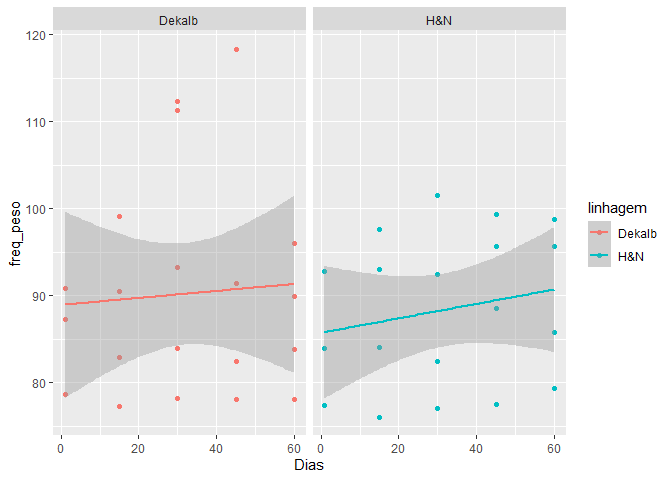
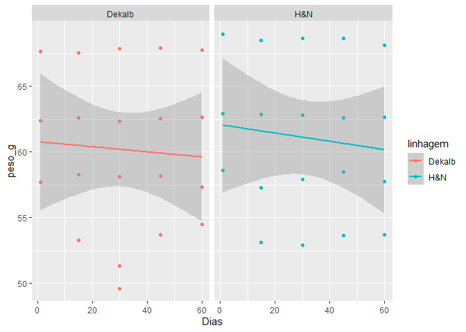
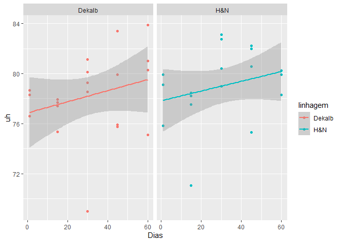
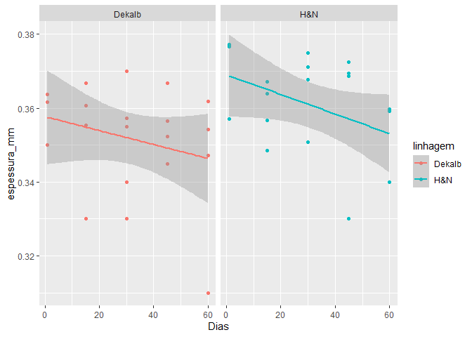
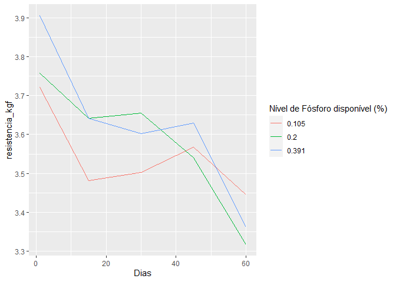
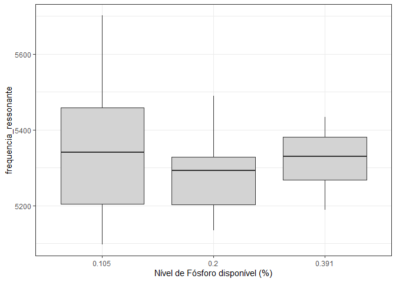
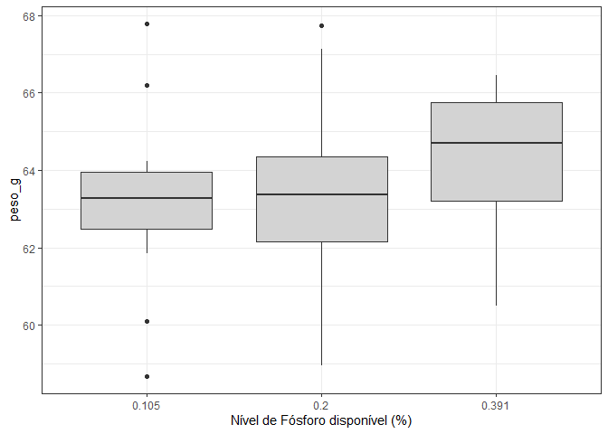
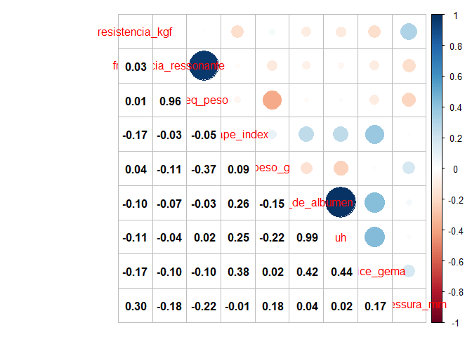
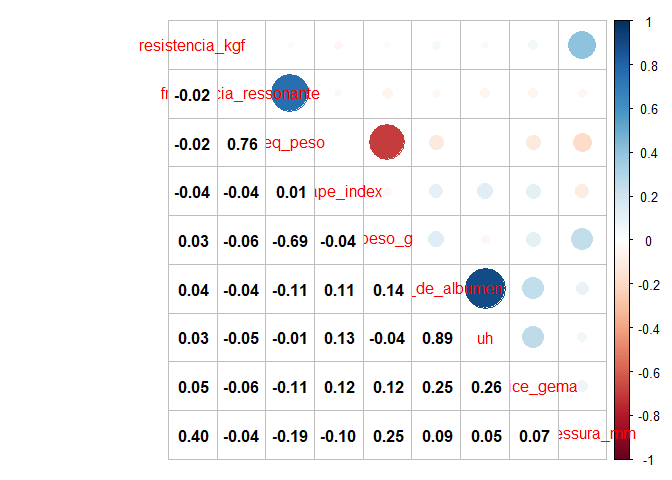

<!-- README.md is generated from README.Rmd. Please edit that file -->

# Análise qualidade da casca - mestrado João

## Carregando os pacotes no R

``` r
library(tidyverse)
library(lubridate)
library(nlme)
library(skimr)
library(GGally)
library(ExpDes.pt)
```

## Pré-tratamento dos dados

-carregando o banco de dados; -mudando os nomes das colunas;

``` r
dados<- readxl::read_excel("data-raw/Dados Mestrado João.xlsx") |>
  janitor::clean_names()
dplyr::glimpse(dados)
#> Rows: 1,415
#> Columns: 23
#> $ data                  <dttm> 2021-05-14, 2021-05-14, 2021-05-14, 2021-05-14,~
#> $ no_ovo_egg_tester     <dbl> 2, 3, 4, 5, 6, 7, 8, 9, 10, 11, 12, 13, 14, 15, ~
#> $ linhagem              <chr> "H&N", "H&N", "H&N", "H&N", "H&N", "H&N", "H&N",~
#> $ box                   <dbl> 117, 117, 135, 135, 135, 152, 152, 152, 166, 166~
#> $ tratamento            <dbl> 1, 1, 1, 1, 1, 1, 1, 1, 1, 1, 1, 1, 1, 1, 1, 1, ~
#> $ repeticao             <dbl> 1, 1, 3, 3, 3, 5, 5, 5, 7, 7, 7, 8, 8, 8, 10, 10~
#> $ no_ovo                <dbl> 2, 3, 1, 2, 3, 1, 2, 3, 1, 2, 3, 1, 2, 3, 1, 2, ~
#> $ nivel_de_fosforo_disp <dbl> 0.391, 0.391, 0.391, 0.391, 0.391, 0.391, 0.391,~
#> $ frequencia_ressonante <dbl> 4679, 5560, 5568, 5087, 6197, 5222, 5653, 4870, ~
#> $ eixo_x_mm             <dbl> 44.59, 42.60, 44.75, 42.57, 44.76, 43.54, 43.31,~
#> $ eixo_y_mm             <dbl> 59.38, 59.04, 58.60, 56.67, 59.53, 58.65, 59.07,~
#> $ shape_index           <dbl> 75.09262, 72.15447, 76.36519, 75.11911, 75.18898~
#> $ peso_g                <dbl> 66.3, 64.3, 66.8, 61.0, 69.4, 64.5, 65.6, 70.3, ~
#> $ altura_de_albumen     <dbl> 5.8, 5.8, 7.5, 7.8, 5.9, 4.4, 6.5, 8.0, 6.5, 7.0~
#> $ cor_de_gema           <dbl> 4, 5, 5, 5, 4, 7, 7, 7, 5, 5, 5, 6, 6, 6, 4, 5, ~
#> $ uh                    <dbl> 73.0, 73.8, 84.8, 88.2, 72.7, 60.8, 78.6, 86.9, ~
#> $ resistencia_kgf       <chr> "3.4", "3.56", "5.22", "4.2300000000000004", "4.~
#> $ espessura_mm          <dbl> 0.37, 0.36, 0.39, 0.36, 0.39, 0.39, 0.33, 0.37, ~
#> $ altura_de_gema        <dbl> 16.6, 17.9, 17.3, 16.5, 18.0, 15.6, 19.6, 20.8, ~
#> $ diametro_de_gema      <dbl> 43.7, 43.7, 43.3, 43.0, 44.3, 44.3, 45.3, 43.7, ~
#> $ indice_gema           <dbl> 0.380, 0.410, 0.400, 0.384, 0.406, 0.352, 0.433,~
#> $ peso_casca            <dbl> 6.10, 5.99, 6.45, 5.49, 6.63, 6.77, 5.44, 6.59, ~
#> $ percent_casca         <dbl> 0.09200603, 0.09315708, 0.09655689, 0.09000000, ~
dados <- dados |> 
  filter(frequencia_ressonante <= 8000)
dados <- dados |> 
  mutate(
    class_peso = case_when(
      peso_g < 50 ~ "pequeno",
      peso_g < 55 ~ "medio",
      peso_g < 60 ~ "grande",
      peso_g < 65 ~ "extra_grande",
      TRUE ~ "jumbo"
    ),
    freq_peso = frequencia_ressonante / peso_g
  )
nd_filter <- c(0.105, 0.200, 0.391)
dados <- dados |> 
  filter(nivel_de_fosforo_disp %in% nd_filter)
# table(dados$class_peso)
```

-   lidando com os valores perdidos de `resistencia_kgf`;
-   definindo as datas da amostragem.

``` r
dados <-dados |>
  dplyr::mutate(
    resistencia_kgf = ifelse(resistencia_kgf == "Perdi", NA, resistencia_kgf),
    resistencia_kgf = as.numeric(resistencia_kgf),
    dia=round(as.numeric(difftime(data,"2021-05-13",units = "days"))),
    dia = dplyr::case_when(
      dia < 3 ~ 1,
      dia < 20 ~15,
      dia < 30 ~ 30,
      dia < 45 ~ 45,
      dia < 60 ~ 60
    )
  )
dplyr::glimpse(dados)
#> Rows: 681
#> Columns: 26
#> $ data                  <dttm> 2021-05-14, 2021-05-14, 2021-05-14, 2021-05-14,~
#> $ no_ovo_egg_tester     <dbl> 2, 3, 4, 5, 6, 7, 8, 9, 10, 11, 12, 13, 14, 15, ~
#> $ linhagem              <chr> "H&N", "H&N", "H&N", "H&N", "H&N", "H&N", "H&N",~
#> $ box                   <dbl> 117, 117, 135, 135, 135, 152, 152, 152, 166, 166~
#> $ tratamento            <dbl> 1, 1, 1, 1, 1, 1, 1, 1, 1, 1, 1, 1, 1, 1, 1, 1, ~
#> $ repeticao             <dbl> 1, 1, 3, 3, 3, 5, 5, 5, 7, 7, 7, 8, 8, 8, 10, 10~
#> $ no_ovo                <dbl> 2, 3, 1, 2, 3, 1, 2, 3, 1, 2, 3, 1, 2, 3, 1, 2, ~
#> $ nivel_de_fosforo_disp <dbl> 0.391, 0.391, 0.391, 0.391, 0.391, 0.391, 0.391,~
#> $ frequencia_ressonante <dbl> 4679, 5560, 5568, 5087, 6197, 5222, 5653, 4870, ~
#> $ eixo_x_mm             <dbl> 44.59, 42.60, 44.75, 42.57, 44.76, 43.54, 43.31,~
#> $ eixo_y_mm             <dbl> 59.38, 59.04, 58.60, 56.67, 59.53, 58.65, 59.07,~
#> $ shape_index           <dbl> 75.09262, 72.15447, 76.36519, 75.11911, 75.18898~
#> $ peso_g                <dbl> 66.3, 64.3, 66.8, 61.0, 69.4, 64.5, 65.6, 70.3, ~
#> $ altura_de_albumen     <dbl> 5.8, 5.8, 7.5, 7.8, 5.9, 4.4, 6.5, 8.0, 6.5, 7.0~
#> $ cor_de_gema           <dbl> 4, 5, 5, 5, 4, 7, 7, 7, 5, 5, 5, 6, 6, 6, 4, 5, ~
#> $ uh                    <dbl> 73.0, 73.8, 84.8, 88.2, 72.7, 60.8, 78.6, 86.9, ~
#> $ resistencia_kgf       <dbl> 3.40, 3.56, 5.22, 4.23, 4.07, 5.02, 3.32, 4.97, ~
#> $ espessura_mm          <dbl> 0.37, 0.36, 0.39, 0.36, 0.39, 0.39, 0.33, 0.37, ~
#> $ altura_de_gema        <dbl> 16.6, 17.9, 17.3, 16.5, 18.0, 15.6, 19.6, 20.8, ~
#> $ diametro_de_gema      <dbl> 43.7, 43.7, 43.3, 43.0, 44.3, 44.3, 45.3, 43.7, ~
#> $ indice_gema           <dbl> 0.380, 0.410, 0.400, 0.384, 0.406, 0.352, 0.433,~
#> $ peso_casca            <dbl> 6.10, 5.99, 6.45, 5.49, 6.63, 6.77, 5.44, 6.59, ~
#> $ percent_casca         <dbl> 0.09200603, 0.09315708, 0.09655689, 0.09000000, ~
#> $ class_peso            <chr> "jumbo", "extra_grande", "jumbo", "extra_grande"~
#> $ freq_peso             <dbl> 70.57315, 86.46967, 83.35329, 83.39344, 89.29395~
#> $ dia                   <dbl> 1, 1, 1, 1, 1, 1, 1, 1, 1, 1, 1, 1, 1, 1, 1, 1, ~
```

-   seleção das variáveis para a análise.

``` r
dados <- dados |>
  select(dia,
         repeticao,
         linhagem,
         nivel_de_fosforo_disp,
         class_peso,
         resistencia_kgf,
         frequencia_ressonante,
         freq_peso,
         shape_index,
         peso_g,
         altura_de_albumen,
         uh,
         altura_de_albumen,
         indice_gema,
         espessura_mm
         ) #|> 
  # mutate(log_frequencia_ressonante = log(frequencia_ressonante))
```

## Corrigindo os outliers

-   definindo uma função para o input de valores perdidos a partir da
    média do tratamento (Pd e Linhage).

``` r
input_na <- function(y,trat){
  df <- tibble(trat, y)
  vl <- is.na(y)
  df <- df[vl,]
  if(nrow(df) != 0){
    vetor_medias <- tapply(y,trat,mean,na.rm=TRUE)
    for(j in 1:nrow(df)){
      df[j,2] <- 
      vetor_medias[which(df$trat[j] == names(vetor_medias))]
    }
  }
  return(df$y)
}
```

``` r
dias <- unique(dados$dia)
linhagens <- unique(dados$linhagem)
for(k in 6:length(dados)){ # para cada variável no BD
  for(i in seq_along(dias)){
    da <- dados |>
      filter(dia == dias[i])
    Pd <- da$nivel_de_fosforo_disp
    Pd <- forcats::as_factor(Pd)
    Lin <- da$linhagem
    Lin <- forcats::as_factor(Lin)
    trat <- paste0(Lin,"_",Pd)
    y<-da[k] |>  pull()
    y[is.na(y)] <- input_na(y, trat)
    
    # boxplot_original <- tibble(trat,y) |>
    #   ggplot(aes(x=y, y=trat)) +
    #   geom_boxplot() +
    #   labs(title = paste0("ORIGINAL - Dia: ", dias[i],"; Variável: ",names(dados[k])))
    # print(boxplot_original)
    
    mod <- aov(y~trat)
    rs<-rstudent(mod)
    yp <- predict(mod)
    
    li<-quantile(rs, .25) - IQR(rs) *1.5
    ls<-quantile(rs, .75) + IQR(rs) *1.5
    # print({
    #   plot(rs ~yp)
    #   abline(h=c(li, ls), lty=2, col="red")
    # })
    regra <- rs >= ls | rs <= li
    da[da$dia == dias[i] & regra, k] <- yp[regra]
    
    # y <- da[k] |> pull()
    # boxplot_arrumado<-tibble(trat,y) |>
    #   ggplot(aes(x=y, y=trat)) +
    #   geom_boxplot() +
    #   labs(title = paste0("TRATADA - Dia: ", dias[i],"; Variável: ",names(dados[k])))
    # print(boxplot_arrumado)
    dados[dados$dia == dias[i],k] <- y
    
  }
}
```

## Análise de regressão linear

A análise foi realizada independete dos tratamentos para descrever o
comportamento das variáveis ao longo do dias por linhagem.

``` r
parametros <- names(dados)[6:(length(dados))]

for(i in 1:length(parametros)){
  da <- dados |>
    select(dia, linhagem, class_peso, parametros[i]) 
  names(da) <- c("dia","linhagem","class_peso","y")
  plot<-da |> 
    dplyr::group_by(dia, linhagem, class_peso) |>
    dplyr::summarise(re=mean(y, na.rm=TRUE)) |>
    ggplot(aes(x=dia, y=re, color=linhagem)) +
    geom_point() +
    geom_smooth(method = "lm")+
    labs(x="Dias",y=parametros[i]) +
    facet_wrap(~linhagem)
  print(plot)

  # tab <- da |>
  #   dplyr::group_by(dia,linhagem) |>
  #   dplyr::summarise(y=mean(y, na.rm=TRUE))
  # 
  # mod <- lm(y~dia + linhagem, data=tab)
  # print(summary.lm(mod))
  # plot(mod)
}
```

<!-- --><!-- --><!-- --><!-- --><!-- --><!-- --><!-- --><!-- --><!-- -->

## Estatística descritiva do banco de dados

-   resumo estatístico para todas as variáveios do banco de dados

``` r
skim(dados)
```

|                                                  |       |
|:-------------------------------------------------|:------|
| Name                                             | dados |
| Number of rows                                   | 681   |
| Number of columns                                | 14    |
| \_\_\_\_\_\_\_\_\_\_\_\_\_\_\_\_\_\_\_\_\_\_\_   |       |
| Column type frequency:                           |       |
| character                                        | 2     |
| numeric                                          | 12    |
| \_\_\_\_\_\_\_\_\_\_\_\_\_\_\_\_\_\_\_\_\_\_\_\_ |       |
| Group variables                                  | None  |

Data summary

**Variable type: character**

| skim\_variable | n\_missing | complete\_rate | min | max | empty | n\_unique | whitespace |
|:---------------|-----------:|---------------:|----:|----:|------:|----------:|-----------:|
| linhagem       |          0 |              1 |   3 |   6 |     0 |         2 |          0 |
| class\_peso    |          0 |              1 |   5 |  12 |     0 |         5 |          0 |

**Variable type: numeric**

| skim\_variable           | n\_missing | complete\_rate |    mean |     sd |      p0 |     p25 |     p50 |     p75 |    p100 | hist  |
|:-------------------------|-----------:|---------------:|--------:|-------:|--------:|--------:|--------:|--------:|--------:|:------|
| dia                      |          0 |              1 |   29.48 |  20.80 |    1.00 |   15.00 |   30.00 |   45.00 |   60.00 | ▇▇▇▇▇ |
| repeticao                |          0 |              1 |    8.42 |   4.52 |    1.00 |    4.00 |    8.00 |   12.00 |   16.00 | ▇▆▆▆▆ |
| nivel\_de\_fosforo\_disp |          0 |              1 |    0.23 |   0.12 |    0.10 |    0.10 |    0.20 |    0.39 |    0.39 | ▇▇▁▁▇ |
| resistencia\_kgf         |          0 |              1 |    3.59 |   0.86 |    0.89 |    2.99 |    3.63 |    4.17 |    6.23 | ▁▅▇▅▁ |
| frequencia\_ressonante   |          0 |              1 | 5313.72 | 426.22 | 4055.00 | 4961.00 | 5279.00 | 5578.00 | 7709.00 | ▁▇▅▁▁ |
| freq\_peso               |          0 |              1 |   84.09 |   9.66 |   66.08 |   77.49 |   82.68 |   89.25 |  137.40 | ▆▇▂▁▁ |
| shape\_index             |          0 |              1 |   74.85 |   2.91 |   63.26 |   73.00 |   74.70 |   76.68 |   84.04 | ▁▂▇▅▁ |
| peso\_g                  |          0 |              1 |   63.57 |   4.75 |   49.60 |   60.40 |   63.60 |   66.80 |   78.50 | ▁▅▇▃▁ |
| altura\_de\_albumen      |          0 |              1 |    6.58 |   1.27 |    3.10 |    5.80 |    6.50 |    7.30 |   14.00 | ▁▇▂▁▁ |
| uh                       |          0 |              1 |   78.96 |   8.78 |   39.70 |   73.90 |   79.60 |   84.50 |  112.30 | ▁▁▇▃▁ |
| indice\_gema             |          0 |              1 |    0.40 |   0.04 |    0.12 |    0.38 |    0.40 |    0.42 |    0.54 | ▁▁▂▇▁ |
| espessura\_mm            |          0 |              1 |    0.36 |   0.03 |    0.26 |    0.35 |    0.36 |    0.38 |    0.44 | ▁▂▇▇▁ |

## Gráfico de linhas

-   Análise para todas as variáveis do banco de dados, por nível de `P`.

``` r
for(i in 1:length(parametros)){
  da <- dados |>
    select(dia, linhagem, nivel_de_fosforo_disp, parametros[i]) 
  names(da) <- c("dia","linhagem","nivel_de_fosforo_disp","y")
  plot <- da |>
    group_by(dia, nivel_de_fosforo_disp) |> 
    drop_na() |> 
    mutate( y = mean(y), na.rm=TRUE) |> 
    ggplot(aes(x = dia, y = y, color=as.factor(nivel_de_fosforo_disp))) +
    geom_line() +
    labs(color="Nível de Fósforo disponível (%)", x="Dias",y=parametros[i])
  print(plot)
}
```

<!-- --><!-- --><!-- --><!-- --><!-- --><!-- --><!-- --><!-- --><!-- -->

### Independente do dia

``` r
for(i in 1:length(parametros)){
  da <- dados |>
    select(dia, repeticao, linhagem, nivel_de_fosforo_disp, parametros[i]) 
  names(da) <- c("dia","repeticao","linhagem","nivel_de_fosforo_disp","y")
  plot <- da |> 
    group_by(nivel_de_fosforo_disp, linhagem, repeticao) |>
    summarise(re = mean(y, na.rm=TRUE)) |>
    ggplot(aes(x = as.factor(nivel_de_fosforo_disp), y = re)) +
    geom_boxplot(fill="lightgray") +
    theme_bw() +
    labs(x="Nível de Fósforo disponível (%)",
         y = parametros[i])
  print(plot)
}
```

<!-- --><!-- --><!-- --><!-- --><!-- --><!-- --><!-- --><!-- --><!-- -->

## Matriz de correlação para linhagem **DEKALB**

``` r
classes<-c("grande", "extra_grande", "jumbo")
for(i in 1:length(classes)){
  dados  |>
    filter(linhagem == "Dekalb", 
           class_peso == classes[i],
           dia <= 30) |>
    drop_na() |> 
    select(resistencia_kgf:espessura_mm)  |>
    cor(use = "p")  |>
    corrplot::corrplot.mixed(lower.col = "black")
}
```

<!-- --><!-- --><!-- -->

## Matriz de correlação para linhagem **H&N**

``` r
for(i in 1:length(classes)){
  dados  |>
    filter(linhagem == "H&N", class_peso == classes[i]) |>
    drop_na() |> 
    select(resistencia_kgf:espessura_mm)  |>
    cor(use = "p")  |>
    corrplot:::corrplot.mixed(lower.col = "black")
}
```

<!-- --><!-- --><!-- -->

## Análise de variância por linhagem

``` r
for(j in seq_along(linhagens)){
  for(i in 1:length(parametros)){
    da <- dados |> filter(linhagem == linhagens[j]) |> 
      select(dia, repeticao, linhagem, nivel_de_fosforo_disp, parametros[i]) 
    names(da) <- c("dia","repeticao","linhagem","nivel_de_fosforo_disp","y")
    
    da<- da |> 
      group_by(repeticao, nivel_de_fosforo_disp) |> 
      summarise(y = mean(y, na.rm=TRUE))
    nivel_de_fosforo <- da$nivel_de_fosforo_disp
    y <- da$y
    print("-------------------------------------------------")
    print(paste0("Linhagem: ",linhagens[j],"; Variável: ",parametros[i]))
    print("-------------------------------------------------")
    dic(nivel_de_fosforo,y,quali = TRUE, mcomp = "tukey")
  }
}
#> `summarise()` has grouped output by 'repeticao'. You can override using the `.groups` argument.
#> [1] "-------------------------------------------------"
#> [1] "Linhagem: H&N; Variável: resistencia_kgf"
#> [1] "-------------------------------------------------"
#> ------------------------------------------------------------------------
#> Quadro da analise de variancia
#> ------------------------------------------------------------------------
#>            GL      SQ       QM     Fc   Pr>Fc
#> Tratamento  2 0.53751 0.268756 3.7149 0.04156
#> Residuo    21 1.51925 0.072345               
#> Total      23 2.05676                        
#> ------------------------------------------------------------------------
#> CV = 7.55 %
#> 
#> ------------------------------------------------------------------------
#> Teste de normalidade dos residuos ( Shapiro-Wilk ) 
#> Valor-p:  0.8173161 
#> De acordo com o teste de Shapiro-Wilk a 5% de significancia, os residuos podem ser considerados normais.
#> ------------------------------------------------------------------------
#> 
#> ------------------------------------------------------------------------
#> Teste de homogeneidade de variancia 
#> valor-p:  0.4269359 
#> De acordo com o teste de bartlett a 5% de significancia, as variancias podem ser consideradas homogeneas.
#> ------------------------------------------------------------------------
#> 
#> Teste de Tukey
#> ------------------------------------------------------------------------
#> Grupos Tratamentos Medias
#> a     0.391   3.739232 
#> ab    0.2     3.579903 
#>  b    0.105   3.373658 
#> ------------------------------------------------------------------------
#> `summarise()` has grouped output by 'repeticao'. You can override using the `.groups` argument.
#> [1] "-------------------------------------------------"
#> [1] "Linhagem: H&N; Variável: frequencia_ressonante"
#> [1] "-------------------------------------------------"
#> ------------------------------------------------------------------------
#> Quadro da analise de variancia
#> ------------------------------------------------------------------------
#>            GL     SQ    QM     Fc   Pr>Fc
#> Tratamento  2  32209 16104 1.3608 0.27817
#> Residuo    21 248531 11835               
#> Total      23 280739                     
#> ------------------------------------------------------------------------
#> CV = 2.04 %
#> 
#> ------------------------------------------------------------------------
#> Teste de normalidade dos residuos ( Shapiro-Wilk ) 
#> Valor-p:  0.59329 
#> De acordo com o teste de Shapiro-Wilk a 5% de significancia, os residuos podem ser considerados normais.
#> ------------------------------------------------------------------------
#> 
#> ------------------------------------------------------------------------
#> Teste de homogeneidade de variancia 
#> valor-p:  0.7977453 
#> De acordo com o teste de bartlett a 5% de significancia, as variancias podem ser consideradas homogeneas.
#> ------------------------------------------------------------------------
#> 
#> De acordo com o teste F, as medias nao podem ser consideradas diferentes.
#> ------------------------------------------------------------------------
#>   Niveis   Medias
#> 1  0.105 5371.845
#> 2    0.2 5282.169
#> 3  0.391 5329.810
#> ------------------------------------------------------------------------
#> `summarise()` has grouped output by 'repeticao'. You can override using the `.groups` argument.
#> [1] "-------------------------------------------------"
#> [1] "Linhagem: H&N; Variável: freq_peso"
#> [1] "-------------------------------------------------"
#> ------------------------------------------------------------------------
#> Quadro da analise de variancia
#> ------------------------------------------------------------------------
#>            GL      SQ     QM     Fc   Pr>Fc
#> Tratamento  2  21.626 10.813 1.2745 0.30033
#> Residuo    21 178.163  8.484               
#> Total      23 199.789                      
#> ------------------------------------------------------------------------
#> CV = 3.51 %
#> 
#> ------------------------------------------------------------------------
#> Teste de normalidade dos residuos ( Shapiro-Wilk ) 
#> Valor-p:  0.9505246 
#> De acordo com o teste de Shapiro-Wilk a 5% de significancia, os residuos podem ser considerados normais.
#> ------------------------------------------------------------------------
#> 
#> ------------------------------------------------------------------------
#> Teste de homogeneidade de variancia 
#> valor-p:  0.5789956 
#> De acordo com o teste de bartlett a 5% de significancia, as variancias podem ser consideradas homogeneas.
#> ------------------------------------------------------------------------
#> 
#> De acordo com o teste F, as medias nao podem ser consideradas diferentes.
#> ------------------------------------------------------------------------
#>   Niveis   Medias
#> 1  0.105 84.24856
#> 2    0.2 82.23805
#> 3  0.391 82.23178
#> ------------------------------------------------------------------------
#> `summarise()` has grouped output by 'repeticao'. You can override using the `.groups` argument.
#> [1] "-------------------------------------------------"
#> [1] "Linhagem: H&N; Variável: shape_index"
#> [1] "-------------------------------------------------"
#> ------------------------------------------------------------------------
#> Quadro da analise de variancia
#> ------------------------------------------------------------------------
#>            GL      SQ      QM      Fc   Pr>Fc
#> Tratamento  2  0.5915 0.29576 0.20919 0.81291
#> Residuo    21 29.6905 1.41383                
#> Total      23 30.2821                        
#> ------------------------------------------------------------------------
#> CV = 1.61 %
#> 
#> ------------------------------------------------------------------------
#> Teste de normalidade dos residuos ( Shapiro-Wilk ) 
#> Valor-p:  0.218206 
#> De acordo com o teste de Shapiro-Wilk a 5% de significancia, os residuos podem ser considerados normais.
#> ------------------------------------------------------------------------
#> 
#> ------------------------------------------------------------------------
#> Teste de homogeneidade de variancia 
#> valor-p:  0.9046813 
#> De acordo com o teste de bartlett a 5% de significancia, as variancias podem ser consideradas homogeneas.
#> ------------------------------------------------------------------------
#> 
#> De acordo com o teste F, as medias nao podem ser consideradas diferentes.
#> ------------------------------------------------------------------------
#>   Niveis   Medias
#> 1  0.105 74.03302
#> 2    0.2 73.72297
#> 3  0.391 74.07501
#> ------------------------------------------------------------------------
#> `summarise()` has grouped output by 'repeticao'. You can override using the `.groups` argument.
#> [1] "-------------------------------------------------"
#> [1] "Linhagem: H&N; Variável: peso_g"
#> [1] "-------------------------------------------------"
#> ------------------------------------------------------------------------
#> Quadro da analise de variancia
#> ------------------------------------------------------------------------
#>            GL     SQ     QM      Fc   Pr>Fc
#> Tratamento  2  3.422 1.7112 0.60741 0.55405
#> Residuo    21 59.162 2.8173                
#> Total      23 62.585                       
#> ------------------------------------------------------------------------
#> CV = 2.6 %
#> 
#> ------------------------------------------------------------------------
#> Teste de normalidade dos residuos ( Shapiro-Wilk ) 
#> Valor-p:  0.2142449 
#> De acordo com o teste de Shapiro-Wilk a 5% de significancia, os residuos podem ser considerados normais.
#> ------------------------------------------------------------------------
#> 
#> ------------------------------------------------------------------------
#> Teste de homogeneidade de variancia 
#> valor-p:  0.2531872 
#> De acordo com o teste de bartlett a 5% de significancia, as variancias podem ser consideradas homogeneas.
#> ------------------------------------------------------------------------
#> 
#> De acordo com o teste F, as medias nao podem ser consideradas diferentes.
#> ------------------------------------------------------------------------
#>   Niveis   Medias
#> 1  0.105 64.16339
#> 2    0.2 64.71190
#> 3  0.391 65.08268
#> ------------------------------------------------------------------------
#> `summarise()` has grouped output by 'repeticao'. You can override using the `.groups` argument.
#> [1] "-------------------------------------------------"
#> [1] "Linhagem: H&N; Variável: altura_de_albumen"
#> [1] "-------------------------------------------------"
#> ------------------------------------------------------------------------
#> Quadro da analise de variancia
#> ------------------------------------------------------------------------
#>            GL     SQ      QM     Fc    Pr>Fc
#> Tratamento  2 1.0247 0.51235 3.1377 0.064226
#> Residuo    21 3.4291 0.16329                
#> Total      23 4.4538                        
#> ------------------------------------------------------------------------
#> CV = 6.06 %
#> 
#> ------------------------------------------------------------------------
#> Teste de normalidade dos residuos ( Shapiro-Wilk ) 
#> Valor-p:  0.4959058 
#> De acordo com o teste de Shapiro-Wilk a 5% de significancia, os residuos podem ser considerados normais.
#> ------------------------------------------------------------------------
#> 
#> ------------------------------------------------------------------------
#> Teste de homogeneidade de variancia 
#> valor-p:  0.975085 
#> De acordo com o teste de bartlett a 5% de significancia, as variancias podem ser consideradas homogeneas.
#> ------------------------------------------------------------------------
#> 
#> De acordo com o teste F, as medias nao podem ser consideradas diferentes.
#> ------------------------------------------------------------------------
#>   Niveis   Medias
#> 1  0.105 6.960179
#> 2    0.2 6.526717
#> 3  0.391 6.517143
#> ------------------------------------------------------------------------
#> `summarise()` has grouped output by 'repeticao'. You can override using the `.groups` argument.
#> [1] "-------------------------------------------------"
#> [1] "Linhagem: H&N; Variável: uh"
#> [1] "-------------------------------------------------"
#> ------------------------------------------------------------------------
#> Quadro da analise de variancia
#> ------------------------------------------------------------------------
#>            GL      SQ     QM     Fc    Pr>Fc
#> Tratamento  2  65.959 32.980 3.7959 0.039152
#> Residuo    21 182.451  8.688                
#> Total      23 248.410                       
#> ------------------------------------------------------------------------
#> CV = 3.72 %
#> 
#> ------------------------------------------------------------------------
#> Teste de normalidade dos residuos ( Shapiro-Wilk ) 
#> Valor-p:  0.8841 
#> De acordo com o teste de Shapiro-Wilk a 5% de significancia, os residuos podem ser considerados normais.
#> ------------------------------------------------------------------------
#> 
#> ------------------------------------------------------------------------
#> Teste de homogeneidade de variancia 
#> valor-p:  0.8431253 
#> De acordo com o teste de bartlett a 5% de significancia, as variancias podem ser consideradas homogeneas.
#> ------------------------------------------------------------------------
#> 
#> Teste de Tukey
#> ------------------------------------------------------------------------
#> Grupos Tratamentos Medias
#> a     0.105   81.48464 
#> a     0.391   78.04357 
#> a     0.2     77.89685 
#> ------------------------------------------------------------------------
#> `summarise()` has grouped output by 'repeticao'. You can override using the `.groups` argument.
#> [1] "-------------------------------------------------"
#> [1] "Linhagem: H&N; Variável: indice_gema"
#> [1] "-------------------------------------------------"
#> ------------------------------------------------------------------------
#> Quadro da analise de variancia
#> ------------------------------------------------------------------------
#>            GL        SQ         QM     Fc     Pr>Fc
#> Tratamento  2 0.0015302 0.00076512 10.234 0.0007894
#> Residuo    21 0.0015700 0.00007476                 
#> Total      23 0.0031002                            
#> ------------------------------------------------------------------------
#> CV = 2.13 %
#> 
#> ------------------------------------------------------------------------
#> Teste de normalidade dos residuos ( Shapiro-Wilk ) 
#> Valor-p:  0.5799142 
#> De acordo com o teste de Shapiro-Wilk a 5% de significancia, os residuos podem ser considerados normais.
#> ------------------------------------------------------------------------
#> 
#> ------------------------------------------------------------------------
#> Teste de homogeneidade de variancia 
#> valor-p:  0.1021237 
#> De acordo com o teste de bartlett a 5% de significancia, as variancias podem ser consideradas homogeneas.
#> ------------------------------------------------------------------------
#> 
#> Teste de Tukey
#> ------------------------------------------------------------------------
#> Grupos Tratamentos Medias
#> a     0.105   0.417625 
#>  b    0.391   0.4021373 
#>  b    0.2     0.3995363 
#> ------------------------------------------------------------------------
#> `summarise()` has grouped output by 'repeticao'. You can override using the `.groups` argument.
#> [1] "-------------------------------------------------"
#> [1] "Linhagem: H&N; Variável: espessura_mm"
#> [1] "-------------------------------------------------"
#> ------------------------------------------------------------------------
#> Quadro da analise de variancia
#> ------------------------------------------------------------------------
#>            GL         SQ         QM      Fc   Pr>Fc
#> Tratamento  2 0.00001791 8.9530e-06 0.10148 0.90394
#> Residuo    21 0.00185266 8.8222e-05                
#> Total      23 0.00187057                           
#> ------------------------------------------------------------------------
#> CV = 2.57 %
#> 
#> ------------------------------------------------------------------------
#> Teste de normalidade dos residuos ( Shapiro-Wilk ) 
#> Valor-p:  0.4492851 
#> De acordo com o teste de Shapiro-Wilk a 5% de significancia, os residuos podem ser considerados normais.
#> ------------------------------------------------------------------------
#> 
#> ------------------------------------------------------------------------
#> Teste de homogeneidade de variancia 
#> valor-p:  0.3949461 
#> De acordo com o teste de bartlett a 5% de significancia, as variancias podem ser consideradas homogeneas.
#> ------------------------------------------------------------------------
#> 
#> De acordo com o teste F, as medias nao podem ser consideradas diferentes.
#> ------------------------------------------------------------------------
#>   Niveis    Medias
#> 1  0.105 0.3647560
#> 2    0.2 0.3661419
#> 3  0.391 0.3668333
#> ------------------------------------------------------------------------
#> `summarise()` has grouped output by 'repeticao'. You can override using the `.groups` argument.
#> [1] "-------------------------------------------------"
#> [1] "Linhagem: Dekalb; Variável: resistencia_kgf"
#> [1] "-------------------------------------------------"
#> ------------------------------------------------------------------------
#> Quadro da analise de variancia
#> ------------------------------------------------------------------------
#>            GL      SQ       QM     Fc  Pr>Fc
#> Tratamento  2 0.19597 0.097987 1.5667 0.2333
#> Residuo    20 1.25090 0.062545              
#> Total      22 1.44687                       
#> ------------------------------------------------------------------------
#> CV = 6.93 %
#> 
#> ------------------------------------------------------------------------
#> Teste de normalidade dos residuos ( Shapiro-Wilk ) 
#> Valor-p:  0.5540174 
#> De acordo com o teste de Shapiro-Wilk a 5% de significancia, os residuos podem ser considerados normais.
#> ------------------------------------------------------------------------
#> 
#> ------------------------------------------------------------------------
#> Teste de homogeneidade de variancia 
#> valor-p:  0.9068782 
#> De acordo com o teste de bartlett a 5% de significancia, as variancias podem ser consideradas homogeneas.
#> ------------------------------------------------------------------------
#> 
#> De acordo com o teste F, as medias nao podem ser consideradas diferentes.
#> ------------------------------------------------------------------------
#>   Niveis   Medias
#> 1  0.105 3.724969
#> 2    0.2 3.584874
#> 3  0.391 3.499607
#> ------------------------------------------------------------------------
#> `summarise()` has grouped output by 'repeticao'. You can override using the `.groups` argument.
#> [1] "-------------------------------------------------"
#> [1] "Linhagem: Dekalb; Variável: frequencia_ressonante"
#> [1] "-------------------------------------------------"
#> ------------------------------------------------------------------------
#> Quadro da analise de variancia
#> ------------------------------------------------------------------------
#>            GL     SQ      QM      Fc   Pr>Fc
#> Tratamento  2   7328  3663.9 0.16869 0.84596
#> Residuo    20 434393 21719.7                
#> Total      22 441721                        
#> ------------------------------------------------------------------------
#> CV = 2.78 %
#> 
#> ------------------------------------------------------------------------
#> Teste de normalidade dos residuos ( Shapiro-Wilk ) 
#> Valor-p:  0.176281 
#> De acordo com o teste de Shapiro-Wilk a 5% de significancia, os residuos podem ser considerados normais.
#> ------------------------------------------------------------------------
#> 
#> ------------------------------------------------------------------------
#> Teste de homogeneidade de variancia 
#> valor-p:  0.3871445 
#> De acordo com o teste de bartlett a 5% de significancia, as variancias podem ser consideradas homogeneas.
#> ------------------------------------------------------------------------
#> 
#> De acordo com o teste F, as medias nao podem ser consideradas diferentes.
#> ------------------------------------------------------------------------
#>   Niveis   Medias
#> 1  0.105 5318.251
#> 2    0.2 5277.804
#> 3  0.391 5310.715
#> ------------------------------------------------------------------------
#> `summarise()` has grouped output by 'repeticao'. You can override using the `.groups` argument.
#> [1] "-------------------------------------------------"
#> [1] "Linhagem: Dekalb; Variável: freq_peso"
#> [1] "-------------------------------------------------"
#> ------------------------------------------------------------------------
#> Quadro da analise de variancia
#> ------------------------------------------------------------------------
#>            GL     SQ      QM      Fc   Pr>Fc
#> Tratamento  2  15.38  7.6889 0.50481 0.61111
#> Residuo    20 304.63 15.2313                
#> Total      22 320.00                        
#> ------------------------------------------------------------------------
#> CV = 4.57 %
#> 
#> ------------------------------------------------------------------------
#> Teste de normalidade dos residuos ( Shapiro-Wilk ) 
#> Valor-p:  0.3846582 
#> De acordo com o teste de Shapiro-Wilk a 5% de significancia, os residuos podem ser considerados normais.
#> ------------------------------------------------------------------------
#> 
#> ------------------------------------------------------------------------
#> Teste de homogeneidade de variancia 
#> valor-p:  0.713819 
#> De acordo com o teste de bartlett a 5% de significancia, as variancias podem ser consideradas homogeneas.
#> ------------------------------------------------------------------------
#> 
#> De acordo com o teste F, as medias nao podem ser consideradas diferentes.
#> ------------------------------------------------------------------------
#>   Niveis   Medias
#> 1  0.105 86.05364
#> 2    0.2 85.85514
#> 3  0.391 84.18646
#> ------------------------------------------------------------------------
#> `summarise()` has grouped output by 'repeticao'. You can override using the `.groups` argument.
#> [1] "-------------------------------------------------"
#> [1] "Linhagem: Dekalb; Variável: shape_index"
#> [1] "-------------------------------------------------"
#> ------------------------------------------------------------------------
#> Quadro da analise de variancia
#> ------------------------------------------------------------------------
#>            GL      SQ      QM     Fc   Pr>Fc
#> Tratamento  2  2.2373 1.11864 1.5219 0.24252
#> Residuo    20 14.7003 0.73502               
#> Total      22 16.9376                       
#> ------------------------------------------------------------------------
#> CV = 1.13 %
#> 
#> ------------------------------------------------------------------------
#> Teste de normalidade dos residuos ( Shapiro-Wilk ) 
#> Valor-p:  0.3330135 
#> De acordo com o teste de Shapiro-Wilk a 5% de significancia, os residuos podem ser considerados normais.
#> ------------------------------------------------------------------------
#> 
#> ------------------------------------------------------------------------
#> Teste de homogeneidade de variancia 
#> valor-p:  0.2985654 
#> De acordo com o teste de bartlett a 5% de significancia, as variancias podem ser consideradas homogeneas.
#> ------------------------------------------------------------------------
#> 
#> De acordo com o teste F, as medias nao podem ser consideradas diferentes.
#> ------------------------------------------------------------------------
#>   Niveis   Medias
#> 1  0.105 75.94105
#> 2    0.2 75.40252
#> 3  0.391 76.14212
#> ------------------------------------------------------------------------
#> `summarise()` has grouped output by 'repeticao'. You can override using the `.groups` argument.
#> [1] "-------------------------------------------------"
#> [1] "Linhagem: Dekalb; Variável: peso_g"
#> [1] "-------------------------------------------------"
#> ------------------------------------------------------------------------
#> Quadro da analise de variancia
#> ------------------------------------------------------------------------
#>            GL     SQ     QM     Fc   Pr>Fc
#> Tratamento  2  9.967 4.9837 1.4114 0.26706
#> Residuo    20 70.620 3.5310               
#> Total      22 80.587                      
#> ------------------------------------------------------------------------
#> CV = 3.01 %
#> 
#> ------------------------------------------------------------------------
#> Teste de normalidade dos residuos ( Shapiro-Wilk ) 
#> Valor-p:  0.07321454 
#> De acordo com o teste de Shapiro-Wilk a 5% de significancia, os residuos podem ser considerados normais.
#> ------------------------------------------------------------------------
#> 
#> ------------------------------------------------------------------------
#> Teste de homogeneidade de variancia 
#> valor-p:  0.6422957 
#> De acordo com o teste de bartlett a 5% de significancia, as variancias podem ser consideradas homogeneas.
#> ------------------------------------------------------------------------
#> 
#> De acordo com o teste F, as medias nao podem ser consideradas diferentes.
#> ------------------------------------------------------------------------
#>   Niveis   Medias
#> 1  0.105 62.21913
#> 2    0.2 61.77222
#> 3  0.391 63.36782
#> ------------------------------------------------------------------------
#> `summarise()` has grouped output by 'repeticao'. You can override using the `.groups` argument.
#> [1] "-------------------------------------------------"
#> [1] "Linhagem: Dekalb; Variável: altura_de_albumen"
#> [1] "-------------------------------------------------"
#> ------------------------------------------------------------------------
#> Quadro da analise de variancia
#> ------------------------------------------------------------------------
#>            GL     SQ      QM     Fc    Pr>Fc
#> Tratamento  2 0.9787 0.48936 3.1142 0.066464
#> Residuo    20 3.1428 0.15714                
#> Total      22 4.1215                        
#> ------------------------------------------------------------------------
#> CV = 6.12 %
#> 
#> ------------------------------------------------------------------------
#> Teste de normalidade dos residuos ( Shapiro-Wilk ) 
#> Valor-p:  0.177555 
#> De acordo com o teste de Shapiro-Wilk a 5% de significancia, os residuos podem ser considerados normais.
#> ------------------------------------------------------------------------
#> 
#> ------------------------------------------------------------------------
#> Teste de homogeneidade de variancia 
#> valor-p:  0.3891753 
#> De acordo com o teste de bartlett a 5% de significancia, as variancias podem ser consideradas homogeneas.
#> ------------------------------------------------------------------------
#> 
#> De acordo com o teste F, as medias nao podem ser consideradas diferentes.
#> ------------------------------------------------------------------------
#>   Niveis   Medias
#> 1  0.105 6.314435
#> 2    0.2 6.362083
#> 3  0.391 6.784490
#> ------------------------------------------------------------------------
#> `summarise()` has grouped output by 'repeticao'. You can override using the `.groups` argument.
#> [1] "-------------------------------------------------"
#> [1] "Linhagem: Dekalb; Variável: uh"
#> [1] "-------------------------------------------------"
#> ------------------------------------------------------------------------
#> Quadro da analise de variancia
#> ------------------------------------------------------------------------
#>            GL      SQ      QM     Fc  Pr>Fc
#> Tratamento  2  32.173 16.0866 2.1684 0.1405
#> Residuo    20 148.373  7.4186              
#> Total      22 180.546                      
#> ------------------------------------------------------------------------
#> CV = 3.46 %
#> 
#> ------------------------------------------------------------------------
#> Teste de normalidade dos residuos ( Shapiro-Wilk ) 
#> Valor-p:  0.629694 
#> De acordo com o teste de Shapiro-Wilk a 5% de significancia, os residuos podem ser considerados normais.
#> ------------------------------------------------------------------------
#> 
#> ------------------------------------------------------------------------
#> Teste de homogeneidade de variancia 
#> valor-p:  0.5058131 
#> De acordo com o teste de bartlett a 5% de significancia, as variancias podem ser consideradas homogeneas.
#> ------------------------------------------------------------------------
#> 
#> De acordo com o teste F, as medias nao podem ser consideradas diferentes.
#> ------------------------------------------------------------------------
#>   Niveis   Medias
#> 1  0.105 77.64198
#> 2    0.2 78.26609
#> 3  0.391 80.46143
#> ------------------------------------------------------------------------
#> `summarise()` has grouped output by 'repeticao'. You can override using the `.groups` argument.
#> [1] "-------------------------------------------------"
#> [1] "Linhagem: Dekalb; Variável: indice_gema"
#> [1] "-------------------------------------------------"
#> ------------------------------------------------------------------------
#> Quadro da analise de variancia
#> ------------------------------------------------------------------------
#>            GL        SQ         QM       Fc   Pr>Fc
#> Tratamento  2 0.0000249 0.00001244 0.067303 0.93512
#> Residuo    20 0.0036968 0.00018484                 
#> Total      22 0.0037217                            
#> ------------------------------------------------------------------------
#> CV = 3.53 %
#> 
#> ------------------------------------------------------------------------
#> Teste de normalidade dos residuos ( Shapiro-Wilk ) 
#> Valor-p:  0.2801252 
#> De acordo com o teste de Shapiro-Wilk a 5% de significancia, os residuos podem ser considerados normais.
#> ------------------------------------------------------------------------
#> 
#> ------------------------------------------------------------------------
#> Teste de homogeneidade de variancia 
#> valor-p:  0.5536419 
#> De acordo com o teste de bartlett a 5% de significancia, as variancias podem ser consideradas homogeneas.
#> ------------------------------------------------------------------------
#> 
#> De acordo com o teste F, as medias nao podem ser consideradas diferentes.
#> ------------------------------------------------------------------------
#>   Niveis    Medias
#> 1  0.105 0.3849011
#> 2    0.2 0.3871004
#> 3  0.391 0.3849347
#> ------------------------------------------------------------------------
#> `summarise()` has grouped output by 'repeticao'. You can override using the `.groups` argument.
#> [1] "-------------------------------------------------"
#> [1] "Linhagem: Dekalb; Variável: espessura_mm"
#> [1] "-------------------------------------------------"
#> ------------------------------------------------------------------------
#> Quadro da analise de variancia
#> ------------------------------------------------------------------------
#>            GL        SQ         QM     Fc   Pr>Fc
#> Tratamento  2 0.0005314 0.00026572 1.4198 0.26511
#> Residuo    20 0.0037431 0.00018715               
#> Total      22 0.0042745                          
#> ------------------------------------------------------------------------
#> CV = 3.82 %
#> 
#> ------------------------------------------------------------------------
#> Teste de normalidade dos residuos ( Shapiro-Wilk ) 
#> Valor-p:  0.9358476 
#> De acordo com o teste de Shapiro-Wilk a 5% de significancia, os residuos podem ser considerados normais.
#> ------------------------------------------------------------------------
#> 
#> ------------------------------------------------------------------------
#> Teste de homogeneidade de variancia 
#> valor-p:  0.700627 
#> De acordo com o teste de bartlett a 5% de significancia, as variancias podem ser consideradas homogeneas.
#> ------------------------------------------------------------------------
#> 
#> De acordo com o teste F, as medias nao podem ser consideradas diferentes.
#> ------------------------------------------------------------------------
#>   Niveis    Medias
#> 1  0.105 0.3638132
#> 2    0.2 0.3523082
#> 3  0.391 0.3574249
#> ------------------------------------------------------------------------
```

## Análise de correlação desconsiderando o efeito dos tratamentos

``` r
names(dados)
#>  [1] "dia"                   "repeticao"             "linhagem"             
#>  [4] "nivel_de_fosforo_disp" "class_peso"            "resistencia_kgf"      
#>  [7] "frequencia_ressonante" "freq_peso"             "shape_index"          
#> [10] "peso_g"                "altura_de_albumen"     "uh"                   
#> [13] "indice_gema"           "espessura_mm"
parametros
#> [1] "resistencia_kgf"       "frequencia_ressonante" "freq_peso"            
#> [4] "shape_index"           "peso_g"                "altura_de_albumen"    
#> [7] "uh"                    "indice_gema"           "espessura_mm"
dados_rs <- dados
for(i in 6:12){
  lin<-dados$linhagem
  pd <- dados$nivel_de_fosforo_disp
  dia <- forcats::as_factor(dados$dia)
  trat <- paste0(lin,"_",pd)
  trat <- forcats::as_factor(trat)
  y <- dados[i] |>  pull()
  sum(is.na(y))
  
  mod <- aov(y~trat*dia)
  anova(mod)
  rs <- rstudent(mod)
  yp <- predict(mod)
  dados_rs[,i] <- rs
}

dados_rs  |> 
  # filter(class_peso %in% classes) |> 
  select(resistencia_kgf:espessura_mm)  |>
  cor(use = "p")  |>
  corrplot::corrplot.mixed(lower.col = "black")
```

<!-- -->

## Análise de correlação por tratamento

``` r
dados$Tratamento <- paste0(dados$linhagem,"_",
                           dados$nivel_de_fosforo_disp)
tratamentos = unique(dados$Tratamento)
for(i in 1:length(tratamentos)){
  print(tratamentos[i])
  dados  |>
    filter(Tratamento == tratamentos[i]) |>  
    select(resistencia_kgf:espessura_mm)  |>
    cor(use = "p")  |>
    corrplot::corrplot.mixed(lower.col = "black")
}
#> [1] "H&N_0.391"
```

<!-- -->

    #> [1] "H&N_0.105"

<!-- -->

    #> [1] "H&N_0.2"

<!-- -->

    #> [1] "Dekalb_0.391"

<!-- -->

    #> [1] "Dekalb_0.105"

<!-- -->

    #> [1] "Dekalb_0.2"

<!-- -->

## Análise de medidas repetidas (modelos mistos)

``` r
for(j in seq_along(linhagens)){
  for(i in 1:length(parametros)){
    da <- dados |>
      select(dia, repeticao, linhagem, nivel_de_fosforo_disp, parametros[i]) 
    names(da) <- c("dia","repeticao","linhagem","nivel_de_fosforo_disp","y")
    
    da<- da |> filter(linhagem == linhagens[j]) |>
      group_by(dia, repeticao, nivel_de_fosforo_disp) |> 
      summarise(y = mean(y, na.rm=TRUE))
    
    nivel_de_fosforo <- da$nivel_de_fosforo_disp
    bloco <- da$repeticao
    y <- da$y
    dia <- da$dia
    print("-------------------------------------------------")
    print(paste0("Linhagem: ",linhagens[j],"; Variável: ",parametros[i]))
    print("-------------------------------------------------")
    
    parc <- interaction(nivel_de_fosforo, drop=TRUE)
    subp <- interaction(nivel_de_fosforo, dia, drop=TRUE)
    mod <- lme(y~nivel_de_fosforo*dia, random=~1|parc/subp,
               method="ML")
    print(anova(mod))
    cat("\n")
  }
}
#> [1] "-------------------------------------------------"
#> [1] "Linhagem: H&N; Variável: resistencia_kgf"
#> [1] "-------------------------------------------------"
#>                      numDF denDF  F-value p-value
#> (Intercept)              1   105 4829.853  <.0001
#> nivel_de_fosforo         1     1    8.469  0.2107
#> dia                      1    10    3.748  0.0816
#> nivel_de_fosforo:dia     1    10    0.001  0.9712
#> 
#> [1] "-------------------------------------------------"
#> [1] "Linhagem: H&N; Variável: frequencia_ressonante"
#> [1] "-------------------------------------------------"
#>                      numDF denDF  F-value p-value
#> (Intercept)              1   105 54617.07  <.0001
#> nivel_de_fosforo         1     1     0.27  0.6962
#> dia                      1    10     3.87  0.0776
#> nivel_de_fosforo:dia     1    10     0.89  0.3675
#> 
#> [1] "-------------------------------------------------"
#> [1] "Linhagem: H&N; Variável: freq_peso"
#> [1] "-------------------------------------------------"
#>                      numDF denDF   F-value p-value
#> (Intercept)              1   105 30207.607  <.0001
#> nivel_de_fosforo         1     1     2.695  0.3483
#> dia                      1    10     6.315  0.0308
#> nivel_de_fosforo:dia     1    10     2.361  0.1554
#> 
#> [1] "-------------------------------------------------"
#> [1] "Linhagem: H&N; Variável: shape_index"
#> [1] "-------------------------------------------------"
#>                      numDF denDF   F-value p-value
#> (Intercept)              1   105 216609.95  <.0001
#> nivel_de_fosforo         1     1      0.08  0.8251
#> dia                      1    10      3.68  0.0839
#> nivel_de_fosforo:dia     1    10      1.82  0.2067
#> 
#> [1] "-------------------------------------------------"
#> [1] "Linhagem: H&N; Variável: peso_g"
#> [1] "-------------------------------------------------"
#>                      numDF denDF  F-value p-value
#> (Intercept)              1   105 56467.98  <.0001
#> nivel_de_fosforo         1     1     2.13  0.3827
#> dia                      1    10     1.90  0.1977
#> nivel_de_fosforo:dia     1    10     1.31  0.2790
#> 
#> [1] "-------------------------------------------------"
#> [1] "Linhagem: H&N; Variável: altura_de_albumen"
#> [1] "-------------------------------------------------"
#>                      numDF denDF  F-value p-value
#> (Intercept)              1   105 9106.027  <.0001
#> nivel_de_fosforo         1     1    5.345  0.2599
#> dia                      1    10    0.103  0.7544
#> nivel_de_fosforo:dia     1    10    0.215  0.6528
#> 
#> [1] "-------------------------------------------------"
#> [1] "Linhagem: H&N; Variável: uh"
#> [1] "-------------------------------------------------"
#>                      numDF denDF   F-value p-value
#> (Intercept)              1   105 18693.650  <.0001
#> nivel_de_fosforo         1     1     4.619  0.2772
#> dia                      1    10     0.041  0.8437
#> nivel_de_fosforo:dia     1    10     0.388  0.5473
#> 
#> [1] "-------------------------------------------------"
#> [1] "Linhagem: H&N; Variável: indice_gema"
#> [1] "-------------------------------------------------"
#>                      numDF denDF   F-value p-value
#> (Intercept)              1   105 14349.377  <.0001
#> nivel_de_fosforo         1     1     2.448  0.3620
#> dia                      1    10     0.441  0.5218
#> nivel_de_fosforo:dia     1    10     0.743  0.4088
#> 
#> [1] "-------------------------------------------------"
#> [1] "Linhagem: H&N; Variável: espessura_mm"
#> [1] "-------------------------------------------------"
#>                      numDF denDF  F-value p-value
#> (Intercept)              1   105 51569.57  <.0001
#> nivel_de_fosforo         1     1     0.46  0.6200
#> dia                      1    10     7.00  0.0245
#> nivel_de_fosforo:dia     1    10     0.32  0.5863
#> 
#> [1] "-------------------------------------------------"
#> [1] "Linhagem: Dekalb; Variável: resistencia_kgf"
#> [1] "-------------------------------------------------"
#>                      numDF denDF  F-value p-value
#> (Intercept)              1   100 6868.313  <.0001
#> nivel_de_fosforo         1     1    3.991  0.2955
#> dia                      1    10    8.940  0.0136
#> nivel_de_fosforo:dia     1    10    2.307  0.1598
#> 
#> [1] "-------------------------------------------------"
#> [1] "Linhagem: Dekalb; Variável: frequencia_ressonante"
#> [1] "-------------------------------------------------"
#>                      numDF denDF   F-value p-value
#> (Intercept)              1   100 31538.091  <.0001
#> nivel_de_fosforo         1     1     0.077  0.8281
#> dia                      1    10     0.224  0.6459
#> nivel_de_fosforo:dia     1    10     5.659  0.0387
#> 
#> [1] "-------------------------------------------------"
#> [1] "Linhagem: Dekalb; Variável: freq_peso"
#> [1] "-------------------------------------------------"
#>                      numDF denDF   F-value p-value
#> (Intercept)              1   100 20206.238  <.0001
#> nivel_de_fosforo         1     1     2.134  0.3822
#> dia                      1    10     1.093  0.3204
#> nivel_de_fosforo:dia     1    10     5.738  0.0376
#> 
#> [1] "-------------------------------------------------"
#> [1] "Linhagem: Dekalb; Variável: shape_index"
#> [1] "-------------------------------------------------"
#>                      numDF denDF   F-value p-value
#> (Intercept)              1   100 156926.38  <.0001
#> nivel_de_fosforo         1     1      0.30  0.6826
#> dia                      1    10      2.72  0.1299
#> nivel_de_fosforo:dia     1    10      1.10  0.3196
#> 
#> [1] "-------------------------------------------------"
#> [1] "Linhagem: Dekalb; Variável: peso_g"
#> [1] "-------------------------------------------------"
#>                      numDF denDF  F-value p-value
#> (Intercept)              1   100 58694.92  <.0001
#> nivel_de_fosforo         1     1     3.96  0.2964
#> dia                      1    10     1.53  0.2444
#> nivel_de_fosforo:dia     1    10     0.87  0.3731
#> 
#> [1] "-------------------------------------------------"
#> [1] "Linhagem: Dekalb; Variável: altura_de_albumen"
#> [1] "-------------------------------------------------"
#>                      numDF denDF  F-value p-value
#> (Intercept)              1   100 8928.226  <.0001
#> nivel_de_fosforo         1     1    9.654  0.1982
#> dia                      1    10    1.932  0.1947
#> nivel_de_fosforo:dia     1    10    0.255  0.6245
#> 
#> [1] "-------------------------------------------------"
#> [1] "Linhagem: Dekalb; Variável: uh"
#> [1] "-------------------------------------------------"
#>                      numDF denDF   F-value p-value
#> (Intercept)              1   100 25659.776  <.0001
#> nivel_de_fosforo         1     1     6.125  0.2445
#> dia                      1    10     3.248  0.1017
#> nivel_de_fosforo:dia     1    10     0.480  0.5040
#> 
#> [1] "-------------------------------------------------"
#> [1] "Linhagem: Dekalb; Variável: indice_gema"
#> [1] "-------------------------------------------------"
#>                      numDF denDF   F-value p-value
#> (Intercept)              1   100 14928.901  <.0001
#> nivel_de_fosforo         1     1     0.001  0.9855
#> dia                      1    10     3.143  0.1066
#> nivel_de_fosforo:dia     1    10     0.272  0.6135
#> 
#> [1] "-------------------------------------------------"
#> [1] "Linhagem: Dekalb; Variável: espessura_mm"
#> [1] "-------------------------------------------------"
#>                      numDF denDF   F-value p-value
#> (Intercept)              1   100 18306.977  <.0001
#> nivel_de_fosforo         1     1     0.459  0.6208
#> dia                      1    10     1.268  0.2865
#> nivel_de_fosforo:dia     1    10     0.710  0.4192
```
