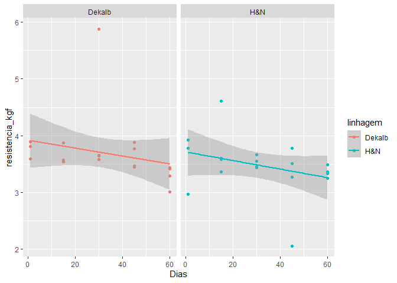
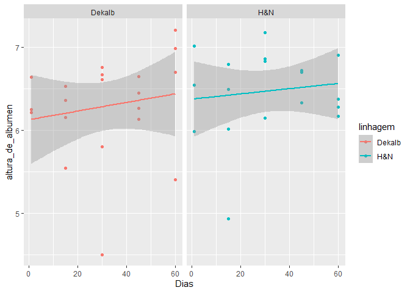
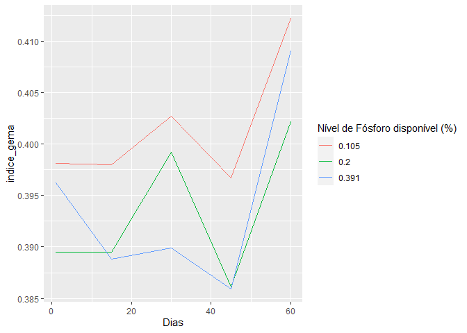
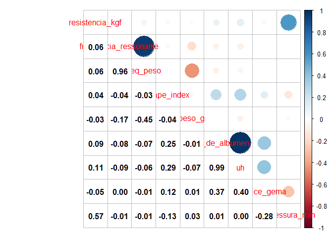
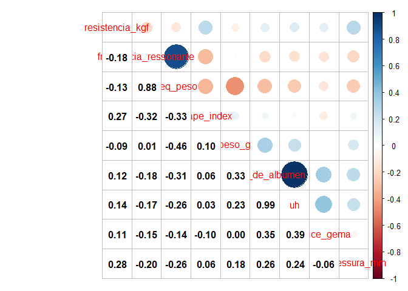

<!-- README.md is generated from README.Rmd. Please edit that file -->

# Análise qualidade da casca - mestrado João

## Carregando os pacotes no R

``` r
library(tidyverse)
library(lubridate)
library(skimr)
library(GGally)
library(ExpDes.pt)
```

## Pré-tratamento dos dados

-carregando o banco de dados; -mudando os nomes das colunas;

``` r
dados<- readxl::read_excel("data-raw/Dados Mestrado João.xlsx") |>
  janitor::clean_names()
dplyr::glimpse(dados)
#> Rows: 1,415
#> Columns: 23
#> $ data                  <dttm> 2021-05-14, 2021-05-14, 2021-05-14, 2021-05-14,~
#> $ no_ovo_egg_tester     <dbl> 2, 3, 4, 5, 6, 7, 8, 9, 10, 11, 12, 13, 14, 15, ~
#> $ linhagem              <chr> "H&N", "H&N", "H&N", "H&N", "H&N", "H&N", "H&N",~
#> $ box                   <dbl> 117, 117, 135, 135, 135, 152, 152, 152, 166, 166~
#> $ tratamento            <dbl> 1, 1, 1, 1, 1, 1, 1, 1, 1, 1, 1, 1, 1, 1, 1, 1, ~
#> $ repeticao             <dbl> 1, 1, 3, 3, 3, 5, 5, 5, 7, 7, 7, 8, 8, 8, 10, 10~
#> $ no_ovo                <dbl> 2, 3, 1, 2, 3, 1, 2, 3, 1, 2, 3, 1, 2, 3, 1, 2, ~
#> $ nivel_de_fosforo_disp <dbl> 0.391, 0.391, 0.391, 0.391, 0.391, 0.391, 0.391,~
#> $ frequencia_ressonante <dbl> 4679, 5560, 5568, 5087, 6197, 5222, 5653, 4870, ~
#> $ eixo_x_mm             <dbl> 44.59, 42.60, 44.75, 42.57, 44.76, 43.54, 43.31,~
#> $ eixo_y_mm             <dbl> 59.38, 59.04, 58.60, 56.67, 59.53, 58.65, 59.07,~
#> $ shape_index           <dbl> 75.09262, 72.15447, 76.36519, 75.11911, 75.18898~
#> $ peso_g                <dbl> 66.3, 64.3, 66.8, 61.0, 69.4, 64.5, 65.6, 70.3, ~
#> $ altura_de_albumen     <dbl> 5.8, 5.8, 7.5, 7.8, 5.9, 4.4, 6.5, 8.0, 6.5, 7.0~
#> $ cor_de_gema           <dbl> 4, 5, 5, 5, 4, 7, 7, 7, 5, 5, 5, 6, 6, 6, 4, 5, ~
#> $ uh                    <dbl> 73.0, 73.8, 84.8, 88.2, 72.7, 60.8, 78.6, 86.9, ~
#> $ resistencia_kgf       <chr> "3.4", "3.56", "5.22", "4.23", "4.07", "5.02", "~
#> $ espessura_mm          <dbl> 0.37, 0.36, 0.39, 0.36, 0.39, 0.39, 0.33, 0.37, ~
#> $ altura_de_gema        <dbl> 16.6, 17.9, 17.3, 16.5, 18.0, 15.6, 19.6, 20.8, ~
#> $ diametro_de_gema      <dbl> 43.7, 43.7, 43.3, 43.0, 44.3, 44.3, 45.3, 43.7, ~
#> $ indice_gema           <dbl> 0.380, 0.410, 0.400, 0.384, 0.406, 0.352, 0.433,~
#> $ peso_casca            <dbl> 6.10, 5.99, 6.45, 5.49, 6.63, 6.77, 5.44, 6.59, ~
#> $ percent_casca         <dbl> 0.09200603, 0.09315708, 0.09655689, 0.09000000, ~
dados <- dados |> 
  mutate(
    class_peso = case_when(
      peso_g < 50 ~ "pequeno",
      peso_g < 55 ~ "medio",
      peso_g < 60 ~ "grande",
      peso_g < 65 ~ "extra_grande",
      TRUE ~ "jumbo"
    ),
    freq_peso = frequencia_ressonante / peso_g
  )
nd_filter <- c(0.105, 0.200, 0.391)
dados <- dados |> 
  filter(nivel_de_fosforo_disp %in% nd_filter)
table(dados$class_peso)
#> 
#> extra_grande       grande        jumbo        medio      pequeno 
#>          268          143          265           23            1
```

-   lidando com os valores perdidos de `resistencia_kgf`;
-   definindo as datas da amostragem.

``` r
dados <-dados |>
  dplyr::mutate(
    resistencia_kgf = ifelse(resistencia_kgf == "Perdi", NA, resistencia_kgf),
    resistencia_kgf = as.numeric(resistencia_kgf),
    dia=round(as.numeric(difftime(data,"2021-05-13",units = "days"))),
    dia = dplyr::case_when(
      dia < 3 ~ 1,
      dia < 20 ~15,
      dia < 30 ~ 30,
      dia < 45 ~ 45,
      dia < 60 ~ 60
    )
  )
dplyr::glimpse(dados)
#> Rows: 700
#> Columns: 26
#> $ data                  <dttm> 2021-05-14, 2021-05-14, 2021-05-14, 2021-05-14,~
#> $ no_ovo_egg_tester     <dbl> 2, 3, 4, 5, 6, 7, 8, 9, 10, 11, 12, 13, 14, 15, ~
#> $ linhagem              <chr> "H&N", "H&N", "H&N", "H&N", "H&N", "H&N", "H&N",~
#> $ box                   <dbl> 117, 117, 135, 135, 135, 152, 152, 152, 166, 166~
#> $ tratamento            <dbl> 1, 1, 1, 1, 1, 1, 1, 1, 1, 1, 1, 1, 1, 1, 1, 1, ~
#> $ repeticao             <dbl> 1, 1, 3, 3, 3, 5, 5, 5, 7, 7, 7, 8, 8, 8, 10, 10~
#> $ no_ovo                <dbl> 2, 3, 1, 2, 3, 1, 2, 3, 1, 2, 3, 1, 2, 3, 1, 2, ~
#> $ nivel_de_fosforo_disp <dbl> 0.391, 0.391, 0.391, 0.391, 0.391, 0.391, 0.391,~
#> $ frequencia_ressonante <dbl> 4679, 5560, 5568, 5087, 6197, 5222, 5653, 4870, ~
#> $ eixo_x_mm             <dbl> 44.59, 42.60, 44.75, 42.57, 44.76, 43.54, 43.31,~
#> $ eixo_y_mm             <dbl> 59.38, 59.04, 58.60, 56.67, 59.53, 58.65, 59.07,~
#> $ shape_index           <dbl> 75.09262, 72.15447, 76.36519, 75.11911, 75.18898~
#> $ peso_g                <dbl> 66.3, 64.3, 66.8, 61.0, 69.4, 64.5, 65.6, 70.3, ~
#> $ altura_de_albumen     <dbl> 5.8, 5.8, 7.5, 7.8, 5.9, 4.4, 6.5, 8.0, 6.5, 7.0~
#> $ cor_de_gema           <dbl> 4, 5, 5, 5, 4, 7, 7, 7, 5, 5, 5, 6, 6, 6, 4, 5, ~
#> $ uh                    <dbl> 73.0, 73.8, 84.8, 88.2, 72.7, 60.8, 78.6, 86.9, ~
#> $ resistencia_kgf       <dbl> 3.40, 3.56, 5.22, 4.23, 4.07, 5.02, 3.32, 4.97, ~
#> $ espessura_mm          <dbl> 0.37, 0.36, 0.39, 0.36, 0.39, 0.39, 0.33, 0.37, ~
#> $ altura_de_gema        <dbl> 16.6, 17.9, 17.3, 16.5, 18.0, 15.6, 19.6, 20.8, ~
#> $ diametro_de_gema      <dbl> 43.7, 43.7, 43.3, 43.0, 44.3, 44.3, 45.3, 43.7, ~
#> $ indice_gema           <dbl> 0.380, 0.410, 0.400, 0.384, 0.406, 0.352, 0.433,~
#> $ peso_casca            <dbl> 6.10, 5.99, 6.45, 5.49, 6.63, 6.77, 5.44, 6.59, ~
#> $ percent_casca         <dbl> 0.09200603, 0.09315708, 0.09655689, 0.09000000, ~
#> $ class_peso            <chr> "jumbo", "extra_grande", "jumbo", "extra_grande"~
#> $ freq_peso             <dbl> 70.57315, 86.46967, 83.35329, 83.39344, 89.29395~
#> $ dia                   <dbl> 1, 1, 1, 1, 1, 1, 1, 1, 1, 1, 1, 1, 1, 1, 1, 1, ~
```

-   seleção das variáveis para a análise.

``` r
dados <- dados |>
  select(dia,
         repeticao,
         linhagem,
         nivel_de_fosforo_disp,
         class_peso,
         resistencia_kgf,
         frequencia_ressonante,
         freq_peso,
         shape_index,
         peso_g,
         altura_de_albumen,
         uh,
         espessura_mm
         ) #|> 
  # mutate(log_frequencia_ressonante = log(frequencia_ressonante))
```

## Corrigindo os outliers

-   definindo uma função para o input de valores perdidos a partir da
    média do tratamento (Pd e Linhage).

``` r
input_na <- function(y,trat){
  df <- tibble(trat, y)
  vl <- is.na(y)
  df <- df[vl,]
  if(nrow(df) != 0){
    vetor_medias <- tapply(y,trat,mean,na.rm=TRUE)
    for(j in 1:nrow(df)){
      df[j,2] <- 
      vetor_medias[which(df$trat[j] == names(vetor_medias))]
    }
  }
  return(df$y)
}
```

``` r
dias <- unique(dados$dia)
linhagens <- unique(dados$linhagem)
for(k in 6:length(dados)){ # para cada variável no BD
  for(i in seq_along(dias)){
    da <- dados |>
      filter(dia == dias[i])
    Pd <- da$nivel_de_fosforo_disp
    Pd <- forcats::as_factor(Pd)
    Lin <- da$linhagem
    Lin <- forcats::as_factor(Lin)
    trat <- paste0(Lin,"_",Pd)
    y<-da[k] |>  pull()
    y[is.na(y)] <- input_na(y, trat)
    
    # boxplot_original <- tibble(trat,y) |>
    #   ggplot(aes(x=y, y=trat)) +
    #   geom_boxplot() +
    #   labs(title = paste0("ORIGINAL - Dia: ", dias[i],"; Variável: ",names(dados[k])))
    # print(boxplot_original)
    
    mod <- aov(y~trat)
    rs<-rstudent(mod)
    yp <- predict(mod)
    
    li<-quantile(rs, .25) - IQR(rs) *1.5
    ls<-quantile(rs, .75) + IQR(rs) *1.5
    # print({
    #   plot(rs ~yp)
    #   abline(h=c(li, ls), lty=2, col="red")
    # })
    regra <- rs >= ls | rs <= li
    da[da$dia == dias[i] & regra, k] <- yp[regra]
    
    # y <- da[k] |> pull()
    # boxplot_arrumado<-tibble(trat,y) |>
    #   ggplot(aes(x=y, y=trat)) +
    #   geom_boxplot() +
    #   labs(title = paste0("TRATADA - Dia: ", dias[i],"; Variável: ",names(dados[k])))
    # print(boxplot_arrumado)
    dados[dados$dia == dias[i],k] <- y
    
  }
}
```

## Análise de regressão linear

A análise foi realizada independete dos tratamentos para descrever o
comportamento das variáveis ao longo do dias por linhagem.

``` r
parametros <- names(dados)[6:(length(dados))]

for(i in 1:length(parametros)){
  da <- dados |>
    select(dia, linhagem, class_peso, parametros[i]) 
  names(da) <- c("dia","linhagem","class_peso","y")
  plot<-da |> 
    dplyr::group_by(dia, linhagem, class_peso) |>
    dplyr::summarise(re=mean(y, na.rm=TRUE)) |>
    ggplot(aes(x=dia, y=re, color=linhagem)) +
    geom_point() +
    geom_smooth(method = "lm")+
    labs(x="Dias",y=parametros[i]) +
    facet_wrap(~linhagem)
  print(plot)

  # tab <- da |>
  #   dplyr::group_by(dia,linhagem) |>
  #   dplyr::summarise(y=mean(y, na.rm=TRUE))
  # 
  # mod <- lm(y~dia + linhagem, data=tab)
  # print(summary.lm(mod))
  # plot(mod)
}
```

<!-- --><!-- --><!-- --><!-- --><!-- --><!-- --><!-- --><!-- -->

## Estatística descritiva do banco de dados

-   resumo estatístico para todas as variáveios do banco de dados

``` r
skim(dados)
```

|                                                  |       |
|:-------------------------------------------------|:------|
| Name                                             | dados |
| Number of rows                                   | 700   |
| Number of columns                                | 13    |
| \_\_\_\_\_\_\_\_\_\_\_\_\_\_\_\_\_\_\_\_\_\_\_   |       |
| Column type frequency:                           |       |
| character                                        | 2     |
| numeric                                          | 11    |
| \_\_\_\_\_\_\_\_\_\_\_\_\_\_\_\_\_\_\_\_\_\_\_\_ |       |
| Group variables                                  | None  |

Data summary

**Variable type: character**

| skim\_variable | n\_missing | complete\_rate | min | max | empty | n\_unique | whitespace |
|:---------------|-----------:|---------------:|----:|----:|------:|----------:|-----------:|
| linhagem       |          0 |              1 |   3 |   6 |     0 |         2 |          0 |
| class\_peso    |          0 |              1 |   5 |  12 |     0 |         5 |          0 |

**Variable type: numeric**

| skim\_variable           | n\_missing | complete\_rate |    mean |     sd |      p0 |     p25 |     p50 |     p75 |    p100 | hist  |
|:-------------------------|-----------:|---------------:|--------:|-------:|--------:|--------:|--------:|--------:|--------:|:------|
| dia                      |          0 |              1 |   30.16 |  20.95 |    1.00 |   15.00 |   30.00 |   45.00 |   60.00 | ▇▇▇▇▇ |
| repeticao                |          0 |              1 |    8.38 |   4.51 |    1.00 |    4.00 |    8.00 |   12.00 |   16.00 | ▇▆▆▆▆ |
| nivel\_de\_fosforo\_disp |          0 |              1 |    0.23 |   0.12 |    0.10 |    0.10 |    0.20 |    0.39 |    0.39 | ▇▇▁▁▇ |
| resistencia\_kgf         |          0 |              1 |    3.58 |   0.86 |    0.89 |    2.99 |    3.62 |    4.17 |    6.23 | ▁▅▇▅▁ |
| frequencia\_ressonante   |          0 |              1 | 5397.22 | 654.34 | 4055.00 | 4965.00 | 5303.00 | 5585.25 | 8764.00 | ▃▇▁▁▁ |
| freq\_peso               |          0 |              1 |   85.62 |  13.41 |   66.08 |   77.64 |   82.95 |   90.03 |  167.60 | ▇▅▁▁▁ |
| shape\_index             |          0 |              1 |   74.92 |   3.01 |   63.26 |   73.02 |   74.76 |   76.76 |   94.01 | ▁▇▆▁▁ |
| peso\_g                  |          0 |              1 |   63.48 |   4.79 |   49.60 |   60.20 |   63.60 |   66.80 |   78.50 | ▁▅▇▃▁ |
| altura\_de\_albumen      |          0 |              1 |    6.57 |   1.26 |    3.10 |    5.80 |    6.50 |    7.10 |   14.00 | ▁▇▂▁▁ |
| uh                       |          0 |              1 |   78.92 |   8.72 |   39.70 |   73.90 |   79.55 |   84.32 |  112.30 | ▁▁▇▃▁ |
| espessura\_mm            |          0 |              1 |    0.36 |   0.03 |    0.26 |    0.35 |    0.36 |    0.38 |    0.44 | ▁▂▇▇▁ |

## Gráfico de linhas

-   Análise para todas as variáveis do banco de dados, por nível de `P`.

``` r
for(i in 1:length(parametros)){
  da <- dados |>
    select(dia, linhagem, nivel_de_fosforo_disp, parametros[i]) 
  names(da) <- c("dia","linhagem","nivel_de_fosforo_disp","y")
  plot <- da |>
    group_by(dia, nivel_de_fosforo_disp) |> 
    drop_na() |> 
    mutate( y = mean(y), na.rm=TRUE) |> 
    ggplot(aes(x = dia, y = y, color=as.factor(nivel_de_fosforo_disp))) +
    geom_line() +
    labs(color="Nível de Fósforo disponível (%)", x="Dias",y=parametros[i])
  print(plot)
}
```

<!-- --><!-- --><!-- --><!-- --><!-- --><!-- --><!-- --><!-- -->

### Independente do dia

``` r
for(i in 1:length(parametros)){
  da <- dados |>
    select(dia, repeticao, linhagem, nivel_de_fosforo_disp, parametros[i]) 
  names(da) <- c("dia","repeticao","linhagem","nivel_de_fosforo_disp","y")
  plot <- da |> 
    group_by(nivel_de_fosforo_disp, linhagem, repeticao) |>
    summarise(re = mean(y, na.rm=TRUE)) |>
    ggplot(aes(x = as.factor(nivel_de_fosforo_disp), y = re)) +
    geom_boxplot(fill="lightgray") +
    theme_bw() +
    labs(x="Nível de Fósforo disponível (%)",
         y = parametros[i])
  print(plot)
}
```

<!-- --><!-- --><!-- --><!-- --><!-- --><!-- --><!-- --><!-- -->

## Matriz de correlação para linhagem **DEKALB**

``` r
classes<-c("grande", "extra_grande", "jumbo")
for(i in 1:length(classes)){
  dados  |>
    filter(linhagem == "Dekalb", 
           class_peso == classes[i],
           dia <= 30) |>
    drop_na() |> 
    select(resistencia_kgf:espessura_mm)  |>
    cor(use = "p")  |>
    corrplot::corrplot.mixed(lower.col = "black")
}
```

<!-- --><!-- --><!-- -->

## Matriz de correlação para linhagem **H&N**

``` r
for(i in 1:length(classes)){
  dados  |>
    filter(linhagem == "H&N", class_peso == classes[i]) |>
    drop_na() |> 
    select(resistencia_kgf:espessura_mm)  |>
    cor(use = "p")  |>
    corrplot:::corrplot.mixed(lower.col = "black")
}
```

<!-- --><!-- --><!-- -->

## Análise de variância

``` r
for(i in 1:length(parametros)){
  da <- dados |>
    select(dia, repeticao, linhagem, nivel_de_fosforo_disp, parametros[i]) 
  names(da) <- c("dia","repeticao","linhagem","nivel_de_fosforo_disp","y")
  
  da<- da |> 
    group_by(repeticao, linhagem, nivel_de_fosforo_disp) |> 
    summarise(y = mean(y, na.rm=TRUE))
  linhagem<-da$linhagem
  nivel_de_fosforo <- da$nivel_de_fosforo_disp
  y <- da$y
  print("-------------------------------------------------")
  print(paste0("Variável: ",parametros[i]))
  print("-------------------------------------------------")
  fat2.dic(linhagem,nivel_de_fosforo,y,quali = c(TRUE, FALSE), mcomp = "tukey",
           fac.names = c("Linhagem","Fosforo"))
}
#> `summarise()` has grouped output by 'repeticao', 'linhagem'. You can override using the `.groups` argument.
#> [1] "-------------------------------------------------"
#> [1] "Variável: resistencia_kgf"
#> [1] "-------------------------------------------------"
#> ------------------------------------------------------------------------
#> Legenda:
#> FATOR 1:  Linhagem 
#> FATOR 2:  Fosforo 
#> ------------------------------------------------------------------------
#> 
#> 
#> Quadro da analise de variancia
#> ------------------------------------------------------------------------
#>                  GL     SQ       QM     Fc   Pr>Fc
#> Linhagem          1 0.0352 0.035184 0.5180 0.47578
#> Fosforo           2 0.0921 0.046050 0.6780 0.51324
#> Linhagem*Fosforo  2 0.5751 0.287537 4.2333 0.02131
#> Residuo          41 2.7848 0.067922               
#> Total            46 3.4872                        
#> ------------------------------------------------------------------------
#> CV = 7.27 %
#> 
#> ------------------------------------------------------------------------
#> Teste de normalidade dos residuos (Shapiro-Wilk)
#> valor-p:  0.9996103 
#> De acordo com o teste de Shapiro-Wilk a 5% de significancia, os residuos podem ser considerados normais.
#> ------------------------------------------------------------------------
#> 
#> 
#> 
#> Interacao significativa: desdobrando a interacao
#> ------------------------------------------------------------------------
#> 
#> Desdobrando  Linhagem  dentro de cada nivel de  Fosforo 
#> ------------------------------------------------------------------------
#> ------------------------------------------------------------------------
#> Quadro da analise de variancia
#> ------------------------------------------------------------------------
#>                        GL      SQ      QM     Fc  Pr.Fc
#> Fosforo                 2 0.09210 0.04605 0.6780 0.5132
#> Linhagem:Fosforo 0.105  1 0.44003 0.44003 6.4784 0.0148
#> Linhagem:Fosforo 0.2    1 0.00440 0.00440 0.0648 0.8003
#> Linhagem:Fosforo 0.391  1 0.16848 0.16848 2.4805 0.1230
#> Residuo                41 2.78480 0.06792     NA     NA
#> Total                  46 3.48715 0.07581     NA     NA
#> ------------------------------------------------------------------------
#> 
#> 
#> 
#>  Linhagem  dentro do nivel  0.105  de  Fosforo 
#> ------------------------------------------------------------------------
#> Teste de Tukey
#> ------------------------------------------------------------------------
#> Grupos Tratamentos Medias
#> a     Dekalb      3.692437 
#>  b    H   3.360764 
#> ------------------------------------------------------------------------
#> 
#> 
#>  Linhagem  dentro do nivel  0.2  de  Fosforo 
#> 
#> De acordo com o teste F, as medias desse fator sao estatisticamente iguais.
#> ------------------------------------------------------------------------
#>     Niveis     Medias
#> 1   Dekalb   3.614750
#> 2        H   3.581579
#> ------------------------------------------------------------------------
#> 
#> 
#>  Linhagem  dentro do nivel  0.391  de  Fosforo 
#> 
#> De acordo com o teste F, as medias desse fator sao estatisticamente iguais.
#> ------------------------------------------------------------------------
#>     Niveis     Medias
#> 1   Dekalb   3.517981
#> 2        H   3.730417
#> ------------------------------------------------------------------------
#> 
#> 
#> 
#> Desdobrando  Fosforo  dentro de cada nivel de  Linhagem 
#> ------------------------------------------------------------------------
#> ------------------------------------------------------------------------
#> Quadro da analise de variancia
#> ------------------------------------------------------------------------
#>                         GL      SQ      QM     Fc  Pr.Fc
#> Linhagem                 1 0.03518 0.03518 0.5180 0.4758
#> Fosforo:Linhagem Dekalb  2 0.11370 0.05685 0.8370 0.4403
#> Fosforo:Linhagem H&N     2 0.55348 0.27674 4.0744 0.0243
#> Residuo                 41 2.78480 0.06792     NA     NA
#> Total                   46 3.48715 0.07581     NA     NA
#> ------------------------------------------------------------------------
#> 
#> 
#> 
#>  Fosforo  dentro do nivel  Dekalb  de  Linhagem 
#> 
#> De acordo com o teste F, as medias desse fator sao estatisticamente iguais.
#> ------------------------------------------------------------------------
#>     Niveis     Medias
#> 1    0.105   3.692437
#> 2      0.2   3.614750
#> 3    0.391   3.517981
#> ------------------------------------------------------------------------
#> 
#> 
#>  Fosforo  dentro do nivel  H&N  de  Linhagem 
#> ------------------------------------------------------------------------
#> Ajuste de modelos polinomiais de regressao
#> ------------------------------------------------------------------------
#> 
#> Modelo Linear
#> =========================================
#>    Estimativa Erro.padrao   tc    valor.p
#> -----------------------------------------
#> b0   3.2749     0.1166    28.0827    0   
#> b1   1.2186     0.4473    2.7242  0.0094 
#> -----------------------------------------
#> 
#> R2 do modelo linear
#> --------
#>   H&N   
#> --------
#> 0.910755
#> --------
#> 
#> Analise de variancia do modelo linear
#> ==================================================
#>                      GL   SQ     QM    Fc  valor.p
#> --------------------------------------------------
#> Efeito linear        1  0.5041 0.5041 7.42 0.00943
#> Desvios de Regressao 1  0.0494 0.0494 0.73 0.39874
#> Residuos             41 2.7848 0.0679             
#> --------------------------------------------------
#> ------------------------------------------------------------------------
#> 
#> Modelo quadratico
#> =========================================
#>    Estimativa Erro.padrao   tc    valor.p
#> -----------------------------------------
#> b0   3.0033     0.3392    8.8541     0   
#> b1   3.9721     3.2597    1.2185  0.2300 
#> b2  -5.4025     6.3351    -0.8528 0.3987 
#> -----------------------------------------
#> 
#> R2 do modelo quadratico
#> -
#> 1
#> -
#> 
#> Analise de variancia do modelo quadratico
#> ==================================================
#>                      GL   SQ     QM    Fc  valor.p
#> --------------------------------------------------
#> Efeito linear        1  0.5041 0.5041 7.42 0.00943
#> Efeito quadratico    1  0.0494 0.0494 0.73 0.39874
#> Desvios de Regressao 0    0      0     0      1   
#> Residuos             41 2.7848 0.0679             
#> --------------------------------------------------
#> ------------------------------------------------------------------------
#> `summarise()` has grouped output by 'repeticao', 'linhagem'. You can override using the `.groups` argument.
#> [1] "-------------------------------------------------"
#> [1] "Variável: frequencia_ressonante"
#> [1] "-------------------------------------------------"
#> ------------------------------------------------------------------------
#> Legenda:
#> FATOR 1:  Linhagem 
#> FATOR 2:  Fosforo 
#> ------------------------------------------------------------------------
#> 
#> 
#> Quadro da analise de variancia
#> ------------------------------------------------------------------------
#>                  GL      SQ    QM      Fc   Pr>Fc
#> Linhagem          1     452   452 0.01349 0.90810
#> Fosforo           2  137640 68820 2.05583 0.14098
#> Linhagem*Fosforo  2   24405 12202 0.36452 0.69676
#> Residuo          41 1372497 33476                
#> Total            46 1534994                      
#> ------------------------------------------------------------------------
#> CV = 3.39 %
#> 
#> ------------------------------------------------------------------------
#> Teste de normalidade dos residuos (Shapiro-Wilk)
#> valor-p:  0.003237047 
#> ATENCAO: a 5% de significancia, os residuos nao podem ser considerados normais!
#> ------------------------------------------------------------------------
#> 
#> Interacao nao significativa: analisando os efeitos simples
#> ------------------------------------------------------------------------
#> Linhagem
#> De acordo com o teste F, as medias desse fator sao estatisticamente iguais.
#> ------------------------------------------------------------------------
#>   Niveis   Medias
#> 1 Dekalb 5401.320
#> 2      H 5395.119
#> ------------------------------------------------------------------------
#> Fosforo
#> De acordo com o teste F, as medias desse fator sao estatisticamente iguais.
#> 
#> ------------------------------------------------------------------------
#>   Niveis   Medias
#> 1  0.105 5473.535
#> 2    0.2 5359.770
#> 3  0.391 5358.689
#> ------------------------------------------------------------------------
#> `summarise()` has grouped output by 'repeticao', 'linhagem'. You can override using the `.groups` argument.
#> [1] "-------------------------------------------------"
#> [1] "Variável: freq_peso"
#> [1] "-------------------------------------------------"
#> ------------------------------------------------------------------------
#> Legenda:
#> FATOR 1:  Linhagem 
#> FATOR 2:  Fosforo 
#> ------------------------------------------------------------------------
#> 
#> 
#> Quadro da analise de variancia
#> ------------------------------------------------------------------------
#>                  GL     SQ      QM     Fc   Pr>Fc
#> Linhagem          1 125.68 125.683 6.9883 0.01157
#> Fosforo           2 106.52  53.261 2.9615 0.06290
#> Linhagem*Fosforo  2  17.68   8.840 0.4915 0.61524
#> Residuo          41 737.37  17.985               
#> Total            46 987.25                       
#> ------------------------------------------------------------------------
#> CV = 4.95 %
#> 
#> ------------------------------------------------------------------------
#> Teste de normalidade dos residuos (Shapiro-Wilk)
#> valor-p:  0.002137696 
#> ATENCAO: a 5% de significancia, os residuos nao podem ser considerados normais!
#> ------------------------------------------------------------------------
#> 
#> Interacao nao significativa: analisando os efeitos simples
#> ------------------------------------------------------------------------
#> Linhagem
#> Teste de Tukey
#> ------------------------------------------------------------------------
#> Grupos Tratamentos Medias
#> a     Dekalb      87.31607 
#>  b    H   84.0448 
#> ------------------------------------------------------------------------
#> 
#> Fosforo
#> De acordo com o teste F, as medias desse fator sao estatisticamente iguais.
#> 
#> ------------------------------------------------------------------------
#>   Niveis   Medias
#> 1  0.105 87.52659
#> 2    0.2 85.57542
#> 3  0.391 83.71417
#> ------------------------------------------------------------------------
#> `summarise()` has grouped output by 'repeticao', 'linhagem'. You can override using the `.groups` argument.
#> [1] "-------------------------------------------------"
#> [1] "Variável: shape_index"
#> [1] "-------------------------------------------------"
#> ------------------------------------------------------------------------
#> Legenda:
#> FATOR 1:  Linhagem 
#> FATOR 2:  Fosforo 
#> ------------------------------------------------------------------------
#> 
#> 
#> Quadro da analise de variancia
#> ------------------------------------------------------------------------
#>                  GL     SQ     QM     Fc   Pr>Fc
#> Linhagem          1 45.795 45.795 42.781 0.00000
#> Fosforo           2  1.968  0.984  0.919 0.40692
#> Linhagem*Fosforo  2  0.082  0.041  0.038 0.96237
#> Residuo          41 43.888  1.070               
#> Total            46 91.733                      
#> ------------------------------------------------------------------------
#> CV = 1.38 %
#> 
#> ------------------------------------------------------------------------
#> Teste de normalidade dos residuos (Shapiro-Wilk)
#> valor-p:  0.06397591 
#> De acordo com o teste de Shapiro-Wilk a 5% de significancia, os residuos podem ser considerados normais.
#> ------------------------------------------------------------------------
#> 
#> Interacao nao significativa: analisando os efeitos simples
#> ------------------------------------------------------------------------
#> Linhagem
#> Teste de Tukey
#> ------------------------------------------------------------------------
#> Grupos Tratamentos Medias
#> a     Dekalb      75.93215 
#>  b    H   73.95752 
#> ------------------------------------------------------------------------
#> 
#> Fosforo
#> De acordo com o teste F, as medias desse fator sao estatisticamente iguais.
#> 
#> ------------------------------------------------------------------------
#>   Niveis   Medias
#> 1  0.105 75.05270
#> 2    0.2 74.66344
#> 3  0.391 75.06411
#> ------------------------------------------------------------------------
#> `summarise()` has grouped output by 'repeticao', 'linhagem'. You can override using the `.groups` argument.
#> [1] "-------------------------------------------------"
#> [1] "Variável: peso_g"
#> [1] "-------------------------------------------------"
#> ------------------------------------------------------------------------
#> Legenda:
#> FATOR 1:  Linhagem 
#> FATOR 2:  Fosforo 
#> ------------------------------------------------------------------------
#> 
#> 
#> Quadro da analise de variancia
#> ------------------------------------------------------------------------
#>                  GL      SQ     QM      Fc   Pr>Fc
#> Linhagem          1  62.774 62.774 20.7329 0.00005
#> Fosforo           2  13.194  6.597  2.1788 0.12610
#> Linhagem*Fosforo  2   3.936  1.968  0.6500 0.52735
#> Residuo          41 124.138  3.028                
#> Total            46 204.042                       
#> ------------------------------------------------------------------------
#> CV = 2.74 %
#> 
#> ------------------------------------------------------------------------
#> Teste de normalidade dos residuos (Shapiro-Wilk)
#> valor-p:  0.4911715 
#> De acordo com o teste de Shapiro-Wilk a 5% de significancia, os residuos podem ser considerados normais.
#> ------------------------------------------------------------------------
#> 
#> Interacao nao significativa: analisando os efeitos simples
#> ------------------------------------------------------------------------
#> Linhagem
#> Teste de Tukey
#> ------------------------------------------------------------------------
#> Grupos Tratamentos Medias
#> a     H   64.60559 
#>  b    Dekalb      62.29368 
#> ------------------------------------------------------------------------
#> 
#> Fosforo
#> De acordo com o teste F, as medias desse fator sao estatisticamente iguais.
#> 
#> ------------------------------------------------------------------------
#>   Niveis   Medias
#> 1  0.105 63.04550
#> 2    0.2 63.13019
#> 3  0.391 64.29851
#> ------------------------------------------------------------------------
#> `summarise()` has grouped output by 'repeticao', 'linhagem'. You can override using the `.groups` argument.
#> [1] "-------------------------------------------------"
#> [1] "Variável: altura_de_albumen"
#> [1] "-------------------------------------------------"
#> ------------------------------------------------------------------------
#> Legenda:
#> FATOR 1:  Linhagem 
#> FATOR 2:  Fosforo 
#> ------------------------------------------------------------------------
#> 
#> 
#> Quadro da analise de variancia
#> ------------------------------------------------------------------------
#>                  GL     SQ      QM     Fc    Pr>Fc
#> Linhagem          1 0.3640 0.36396 2.3253 0.134960
#> Fosforo           2 0.4437 0.22187 1.4175 0.253939
#> Linhagem*Fosforo  2 1.3256 0.66280 4.2346 0.021291
#> Residuo          41 6.4173 0.15652                
#> Total            46 8.5506                        
#> ------------------------------------------------------------------------
#> CV = 6.02 %
#> 
#> ------------------------------------------------------------------------
#> Teste de normalidade dos residuos (Shapiro-Wilk)
#> valor-p:  0.157455 
#> De acordo com o teste de Shapiro-Wilk a 5% de significancia, os residuos podem ser considerados normais.
#> ------------------------------------------------------------------------
#> 
#> 
#> 
#> Interacao significativa: desdobrando a interacao
#> ------------------------------------------------------------------------
#> 
#> Desdobrando  Linhagem  dentro de cada nivel de  Fosforo 
#> ------------------------------------------------------------------------
#> ------------------------------------------------------------------------
#> Quadro da analise de variancia
#> ------------------------------------------------------------------------
#>                        GL      SQ      QM     Fc  Pr.Fc
#> Fosforo                 2 0.44374 0.22187 1.4175 0.2539
#> Linhagem:Fosforo 0.105  1 1.34684 1.34684 8.6050 0.0055
#> Linhagem:Fosforo 0.2    1 0.10220 0.10220 0.6530 0.4237
#> Linhagem:Fosforo 0.391  1 0.22946 0.22946 1.4660 0.2329
#> Residuo                41 6.41727 0.15652     NA     NA
#> Total                  46 8.55057 0.18588     NA     NA
#> ------------------------------------------------------------------------
#> 
#> 
#> 
#>  Linhagem  dentro do nivel  0.105  de  Fosforo 
#> ------------------------------------------------------------------------
#> Teste de Tukey
#> ------------------------------------------------------------------------
#> Grupos Tratamentos Medias
#> a     H   6.935 
#>  b    Dekalb      6.354732 
#> ------------------------------------------------------------------------
#> 
#> 
#>  Linhagem  dentro do nivel  0.2  de  Fosforo 
#> 
#> De acordo com o teste F, as medias desse fator sao estatisticamente iguais.
#> ------------------------------------------------------------------------
#>     Niveis     Medias
#> 1   Dekalb   6.352500
#> 2        H   6.512344
#> ------------------------------------------------------------------------
#> 
#> 
#>  Linhagem  dentro do nivel  0.391  de  Fosforo 
#> 
#> De acordo com o teste F, as medias desse fator sao estatisticamente iguais.
#> ------------------------------------------------------------------------
#>     Niveis     Medias
#> 1   Dekalb   6.766667
#> 2        H   6.518750
#> ------------------------------------------------------------------------
#> 
#> 
#> 
#> Desdobrando  Fosforo  dentro de cada nivel de  Linhagem 
#> ------------------------------------------------------------------------
#> ------------------------------------------------------------------------
#> Quadro da analise de variancia
#> ------------------------------------------------------------------------
#>                         GL      SQ      QM     Fc  Pr.Fc
#> Linhagem                 1 0.36396 0.36396 2.3253 0.1350
#> Fosforo:Linhagem Dekalb  2 0.83082 0.41541 2.6541 0.0824
#> Fosforo:Linhagem H&N     2 0.93851 0.46926 2.9981 0.0609
#> Residuo                 41 6.41727 0.15652     NA     NA
#> Total                   46 8.55057 0.18588     NA     NA
#> ------------------------------------------------------------------------
#> 
#> 
#> 
#>  Fosforo  dentro do nivel  Dekalb  de  Linhagem 
#> 
#> De acordo com o teste F, as medias desse fator sao estatisticamente iguais.
#> ------------------------------------------------------------------------
#>     Niveis     Medias
#> 1    0.105   6.354732
#> 2      0.2   6.352500
#> 3    0.391   6.766667
#> ------------------------------------------------------------------------
#> 
#> 
#>  Fosforo  dentro do nivel  H&N  de  Linhagem 
#> 
#> De acordo com o teste F, as medias desse fator sao estatisticamente iguais.
#> ------------------------------------------------------------------------
#>     Niveis     Medias
#> 1    0.105   6.935000
#> 2      0.2   6.512344
#> 3    0.391   6.518750
#> ------------------------------------------------------------------------
#> `summarise()` has grouped output by 'repeticao', 'linhagem'. You can override using the `.groups` argument.
#> [1] "-------------------------------------------------"
#> [1] "Variável: uh"
#> [1] "-------------------------------------------------"
#> ------------------------------------------------------------------------
#> Legenda:
#> FATOR 1:  Linhagem 
#> FATOR 2:  Fosforo 
#> ------------------------------------------------------------------------
#> 
#> 
#> Quadro da analise de variancia
#> ------------------------------------------------------------------------
#>                  GL     SQ     QM     Fc   Pr>Fc
#> Linhagem          1   1.66  1.664 0.2024 0.65513
#> Fosforo           2  20.01 10.007 1.2174 0.30648
#> Linhagem*Fosforo  2  70.02 35.011 4.2593 0.02086
#> Residuo          41 337.01  8.220               
#> Total            46 428.71                      
#> ------------------------------------------------------------------------
#> CV = 3.63 %
#> 
#> ------------------------------------------------------------------------
#> Teste de normalidade dos residuos (Shapiro-Wilk)
#> valor-p:  0.5334621 
#> De acordo com o teste de Shapiro-Wilk a 5% de significancia, os residuos podem ser considerados normais.
#> ------------------------------------------------------------------------
#> 
#> 
#> 
#> Interacao significativa: desdobrando a interacao
#> ------------------------------------------------------------------------
#> 
#> Desdobrando  Linhagem  dentro de cada nivel de  Fosforo 
#> ------------------------------------------------------------------------
#> ------------------------------------------------------------------------
#> Quadro da analise de variancia
#> ------------------------------------------------------------------------
#>                        GL        SQ       QM     Fc  Pr.Fc
#> Fosforo                 2  20.01303 10.00652 1.2174 0.3065
#> Linhagem:Fosforo 0.105  1  51.62551 51.62551 6.2807 0.0163
#> Linhagem:Fosforo 0.2    1   0.60499  0.60499 0.0736 0.7875
#> Linhagem:Fosforo 0.391  1  19.37393 19.37393 2.3570 0.1324
#> Residuo                41 337.00986  8.21975     NA     NA
#> Total                  46 428.70824  9.31974     NA     NA
#> ------------------------------------------------------------------------
#> 
#> 
#> 
#>  Linhagem  dentro do nivel  0.105  de  Fosforo 
#> ------------------------------------------------------------------------
#> Teste de Tukey
#> ------------------------------------------------------------------------
#> Grupos Tratamentos Medias
#> a     H   81.3625 
#>  b    Dekalb      77.76996 
#> ------------------------------------------------------------------------
#> 
#> 
#>  Linhagem  dentro do nivel  0.2  de  Fosforo 
#> 
#> De acordo com o teste F, as medias desse fator sao estatisticamente iguais.
#> ------------------------------------------------------------------------
#>     Niveis     Medias
#> 1   Dekalb   78.21917
#> 2        H   77.83026
#> ------------------------------------------------------------------------
#> 
#> 
#>  Linhagem  dentro do nivel  0.391  de  Fosforo 
#> 
#> De acordo com o teste F, as medias desse fator sao estatisticamente iguais.
#> ------------------------------------------------------------------------
#>     Niveis     Medias
#> 1   Dekalb   80.33619
#> 2        H   78.05815
#> ------------------------------------------------------------------------
#> 
#> 
#> 
#> Desdobrando  Fosforo  dentro de cada nivel de  Linhagem 
#> ------------------------------------------------------------------------
#> ------------------------------------------------------------------------
#> Quadro da analise de variancia
#> ------------------------------------------------------------------------
#>                         GL        SQ       QM     Fc  Pr.Fc
#> Linhagem                 1   1.66402  1.66402 0.2024 0.6551
#> Fosforo:Linhagem Dekalb  2  27.50810 13.75405 1.6733 0.2002
#> Fosforo:Linhagem H&N     2  62.52625 31.26313 3.8034 0.0305
#> Residuo                 41 337.00986  8.21975     NA     NA
#> Total                   46 428.70824  9.31974     NA     NA
#> ------------------------------------------------------------------------
#> 
#> 
#> 
#>  Fosforo  dentro do nivel  Dekalb  de  Linhagem 
#> 
#> De acordo com o teste F, as medias desse fator sao estatisticamente iguais.
#> ------------------------------------------------------------------------
#>     Niveis     Medias
#> 1    0.105   77.76996
#> 2      0.2   78.21917
#> 3    0.391   80.33619
#> ------------------------------------------------------------------------
#> 
#> 
#>  Fosforo  dentro do nivel  H&N  de  Linhagem 
#> ------------------------------------------------------------------------
#> Ajuste de modelos polinomiais de regressao
#> ------------------------------------------------------------------------
#> 
#> Modelo Linear
#> =========================================
#>    Estimativa Erro.padrao   tc    valor.p
#> -----------------------------------------
#> b0  81.3381     1.2829    63.4034    0   
#> b1  -9.7177     4.9207    -1.9748 0.0550 
#> -----------------------------------------
#> 
#> R2 do modelo linear
#> --------
#>   H&N   
#> --------
#> 0.512702
#> --------
#> 
#> Analise de variancia do modelo linear
#> =====================================================
#>                      GL    SQ      QM     Fc  valor.p
#> -----------------------------------------------------
#> Efeito linear        1  32.0573  32.0573 3.9  0.05505
#> Desvios de Regressao 1  30.4689  30.4689 3.71 0.06115
#> Residuos             41 337.0099 8.2198              
#> -----------------------------------------------------
#> ------------------------------------------------------------------------
#> 
#> Modelo quadratico
#> =========================================
#>    Estimativa Erro.padrao   tc    valor.p
#> -----------------------------------------
#> b0  88.0843     3.7314    23.6063    0   
#> b1  -78.1055    35.8598   -2.1781 0.0352 
#> b2  134.1770    69.6914   1.9253  0.0612 
#> -----------------------------------------
#> 
#> R2 do modelo quadratico
#> -
#> 1
#> -
#> 
#> Analise de variancia do modelo quadratico
#> =====================================================
#>                      GL    SQ      QM     Fc  valor.p
#> -----------------------------------------------------
#> Efeito linear        1  32.0573  32.0573 3.9  0.05505
#> Efeito quadratico    1  30.4689  30.4689 3.71 0.06115
#> Desvios de Regressao 0     0        0     0      1   
#> Residuos             41 337.0099 8.2198              
#> -----------------------------------------------------
#> ------------------------------------------------------------------------
#> `summarise()` has grouped output by 'repeticao', 'linhagem'. You can override using the `.groups` argument.
#> [1] "-------------------------------------------------"
#> [1] "Variável: espessura_mm"
#> [1] "-------------------------------------------------"
#> ------------------------------------------------------------------------
#> Legenda:
#> FATOR 1:  Linhagem 
#> FATOR 2:  Fosforo 
#> ------------------------------------------------------------------------
#> 
#> 
#> Quadro da analise de variancia
#> ------------------------------------------------------------------------
#>                  GL        SQ         QM     Fc   Pr>Fc
#> Linhagem          1 0.0008091 0.00080915 6.0771 0.01797
#> Fosforo           2 0.0001936 0.00009680 0.7270 0.48947
#> Linhagem*Fosforo  2 0.0002215 0.00011074 0.8317 0.44253
#> Residuo          41 0.0054591 0.00013315               
#> Total            46 0.0066833                          
#> ------------------------------------------------------------------------
#> CV = 3.18 %
#> 
#> ------------------------------------------------------------------------
#> Teste de normalidade dos residuos (Shapiro-Wilk)
#> valor-p:  0.9948873 
#> De acordo com o teste de Shapiro-Wilk a 5% de significancia, os residuos podem ser considerados normais.
#> ------------------------------------------------------------------------
#> 
#> Interacao nao significativa: analisando os efeitos simples
#> ------------------------------------------------------------------------
#> Linhagem
#> Teste de Tukey
#> ------------------------------------------------------------------------
#> Grupos Tratamentos Medias
#> a     H   0.3665926 
#>  b    Dekalb      0.3582923 
#> ------------------------------------------------------------------------
#> 
#> Fosforo
#> De acordo com o teste F, as medias desse fator sao estatisticamente iguais.
#> 
#> ------------------------------------------------------------------------
#>   Niveis    Medias
#> 1  0.105 0.3649587
#> 2    0.2 0.3600437
#> 3  0.391 0.3625939
#> ------------------------------------------------------------------------
```

## Adicionando o dia na análise (provisória)

``` r
for(i in 1:length(parametros)){
  da <- dados |>
    select(dia, repeticao, linhagem, nivel_de_fosforo_disp, parametros[i]) 
  names(da) <- c("dia","repeticao","linhagem","nivel_de_fosforo_disp","y")
  
  da<- da |> 
    group_by(dia, repeticao, linhagem, nivel_de_fosforo_disp) |> 
    summarise(y = mean(y, na.rm=TRUE))
  linhagem<-da$linhagem
  nivel_de_fosforo <- da$nivel_de_fosforo_disp
  y <- da$y
  dia <- da$dia
  print("-------------------------------------------------")
  print(paste0("Variável: ",parametros[i]))
  print("-------------------------------------------------")
  fat3.dic(dia, linhagem,nivel_de_fosforo,y,quali = c(TRUE, TRUE, FALSE), mcomp = "tukey",
           fac.names = c("Dia", "Linhagem","Fosforo"))
}
#> `summarise()` has grouped output by 'dia', 'repeticao', 'linhagem'. You can override using the `.groups` argument.
#> [1] "-------------------------------------------------"
#> [1] "Variável: resistencia_kgf"
#> [1] "-------------------------------------------------"
#> ------------------------------------------------------------------------
#> Legenda:
#> FATOR 1:  Dia 
#> FATOR 2:  Linhagem 
#> FATOR 3:  Fosforo 
#> ------------------------------------------------------------------------
#> 
#> ------------------------------------------------------------------------
#> Quadro da analise de variancia
#> ------------------------------------------------------------------------
#>                       GL       SQ      QM     Fc  Pr>Fc
#> Dia                    4  3.91808 0.97952  3.684 0.0064
#> Linhagem               1  0.17742 0.17742 0.6673  0.415
#> Fosforo                2  0.46768 0.23384 0.8795 0.4166
#> Dia*Linhagem           4  0.27923 0.06981 0.2625 0.9017
#> Dia*Fosforo            8  0.39391 0.04924 0.1852 0.9927
#> Linhagem*Fosforo       2  2.83806 1.41903  5.337 0.0055
#> Dia*Linhagem*Fosforo   8  2.16918 0.27115 1.0198 0.4222
#> Residuo              205 54.50656 0.26589              
#> Total                234 64.75011                      
#> ------------------------------------------------------------------------
#> CV = 14.39 %
#> 
#> ------------------------------------------------------------------------
#> Teste de normalidade dos residuos (Shapiro-Wilk)
#> valor-p:  0.6428463 
#> De acordo com o teste de Shapiro-Wilk a 5% de significancia, os residuos podem ser considerados normais.
#> ------------------------------------------------------------------------
#> 
#> 
#> 
#> Interacao Linhagem*Fosforo  significativa: desdobrando a interacao
#> ------------------------------------------------------------------------
#> 
#> Desdobrando  Linhagem  dentro de cada nivel de  Fosforo 
#> ------------------------------------------------------------------------
#> ------------------------------------------------------------------------
#> Quadro da analise de variancia
#> ------------------------------------------------------------------------
#>                         GL       SQ      QM     Fc  Pr>Fc
#> Linhagem:Fosforo 0.105   1  2.16523 2.16523 8.1434 0.0048
#> Linhagem:Fosforo 0.2     1  0.02598 0.02598 0.0977 0.7549
#> Linhagem:Fosforo 0.391   1  0.83779 0.83779 3.1509 0.0774
#> Residuo                205 54.50656 0.26589              
#> ------------------------------------------------------------------------
#> 
#> 
#> 
#>  Linhagem  dentro do nivel  0.105  de  Fosforo 
#> ------------------------------------------------------------------------
#> Teste de Tukey
#> ------------------------------------------------------------------------
#> Grupos Tratamentos Medias
#> a     Dekalb      3.689795 
#>  b    H   3.360764 
#> ------------------------------------------------------------------------
#> 
#> 
#>  Linhagem  dentro do nivel  0.2  de  Fosforo 
#> 
#> De acordo com o teste F, as medias desse fator sao estatisticamente iguais.
#> ------------------------------------------------------------------------
#>     Niveis     Medias
#> 1   Dekalb   3.614750
#> 2        H   3.578708
#> ------------------------------------------------------------------------
#> 
#> 
#>  Linhagem  dentro do nivel  0.391  de  Fosforo 
#> 
#> De acordo com o teste F, as medias desse fator sao estatisticamente iguais.
#> ------------------------------------------------------------------------
#>     Niveis     Medias
#> 1   Dekalb   3.517981
#> 2        H   3.729833
#> ------------------------------------------------------------------------
#> 
#> 
#> 
#> Desdobrando  Fosforo  dentro de cada nivel de  Linhagem 
#> ------------------------------------------------------------------------
#> ------------------------------------------------------------------------
#> Quadro da analise de variancia
#> ------------------------------------------------------------------------
#>                          GL       SQ      QM     Fc  Pr>Fc
#> Fosforo:Linhagem Dekalb   2  0.55173 0.27587 1.0375 0.3562
#> Fosforo:Linhagem H&N      2  2.75400 1.37700 5.1789 0.0064
#> Residuo                 205 54.50656 0.26589              
#> ------------------------------------------------------------------------
#> 
#> 
#> 
#>  Fosforo  dentro do nivel  Dekalb  de  Linhagem 
#> 
#> De acordo com o teste F, as medias desse fator sao estatisticamente iguais.
#> ------------------------------------------------------------------------
#>     Niveis     Medias
#> 1    0.105   3.689795
#> 2      0.2   3.614750
#> 3    0.391   3.517981
#> ------------------------------------------------------------------------
#> 
#> 
#>  Fosforo  dentro do nivel  H&N  de  Linhagem 
#> ------------------------------------------------------------------------
#> Ajuste de modelos polinomiais de regressao
#> ------------------------------------------------------------------------
#> 
#> Modelo Linear
#> =========================================
#>    Estimativa Erro.padrao   tc    valor.p
#> -----------------------------------------
#> b0   3.2737     0.1032    31.7270    0   
#> b1   1.2185     0.3958    3.0788  0.0024 
#> -----------------------------------------
#> 
#> R2 do modelo linear
#> --------
#>   H&N   
#> --------
#> 0.915152
#> --------
#> 
#> Analise de variancia do modelo linear
#> ====================================================
#>                      GL    SQ      QM    Fc  valor.p
#> ----------------------------------------------------
#> Efeito linear         1  2.5203  2.5203 9.48 0.00236
#> Desvios de Regressao  1  0.2337  0.2337 0.88 0.34962
#> Residuos             205 54.5066 0.2659             
#> ----------------------------------------------------
#> ------------------------------------------------------------------------
#> 
#> Modelo quadratico
#> =========================================
#>    Estimativa Erro.padrao   tc    valor.p
#> -----------------------------------------
#> b0   3.0095     0.3001    10.0275    0   
#> b1   3.8969     2.8843    1.3511  0.1782 
#> b2  -5.2549     5.6055    -0.9375 0.3496 
#> -----------------------------------------
#> 
#> R2 do modelo quadratico
#> -
#> 1
#> -
#> 
#> Analise de variancia do modelo quadratico
#> ====================================================
#>                      GL    SQ      QM    Fc  valor.p
#> ----------------------------------------------------
#> Efeito linear         1  2.5203  2.5203 9.48 0.00236
#> Efeito quadratico     1  0.2337  0.2337 0.88 0.34962
#> Desvios de Regressao  0     0      0     0      1   
#> Residuos             205 54.5066 0.2659             
#> ----------------------------------------------------
#> ------------------------------------------------------------------------
#> 
#> Analisando os efeitos simples do fator  Dia 
#> ------------------------------------------------------------------------
#> Dia
#> Teste de Tukey
#> ------------------------------------------------------------------------
#> Grupos Tratamentos Medias
#> a     1   3.789434 
#> ab    15      3.587021 
#> ab    30      3.583298 
#> ab    45      3.575603 
#>  b    60      3.381312 
#> ------------------------------------------------------------------------
#> `summarise()` has grouped output by 'dia', 'repeticao', 'linhagem'. You can override using the `.groups` argument.
#> [1] "-------------------------------------------------"
#> [1] "Variável: frequencia_ressonante"
#> [1] "-------------------------------------------------"
#> ------------------------------------------------------------------------
#> Legenda:
#> FATOR 1:  Dia 
#> FATOR 2:  Linhagem 
#> FATOR 3:  Fosforo 
#> ------------------------------------------------------------------------
#> 
#> ------------------------------------------------------------------------
#> Quadro da analise de variancia
#> ------------------------------------------------------------------------
#>                       GL          SQ            QM     Fc  Pr>Fc
#> Dia                    4  5210433.13 1302608.28351 9.6249      0
#> Linhagem               1    13298.97   13298.96994 0.0983 0.7542
#> Fosforo                2   823875.35   411937.6761 3.0438 0.0498
#> Dia*Linhagem           4   389270.62   97317.65504 0.7191 0.5798
#> Dia*Fosforo            8  3500381.48   437547.6846  3.233 0.0017
#> Linhagem*Fosforo       2    98337.30   49168.65214 0.3633 0.6958
#> Dia*Linhagem*Fosforo   8  1670280.54  208785.06784 1.5427 0.1443
#> Residuo              205 27744078.60  135336.96879              
#> Total                234 39449956.00                            
#> ------------------------------------------------------------------------
#> CV = 6.81 %
#> 
#> ------------------------------------------------------------------------
#> Teste de normalidade dos residuos (Shapiro-Wilk)
#> valor-p:  8.893739e-12 
#> ATENCAO: a 5% de significancia, os residuos nao podem ser considerados normais!
#> ------------------------------------------------------------------------
#> 
#> 
#> 
#> Interacao Dia*Fosforo  significativa: desdobrando a interacao
#> ------------------------------------------------------------------------
#> 
#> Desdobrando  Dia  dentro de cada nivel de  Fosforo 
#> ------------------------------------------------------------------------
#> ------------------------------------------------------------------------
#> Quadro da analise de variancia
#> ------------------------------------------------------------------------
#>                    GL       SQ        QM      Fc  Pr>Fc
#> Dia:Fosforo 0.105   4  6983840 1745960.1 12.9008      0
#> Dia:Fosforo 0.2     4  1312004  328000.9  2.4236 0.0494
#> Dia:Fosforo 0.391   4   385794   96448.5  0.7127 0.5841
#> Residuo           205 27744079  135337.0               
#> ------------------------------------------------------------------------
#> 
#> 
#> 
#>  Dia  dentro do nivel  0.105  de  Fosforo 
#> ------------------------------------------------------------------------
#> Teste de Tukey
#> ------------------------------------------------------------------------
#> Grupos Tratamentos Medias
#> a     60      6041.172 
#>  b    45      5520.708 
#>  b    1   5317.021 
#>  b    30      5297.5 
#>  b    15      5234.896 
#> ------------------------------------------------------------------------
#> 
#> 
#>  Dia  dentro do nivel  0.2  de  Fosforo 
#> ------------------------------------------------------------------------
#> Teste de Tukey
#> ------------------------------------------------------------------------
#> Grupos Tratamentos Medias
#> a     45      5502.417 
#> a     60      5501.979 
#> a     30      5301.562 
#> a     1   5300.625 
#> a     15      5173.729 
#> ------------------------------------------------------------------------
#> 
#> 
#>  Dia  dentro do nivel  0.391  de  Fosforo 
#> 
#> De acordo com o teste F, as medias desse fator sao estatisticamente iguais.
#> ------------------------------------------------------------------------
#>     Niveis     Medias
#> 1        1   5404.722
#> 2       15   5300.822
#> 3       30   5260.844
#> 4       45   5461.956
#> 5       60   5362.644
#> ------------------------------------------------------------------------
#> 
#> 
#> 
#> Desdobrando  Fosforo  dentro de cada nivel de  Dia 
#> ------------------------------------------------------------------------
#> ------------------------------------------------------------------------
#> Quadro da analise de variancia
#> ------------------------------------------------------------------------
#>                 GL          SQ         QM      Fc  Pr>Fc
#> Fosforo:Dia 1    2    96074.09   48037.05  0.3549 0.7016
#> Fosforo:Dia 15   2   125053.88   62526.94   0.462 0.6307
#> Fosforo:Dia 30   2    15417.16    7708.58   0.057 0.9446
#> Fosforo:Dia 45   2    27808.75   13904.38  0.1027 0.9024
#> Fosforo:Dia 60   2  4033656.17 2016828.09 14.9023      0
#> Residuo        205 27744078.60  135336.97               
#> ------------------------------------------------------------------------
#> 
#> 
#> 
#>  Fosforo  dentro do nivel  1  de  Dia 
#> 
#> De acordo com o teste F, as medias desse fator sao estatisticamente iguais.
#> ------------------------------------------------------------------------
#>     Niveis     Medias
#> 1    0.105   5317.021
#> 2      0.2   5300.625
#> 3    0.391   5404.722
#> ------------------------------------------------------------------------
#> 
#> 
#>  Fosforo  dentro do nivel  15  de  Dia 
#> 
#> De acordo com o teste F, as medias desse fator sao estatisticamente iguais.
#> ------------------------------------------------------------------------
#>     Niveis     Medias
#> 1    0.105   5234.896
#> 2      0.2   5173.729
#> 3    0.391   5300.822
#> ------------------------------------------------------------------------
#> 
#> 
#>  Fosforo  dentro do nivel  30  de  Dia 
#> 
#> De acordo com o teste F, as medias desse fator sao estatisticamente iguais.
#> ------------------------------------------------------------------------
#>     Niveis     Medias
#> 1    0.105   5297.500
#> 2      0.2   5301.562
#> 3    0.391   5260.844
#> ------------------------------------------------------------------------
#> 
#> 
#>  Fosforo  dentro do nivel  45  de  Dia 
#> 
#> De acordo com o teste F, as medias desse fator sao estatisticamente iguais.
#> ------------------------------------------------------------------------
#>     Niveis     Medias
#> 1    0.105   5520.708
#> 2      0.2   5502.417
#> 3    0.391   5461.956
#> ------------------------------------------------------------------------
#> 
#> 
#>  Fosforo  dentro do nivel  60  de  Dia 
#> ------------------------------------------------------------------------
#> Ajuste de modelos polinomiais de regressao
#> ------------------------------------------------------------------------
#> 
#> Modelo Linear
#> ==========================================
#>    Estimativa  Erro.padrao   tc    valor.p
#> ------------------------------------------
#> b0 6,133.1590   117.0886   52.3805    0   
#> b1 -2,152.4790  455.2082   -4.7286    0   
#> ------------------------------------------
#> 
#> R2 do modelo linear
#> --------
#>    60   
#> --------
#> 0.750197
#> --------
#> 
#> Analise de variancia do modelo linear
#> =====================================================================
#>                      GL        SQ              QM        Fc   valor.p
#> ---------------------------------------------------------------------
#> Efeito linear         1  3,026,037.0000  3,026,037.0000 22.36    0   
#> Desvios de Regressao  1  1,007,619.0000  1,007,619.0000 7.45  0.00691
#> Residuos             205 27,744,079.0000  135,337.0000               
#> ---------------------------------------------------------------------
#> ------------------------------------------------------------------------
#> 
#> Modelo quadratico
#> ===========================================
#>     Estimativa  Erro.padrao   tc    valor.p
#> -------------------------------------------
#> b0  7,000.3050   338.6825   20.6692    0   
#> b1 -10,950.5200 3,256.3520  -3.3628 0.0009 
#> b2 17,294.4500  6,338.2110  2.7286  0.0069 
#> -------------------------------------------
#> 
#> R2 do modelo quadratico
#> -
#> 1
#> -
#> 
#> Analise de variancia do modelo quadratico
#> =====================================================================
#>                      GL        SQ              QM        Fc   valor.p
#> ---------------------------------------------------------------------
#> Efeito linear         1  3,026,037.0000  3,026,037.0000 22.36    0   
#> Efeito quadratico     1  1,007,619.0000  1,007,619.0000 7.45  0.00691
#> Desvios de Regressao  0         0              0          0      1   
#> Residuos             205 27,744,079.0000  135,337.0000               
#> ---------------------------------------------------------------------
#> ------------------------------------------------------------------------
#> 
#> Analisando os efeitos simples do fator  Linhagem 
#> ------------------------------------------------------------------------
#> Linhagem
#> De acordo com o teste F, as medias desse fator sao estatisticamente iguais.
#> ------------------------------------------------------------------------
#>   Niveis   Medias
#> 1 Dekalb 5407.389
#> 2      H 5392.340
#> ------------------------------------------------------------------------
#> `summarise()` has grouped output by 'dia', 'repeticao', 'linhagem'. You can override using the `.groups` argument.
#> [1] "-------------------------------------------------"
#> [1] "Variável: freq_peso"
#> [1] "-------------------------------------------------"
#> ------------------------------------------------------------------------
#> Legenda:
#> FATOR 1:  Dia 
#> FATOR 2:  Linhagem 
#> FATOR 3:  Fosforo 
#> ------------------------------------------------------------------------
#> 
#> ------------------------------------------------------------------------
#> Quadro da analise de variancia
#> ------------------------------------------------------------------------
#>                       GL          SQ        QM      Fc  Pr>Fc
#> Dia                    4  1834.50233 458.62558  7.9532      0
#> Linhagem               1   694.30411 694.30411 12.0402  6e-04
#> Fosforo                2   584.79459  292.3973  5.0706 0.0071
#> Dia*Linhagem           4   226.75508  56.68877  0.9831 0.4178
#> Dia*Fosforo            8  1316.13559 164.51695   2.853  0.005
#> Linhagem*Fosforo       2    85.86083  42.93042  0.7445 0.4763
#> Dia*Linhagem*Fosforo   8   644.78700  80.59837  1.3977 0.1992
#> Residuo              205 11821.42276  57.66548               
#> Total                234 17208.56229                         
#> ------------------------------------------------------------------------
#> CV = 8.86 %
#> 
#> ------------------------------------------------------------------------
#> Teste de normalidade dos residuos (Shapiro-Wilk)
#> valor-p:  2.808378e-09 
#> ATENCAO: a 5% de significancia, os residuos nao podem ser considerados normais!
#> ------------------------------------------------------------------------
#> 
#> 
#> 
#> Interacao Dia*Fosforo  significativa: desdobrando a interacao
#> ------------------------------------------------------------------------
#> 
#> Desdobrando  Dia  dentro de cada nivel de  Fosforo 
#> ------------------------------------------------------------------------
#> ------------------------------------------------------------------------
#> Quadro da analise de variancia
#> ------------------------------------------------------------------------
#>                    GL         SQ        QM      Fc  Pr>Fc
#> Dia:Fosforo 0.105   4  2489.4430 622.36074 10.7926      0
#> Dia:Fosforo 0.2     4   651.0307 162.75767  2.8224 0.0261
#> Dia:Fosforo 0.391   4     4.7007   1.17517  0.0204 0.9992
#> Residuo           205 11821.4228  57.66548               
#> ------------------------------------------------------------------------
#> 
#> 
#> 
#>  Dia  dentro do nivel  0.105  de  Fosforo 
#> ------------------------------------------------------------------------
#> Teste de Tukey
#> ------------------------------------------------------------------------
#> Grupos Tratamentos Medias
#> a     60      98.10983 
#>  b    45      88.80446 
#>  b    30      84.59604 
#>  b    15      83.80881 
#>  b    1   83.09223 
#> ------------------------------------------------------------------------
#> 
#> 
#>  Dia  dentro do nivel  0.2  de  Fosforo 
#> ------------------------------------------------------------------------
#> Teste de Tukey
#> ------------------------------------------------------------------------
#> Grupos Tratamentos Medias
#> a     60      89.40262 
#> ab    45      87.36497 
#> ab    30      86.23794 
#> ab    15      82.64997 
#>  b    1   81.85122 
#> ------------------------------------------------------------------------
#> 
#> 
#>  Dia  dentro do nivel  0.391  de  Fosforo 
#> 
#> De acordo com o teste F, as medias desse fator sao estatisticamente iguais.
#> ------------------------------------------------------------------------
#>     Niveis     Medias
#> 1        1   83.83627
#> 2       15   83.35228
#> 3       30   83.56668
#> 4       45   84.09165
#> 5       60   83.64765
#> ------------------------------------------------------------------------
#> 
#> 
#> 
#> Desdobrando  Fosforo  dentro de cada nivel de  Dia 
#> ------------------------------------------------------------------------
#> ------------------------------------------------------------------------
#> Quadro da analise de variancia
#> ------------------------------------------------------------------------
#>                 GL          SQ        QM      Fc  Pr>Fc
#> Fosforo:Dia 1    2    31.33690  15.66845  0.2717 0.7623
#> Fosforo:Dia 15   2    10.89759   5.44879  0.0945 0.9099
#> Fosforo:Dia 30   2    56.53179  28.26590  0.4902 0.6132
#> Fosforo:Dia 45   2   179.41517  89.70758  1.5557 0.2135
#> Fosforo:Dia 60   2  1650.09613 825.04806 14.3075      0
#> Residuo        205 11821.42276  57.66548               
#> ------------------------------------------------------------------------
#> 
#> 
#> 
#>  Fosforo  dentro do nivel  1  de  Dia 
#> 
#> De acordo com o teste F, as medias desse fator sao estatisticamente iguais.
#> ------------------------------------------------------------------------
#>     Niveis     Medias
#> 1    0.105   83.09223
#> 2      0.2   81.85122
#> 3    0.391   83.83627
#> ------------------------------------------------------------------------
#> 
#> 
#>  Fosforo  dentro do nivel  15  de  Dia 
#> 
#> De acordo com o teste F, as medias desse fator sao estatisticamente iguais.
#> ------------------------------------------------------------------------
#>     Niveis     Medias
#> 1    0.105   83.80881
#> 2      0.2   82.64997
#> 3    0.391   83.35228
#> ------------------------------------------------------------------------
#> 
#> 
#>  Fosforo  dentro do nivel  30  de  Dia 
#> 
#> De acordo com o teste F, as medias desse fator sao estatisticamente iguais.
#> ------------------------------------------------------------------------
#>     Niveis     Medias
#> 1    0.105   84.59604
#> 2      0.2   86.23794
#> 3    0.391   83.56668
#> ------------------------------------------------------------------------
#> 
#> 
#>  Fosforo  dentro do nivel  45  de  Dia 
#> 
#> De acordo com o teste F, as medias desse fator sao estatisticamente iguais.
#> ------------------------------------------------------------------------
#>     Niveis     Medias
#> 1    0.105   88.80446
#> 2      0.2   87.36497
#> 3    0.391   84.09165
#> ------------------------------------------------------------------------
#> 
#> 
#>  Fosforo  dentro do nivel  60  de  Dia 
#> ------------------------------------------------------------------------
#> Ajuste de modelos polinomiais de regressao
#> ------------------------------------------------------------------------
#> 
#> Modelo Linear
#> =========================================
#>    Estimativa Erro.padrao   tc    valor.p
#> -----------------------------------------
#> b0  101.4650    2.4169    41.9809    0   
#> b1  -47.8306    9.3964    -5.0903    0   
#> -----------------------------------------
#> 
#> R2 do modelo linear
#> --------
#>    60   
#> --------
#> 0.905522
#> --------
#> 
#> Analise de variancia do modelo linear
#> =============================================================
#>                      GL      SQ          QM      Fc   valor.p
#> -------------------------------------------------------------
#> Efeito linear         1  1,494.1980  1,494.1980 25.91    0   
#> Desvios de Regressao  1   155.8981    155.8981   2.7  0.10166
#> Residuos             205 11,821.4200  57.6655                
#> -------------------------------------------------------------
#> ------------------------------------------------------------------------
#> 
#> Modelo quadratico
#> =========================================
#>    Estimativa Erro.padrao   tc    valor.p
#> -----------------------------------------
#> b0  112.2511    6.9911    16.0564    0   
#> b1 -157.2661    67.2173   -2.3397 0.0203 
#> b2  215.1191   130.8327   1.6442  0.1017 
#> -----------------------------------------
#> 
#> R2 do modelo quadratico
#> -
#> 1
#> -
#> 
#> Analise de variancia do modelo quadratico
#> =============================================================
#>                      GL      SQ          QM      Fc   valor.p
#> -------------------------------------------------------------
#> Efeito linear         1  1,494.1980  1,494.1980 25.91    0   
#> Efeito quadratico     1   155.8981    155.8981   2.7  0.10166
#> Desvios de Regressao  0       0          0        0      1   
#> Residuos             205 11,821.4200  57.6655                
#> -------------------------------------------------------------
#> ------------------------------------------------------------------------
#> 
#> Analisando os efeitos simples do fator  Linhagem 
#> ------------------------------------------------------------------------
#> Linhagem
#> Teste de Tukey
#> ------------------------------------------------------------------------
#> Grupos Tratamentos Medias
#> a     Dekalb      87.42437 
#>  b    H   83.98587 
#> ------------------------------------------------------------------------
#> `summarise()` has grouped output by 'dia', 'repeticao', 'linhagem'. You can override using the `.groups` argument.
#> [1] "-------------------------------------------------"
#> [1] "Variável: shape_index"
#> [1] "-------------------------------------------------"
#> ------------------------------------------------------------------------
#> Legenda:
#> FATOR 1:  Dia 
#> FATOR 2:  Linhagem 
#> FATOR 3:  Fosforo 
#> ------------------------------------------------------------------------
#> 
#> ------------------------------------------------------------------------
#> Quadro da analise de variancia
#> ------------------------------------------------------------------------
#>                       GL        SQ       QM      Fc  Pr>Fc
#> Dia                    4  25.99571  6.49893  2.3669  0.054
#> Linhagem               1 229.53340 229.5334 83.5949      0
#> Fosforo                2   9.65089  4.82544  1.7574 0.1751
#> Dia*Linhagem           4   0.95193  0.23798  0.0867 0.9865
#> Dia*Fosforo            8  14.49127  1.81141  0.6597 0.7265
#> Linhagem*Fosforo       2   0.49311  0.24656  0.0898 0.9142
#> Dia*Linhagem*Fosforo   8  25.32321   3.1654  1.1528 0.3296
#> Residuo              205 562.88566  2.74578               
#> Total                234 869.32519                        
#> ------------------------------------------------------------------------
#> CV = 2.21 %
#> 
#> ------------------------------------------------------------------------
#> Teste de normalidade dos residuos (Shapiro-Wilk)
#> valor-p:  0.8124263 
#> De acordo com o teste de Shapiro-Wilk a 5% de significancia, os residuos podem ser considerados normais.
#> ------------------------------------------------------------------------
#> 
#> Interacao nao significativa: analisando os efeitos simples
#> ------------------------------------------------------------------------
#> Dia
#> De acordo com o teste F, as medias desse fator sao estatisticamente iguais.
#> ------------------------------------------------------------------------
#>   Niveis   Medias
#> 1      1 74.50453
#> 2     15 74.71908
#> 3     30 74.85644
#> 4     45 75.09539
#> 5     60 75.47298
#> ------------------------------------------------------------------------
#> Linhagem
#> Teste de Tukey
#> ------------------------------------------------------------------------
#> Grupos Tratamentos Medias
#> a     Dekalb      75.93924 
#>  b    H   73.96219 
#> ------------------------------------------------------------------------
#> 
#> Fosforo
#> De acordo com o teste F, as medias desse fator sao estatisticamente iguais.
#> ------------------------------------------------------------------------
#>   Niveis   Medias
#> 1  0.105 75.06289
#> 2    0.2 74.67119
#> 3  0.391 75.06332
#> ------------------------------------------------------------------------
#> `summarise()` has grouped output by 'dia', 'repeticao', 'linhagem'. You can override using the `.groups` argument.
#> [1] "-------------------------------------------------"
#> [1] "Variável: peso_g"
#> [1] "-------------------------------------------------"
#> ------------------------------------------------------------------------
#> Legenda:
#> FATOR 1:  Dia 
#> FATOR 2:  Linhagem 
#> FATOR 3:  Fosforo 
#> ------------------------------------------------------------------------
#> 
#> ------------------------------------------------------------------------
#> Quadro da analise de variancia
#> ------------------------------------------------------------------------
#>                       GL         SQ        QM      Fc  Pr>Fc
#> Dia                    4  123.80280   30.9507  4.2839 0.0024
#> Linhagem               1  317.58842 317.58842 43.9574      0
#> Fosforo                2   66.12033  33.06016  4.5759 0.0114
#> Dia*Linhagem           4   26.65488   6.66372  0.9223 0.4519
#> Dia*Fosforo            8   60.75670   7.59459  1.0512  0.399
#> Linhagem*Fosforo       2   20.16335  10.08167  1.3954 0.2501
#> Dia*Linhagem*Fosforo   8   44.18223   5.52278  0.7644 0.6345
#> Residuo              205 1481.10870   7.22492               
#> Total                234 2140.37741                         
#> ------------------------------------------------------------------------
#> CV = 4.23 %
#> 
#> ------------------------------------------------------------------------
#> Teste de normalidade dos residuos (Shapiro-Wilk)
#> valor-p:  0.6121663 
#> De acordo com o teste de Shapiro-Wilk a 5% de significancia, os residuos podem ser considerados normais.
#> ------------------------------------------------------------------------
#> 
#> Interacao nao significativa: analisando os efeitos simples
#> ------------------------------------------------------------------------
#> Dia
#> Teste de Tukey
#> ------------------------------------------------------------------------
#> Grupos Tratamentos Medias
#> a     1   64.70638 
#> ab    45      63.82482 
#> ab    15      63.3 
#>  b    60      62.83422 
#>  b    30      62.7305 
#> ------------------------------------------------------------------------
#> 
#> Linhagem
#> Teste de Tukey
#> ------------------------------------------------------------------------
#> Grupos Tratamentos Medias
#> a     H   64.61722 
#>  b    Dekalb      62.29167 
#> ------------------------------------------------------------------------
#> 
#> Fosforo
#> Ajuste de modelos polinomiais de regressao
#> ------------------------------------------------------------------------
#> 
#> Modelo Linear
#> ==========================================
#>    Estimativa Erro.padrao    tc    valor.p
#> ------------------------------------------
#> b0  62.4197     0.3826    163.1489    0   
#> b1   4.6342     1.4874     3.1156  0.0021 
#> ------------------------------------------
#> 
#> R2 do modelo linear
#> --------
#> 1.060662
#> --------
#> 
#> Analise de variancia do modelo linear
#> =========================================================
#>                      GL      SQ       QM     Fc   valor.p
#> ---------------------------------------------------------
#> Efeito linear         1   70.1313   70.1313 9.71  0.0021 
#> Desvios de Regressao  1   -4.0110   -4.0110 -0.56    1   
#> Residuos             205 1,481.1090 7.2249               
#> ---------------------------------------------------------
#> ------------------------------------------------------------------------
#> 
#> Modelo quadratico
#> =========================================
#>    Estimativa Erro.padrao   tc    valor.p
#> -----------------------------------------
#> b0  63.3015     1.1067    57.2002    0   
#> b1  -4.3122     10.6403   -0.4053 0.6857 
#> b2  17.5861     20.7105   0.8491  0.3968 
#> -----------------------------------------
#> 
#> R2 do modelo quadratico
#> -
#> 1
#> -
#> 
#> Analise de variancia do modelo quadratico
#> ========================================================
#>                      GL      SQ       QM     Fc  valor.p
#> --------------------------------------------------------
#> Efeito linear         1   70.1313   70.1313 9.71 0.0021 
#> Efeito quadratico     1    5.2094   5.2094  0.72 0.39679
#> Desvios de Regressao  0   -9.2204      0     0      1   
#> Residuos             205 1,481.1090 7.2249              
#> --------------------------------------------------------
#> ------------------------------------------------------------------------
#> `summarise()` has grouped output by 'dia', 'repeticao', 'linhagem'. You can override using the `.groups` argument.
#> [1] "-------------------------------------------------"
#> [1] "Variável: altura_de_albumen"
#> [1] "-------------------------------------------------"
#> ------------------------------------------------------------------------
#> Legenda:
#> FATOR 1:  Dia 
#> FATOR 2:  Linhagem 
#> FATOR 3:  Fosforo 
#> ------------------------------------------------------------------------
#> 
#> ------------------------------------------------------------------------
#> Quadro da analise de variancia
#> ------------------------------------------------------------------------
#>                       GL        SQ      QM     Fc  Pr>Fc
#> Dia                    4   6.06603 1.51651 2.9932 0.0198
#> Linhagem               1   2.02466 2.02466 3.9962 0.0469
#> Fosforo                2   1.86024 0.93012 1.8358 0.1621
#> Dia*Linhagem           4   3.49506 0.87376 1.7246 0.1458
#> Dia*Fosforo            8   3.63805 0.45476 0.8976 0.5194
#> Linhagem*Fosforo       2   6.62856 3.31428 6.5416 0.0018
#> Dia*Linhagem*Fosforo   8   2.84634 0.35579 0.7022 0.6894
#> Residuo              205 103.86292 0.50665              
#> Total                234 130.42187                      
#> ------------------------------------------------------------------------
#> CV = 10.83 %
#> 
#> ------------------------------------------------------------------------
#> Teste de normalidade dos residuos (Shapiro-Wilk)
#> valor-p:  0.1339947 
#> De acordo com o teste de Shapiro-Wilk a 5% de significancia, os residuos podem ser considerados normais.
#> ------------------------------------------------------------------------
#> 
#> 
#> 
#> Interacao Linhagem*Fosforo  significativa: desdobrando a interacao
#> ------------------------------------------------------------------------
#> 
#> Desdobrando  Linhagem  dentro de cada nivel de  Fosforo 
#> ------------------------------------------------------------------------
#> ------------------------------------------------------------------------
#> Quadro da analise de variancia
#> ------------------------------------------------------------------------
#>                         GL        SQ      QM      Fc  Pr>Fc
#> Linhagem:Fosforo 0.105   1   6.67013 6.67013 13.1652  4e-04
#> Linhagem:Fosforo 0.2     1   0.75725 0.75725  1.4946 0.2229
#> Linhagem:Fosforo 0.391   1   1.17446 1.17446  2.3181 0.1294
#> Residuo                205 103.86292 0.50665               
#> ------------------------------------------------------------------------
#> 
#> 
#> 
#>  Linhagem  dentro do nivel  0.105  de  Fosforo 
#> ------------------------------------------------------------------------
#> Teste de Tukey
#> ------------------------------------------------------------------------
#> Grupos Tratamentos Medias
#> a     H   6.935 
#>  b    Dekalb      6.3575 
#> ------------------------------------------------------------------------
#> 
#> 
#>  Linhagem  dentro do nivel  0.2  de  Fosforo 
#> 
#> De acordo com o teste F, as medias desse fator sao estatisticamente iguais.
#> ------------------------------------------------------------------------
#>     Niveis     Medias
#> 1   Dekalb   6.352500
#> 2        H   6.547083
#> ------------------------------------------------------------------------
#> 
#> 
#>  Linhagem  dentro do nivel  0.391  de  Fosforo 
#> 
#> De acordo com o teste F, as medias desse fator sao estatisticamente iguais.
#> ------------------------------------------------------------------------
#>     Niveis     Medias
#> 1   Dekalb   6.766667
#> 2        H   6.515833
#> ------------------------------------------------------------------------
#> 
#> 
#> 
#> Desdobrando  Fosforo  dentro de cada nivel de  Linhagem 
#> ------------------------------------------------------------------------
#> ------------------------------------------------------------------------
#> Quadro da analise de variancia
#> ------------------------------------------------------------------------
#>                          GL        SQ      QM     Fc  Pr>Fc
#> Fosforo:Linhagem Dekalb   2   4.12671 2.06336 4.0726 0.0184
#> Fosforo:Linhagem H&N      2   4.36209 2.18104 4.3048 0.0147
#> Residuo                 205 103.86292 0.50665              
#> ------------------------------------------------------------------------
#> 
#> 
#> 
#>  Fosforo  dentro do nivel  Dekalb  de  Linhagem 
#> ------------------------------------------------------------------------
#> Ajuste de modelos polinomiais de regressao
#> ------------------------------------------------------------------------
#> 
#> Modelo Linear
#> =========================================
#>    Estimativa Erro.padrao   tc    valor.p
#> -----------------------------------------
#> b0   6.1379     0.1442    42.5562    0   
#> b1   1.5210     0.5689    2.6736  0.0081 
#> -----------------------------------------
#> 
#> R2 do modelo linear
#> --------
#>  Dekalb 
#> --------
#> 0.877574
#> --------
#> 
#> Analise de variancia do modelo linear
#> =====================================================
#>                      GL     SQ      QM    Fc  valor.p
#> -----------------------------------------------------
#> Efeito linear         1   3.6215  3.6215 7.15 0.00811
#> Desvios de Regressao  1   0.5052  0.5052  1   0.31917
#> Residuos             205 103.8629 0.5066             
#> -----------------------------------------------------
#> ------------------------------------------------------------------------
#> 
#> Modelo quadratico
#> =========================================
#>    Estimativa Erro.padrao   tc    valor.p
#> -----------------------------------------
#> b0   6.5261     0.4146    15.7401    0   
#> b1  -2.4212     3.9886    -0.6070 0.5445 
#> b2   7.7659     7.7769    0.9986  0.3192 
#> -----------------------------------------
#> 
#> R2 do modelo quadratico
#> -
#> 1
#> -
#> 
#> Analise de variancia do modelo quadratico
#> =====================================================
#>                      GL     SQ      QM    Fc  valor.p
#> -----------------------------------------------------
#> Efeito linear         1   3.6215  3.6215 7.15 0.00811
#> Efeito quadratico     1   0.5052  0.5052  1   0.31917
#> Desvios de Regressao  0     0       0     0      1   
#> Residuos             205 103.8629 0.5066             
#> -----------------------------------------------------
#> ------------------------------------------------------------------------
#> 
#> 
#>  Fosforo  dentro do nivel  H&N  de  Linhagem 
#> ------------------------------------------------------------------------
#> Ajuste de modelos polinomiais de regressao
#> ------------------------------------------------------------------------
#> 
#> Modelo Linear
#> =========================================
#>    Estimativa Erro.padrao   tc    valor.p
#> -----------------------------------------
#> b0   6.9625     0.1424    48.8814    0   
#> b1  -1.2781     0.5463    -2.3393 0.0203 
#> -----------------------------------------
#> 
#> R2 do modelo linear
#> --------
#>   H&N   
#> --------
#> 0.635620
#> --------
#> 
#> Analise de variancia do modelo linear
#> =====================================================
#>                      GL     SQ      QM    Fc  valor.p
#> -----------------------------------------------------
#> Efeito linear         1   2.7726  2.7726 5.47 0.02028
#> Desvios de Regressao  1   1.5895  1.5895 3.14 0.07801
#> Residuos             205 103.8629 0.5066             
#> -----------------------------------------------------
#> ------------------------------------------------------------------------
#> 
#> Modelo quadratico
#> =========================================
#>    Estimativa Erro.padrao   tc    valor.p
#> -----------------------------------------
#> b0   7.6516     0.4143    18.4689    0   
#> b1  -8.2635     3.9815    -2.0755 0.0392 
#> b2  13.7053     7.7378    1.7712  0.0780 
#> -----------------------------------------
#> 
#> R2 do modelo quadratico
#> -
#> 1
#> -
#> 
#> Analise de variancia do modelo quadratico
#> =====================================================
#>                      GL     SQ      QM    Fc  valor.p
#> -----------------------------------------------------
#> Efeito linear         1   2.7726  2.7726 5.47 0.02028
#> Efeito quadratico     1   1.5895  1.5895 3.14 0.07801
#> Desvios de Regressao  0     0       0     0      1   
#> Residuos             205 103.8629 0.5066             
#> -----------------------------------------------------
#> ------------------------------------------------------------------------
#> 
#> Analisando os efeitos simples do fator  Dia 
#> ------------------------------------------------------------------------
#> Dia
#> Teste de Tukey
#> ------------------------------------------------------------------------
#> Grupos Tratamentos Medias
#> a     30      6.803901 
#> ab    60      6.697872 
#> ab    1   6.574468 
#> ab    45      6.405674 
#>  b    15      6.393617 
#> ------------------------------------------------------------------------
#> `summarise()` has grouped output by 'dia', 'repeticao', 'linhagem'. You can override using the `.groups` argument.
#> [1] "-------------------------------------------------"
#> [1] "Variável: uh"
#> [1] "-------------------------------------------------"
#> ------------------------------------------------------------------------
#> Legenda:
#> FATOR 1:  Dia 
#> FATOR 2:  Linhagem 
#> FATOR 3:  Fosforo 
#> ------------------------------------------------------------------------
#> 
#> ------------------------------------------------------------------------
#> Quadro da analise de variancia
#> ------------------------------------------------------------------------
#>                       GL         SQ        QM     Fc  Pr>Fc
#> Dia                    4  369.84485  92.46121 3.7832 0.0054
#> Linhagem               1   12.72386  12.72386 0.5206 0.4714
#> Fosforo                2   81.65722  40.82861 1.6706 0.1907
#> Dia*Linhagem           4   97.28494  24.32123 0.9951 0.4112
#> Dia*Fosforo            8  208.32369  26.04046 1.0655 0.3887
#> Linhagem*Fosforo       2  353.51832 176.75916 7.2323  9e-04
#> Dia*Linhagem*Fosforo   8  110.36431  13.79554 0.5645 0.8063
#> Residuo              205 5010.21620  24.44008              
#> Total                234 6243.93340                        
#> ------------------------------------------------------------------------
#> CV = 6.26 %
#> 
#> ------------------------------------------------------------------------
#> Teste de normalidade dos residuos (Shapiro-Wilk)
#> valor-p:  0.9880496 
#> De acordo com o teste de Shapiro-Wilk a 5% de significancia, os residuos podem ser considerados normais.
#> ------------------------------------------------------------------------
#> 
#> 
#> 
#> Interacao Linhagem*Fosforo  significativa: desdobrando a interacao
#> ------------------------------------------------------------------------
#> 
#> Desdobrando  Linhagem  dentro de cada nivel de  Fosforo 
#> ------------------------------------------------------------------------
#> ------------------------------------------------------------------------
#> Quadro da analise de variancia
#> ------------------------------------------------------------------------
#>                         GL         SQ        QM      Fc  Pr>Fc
#> Linhagem:Fosforo 0.105   1  266.66296 266.66296 10.9109 0.0011
#> Linhagem:Fosforo 0.2     1    0.52813   0.52813  0.0216 0.8833
#> Linhagem:Fosforo 0.391   1   98.63425  98.63425  4.0358 0.0459
#> Residuo                205 5010.21620  24.44008               
#> ------------------------------------------------------------------------
#> 
#> 
#> 
#>  Linhagem  dentro do nivel  0.105  de  Fosforo 
#> ------------------------------------------------------------------------
#> Teste de Tukey
#> ------------------------------------------------------------------------
#> Grupos Tratamentos Medias
#> a     H   81.3625 
#>  b    Dekalb      77.71104 
#> ------------------------------------------------------------------------
#> 
#> 
#>  Linhagem  dentro do nivel  0.2  de  Fosforo 
#> 
#> De acordo com o teste F, as medias desse fator sao estatisticamente iguais.
#> ------------------------------------------------------------------------
#>     Niveis     Medias
#> 1   Dekalb   78.21917
#> 2        H   78.05667
#> ------------------------------------------------------------------------
#> 
#> 
#>  Linhagem  dentro do nivel  0.391  de  Fosforo 
#> ------------------------------------------------------------------------
#> Teste de Tukey
#> ------------------------------------------------------------------------
#> Grupos Tratamentos Medias
#> a     Dekalb      80.33619 
#>  b    H   78.0375 
#> ------------------------------------------------------------------------
#> 
#> 
#> 
#> Desdobrando  Fosforo  dentro de cada nivel de  Linhagem 
#> ------------------------------------------------------------------------
#> ------------------------------------------------------------------------
#> Quadro da analise de variancia
#> ------------------------------------------------------------------------
#>                          GL        SQ        QM     Fc  Pr>Fc
#> Fosforo:Linhagem Dekalb   2  142.0485  71.02426 2.9061 0.0569
#> Fosforo:Linhagem H&N      2  293.1270 146.56351 5.9969 0.0029
#> Residuo                 205 5010.2162  24.44008              
#> ------------------------------------------------------------------------
#> 
#> 
#> 
#>  Fosforo  dentro do nivel  Dekalb  de  Linhagem 
#> 
#> De acordo com o teste F, as medias desse fator sao estatisticamente iguais.
#> ------------------------------------------------------------------------
#>     Niveis     Medias
#> 1    0.105   77.71104
#> 2      0.2   78.21917
#> 3    0.391   80.33619
#> ------------------------------------------------------------------------
#> 
#> 
#>  Fosforo  dentro do nivel  H&N  de  Linhagem 
#> ------------------------------------------------------------------------
#> Ajuste de modelos polinomiais de regressao
#> ------------------------------------------------------------------------
#> 
#> Modelo Linear
#> =========================================
#>    Estimativa Erro.padrao   tc    valor.p
#> -----------------------------------------
#> b0  81.4643     0.9893    82.3472    0   
#> b1  -9.9658     3.7946    -2.6263 0.0093 
#> -----------------------------------------
#> 
#> R2 do modelo linear
#> --------
#>   H&N   
#> --------
#> 0.575098
#> --------
#> 
#> Analise de variancia do modelo linear
#> ========================================================
#>                      GL      SQ        QM    Fc  valor.p
#> --------------------------------------------------------
#> Efeito linear         1   168.5766  168.5766 6.9 0.00928
#> Desvios de Regressao  1   124.5504  124.5504 5.1 0.02503
#> Residuos             205 5,010.2160 24.4401             
#> --------------------------------------------------------
#> ------------------------------------------------------------------------
#> 
#> Modelo quadratico
#> =========================================
#>    Estimativa Erro.padrao   tc    valor.p
#> -----------------------------------------
#> b0  87.5641     2.8774    30.4311    0   
#> b1  -71.8012    27.6531   -2.5965 0.0101 
#> b2  121.3213    53.7423   2.2575  0.0250 
#> -----------------------------------------
#> 
#> R2 do modelo quadratico
#> -
#> 1
#> -
#> 
#> Analise de variancia do modelo quadratico
#> ========================================================
#>                      GL      SQ        QM    Fc  valor.p
#> --------------------------------------------------------
#> Efeito linear         1   168.5766  168.5766 6.9 0.00928
#> Efeito quadratico     1   124.5504  124.5504 5.1 0.02503
#> Desvios de Regressao  0      0         0      0     1   
#> Residuos             205 5,010.2160 24.4401             
#> --------------------------------------------------------
#> ------------------------------------------------------------------------
#> 
#> Analisando os efeitos simples do fator  Dia 
#> ------------------------------------------------------------------------
#> Dia
#> Teste de Tukey
#> ------------------------------------------------------------------------
#> Grupos Tratamentos Medias
#> a     30      80.82979 
#> ab    60      79.93989 
#> ab    1   78.44326 
#>  b    45      77.70922 
#>  b    15      77.7 
#> ------------------------------------------------------------------------
#> `summarise()` has grouped output by 'dia', 'repeticao', 'linhagem'. You can override using the `.groups` argument.
#> [1] "-------------------------------------------------"
#> [1] "Variável: espessura_mm"
#> [1] "-------------------------------------------------"
#> ------------------------------------------------------------------------
#> Legenda:
#> FATOR 1:  Dia 
#> FATOR 2:  Linhagem 
#> FATOR 3:  Fosforo 
#> ------------------------------------------------------------------------
#> 
#> ------------------------------------------------------------------------
#> Quadro da analise de variancia
#> ------------------------------------------------------------------------
#>                       GL      SQ      QM      Fc  Pr>Fc
#> Dia                    4 0.00279   7e-04  2.5298 0.0417
#> Linhagem               1 0.00387 0.00387 14.0082  2e-04
#> Fosforo                2 0.00107 0.00053  1.9294 0.1479
#> Dia*Linhagem           4 0.00121   3e-04  1.0983 0.3585
#> Dia*Fosforo            8 0.00161   2e-04  0.7292 0.6656
#> Linhagem*Fosforo       2 0.00109 0.00055  1.9799 0.1407
#> Dia*Linhagem*Fosforo   8 0.00193 0.00024  0.8759 0.5377
#> Residuo              205 0.05659 0.00028               
#> Total                234 0.07017                       
#> ------------------------------------------------------------------------
#> CV = 4.58 %
#> 
#> ------------------------------------------------------------------------
#> Teste de normalidade dos residuos (Shapiro-Wilk)
#> valor-p:  0.5014585 
#> De acordo com o teste de Shapiro-Wilk a 5% de significancia, os residuos podem ser considerados normais.
#> ------------------------------------------------------------------------
#> 
#> Interacao nao significativa: analisando os efeitos simples
#> ------------------------------------------------------------------------
#> Dia
#> Teste de Tukey
#> ------------------------------------------------------------------------
#> Grupos Tratamentos Medias
#> a     1   0.3675532 
#> ab    45      0.3646809 
#> ab    30      0.3620922 
#> ab    15      0.3607801 
#>  b    60      0.3573991 
#> ------------------------------------------------------------------------
#> 
#> Linhagem
#> Teste de Tukey
#> ------------------------------------------------------------------------
#> Grupos Tratamentos Medias
#> a     H   0.3664722 
#>  b    Dekalb      0.3583573 
#> ------------------------------------------------------------------------
#> 
#> Fosforo
#> De acordo com o teste F, as medias desse fator sao estatisticamente iguais.
#> ------------------------------------------------------------------------
#>   Niveis    Medias
#> 1  0.105 0.3650521
#> 2    0.2 0.3598958
#> 3  0.391 0.3625590
#> ------------------------------------------------------------------------
```

## Análise de correlação desconsiderando o efeito dos tratamentos

``` r
names(dados)
#>  [1] "dia"                   "repeticao"             "linhagem"             
#>  [4] "nivel_de_fosforo_disp" "class_peso"            "resistencia_kgf"      
#>  [7] "frequencia_ressonante" "freq_peso"             "shape_index"          
#> [10] "peso_g"                "altura_de_albumen"     "uh"                   
#> [13] "espessura_mm"
parametros
#> [1] "resistencia_kgf"       "frequencia_ressonante" "freq_peso"            
#> [4] "shape_index"           "peso_g"                "altura_de_albumen"    
#> [7] "uh"                    "espessura_mm"
dados_rs <- dados
for(i in 6:12){
  lin<-dados$linhagem
  pd <- dados$nivel_de_fosforo_disp
  dia <- forcats::as_factor(dados$dia)
  trat <- paste0(lin,"_",pd)
  trat <- forcats::as_factor(trat)
  y <- dados[i] |>  pull()
  sum(is.na(y))
  
  mod <- aov(y~trat*dia)
  anova(mod)
  rs <- rstudent(mod)
  yp <- predict(mod)
  dados_rs[,i] <- rs
}

dados_rs  |> 
  # filter(class_peso %in% classes) |> 
  select(resistencia_kgf:espessura_mm)  |>
  cor(use = "p")  |>
  corrplot::corrplot.mixed(lower.col = "black")
```

<!-- -->

## Análise de correlação por tratamento

``` r
dados$Tratamento <- paste0(dados$linhagem,"_",
                           dados$nivel_de_fosforo_disp)
tratamentos = unique(dados$Tratamento)
for(i in 1:length(tratamentos)){
  print(tratamentos[i])
  dados  |>
    filter(Tratamento == tratamentos[i]) |>  
    select(resistencia_kgf:espessura_mm)  |>
    cor(use = "p")  |>
    corrplot::corrplot.mixed(lower.col = "black")
}
#> [1] "H&N_0.391"
```

<!-- -->

    #> [1] "H&N_0.105"

<!-- -->

    #> [1] "H&N_0.2"

<!-- -->

    #> [1] "Dekalb_0.391"

<!-- -->

    #> [1] "Dekalb_0.105"

<!-- -->

    #> [1] "Dekalb_0.2"

<!-- -->
