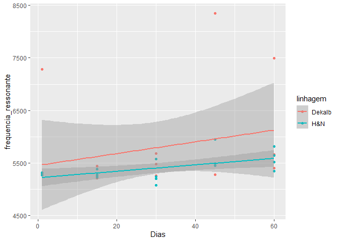
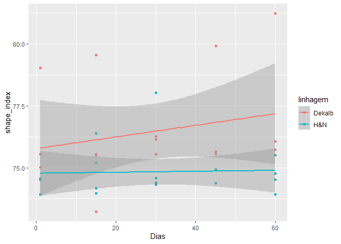
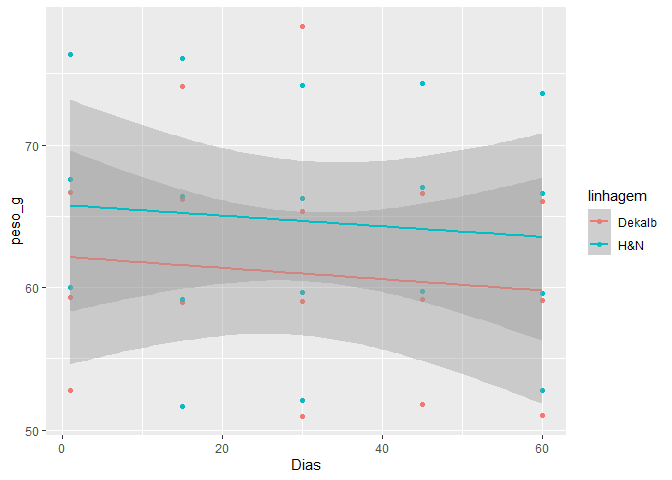
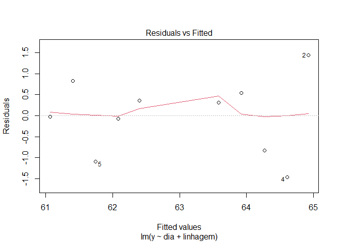
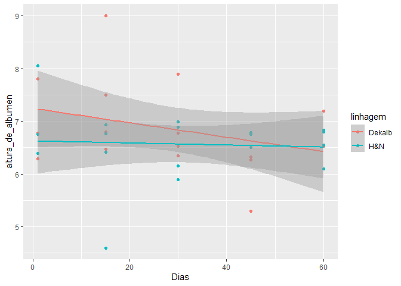
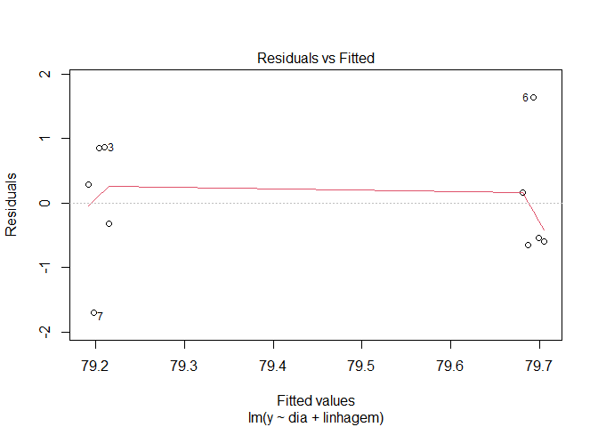
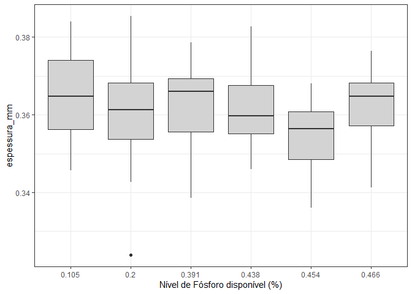
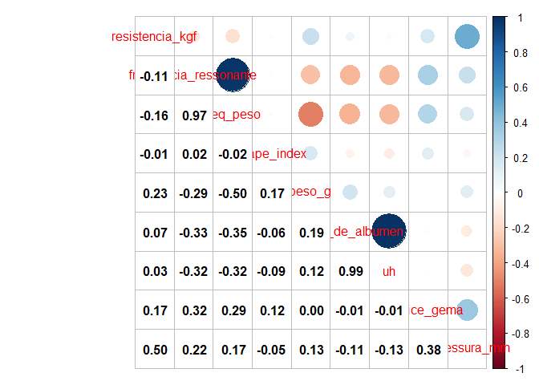
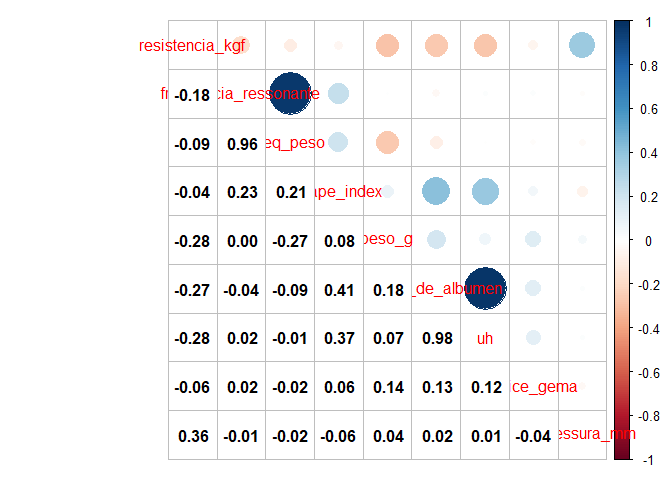

<!-- README.md is generated from README.Rmd. Please edit that file -->

# Análise qualidade da casca - mestrado João

## Carregando os pacotes no R

``` r
library(tidyverse)
library(lubridate)
library(skimr)
library(GGally)
library(ExpDes.pt)
```

## Pré-tratamento dos dados

-carregando o banco de dados; -mudando os nomes das colunas;

``` r
dados<- readxl::read_excel("data-raw/Dados Mestrado João.xlsx") |>
  janitor::clean_names()
dplyr::glimpse(dados)
#> Rows: 1,415
#> Columns: 23
#> $ data                  <dttm> 2021-05-14, 2021-05-14, 2021-05-14, 2021-05-14,~
#> $ no_ovo_egg_tester     <dbl> 2, 3, 4, 5, 6, 7, 8, 9, 10, 11, 12, 13, 14, 15, ~
#> $ linhagem              <chr> "H&N", "H&N", "H&N", "H&N", "H&N", "H&N", "H&N",~
#> $ box                   <dbl> 117, 117, 135, 135, 135, 152, 152, 152, 166, 166~
#> $ tratamento            <dbl> 1, 1, 1, 1, 1, 1, 1, 1, 1, 1, 1, 1, 1, 1, 1, 1, ~
#> $ repeticao             <dbl> 1, 1, 3, 3, 3, 5, 5, 5, 7, 7, 7, 8, 8, 8, 10, 10~
#> $ no_ovo                <dbl> 2, 3, 1, 2, 3, 1, 2, 3, 1, 2, 3, 1, 2, 3, 1, 2, ~
#> $ nivel_de_fosforo_disp <dbl> 0.391, 0.391, 0.391, 0.391, 0.391, 0.391, 0.391,~
#> $ frequencia_ressonante <dbl> 4679, 5560, 5568, 5087, 6197, 5222, 5653, 4870, ~
#> $ eixo_x_mm             <dbl> 44.59, 42.60, 44.75, 42.57, 44.76, 43.54, 43.31,~
#> $ eixo_y_mm             <dbl> 59.38, 59.04, 58.60, 56.67, 59.53, 58.65, 59.07,~
#> $ shape_index           <dbl> 75.09262, 72.15447, 76.36519, 75.11911, 75.18898~
#> $ peso_g                <dbl> 66.3, 64.3, 66.8, 61.0, 69.4, 64.5, 65.6, 70.3, ~
#> $ altura_de_albumen     <dbl> 5.8, 5.8, 7.5, 7.8, 5.9, 4.4, 6.5, 8.0, 6.5, 7.0~
#> $ cor_de_gema           <dbl> 4, 5, 5, 5, 4, 7, 7, 7, 5, 5, 5, 6, 6, 6, 4, 5, ~
#> $ uh                    <dbl> 73.0, 73.8, 84.8, 88.2, 72.7, 60.8, 78.6, 86.9, ~
#> $ resistencia_kgf       <chr> "3.4", "3.56", "5.22", "4.23", "4.07", "5.02", "~
#> $ espessura_mm          <dbl> 0.37, 0.36, 0.39, 0.36, 0.39, 0.39, 0.33, 0.37, ~
#> $ altura_de_gema        <dbl> 16.6, 17.9, 17.3, 16.5, 18.0, 15.6, 19.6, 20.8, ~
#> $ diametro_de_gema      <dbl> 43.7, 43.7, 43.3, 43.0, 44.3, 44.3, 45.3, 43.7, ~
#> $ indice_gema           <dbl> 0.380, 0.410, 0.400, 0.384, 0.406, 0.352, 0.433,~
#> $ peso_casca            <dbl> 6.10, 5.99, 6.45, 5.49, 6.63, 6.77, 5.44, 6.59, ~
#> $ percent_casca         <dbl> 0.09200603, 0.09315708, 0.09655689, 0.09000000, ~
```

-   seleção das variáveis para a análise

``` r
dados <- dados |>
  select(data,
         repeticao,
         linhagem,
         nivel_de_fosforo_disp,
         resistencia_kgf,
         frequencia_ressonante,
         shape_index,
         peso_g,
         altura_de_albumen,
         uh,
         espessura_mm
         ) #|> 
  # mutate(log_frequencia_ressonante = log(frequencia_ressonante))
```

-   lidando com os valores perdidos de `resistencia_kgf`;
-   definindo as datas da amostragem.

``` r
dados <-dados |>
  dplyr::mutate(
    resistencia_kgf = ifelse(resistencia_kgf == "Perdi", NA, resistencia_kgf),
    resistencia_kgf = as.numeric(resistencia_kgf),
    dia=round(as.numeric(difftime(data,"2021-05-13",units = "days"))),
    dia = dplyr::case_when(
      dia < 3 ~ 1,
      dia < 20 ~15,
      dia < 30 ~ 30,
      dia < 45 ~ 45,
      dia < 60 ~ 60
    )
  )
dplyr::glimpse(dados)
#> Rows: 1,415
#> Columns: 12
#> $ data                  <dttm> 2021-05-14, 2021-05-14, 2021-05-14, 2021-05-14,~
#> $ repeticao             <dbl> 1, 1, 3, 3, 3, 5, 5, 5, 7, 7, 7, 8, 8, 8, 10, 10~
#> $ linhagem              <chr> "H&N", "H&N", "H&N", "H&N", "H&N", "H&N", "H&N",~
#> $ nivel_de_fosforo_disp <dbl> 0.391, 0.391, 0.391, 0.391, 0.391, 0.391, 0.391,~
#> $ resistencia_kgf       <dbl> 3.40, 3.56, 5.22, 4.23, 4.07, 5.02, 3.32, 4.97, ~
#> $ frequencia_ressonante <dbl> 4679, 5560, 5568, 5087, 6197, 5222, 5653, 4870, ~
#> $ shape_index           <dbl> 75.09262, 72.15447, 76.36519, 75.11911, 75.18898~
#> $ peso_g                <dbl> 66.3, 64.3, 66.8, 61.0, 69.4, 64.5, 65.6, 70.3, ~
#> $ altura_de_albumen     <dbl> 5.8, 5.8, 7.5, 7.8, 5.9, 4.4, 6.5, 8.0, 6.5, 7.0~
#> $ uh                    <dbl> 73.0, 73.8, 84.8, 88.2, 72.7, 60.8, 78.6, 86.9, ~
#> $ espessura_mm          <dbl> 0.37, 0.36, 0.39, 0.36, 0.39, 0.39, 0.33, 0.37, ~
#> $ dia                   <dbl> 1, 1, 1, 1, 1, 1, 1, 1, 1, 1, 1, 1, 1, 1, 1, 1, ~
```

## Análise de regressão linear

A análise foi realizada independete dos tratamentos para descrever o
comportamento das variáveis ao longo do dias por linhagem.

``` r
parametros <- names(dados)[5:(length(dados)-1)]

for(i in 1:length(parametros)){
  da <- dados |>
    select(dia, linhagem, parametros[i]) 
  names(da) <- c("dia","linhagem","y")
  plot<-da |> 
    dplyr::group_by(dia, linhagem) |>
    dplyr::summarise(re=mean(y, na.rm=TRUE)) |>
    ggplot(aes(x=dia, y=re, color=linhagem)) +
    geom_point() +
    geom_smooth(method = "lm")+
    labs(x="Dias",y=parametros[i])
  print(plot)

  tab <- da |>
    dplyr::group_by(dia,linhagem) |>
    dplyr::summarise(y=mean(y, na.rm=TRUE))
  
  mod <- lm(y~dia + linhagem, data=tab)
  print(summary.lm(mod))
  plot(mod)
}
```

<!-- -->

    #> 
    #> Call:
    #> lm(formula = y ~ dia + linhagem, data = tab)
    #> 
    #> Residuals:
    #>      Min       1Q   Median       3Q      Max 
    #> -0.05343 -0.04214 -0.01505  0.04902  0.06213 
    #> 
    #> Coefficients:
    #>               Estimate Std. Error t value Pr(>|t|)    
    #> (Intercept)  3.8423751  0.0346587 110.863 1.28e-12 ***
    #> dia         -0.0053243  0.0008196  -6.496 0.000335 ***
    #> linhagemH&N -0.0983600  0.0343108  -2.867 0.024104 *  
    #> ---
    #> Signif. codes:  0 '***' 0.001 '**' 0.01 '*' 0.05 '.' 0.1 ' ' 1
    #> 
    #> Residual standard error: 0.05425 on 7 degrees of freedom
    #> Multiple R-squared:  0.8781, Adjusted R-squared:  0.8433 
    #> F-statistic: 25.21 on 2 and 7 DF,  p-value: 0.0006325

<!-- --><!-- --><!-- --><!-- --><!-- -->

    #> 
    #> Call:
    #> lm(formula = y ~ dia + linhagem, data = tab)
    #> 
    #> Residuals:
    #>      Min       1Q   Median       3Q      Max 
    #> -154.631  -48.765   -2.342   82.169  117.902 
    #> 
    #> Coefficients:
    #>             Estimate Std. Error t value Pr(>|t|)    
    #> (Intercept) 5193.126     67.545  76.884 1.66e-11 ***
    #> dia            5.661      1.597   3.544  0.00942 ** 
    #> linhagemH&N   21.638     66.867   0.324  0.75569    
    #> ---
    #> Signif. codes:  0 '***' 0.001 '**' 0.01 '*' 0.05 '.' 0.1 ' ' 1
    #> 
    #> Residual standard error: 105.7 on 7 degrees of freedom
    #> Multiple R-squared:  0.644,  Adjusted R-squared:  0.5423 
    #> F-statistic: 6.332 on 2 and 7 DF,  p-value: 0.02691

<!-- --><!-- --><!-- --><!-- --><!-- -->

    #> 
    #> Call:
    #> lm(formula = y ~ dia + linhagem, data = tab)
    #> 
    #> Residuals:
    #>       Min        1Q    Median        3Q       Max 
    #> -0.231430 -0.124791  0.004638  0.085103  0.285269 
    #> 
    #> Coefficients:
    #>              Estimate Std. Error t value Pr(>|t|)    
    #> (Intercept) 75.449881   0.113468  664.94  < 2e-16 ***
    #> dia          0.007915   0.002683    2.95   0.0214 *  
    #> linhagemH&N -1.229854   0.112329  -10.95 1.17e-05 ***
    #> ---
    #> Signif. codes:  0 '***' 0.001 '**' 0.01 '*' 0.05 '.' 0.1 ' ' 1
    #> 
    #> Residual standard error: 0.1776 on 7 degrees of freedom
    #> Multiple R-squared:  0.9484, Adjusted R-squared:  0.9336 
    #> F-statistic: 64.29 on 2 and 7 DF,  p-value: 3.128e-05

<!-- --><!-- --><!-- --><!-- --><!-- -->

    #> 
    #> Call:
    #> lm(formula = y ~ dia + linhagem, data = tab)
    #> 
    #> Residuals:
    #>     Min      1Q  Median      3Q     Max 
    #> -1.4614 -0.6409  0.1453  0.4940  1.4403 
    #> 
    #> Coefficients:
    #>             Estimate Std. Error t value Pr(>|t|)    
    #> (Intercept) 62.42370    0.65293  95.606 3.61e-12 ***
    #> dia         -0.02264    0.01544  -1.466  0.18598    
    #> linhagemH&N  2.52023    0.64637   3.899  0.00591 ** 
    #> ---
    #> Signif. codes:  0 '***' 0.001 '**' 0.01 '*' 0.05 '.' 0.1 ' ' 1
    #> 
    #> Residual standard error: 1.022 on 7 degrees of freedom
    #> Multiple R-squared:  0.7126, Adjusted R-squared:  0.6304 
    #> F-statistic: 8.676 on 2 and 7 DF,  p-value: 0.01273

<!-- --><!-- --><!-- --><!-- --><!-- -->

    #> 
    #> Call:
    #> lm(formula = y ~ dia + linhagem, data = tab)
    #> 
    #> Residuals:
    #>      Min       1Q   Median       3Q      Max 
    #> -0.22801 -0.06331  0.01630  0.06702  0.18702 
    #> 
    #> Coefficients:
    #>              Estimate Std. Error t value Pr(>|t|)    
    #> (Intercept)  6.572100   0.091143  72.108 2.59e-11 ***
    #> dia         -0.001281   0.002155  -0.595   0.5708    
    #> linhagemH&N  0.184955   0.090228   2.050   0.0795 .  
    #> ---
    #> Signif. codes:  0 '***' 0.001 '**' 0.01 '*' 0.05 '.' 0.1 ' ' 1
    #> 
    #> Residual standard error: 0.1427 on 7 degrees of freedom
    #> Multiple R-squared:  0.3942, Adjusted R-squared:  0.2211 
    #> F-statistic: 2.278 on 2 and 7 DF,  p-value: 0.173

<!-- --><!-- --><!-- --><!-- --><!-- -->

    #> 
    #> Call:
    #> lm(formula = y ~ dia + linhagem, data = tab)
    #> 
    #> Residuals:
    #>      Min       1Q   Median       3Q      Max 
    #> -1.69894 -0.58537 -0.07698  0.71350  1.63887 
    #> 
    #> Coefficients:
    #>               Estimate Std. Error t value Pr(>|t|)    
    #> (Intercept) 79.2153600  0.6980292 113.484 1.09e-12 ***
    #> dia         -0.0003967  0.0165062  -0.024    0.981    
    #> linhagemH&N  0.4900703  0.6910230   0.709    0.501    
    #> ---
    #> Signif. codes:  0 '***' 0.001 '**' 0.01 '*' 0.05 '.' 0.1 ' ' 1
    #> 
    #> Residual standard error: 1.093 on 7 degrees of freedom
    #> Multiple R-squared:  0.06711,    Adjusted R-squared:  -0.1994 
    #> F-statistic: 0.2518 on 2 and 7 DF,  p-value: 0.7842

<!-- --><!-- --><!-- --><!-- --><!-- -->

    #> 
    #> Call:
    #> lm(formula = y ~ dia + linhagem, data = tab)
    #> 
    #> Residuals:
    #>        Min         1Q     Median         3Q        Max 
    #> -0.0065625 -0.0017254 -0.0003408  0.0021902  0.0047028 
    #> 
    #> Coefficients:
    #>               Estimate Std. Error t value Pr(>|t|)    
    #> (Intercept)  3.624e-01  2.400e-03 150.955 1.48e-13 ***
    #> dia         -1.251e-04  5.676e-05  -2.204   0.0633 .  
    #> linhagemH&N  4.674e-03  2.376e-03   1.967   0.0899 .  
    #> ---
    #> Signif. codes:  0 '***' 0.001 '**' 0.01 '*' 0.05 '.' 0.1 ' ' 1
    #> 
    #> Residual standard error: 0.003757 on 7 degrees of freedom
    #> Multiple R-squared:  0.5549, Adjusted R-squared:  0.4277 
    #> F-statistic: 4.364 on 2 and 7 DF,  p-value: 0.05883

<!-- --><!-- --><!-- --><!-- -->

## Estatística descritiva do banco de dados

-   resumo estatístico para todas as variáveios do banco de dados

``` r
skim(dados)
```

|                                                  |       |
|:-------------------------------------------------|:------|
| Name                                             | dados |
| Number of rows                                   | 1415  |
| Number of columns                                | 12    |
| \_\_\_\_\_\_\_\_\_\_\_\_\_\_\_\_\_\_\_\_\_\_\_   |       |
| Column type frequency:                           |       |
| character                                        | 1     |
| numeric                                          | 10    |
| POSIXct                                          | 1     |
| \_\_\_\_\_\_\_\_\_\_\_\_\_\_\_\_\_\_\_\_\_\_\_\_ |       |
| Group variables                                  | None  |

Data summary

**Variable type: character**

| skim\_variable | n\_missing | complete\_rate | min | max | empty | n\_unique | whitespace |
|:---------------|-----------:|---------------:|----:|----:|------:|----------:|-----------:|
| linhagem       |          0 |              1 |   3 |   6 |     0 |         2 |          0 |

**Variable type: numeric**

| skim\_variable           | n\_missing | complete\_rate |    mean |     sd |      p0 |     p25 |     p50 |     p75 |    p100 | hist  |
|:-------------------------|-----------:|---------------:|--------:|-------:|--------:|--------:|--------:|--------:|--------:|:------|
| repeticao                |          0 |           1.00 |    8.43 |   4.56 |    1.00 |    4.00 |    8.00 |   12.00 |   16.00 | ▇▆▆▆▆ |
| nivel\_de\_fosforo\_disp |          0 |           1.00 |    0.34 |   0.14 |    0.10 |    0.20 |    0.44 |    0.45 |    0.47 | ▃▂▁▂▇ |
| resistencia\_kgf         |          3 |           1.00 |    3.63 |   0.85 |    0.89 |    3.08 |    3.67 |    4.20 |    6.64 | ▁▅▇▃▁ |
| frequencia\_ressonante   |          0 |           1.00 | 5374.87 | 661.59 | 2529.00 | 4962.50 | 5252.00 | 5574.50 | 8764.00 | ▁▅▇▁▁ |
| shape\_index             |          0 |           1.00 |   75.07 |   3.01 |   63.26 |   73.12 |   74.91 |   76.93 |   94.01 | ▁▇▆▁▁ |
| peso\_g                  |          0 |           1.00 |   63.01 |   4.83 |   48.10 |   59.40 |   62.90 |   66.30 |   83.00 | ▁▇▇▂▁ |
| altura\_de\_albumen      |          0 |           1.00 |    6.63 |   1.27 |    3.10 |    5.80 |    6.50 |    7.30 |   16.40 | ▂▇▁▁▁ |
| uh                       |          0 |           1.00 |   79.45 |   8.66 |   39.70 |   74.30 |   80.00 |   84.80 |  120.60 | ▁▂▇▂▁ |
| espessura\_mm            |          9 |           0.99 |    0.36 |   0.03 |    0.25 |    0.35 |    0.36 |    0.38 |    0.46 | ▁▂▇▃▁ |
| dia                      |          0 |           1.00 |   30.17 |  20.95 |    1.00 |   15.00 |   30.00 |   45.00 |   60.00 | ▇▇▇▇▇ |

**Variable type: POSIXct**

| skim\_variable | n\_missing | complete\_rate | min        | max        | median     | n\_unique |
|:---------------|-----------:|---------------:|:-----------|:-----------|:-----------|----------:|
| data           |          0 |              1 | 2021-05-14 | 2021-07-09 | 2021-06-10 |        11 |

## Gráfico boxplot

-   Análise para todas as variáveis do banco de dados, por dia.

``` r
for(i in 1:length(parametros)){
  da <- dados |>
    select(dia, linhagem, nivel_de_fosforo_disp, parametros[i]) 
  names(da) <- c("dia","linhagem","nivel_de_fosforo_disp","y")
  plot <- da |>
    ggplot(aes(x = as.factor(nivel_de_fosforo_disp), y = y, fill=as.factor(dia))) +
    geom_boxplot() +
    facet_wrap(~dia, nrow=5) +
    labs(x="Nível de Fósforo disponível (%)", fill="Dias",y=parametros[i])
  print(plot)
}
```

<!-- --><!-- --><!-- --><!-- --><!-- --><!-- --><!-- -->

\#\#\# Independent do dia

``` r
for(i in 1:length(parametros)){
  da <- dados |>
    select(dia, repeticao, linhagem, nivel_de_fosforo_disp, parametros[i]) 
  names(da) <- c("dia","repeticao","linhagem","nivel_de_fosforo_disp","y")
  plot <- da |> 
    group_by(nivel_de_fosforo_disp, linhagem, repeticao) |>
    summarise(re = mean(y, na.rm=TRUE)) |>
    ggplot(aes(x = as.factor(nivel_de_fosforo_disp), y = re)) +
    geom_boxplot(fill="lightgray") +
    theme_bw() +
    labs(x="Nível de Fósforo disponível (%)",
         y = parametros[i])
  print(plot)
}
```

<!-- --><!-- --><!-- --><!-- --><!-- --><!-- --><!-- -->

## Matriz de correlação para linhagem **DEKALB**

``` r
dados  |>
  filter(linhagem == "Dekalb") |>
  select(resistencia_kgf:espessura_mm)  |>
  cor(use = "p")  |>
  corrplot::corrplot()
```

<!-- -->

``` r
dados |>
  filter(linhagem == "Dekalb") |>
  select(resistencia_kgf:espessura_mm) |>
  ggpairs()
```

<!-- -->

## Matriz de correlação para linhagem **H&N**

``` r
dados  |>
  filter(linhagem == "H&N") |>
  select(resistencia_kgf:espessura_mm)  |>
  cor(use = "p")  |>
  corrplot::corrplot()
```

<!-- -->

``` r
dados |>
  filter(linhagem == "H&N") |>
  select(resistencia_kgf:espessura_mm) |>
  ggpairs()
```

<!-- -->

## Análise de variância

``` r
for(i in 1:length(parametros)){
  da <- dados |>
    select(dia, repeticao, linhagem, nivel_de_fosforo_disp, parametros[i]) 
  names(da) <- c("dia","repeticao","linhagem","nivel_de_fosforo_disp","y")
  
  da<- da |> 
    group_by(repeticao, linhagem, nivel_de_fosforo_disp) |> 
    summarise(y = mean(y, na.rm=TRUE))
  linhagem<-da$linhagem
  nivel_de_fosforo <- da$nivel_de_fosforo_disp
  y <- da$y
  print("-------------------------------------------------")
  print(paste0("Variável: ",parametros[i]))
  print("-------------------------------------------------")
  fat2.dic(linhagem,nivel_de_fosforo,y,quali = c(TRUE, FALSE), mcomp = "tukey",
           fac.names = c("Linhagem","Fosforo"))
}
#> `summarise()` has grouped output by 'repeticao', 'linhagem'. You can override using the `.groups` argument.
#> [1] "-------------------------------------------------"
#> [1] "Variável: resistencia_kgf"
#> [1] "-------------------------------------------------"
#> ------------------------------------------------------------------------
#> Legenda:
#> FATOR 1:  Linhagem 
#> FATOR 2:  Fosforo 
#> ------------------------------------------------------------------------
#> 
#> 
#> Quadro da analise de variancia
#> ------------------------------------------------------------------------
#>                  GL     SQ QM     Fc   Pr>Fc
#> Linhagem          1 0.2411  5 3.3388 0.07126
#> Fosforo           5 0.3081  2 0.8533 0.51614
#> Linhagem*Fosforo  5 0.7906  4 2.1896 0.06305
#> Residuo          83 5.9936  3               
#> Total            94 7.3334  1               
#> ------------------------------------------------------------------------
#> CV = 7.4 %
#> 
#> ------------------------------------------------------------------------
#> Teste de normalidade dos residuos (Shapiro-Wilk)
#> valor-p:  0.9283092 
#> De acordo com o teste de Shapiro-Wilk a 5% de significancia, os residuos podem ser considerados normais.
#> ------------------------------------------------------------------------
#> 
#> Interacao nao significativa: analisando os efeitos simples
#> ------------------------------------------------------------------------
#> Linhagem
#> De acordo com o teste F, as medias desse fator sao estatisticamente iguais.
#> ------------------------------------------------------------------------
#>   Niveis   Medias
#> 1 Dekalb 3.682069
#> 2      H 3.581308
#> ------------------------------------------------------------------------
#> Fosforo
#> De acordo com o teste F, as medias desse fator sao estatisticamente iguais.
#> 
#> ------------------------------------------------------------------------
#>   Niveis   Medias
#> 1  0.105 3.526496
#> 2    0.2 3.598164
#> 3  0.391 3.628860
#> 4  0.438 3.698375
#> 5  0.454 3.661955
#> 6  0.466 3.672952
#> ------------------------------------------------------------------------
#> `summarise()` has grouped output by 'repeticao', 'linhagem'. You can override using the `.groups` argument.
#> [1] "-------------------------------------------------"
#> [1] "Variável: frequencia_ressonante"
#> [1] "-------------------------------------------------"
#> ------------------------------------------------------------------------
#> Legenda:
#> FATOR 1:  Linhagem 
#> FATOR 2:  Fosforo 
#> ------------------------------------------------------------------------
#> 
#> 
#> Quadro da analise de variancia
#> ------------------------------------------------------------------------
#>                  GL      SQ QM      Fc   Pr>Fc
#> Linhagem          1   10493  2 0.27737 0.59984
#> Fosforo           5  409289  5 2.16387 0.06589
#> Linhagem*Fosforo  5   66699  3 0.35263 0.87920
#> Residuo          83 3139831  4                
#> Total            94 3626311  1                
#> ------------------------------------------------------------------------
#> CV = 3.62 %
#> 
#> ------------------------------------------------------------------------
#> Teste de normalidade dos residuos (Shapiro-Wilk)
#> valor-p:  0.000147489 
#> ATENCAO: a 5% de significancia, os residuos nao podem ser considerados normais!
#> ------------------------------------------------------------------------
#> 
#> Interacao nao significativa: analisando os efeitos simples
#> ------------------------------------------------------------------------
#> Linhagem
#> De acordo com o teste F, as medias desse fator sao estatisticamente iguais.
#> ------------------------------------------------------------------------
#>   Niveis   Medias
#> 1 Dekalb 5364.616
#> 2      H 5385.637
#> ------------------------------------------------------------------------
#> Fosforo
#> De acordo com o teste F, as medias desse fator sao estatisticamente iguais.
#> 
#> ------------------------------------------------------------------------
#>   Niveis   Medias
#> 1  0.105 5473.535
#> 2    0.2 5359.770
#> 3  0.391 5358.689
#> 4  0.438 5285.500
#> 5  0.454 5446.012
#> 6  0.466 5326.883
#> ------------------------------------------------------------------------
#> `summarise()` has grouped output by 'repeticao', 'linhagem'. You can override using the `.groups` argument.
#> [1] "-------------------------------------------------"
#> [1] "Variável: shape_index"
#> [1] "-------------------------------------------------"
#> ------------------------------------------------------------------------
#> Legenda:
#> FATOR 1:  Linhagem 
#> FATOR 2:  Fosforo 
#> ------------------------------------------------------------------------
#> 
#> 
#> Quadro da analise de variancia
#> ------------------------------------------------------------------------
#>                  GL      SQ QM     Fc   Pr>Fc
#> Linhagem          1  35.549  5 32.869 0.00000
#> Fosforo           5   6.002  3  1.110 0.36149
#> Linhagem*Fosforo  5  15.383  4  2.845 0.02023
#> Residuo          83  89.768  2               
#> Total            94 146.703  1               
#> ------------------------------------------------------------------------
#> CV = 1.39 %
#> 
#> ------------------------------------------------------------------------
#> Teste de normalidade dos residuos (Shapiro-Wilk)
#> valor-p:  0.3233734 
#> De acordo com o teste de Shapiro-Wilk a 5% de significancia, os residuos podem ser considerados normais.
#> ------------------------------------------------------------------------
#> 
#> 
#> 
#> Interacao significativa: desdobrando a interacao
#> ------------------------------------------------------------------------
#> 
#> Desdobrando  Linhagem  dentro de cada nivel de  Fosforo 
#> ------------------------------------------------------------------------
#> ------------------------------------------------------------------------
#> Quadro da analise de variancia
#> ------------------------------------------------------------------------
#>                        GL        SQ       QM      Fc  Pr.Fc
#> Fosforo                 5   6.00214  1.20043  1.1099 0.3615
#> Linhagem:Fosforo 0.105  1  15.74516 15.74516  14.558  3e-04
#> Linhagem:Fosforo 0.2    1  14.17020 14.17020 13.1018  5e-04
#> Linhagem:Fosforo 0.391  1  16.28336 16.28336 15.0556  2e-04
#> Linhagem:Fosforo 0.438  1   3.02565  3.02565  2.7975 0.0982
#> Linhagem:Fosforo 0.454  1   0.02176  0.02176  0.0201 0.8876
#> Linhagem:Fosforo 0.466  1   1.69752  1.69752  1.5695 0.2138
#> Residuo                83  89.76848  1.08155               
#> Total                  94 146.70305  1.56067               
#> ------------------------------------------------------------------------
#> 
#> 
#> 
#>  Linhagem  dentro do nivel  0.105  de  Fosforo 
#> ------------------------------------------------------------------------
#> Teste de Tukey
#> ------------------------------------------------------------------------
#> Grupos Tratamentos Medias
#> a     Dekalb      76.0447 
#>  b    H   74.06069 
#> ------------------------------------------------------------------------
#> 
#> 
#>  Linhagem  dentro do nivel  0.2  de  Fosforo 
#> ------------------------------------------------------------------------
#> Teste de Tukey
#> ------------------------------------------------------------------------
#> Grupos Tratamentos Medias
#> a     Dekalb      75.60452 
#>  b    H   73.72235 
#> ------------------------------------------------------------------------
#> 
#> 
#>  Linhagem  dentro do nivel  0.391  de  Fosforo 
#> ------------------------------------------------------------------------
#> Teste de Tukey
#> ------------------------------------------------------------------------
#> Grupos Tratamentos Medias
#> a     Dekalb      76.17795 
#>  b    H   74.0895 
#> ------------------------------------------------------------------------
#> 
#> 
#>  Linhagem  dentro do nivel  0.438  de  Fosforo 
#> 
#> De acordo com o teste F, as medias desse fator sao estatisticamente iguais.
#> ------------------------------------------------------------------------
#>   Niveis   Medias
#> 1 Dekalb 75.80501
#> 2      H 74.93529
#> ------------------------------------------------------------------------
#> 
#> 
#>  Linhagem  dentro do nivel  0.454  de  Fosforo 
#> 
#> De acordo com o teste F, as medias desse fator sao estatisticamente iguais.
#> ------------------------------------------------------------------------
#>   Niveis   Medias
#> 1 Dekalb 75.33716
#> 2      H 75.41091
#> ------------------------------------------------------------------------
#> 
#> 
#>  Linhagem  dentro do nivel  0.466  de  Fosforo 
#> 
#> De acordo com o teste F, as medias desse fator sao estatisticamente iguais.
#> ------------------------------------------------------------------------
#>   Niveis   Medias
#> 1 Dekalb 75.23353
#> 2      H 74.58208
#> ------------------------------------------------------------------------
#> 
#> 
#> 
#> Desdobrando  Fosforo  dentro de cada nivel de  Linhagem 
#> ------------------------------------------------------------------------
#> ------------------------------------------------------------------------
#> Quadro da analise de variancia
#> ------------------------------------------------------------------------
#>                         GL        SQ       QM      Fc  Pr.Fc
#> Linhagem                 1  35.54946 35.54946 32.8691      0
#> Fosforo:Linhagem Dekalb  5   5.50040  1.10008  1.0171 0.4129
#> Fosforo:Linhagem H&N     5  15.88471  3.17694  2.9374 0.0172
#> Residuo                 83  89.76848  1.08155               
#> Total                   94 146.70305  1.56067               
#> ------------------------------------------------------------------------
#> 
#> 
#> 
#>  Fosforo  dentro do nivel  Dekalb  de  Linhagem 
#> 
#> De acordo com o teste F, as medias desse fator sao estatisticamente iguais.
#> ------------------------------------------------------------------------
#>   Niveis   Medias
#> 1  0.105 76.04470
#> 2    0.2 75.60452
#> 3  0.391 76.17795
#> 4  0.438 75.80501
#> 5  0.454 75.33716
#> 6  0.466 75.23353
#> ------------------------------------------------------------------------
#> 
#> 
#>  Fosforo  dentro do nivel  H&N  de  Linhagem 
#> ------------------------------------------------------------------------
#> Ajuste de modelos polinomiais de regressao
#> ------------------------------------------------------------------------
#> 
#> Modelo Linear
#> ==========================================
#>    Estimativa Erro.padrao    tc    valor.p
#> ------------------------------------------
#> b0  73.4372     0.3991    184.0138    0   
#> b1   3.0075     1.0802     2.7843  0.0066 
#> ------------------------------------------
#> 
#> R2 do modelo linear
#> --------
#>   H&N   
#> --------
#> 0.527838
#> --------
#> 
#> Analise de variancia do modelo linear
#> ===================================================
#>                      GL   SQ      QM    Fc  valor.p
#> ---------------------------------------------------
#> Efeito linear        1  8.3846  8.3846 7.75 0.00664
#> Desvios de Regressao 4  7.5001  1.8750 1.73 0.15032
#> Residuos             83 89.7685 1.0816             
#> ---------------------------------------------------
#> ------------------------------------------------------------------------
#> 
#> Modelo quadratico
#> =========================================
#>    Estimativa Erro.padrao   tc    valor.p
#> -----------------------------------------
#> b0  75.0358     1.0295    72.8826    0   
#> b1  -11.8614    8.8936    -1.3337 0.1860 
#> b2  25.5789     15.1862   1.6844  0.0959 
#> -----------------------------------------
#> 
#> R2 do modelo quadratico
#> --------
#>   H&N   
#> --------
#> 0.721005
#> --------
#> 
#> Analise de variancia do modelo quadratico
#> ===================================================
#>                      GL   SQ      QM    Fc  valor.p
#> ---------------------------------------------------
#> Efeito linear        1  8.3846  8.3846 7.75 0.00664
#> Efeito quadratico    1  3.0684  3.0684 2.84 0.09587
#> Desvios de Regressao 3  4.4318  1.4772 1.37 0.25893
#> Residuos             83 89.7685 1.0816             
#> ---------------------------------------------------
#> ------------------------------------------------------------------------
#> 
#> Modelo cubico
#> =========================================
#>    Estimativa Erro.padrao   tc    valor.p
#> -----------------------------------------
#> b0  75.1076     2.1916    34.2700    0   
#> b1  -12.8856    28.9727   -0.4448 0.6577 
#> b2  29.6747    111.3088   0.2666  0.7904 
#> b3  -4.8371    130.2253   -0.0371 0.9705 
#> -----------------------------------------
#> 
#> R2 do modelo cubico
#> --------
#>   H&N   
#> --------
#> 0.721098
#> --------
#> 
#> Analise de variancia do modelo cubico
#> ===================================================
#>                      GL   SQ      QM    Fc  valor.p
#> ---------------------------------------------------
#> Efeito linear        1  8.3846  8.3846 7.75 0.00664
#> Efeito quadratico    1  3.0684  3.0684 2.84 0.09587
#> Efeito cubico        1  0.0015  0.0015  0   0.97046
#> Desvios de Regressao 2  4.4303  2.2151 2.05 0.13545
#> Residuos             83 89.7685 1.0816             
#> ---------------------------------------------------
#> ------------------------------------------------------------------------
#> `summarise()` has grouped output by 'repeticao', 'linhagem'. You can override using the `.groups` argument.
#> [1] "-------------------------------------------------"
#> [1] "Variável: peso_g"
#> [1] "-------------------------------------------------"
#> ------------------------------------------------------------------------
#> Legenda:
#> FATOR 1:  Linhagem 
#> FATOR 2:  Fosforo 
#> ------------------------------------------------------------------------
#> 
#> 
#> Quadro da analise de variancia
#> ------------------------------------------------------------------------
#>                  GL     SQ QM     Fc    Pr>Fc
#> Linhagem          1 150.71  2 60.085 0.000000
#> Fosforo           5  45.39  5  3.619 0.005193
#> Linhagem*Fosforo  5  29.81  4  2.377 0.045678
#> Residuo          83 208.18  3                
#> Total            94 434.08  1                
#> ------------------------------------------------------------------------
#> CV = 2.51 %
#> 
#> ------------------------------------------------------------------------
#> Teste de normalidade dos residuos (Shapiro-Wilk)
#> valor-p:  0.8062633 
#> De acordo com o teste de Shapiro-Wilk a 5% de significancia, os residuos podem ser considerados normais.
#> ------------------------------------------------------------------------
#> 
#> 
#> 
#> Interacao significativa: desdobrando a interacao
#> ------------------------------------------------------------------------
#> 
#> Desdobrando  Linhagem  dentro de cada nivel de  Fosforo 
#> ------------------------------------------------------------------------
#> ------------------------------------------------------------------------
#> Quadro da analise de variancia
#> ------------------------------------------------------------------------
#>                        GL        SQ       QM      Fc  Pr.Fc
#> Fosforo                 5  45.38908  9.07782  3.6193 0.0052
#> Linhagem:Fosforo 0.105  1  17.17819 17.17819  6.8488 0.0105
#> Linhagem:Fosforo 0.2    1  37.26018 37.26018 14.8553  2e-04
#> Linhagem:Fosforo 0.391  1  10.43937 10.43937  4.1621 0.0445
#> Linhagem:Fosforo 0.438  1  82.11380 82.11380 32.7381      0
#> Linhagem:Fosforo 0.454  1   4.14365  4.14365   1.652 0.2023
#> Linhagem:Fosforo 0.466  1  26.24123 26.24123 10.4622 0.0018
#> Residuo                83 208.18062  2.50820               
#> Total                  94 434.08309  4.61791               
#> ------------------------------------------------------------------------
#> 
#> 
#> 
#>  Linhagem  dentro do nivel  0.105  de  Fosforo 
#> ------------------------------------------------------------------------
#> Teste de Tukey
#> ------------------------------------------------------------------------
#> Grupos Tratamentos Medias
#> a     H   64.08167 
#>  b    Dekalb      62.00934 
#> ------------------------------------------------------------------------
#> 
#> 
#>  Linhagem  dentro do nivel  0.2  de  Fosforo 
#> ------------------------------------------------------------------------
#> Teste de Tukey
#> ------------------------------------------------------------------------
#> Grupos Tratamentos Medias
#> a     H   64.65622 
#>  b    Dekalb      61.60417 
#> ------------------------------------------------------------------------
#> 
#> 
#>  Linhagem  dentro do nivel  0.391  de  Fosforo 
#> ------------------------------------------------------------------------
#> Teste de Tukey
#> ------------------------------------------------------------------------
#> Grupos Tratamentos Medias
#> a     H   65.07887 
#>  b    Dekalb      63.40667 
#> ------------------------------------------------------------------------
#> 
#> 
#>  Linhagem  dentro do nivel  0.438  de  Fosforo 
#> ------------------------------------------------------------------------
#> Teste de Tukey
#> ------------------------------------------------------------------------
#> Grupos Tratamentos Medias
#> a     H   64.13667 
#>  b    Dekalb      59.60583 
#> ------------------------------------------------------------------------
#> 
#> 
#>  Linhagem  dentro do nivel  0.454  de  Fosforo 
#> 
#> De acordo com o teste F, as medias desse fator sao estatisticamente iguais.
#> ------------------------------------------------------------------------
#>   Niveis   Medias
#> 1 Dekalb 62.12833
#> 2      H 63.14613
#> ------------------------------------------------------------------------
#> 
#> 
#>  Linhagem  dentro do nivel  0.466  de  Fosforo 
#> ------------------------------------------------------------------------
#> Teste de Tukey
#> ------------------------------------------------------------------------
#> Grupos Tratamentos Medias
#> a     H   64.44875 
#>  b    Dekalb      61.88744 
#> ------------------------------------------------------------------------
#> 
#> 
#> 
#> Desdobrando  Fosforo  dentro de cada nivel de  Linhagem 
#> ------------------------------------------------------------------------
#> ------------------------------------------------------------------------
#> Quadro da analise de variancia
#> ------------------------------------------------------------------------
#>                         GL        SQ        QM      Fc  Pr.Fc
#> Linhagem                 1 150.70557 150.70557 60.0851      0
#> Fosforo:Linhagem Dekalb  5  57.99000  11.59800   4.624  9e-04
#> Fosforo:Linhagem H&N     5  17.20689   3.44138  1.3721 0.2432
#> Residuo                 83 208.18062   2.50820               
#> Total                   94 434.08309   4.61791               
#> ------------------------------------------------------------------------
#> 
#> 
#> 
#>  Fosforo  dentro do nivel  Dekalb  de  Linhagem 
#> ------------------------------------------------------------------------
#> Ajuste de modelos polinomiais de regressao
#> ------------------------------------------------------------------------
#> 
#> Modelo Linear
#> ==========================================
#>    Estimativa Erro.padrao    tc    valor.p
#> ------------------------------------------
#> b0  62.0820     0.6078    102.1479    0   
#> b1  -1.0054     1.6471    -0.6104  0.5432 
#> ------------------------------------------
#> 
#> R2 do modelo linear
#> --------
#>  Dekalb 
#> --------
#> 0.016117
#> --------
#> 
#> Analise de variancia do modelo linear
#> =====================================================
#>                      GL    SQ      QM     Fc  valor.p
#> -----------------------------------------------------
#> Efeito linear        1   0.9346  0.9346  0.37 0.54325
#> Desvios de Regressao 4  57.0554  14.2638 5.69 0.00043
#> Residuos             83 208.1806 2.5082              
#> -----------------------------------------------------
#> ------------------------------------------------------------------------
#> 
#> Modelo quadratico
#> =========================================
#>    Estimativa Erro.padrao   tc    valor.p
#> -----------------------------------------
#> b0  61.1618     1.5882    38.5090    0   
#> b1   7.5685     13.7704   0.5496  0.5841 
#> b2  -14.7334    23.4932   -0.6271 0.5323 
#> -----------------------------------------
#> 
#> R2 do modelo quadratico
#> --------
#>  Dekalb 
#> --------
#> 0.033128
#> --------
#> 
#> Analise de variancia do modelo quadratico
#> =====================================================
#>                      GL    SQ      QM     Fc  valor.p
#> -----------------------------------------------------
#> Efeito linear        1   0.9346  0.9346  0.37 0.54325
#> Efeito quadratico    1   0.9865  0.9865  0.39 0.53229
#> Desvios de Regressao 3  56.0689  18.6896 7.45 0.00018
#> Residuos             83 208.1806 2.5082              
#> -----------------------------------------------------
#> ------------------------------------------------------------------------
#> 
#> Modelo cubico
#> =========================================
#>    Estimativa Erro.padrao   tc    valor.p
#> -----------------------------------------
#> b0  64.2026     3.3636    19.0877    0   
#> b1  -36.0346    44.6898   -0.8063 0.4224 
#> b2  161.0083   172.9604   0.9309  0.3546 
#> b3 -208.7013   203.4948   -1.0256 0.3081 
#> -----------------------------------------
#> 
#> R2 do modelo cubico
#> --------
#>  Dekalb 
#> --------
#> 0.078622
#> --------
#> 
#> Analise de variancia do modelo cubico
#> ======================================================
#>                      GL    SQ      QM     Fc   valor.p
#> ------------------------------------------------------
#> Efeito linear        1   0.9346  0.9346  0.37  0.54325
#> Efeito quadratico    1   0.9865  0.9865  0.39  0.53229
#> Efeito cubico        1   2.6382  2.6382  1.05  0.30807
#> Desvios de Regressao 2  53.4307  26.7154 10.65  8e-05 
#> Residuos             83 208.1806 2.5082               
#> ------------------------------------------------------
#> ------------------------------------------------------------------------
#> 
#> 
#>  Fosforo  dentro do nivel  H&N  de  Linhagem 
#> 
#> De acordo com o teste F, as medias desse fator sao estatisticamente iguais.
#> ------------------------------------------------------------------------
#>   Niveis   Medias
#> 1  0.105 64.08167
#> 2    0.2 64.65622
#> 3  0.391 65.07887
#> 4  0.438 64.13667
#> 5  0.454 63.14613
#> 6  0.466 64.44875
#> ------------------------------------------------------------------------
#> `summarise()` has grouped output by 'repeticao', 'linhagem'. You can override using the `.groups` argument.
#> [1] "-------------------------------------------------"
#> [1] "Variável: altura_de_albumen"
#> [1] "-------------------------------------------------"
#> ------------------------------------------------------------------------
#> Legenda:
#> FATOR 1:  Linhagem 
#> FATOR 2:  Fosforo 
#> ------------------------------------------------------------------------
#> 
#> 
#> Quadro da analise de variancia
#> ------------------------------------------------------------------------
#>                  GL      SQ QM     Fc    Pr>Fc
#> Linhagem          1  0.8267  5 5.8913 0.017379
#> Fosforo           5  1.6879  3 2.4057 0.043456
#> Linhagem*Fosforo  5  1.8967  4 2.7034 0.025892
#> Residuo          83 11.6469  2                
#> Total            94 16.0582  1                
#> ------------------------------------------------------------------------
#> CV = 5.65 %
#> 
#> ------------------------------------------------------------------------
#> Teste de normalidade dos residuos (Shapiro-Wilk)
#> valor-p:  0.2450373 
#> De acordo com o teste de Shapiro-Wilk a 5% de significancia, os residuos podem ser considerados normais.
#> ------------------------------------------------------------------------
#> 
#> 
#> 
#> Interacao significativa: desdobrando a interacao
#> ------------------------------------------------------------------------
#> 
#> Desdobrando  Linhagem  dentro de cada nivel de  Fosforo 
#> ------------------------------------------------------------------------
#> ------------------------------------------------------------------------
#> Quadro da analise de variancia
#> ------------------------------------------------------------------------
#>                        GL       SQ      QM     Fc  Pr.Fc
#> Fosforo                 5  1.68786 0.33757 2.4057 0.0435
#> Linhagem:Fosforo 0.105  1  1.34684 1.34684 9.5981 0.0027
#> Linhagem:Fosforo 0.2    1  0.10220 0.10220 0.7283 0.3959
#> Linhagem:Fosforo 0.391  1  0.22946 0.22946 1.6352 0.2045
#> Linhagem:Fosforo 0.438  1  0.98340 0.98340 7.0081 0.0097
#> Linhagem:Fosforo 0.454  1  0.05904 0.05904 0.4207 0.5184
#> Linhagem:Fosforo 0.466  1  0.00150 0.00150 0.0107  0.918
#> Residuo                83 11.64692 0.14032              
#> Total                  94 16.05822 0.17083              
#> ------------------------------------------------------------------------
#> 
#> 
#> 
#>  Linhagem  dentro do nivel  0.105  de  Fosforo 
#> ------------------------------------------------------------------------
#> Teste de Tukey
#> ------------------------------------------------------------------------
#> Grupos Tratamentos Medias
#> a     H   6.935 
#>  b    Dekalb      6.354732 
#> ------------------------------------------------------------------------
#> 
#> 
#>  Linhagem  dentro do nivel  0.2  de  Fosforo 
#> 
#> De acordo com o teste F, as medias desse fator sao estatisticamente iguais.
#> ------------------------------------------------------------------------
#>   Niveis   Medias
#> 1 Dekalb 6.352500
#> 2      H 6.512344
#> ------------------------------------------------------------------------
#> 
#> 
#>  Linhagem  dentro do nivel  0.391  de  Fosforo 
#> 
#> De acordo com o teste F, as medias desse fator sao estatisticamente iguais.
#> ------------------------------------------------------------------------
#>   Niveis   Medias
#> 1 Dekalb 6.766667
#> 2      H 6.518750
#> ------------------------------------------------------------------------
#> 
#> 
#>  Linhagem  dentro do nivel  0.438  de  Fosforo 
#> ------------------------------------------------------------------------
#> Teste de Tukey
#> ------------------------------------------------------------------------
#> Grupos Tratamentos Medias
#> a     H   6.988333 
#>  b    Dekalb      6.4925 
#> ------------------------------------------------------------------------
#> 
#> 
#>  Linhagem  dentro do nivel  0.454  de  Fosforo 
#> 
#> De acordo com o teste F, as medias desse fator sao estatisticamente iguais.
#> ------------------------------------------------------------------------
#>   Niveis   Medias
#> 1 Dekalb 6.430000
#> 2      H 6.551488
#> ------------------------------------------------------------------------
#> 
#> 
#>  Linhagem  dentro do nivel  0.466  de  Fosforo 
#> 
#> De acordo com o teste F, as medias desse fator sao estatisticamente iguais.
#> ------------------------------------------------------------------------
#>   Niveis   Medias
#> 1 Dekalb 6.826131
#> 2      H 6.806786
#> ------------------------------------------------------------------------
#> 
#> 
#> 
#> Desdobrando  Fosforo  dentro de cada nivel de  Linhagem 
#> ------------------------------------------------------------------------
#> ------------------------------------------------------------------------
#> Quadro da analise de variancia
#> ------------------------------------------------------------------------
#>                         GL       SQ      QM     Fc  Pr.Fc
#> Linhagem                 1  0.82670 0.82670 5.8913 0.0174
#> Fosforo:Linhagem Dekalb  5  1.68245 0.33649 2.3979  0.044
#> Fosforo:Linhagem H&N     5  1.90215 0.38043 2.7111 0.0255
#> Residuo                 83 11.64692 0.14032              
#> Total                   94 16.05822 0.17083              
#> ------------------------------------------------------------------------
#> 
#> 
#> 
#>  Fosforo  dentro do nivel  Dekalb  de  Linhagem 
#> ------------------------------------------------------------------------
#> Ajuste de modelos polinomiais de regressao
#> ------------------------------------------------------------------------
#> 
#> Modelo Linear
#> =========================================
#>    Estimativa Erro.padrao   tc    valor.p
#> -----------------------------------------
#> b0   6.2404     0.1437    43.4098    0   
#> b1   0.8551     0.3896    2.1949  0.0310 
#> -----------------------------------------
#> 
#> R2 do modelo linear
#> --------
#>  Dekalb 
#> --------
#> 0.401794
#> --------
#> 
#> Analise de variancia do modelo linear
#> ===================================================
#>                      GL   SQ      QM    Fc  valor.p
#> ---------------------------------------------------
#> Efeito linear        1  0.6760  0.6760 4.82 0.03097
#> Desvios de Regressao 4  1.0065  0.2516 1.79 0.13796
#> Residuos             83 11.6469 0.1403             
#> ---------------------------------------------------
#> ------------------------------------------------------------------------
#> 
#> Modelo quadratico
#> =========================================
#>    Estimativa Erro.padrao   tc    valor.p
#> -----------------------------------------
#> b0   6.2247     0.3757    16.5698    0   
#> b1   1.0007     3.2571    0.3072  0.7594 
#> b2  -0.2503     5.5568    -0.0450 0.9642 
#> -----------------------------------------
#> 
#> R2 do modelo quadratico
#> --------
#>  Dekalb 
#> --------
#> 0.401963
#> --------
#> 
#> Analise de variancia do modelo quadratico
#> ===================================================
#>                      GL   SQ      QM    Fc  valor.p
#> ---------------------------------------------------
#> Efeito linear        1  0.6760  0.6760 4.82 0.03097
#> Efeito quadratico    1  0.0003  0.0003  0   0.96419
#> Desvios de Regressao 3  1.0062  0.3354 2.39 0.07455
#> Residuos             83 11.6469 0.1403             
#> ---------------------------------------------------
#> ------------------------------------------------------------------------
#> 
#> Modelo cubico
#> =========================================
#>    Estimativa Erro.padrao   tc    valor.p
#> -----------------------------------------
#> b0   6.6004     0.7956    8.2964     0   
#> b1  -4.3862     10.5705   -0.4150 0.6792 
#> b2  21.4618     40.9102   0.5246  0.6012 
#> b3  -25.7841    48.1325   -0.5357 0.5936 
#> -----------------------------------------
#> 
#> R2 do modelo cubico
#> --------
#>  Dekalb 
#> --------
#> 0.425897
#> --------
#> 
#> Analise de variancia do modelo cubico
#> ===================================================
#>                      GL   SQ      QM    Fc  valor.p
#> ---------------------------------------------------
#> Efeito linear        1  0.6760  0.6760 4.82 0.03097
#> Efeito quadratico    1  0.0003  0.0003  0   0.96419
#> Efeito cubico        1  0.0403  0.0403 0.29 0.59361
#> Desvios de Regressao 2  0.9659  0.4830 3.44 0.03665
#> Residuos             83 11.6469 0.1403             
#> ---------------------------------------------------
#> ------------------------------------------------------------------------
#> 
#> 
#>  Fosforo  dentro do nivel  H&N  de  Linhagem 
#> ------------------------------------------------------------------------
#> Ajuste de modelos polinomiais de regressao
#> ------------------------------------------------------------------------
#> 
#> Modelo Linear
#> =========================================
#>    Estimativa Erro.padrao   tc    valor.p
#> -----------------------------------------
#> b0   6.7592     0.1437    47.0203    0   
#> b1  -0.1181     0.3891    -0.3034 0.7623 
#> -----------------------------------------
#> 
#> R2 do modelo linear
#> --------
#>   H&N   
#> --------
#> 0.006791
#> --------
#> 
#> Analise de variancia do modelo linear
#> ===================================================
#>                      GL   SQ      QM    Fc  valor.p
#> ---------------------------------------------------
#> Efeito linear        1  0.0129  0.0129 0.09 0.76233
#> Desvios de Regressao 4  1.8892  0.4723 3.37 0.01327
#> Residuos             83 11.6469 0.1403             
#> ---------------------------------------------------
#> ------------------------------------------------------------------------
#> 
#> Modelo quadratico
#> =========================================
#>    Estimativa Erro.padrao   tc    valor.p
#> -----------------------------------------
#> b0   7.5945     0.3708    20.4792    0   
#> b1  -7.8880     3.2035    -2.4623 0.0159 
#> b2  13.3665     5.4701    2.4436  0.0167 
#> -----------------------------------------
#> 
#> R2 do modelo quadratico
#> --------
#>   H&N   
#> --------
#> 0.447283
#> --------
#> 
#> Analise de variancia do modelo quadratico
#> ===================================================
#>                      GL   SQ      QM    Fc  valor.p
#> ---------------------------------------------------
#> Efeito linear        1  0.0129  0.0129 0.09 0.76233
#> Efeito quadratico    1  0.8379  0.8379 5.97 0.01666
#> Desvios de Regressao 3  1.0514  0.3504 2.5  0.06533
#> Residuos             83 11.6469 0.1403             
#> ---------------------------------------------------
#> ------------------------------------------------------------------------
#> 
#> Modelo cubico
#> =========================================
#>    Estimativa Erro.padrao   tc    valor.p
#> -----------------------------------------
#> b0   8.0732     0.7894    10.2266    0   
#> b1  -14.7096    10.4360   -1.4095 0.1624 
#> b2  40.6461     40.0934   1.0138  0.3136 
#> b3  -32.2169    46.9071   -0.6868 0.4941 
#> -----------------------------------------
#> 
#> R2 do modelo cubico
#> --------
#>   H&N   
#> --------
#> 0.482082
#> --------
#> 
#> Analise de variancia do modelo cubico
#> ===================================================
#>                      GL   SQ      QM    Fc  valor.p
#> ---------------------------------------------------
#> Efeito linear        1  0.0129  0.0129 0.09 0.76233
#> Efeito quadratico    1  0.8379  0.8379 5.97 0.01666
#> Efeito cubico        1  0.0662  0.0662 0.47 0.49411
#> Desvios de Regressao 2  0.9852  0.4926 3.51 0.0344 
#> Residuos             83 11.6469 0.1403             
#> ---------------------------------------------------
#> ------------------------------------------------------------------------
#> `summarise()` has grouped output by 'repeticao', 'linhagem'. You can override using the `.groups` argument.
#> [1] "-------------------------------------------------"
#> [1] "Variável: uh"
#> [1] "-------------------------------------------------"
#> ------------------------------------------------------------------------
#> Legenda:
#> FATOR 1:  Linhagem 
#> FATOR 2:  Fosforo 
#> ------------------------------------------------------------------------
#> 
#> 
#> Quadro da analise de variancia
#> ------------------------------------------------------------------------
#>                  GL     SQ QM      Fc   Pr>Fc
#> Linhagem          1   6.02  4 0.83696 0.36292
#> Fosforo           5  80.79  2 2.24531 0.05730
#> Linhagem*Fosforo  5  91.96  3 2.55553 0.03350
#> Residuo          83 597.33  5                
#> Total            94 776.11  1                
#> ------------------------------------------------------------------------
#> CV = 3.38 %
#> 
#> ------------------------------------------------------------------------
#> Teste de normalidade dos residuos (Shapiro-Wilk)
#> valor-p:  0.2776907 
#> De acordo com o teste de Shapiro-Wilk a 5% de significancia, os residuos podem ser considerados normais.
#> ------------------------------------------------------------------------
#> 
#> 
#> 
#> Interacao significativa: desdobrando a interacao
#> ------------------------------------------------------------------------
#> 
#> Desdobrando  Linhagem  dentro de cada nivel de  Fosforo 
#> ------------------------------------------------------------------------
#> ------------------------------------------------------------------------
#> Quadro da analise de variancia
#> ------------------------------------------------------------------------
#>                        GL        SQ       QM     Fc  Pr.Fc
#> Fosforo                 5  80.79464 16.15893 2.2453 0.0573
#> Linhagem:Fosforo 0.105  1  51.62551 51.62551 7.1734 0.0089
#> Linhagem:Fosforo 0.2    1   0.60499  0.60499 0.0841 0.7726
#> Linhagem:Fosforo 0.391  1  19.37393 19.37393  2.692 0.1046
#> Linhagem:Fosforo 0.438  1  20.82401 20.82401 2.8935 0.0927
#> Linhagem:Fosforo 0.454  1   1.77143  1.77143 0.2461 0.6211
#> Linhagem:Fosforo 0.466  1   3.95063  3.95063 0.5489 0.4608
#> Residuo                83 597.33124  7.19676              
#> Total                  94 776.10709  8.25646              
#> ------------------------------------------------------------------------
#> 
#> 
#> 
#>  Linhagem  dentro do nivel  0.105  de  Fosforo 
#> ------------------------------------------------------------------------
#> Teste de Tukey
#> ------------------------------------------------------------------------
#> Grupos Tratamentos Medias
#> a     H   81.3625 
#>  b    Dekalb      77.76996 
#> ------------------------------------------------------------------------
#> 
#> 
#>  Linhagem  dentro do nivel  0.2  de  Fosforo 
#> 
#> De acordo com o teste F, as medias desse fator sao estatisticamente iguais.
#> ------------------------------------------------------------------------
#>   Niveis   Medias
#> 1 Dekalb 78.21917
#> 2      H 77.83026
#> ------------------------------------------------------------------------
#> 
#> 
#>  Linhagem  dentro do nivel  0.391  de  Fosforo 
#> 
#> De acordo com o teste F, as medias desse fator sao estatisticamente iguais.
#> ------------------------------------------------------------------------
#>   Niveis   Medias
#> 1 Dekalb 80.33619
#> 2      H 78.05815
#> ------------------------------------------------------------------------
#> 
#> 
#>  Linhagem  dentro do nivel  0.438  de  Fosforo 
#> 
#> De acordo com o teste F, as medias desse fator sao estatisticamente iguais.
#> ------------------------------------------------------------------------
#>   Niveis   Medias
#> 1 Dekalb 79.39000
#> 2      H 81.67167
#> ------------------------------------------------------------------------
#> 
#> 
#>  Linhagem  dentro do nivel  0.454  de  Fosforo 
#> 
#> De acordo com o teste F, as medias desse fator sao estatisticamente iguais.
#> ------------------------------------------------------------------------
#>   Niveis   Medias
#> 1 Dekalb 78.48833
#> 2      H 79.15381
#> ------------------------------------------------------------------------
#> 
#> 
#>  Linhagem  dentro do nivel  0.466  de  Fosforo 
#> 
#> De acordo com o teste F, as medias desse fator sao estatisticamente iguais.
#> ------------------------------------------------------------------------
#>   Niveis   Medias
#> 1 Dekalb 81.09976
#> 2      H 80.10595
#> ------------------------------------------------------------------------
#> 
#> 
#> 
#> Desdobrando  Fosforo  dentro de cada nivel de  Linhagem 
#> ------------------------------------------------------------------------
#> ------------------------------------------------------------------------
#> Quadro da analise de variancia
#> ------------------------------------------------------------------------
#>                         GL        SQ       QM     Fc  Pr.Fc
#> Linhagem                 1   6.02337  6.02337  0.837 0.3629
#> Fosforo:Linhagem Dekalb  5  66.30428 13.26086 1.8426 0.1134
#> Fosforo:Linhagem H&N     5 106.44820 21.28964 2.9582 0.0166
#> Residuo                 83 597.33124  7.19676              
#> Total                   94 776.10709  8.25646              
#> ------------------------------------------------------------------------
#> 
#> 
#> 
#>  Fosforo  dentro do nivel  Dekalb  de  Linhagem 
#> 
#> De acordo com o teste F, as medias desse fator sao estatisticamente iguais.
#> ------------------------------------------------------------------------
#>   Niveis   Medias
#> 1  0.105 77.76996
#> 2    0.2 78.21917
#> 3  0.391 80.33619
#> 4  0.438 79.39000
#> 5  0.454 78.48833
#> 6  0.466 81.09976
#> ------------------------------------------------------------------------
#> 
#> 
#>  Fosforo  dentro do nivel  H&N  de  Linhagem 
#> ------------------------------------------------------------------------
#> Ajuste de modelos polinomiais de regressao
#> ------------------------------------------------------------------------
#> 
#> Modelo Linear
#> =========================================
#>    Estimativa Erro.padrao   tc    valor.p
#> -----------------------------------------
#> b0  79.7872     1.0295    77.5036    0   
#> b1  -0.2633     2.7864    -0.0945 0.9249 
#> -----------------------------------------
#> 
#> R2 do modelo linear
#> --------
#>   H&N   
#> --------
#> 0.000604
#> --------
#> 
#> Analise de variancia do modelo linear
#> =====================================================
#>                      GL    SQ      QM     Fc  valor.p
#> -----------------------------------------------------
#> Efeito linear        1   0.0643  0.0643  0.01 0.92494
#> Desvios de Regressao 4  106.3839 26.5960 3.7  0.00809
#> Residuos             83 597.3312 7.1968              
#> -----------------------------------------------------
#> ------------------------------------------------------------------------
#> 
#> Modelo quadratico
#> =========================================
#>    Estimativa Erro.padrao   tc    valor.p
#> -----------------------------------------
#> b0  86.8772     2.6558    32.7126    0   
#> b1  -66.2119    22.9414   -2.8861 0.0050 
#> b2  113.4506    39.1737   2.8961  0.0048 
#> -----------------------------------------
#> 
#> R2 do modelo quadratico
#> --------
#>   H&N   
#> --------
#> 0.567655
#> --------
#> 
#> Analise de variancia do modelo quadratico
#> =====================================================
#>                      GL    SQ      QM     Fc  valor.p
#> -----------------------------------------------------
#> Efeito linear        1   0.0643  0.0643  0.01 0.92494
#> Efeito quadratico    1  60.3616  60.3616 8.39 0.00483
#> Desvios de Regressao 3  46.0224  15.3408 2.13 0.1024 
#> Residuos             83 597.3312 7.1968              
#> -----------------------------------------------------
#> ------------------------------------------------------------------------
#> 
#> Modelo cubico
#> =========================================
#>    Estimativa Erro.padrao   tc    valor.p
#> -----------------------------------------
#> b0  91.1019     5.6535    16.1144    0   
#> b1 -126.4226    74.7369   -1.6916 0.0945 
#> b2  354.2328   287.1279   1.2337  0.2208 
#> b3 -284.3611   335.9240   -0.8465 0.3997 
#> -----------------------------------------
#> 
#> R2 do modelo cubico
#> --------
#>   H&N   
#> --------
#> 0.616101
#> --------
#> 
#> Analise de variancia do modelo cubico
#> =====================================================
#>                      GL    SQ      QM     Fc  valor.p
#> -----------------------------------------------------
#> Efeito linear        1   0.0643  0.0643  0.01 0.92494
#> Efeito quadratico    1  60.3616  60.3616 8.39 0.00483
#> Efeito cubico        1   5.1570  5.1570  0.72 0.39971
#> Desvios de Regressao 2  40.8654  20.4327 2.84 0.06417
#> Residuos             83 597.3312 7.1968              
#> -----------------------------------------------------
#> ------------------------------------------------------------------------
#> `summarise()` has grouped output by 'repeticao', 'linhagem'. You can override using the `.groups` argument.
#> [1] "-------------------------------------------------"
#> [1] "Variável: espessura_mm"
#> [1] "-------------------------------------------------"
#> ------------------------------------------------------------------------
#> Legenda:
#> FATOR 1:  Linhagem 
#> FATOR 2:  Fosforo 
#> ------------------------------------------------------------------------
#> 
#> 
#> Quadro da analise de variancia
#> ------------------------------------------------------------------------
#>                  GL        SQ QM     Fc    Pr>Fc
#> Linhagem          1 0.0004867  5 4.3384 0.040339
#> Fosforo           5 0.0009184  4 1.6372 0.159225
#> Linhagem*Fosforo  5 0.0007240  3 1.2907 0.275801
#> Residuo          83 0.0093120  2                
#> Total            94 0.0114412  1                
#> ------------------------------------------------------------------------
#> CV = 2.93 %
#> 
#> ------------------------------------------------------------------------
#> Teste de normalidade dos residuos (Shapiro-Wilk)
#> valor-p:  0.8753472 
#> De acordo com o teste de Shapiro-Wilk a 5% de significancia, os residuos podem ser considerados normais.
#> ------------------------------------------------------------------------
#> 
#> Interacao nao significativa: analisando os efeitos simples
#> ------------------------------------------------------------------------
#> Linhagem
#> Teste de Tukey
#> ------------------------------------------------------------------------
#> Grupos Tratamentos Medias
#> a     H   0.3632209 
#>  b    Dekalb      0.3586936 
#> ------------------------------------------------------------------------
#> 
#> Fosforo
#> De acordo com o teste F, as medias desse fator sao estatisticamente iguais.
#> 
#> ------------------------------------------------------------------------
#>   Niveis    Medias
#> 1  0.105 0.3649587
#> 2    0.2 0.3600437
#> 3  0.391 0.3627094
#> 4  0.438 0.3616815
#> 5  0.454 0.3548720
#> 6  0.466 0.3617292
#> ------------------------------------------------------------------------
```

## Adicionando o dia na análise (provisória)

``` r
for(i in 1:length(parametros)){
  da <- dados |>
    select(dia, repeticao, linhagem, nivel_de_fosforo_disp, parametros[i]) 
  names(da) <- c("dia","repeticao","linhagem","nivel_de_fosforo_disp","y")
  
  da<- da |> 
    group_by(dia, repeticao, linhagem, nivel_de_fosforo_disp) |> 
    summarise(y = mean(y, na.rm=TRUE))
  linhagem<-da$linhagem
  nivel_de_fosforo <- da$nivel_de_fosforo_disp
  y <- da$y
  dia <- da$dia
  print("-------------------------------------------------")
  print(paste0("Variável: ",parametros[i]))
  print("-------------------------------------------------")
  fat3.dic(dia, linhagem,nivel_de_fosforo,y,quali = c(TRUE, TRUE, FALSE), mcomp = "tukey",
           fac.names = c("Dia", "Linhagem","Fosforo"))
}
#> `summarise()` has grouped output by 'dia', 'repeticao', 'linhagem'. You can override using the `.groups` argument.
#> [1] "-------------------------------------------------"
#> [1] "Variável: resistencia_kgf"
#> [1] "-------------------------------------------------"
#> ------------------------------------------------------------------------
#> Legenda:
#> FATOR 1:  Dia 
#> FATOR 2:  Linhagem 
#> FATOR 3:  Fosforo 
#> ------------------------------------------------------------------------
#> 
#> ------------------------------------------------------------------------
#> Quadro da analise de variancia
#> ------------------------------------------------------------------------
#>                       GL        SQ      QM     Fc  Pr>Fc
#> Dia                    4   6.07451 1.51863 6.0697  1e-04
#> Linhagem               1   1.14109 1.14109 4.5607 0.0333
#> Fosforo                5   1.61671 0.32334 1.2923 0.2662
#> Dia*Linhagem           4   0.37204 0.09301 0.3717 0.8288
#> Dia*Fosforo           20   2.79358 0.13968 0.5583 0.9393
#> Linhagem*Fosforo       5   3.88469 0.77694 3.1053 0.0092
#> Dia*Linhagem*Fosforo  20   3.91230 0.19561 0.7818 0.7363
#> Residuo              415 103.83288  0.2502              
#> Total                474 123.62781                      
#> ------------------------------------------------------------------------
#> CV = 13.78 %
#> 
#> ------------------------------------------------------------------------
#> Teste de normalidade dos residuos (Shapiro-Wilk)
#> valor-p:  0.1252214 
#> De acordo com o teste de Shapiro-Wilk a 5% de significancia, os residuos podem ser considerados normais.
#> ------------------------------------------------------------------------
#> 
#> 
#> 
#> Interacao Linhagem*Fosforo  significativa: desdobrando a interacao
#> ------------------------------------------------------------------------
#> 
#> Desdobrando  Linhagem  dentro de cada nivel de  Fosforo 
#> ------------------------------------------------------------------------
#> ------------------------------------------------------------------------
#> Quadro da analise de variancia
#> ------------------------------------------------------------------------
#>                         GL        SQ      QM     Fc  Pr>Fc
#> Linhagem:Fosforo 0.105   1   2.14895 2.14895 8.5889 0.0036
#> Linhagem:Fosforo 0.2     1   0.02598 0.02598 0.1038 0.7474
#> Linhagem:Fosforo 0.391   1   0.91032 0.91032 3.6384 0.0572
#> Linhagem:Fosforo 0.438   1   0.00435 0.00435 0.0174 0.8951
#> Linhagem:Fosforo 0.454   1   1.11904 1.11904 4.4726  0.035
#> Linhagem:Fosforo 0.466   1   0.81574 0.81574 3.2604 0.0717
#> Residuo                415 103.83288 0.25020              
#> ------------------------------------------------------------------------
#> 
#> 
#> 
#>  Linhagem  dentro do nivel  0.105  de  Fosforo 
#> ------------------------------------------------------------------------
#> Teste de Tukey
#> ------------------------------------------------------------------------
#> Grupos Tratamentos Medias
#> a     Dekalb      3.688125 
#>  b    H   3.360333 
#> ------------------------------------------------------------------------
#> 
#> 
#>  Linhagem  dentro do nivel  0.2  de  Fosforo 
#> 
#> De acordo com o teste F, as medias desse fator sao estatisticamente iguais.
#> ------------------------------------------------------------------------
#>   Niveis   Medias
#> 1 Dekalb 3.614750
#> 2      H 3.578708
#> ------------------------------------------------------------------------
#> 
#> 
#>  Linhagem  dentro do nivel  0.391  de  Fosforo 
#> 
#> De acordo com o teste F, as medias desse fator sao estatisticamente iguais.
#> ------------------------------------------------------------------------
#>   Niveis   Medias
#> 1 Dekalb 3.509000
#> 2      H 3.729833
#> ------------------------------------------------------------------------
#> 
#> 
#>  Linhagem  dentro do nivel  0.438  de  Fosforo 
#> 
#> De acordo com o teste F, as medias desse fator sao estatisticamente iguais.
#> ------------------------------------------------------------------------
#>   Niveis  Medias
#> 1 Dekalb 3.69100
#> 2      H 3.70575
#> ------------------------------------------------------------------------
#> 
#> 
#>  Linhagem  dentro do nivel  0.454  de  Fosforo 
#> ------------------------------------------------------------------------
#> Teste de Tukey
#> ------------------------------------------------------------------------
#> Grupos Tratamentos Medias
#> a     Dekalb      3.7815 
#>  b    H   3.544958 
#> ------------------------------------------------------------------------
#> 
#> 
#>  Linhagem  dentro do nivel  0.466  de  Fosforo 
#> 
#> De acordo com o teste F, as medias desse fator sao estatisticamente iguais.
#> ------------------------------------------------------------------------
#>   Niveis   Medias
#> 1 Dekalb 3.777333
#> 2      H 3.575375
#> ------------------------------------------------------------------------
#> 
#> 
#> 
#> Desdobrando  Fosforo  dentro de cada nivel de  Linhagem 
#> ------------------------------------------------------------------------
#> ------------------------------------------------------------------------
#> Quadro da analise de variancia
#> ------------------------------------------------------------------------
#>                          GL        SQ      QM     Fc  Pr>Fc
#> Fosforo:Linhagem Dekalb   5   1.99219 0.39844 1.5925  0.161
#> Fosforo:Linhagem H&N      5   3.50921 0.70184 2.8051 0.0166
#> Residuo                 415 103.83288 0.25020              
#> ------------------------------------------------------------------------
#> 
#> 
#> 
#>  Fosforo  dentro do nivel  Dekalb  de  Linhagem 
#> 
#> De acordo com o teste F, as medias desse fator sao estatisticamente iguais.
#> ------------------------------------------------------------------------
#>   Niveis   Medias
#> 1  0.105 3.688125
#> 2    0.2 3.614750
#> 3  0.391 3.509000
#> 4  0.438 3.691000
#> 5  0.454 3.781500
#> 6  0.466 3.777333
#> ------------------------------------------------------------------------
#> 
#> 
#>  Fosforo  dentro do nivel  H&N  de  Linhagem 
#> ------------------------------------------------------------------------
#> Ajuste de modelos polinomiais de regressao
#> ------------------------------------------------------------------------
#> 
#> Modelo Linear
#> =========================================
#>    Estimativa Erro.padrao   tc    valor.p
#> -----------------------------------------
#> b0   3.3841     0.0858    39.4221    0   
#> b1   0.5796     0.2323    2.4945  0.0130 
#> -----------------------------------------
#> 
#> R2 do modelo linear
#> --------
#>   H&N   
#> --------
#> 0.443650
#> --------
#> 
#> Analise de variancia do modelo linear
#> =====================================================
#>                      GL     SQ      QM    Fc  valor.p
#> -----------------------------------------------------
#> Efeito linear         1   1.5569  1.5569 6.22  0.013 
#> Desvios de Regressao  4   1.9524  0.4881 1.95 0.10121
#> Residuos             415 103.8329 0.2502             
#> -----------------------------------------------------
#> ------------------------------------------------------------------------
#> 
#> Modelo quadratico
#> =========================================
#>    Estimativa Erro.padrao   tc    valor.p
#> -----------------------------------------
#> b0   2.8779     0.2214    12.9955    0   
#> b1   5.2882     1.9130    2.7644  0.0060 
#> b2  -8.1001     3.2665    -2.4797 0.0135 
#> -----------------------------------------
#> 
#> R2 do modelo quadratico
#> --------
#>   H&N   
#> --------
#> 0.882071
#> --------
#> 
#> Analise de variancia do modelo quadratico
#> =====================================================
#>                      GL     SQ      QM    Fc  valor.p
#> -----------------------------------------------------
#> Efeito linear         1   1.5569  1.5569 6.22  0.013 
#> Efeito quadratico     1   1.5385  1.5385 6.15 0.01354
#> Desvios de Regressao  3   0.4138  0.1379 0.55 0.64749
#> Residuos             415 103.8329 0.2502             
#> -----------------------------------------------------
#> ------------------------------------------------------------------------
#> 
#> Modelo cubico
#> =========================================
#>    Estimativa Erro.padrao   tc    valor.p
#> -----------------------------------------
#> b0   3.1949     0.4714    6.7772     0   
#> b1   0.7699     6.2320    0.1235  0.9017 
#> b2   9.9682     23.9423   0.4164  0.6774 
#> b3  -21.3385    28.0111   -0.7618 0.4466 
#> -----------------------------------------
#> 
#> R2 do modelo cubico
#> --------
#>   H&N   
#> --------
#> 0.923446
#> --------
#> 
#> Analise de variancia do modelo cubico
#> =====================================================
#>                      GL     SQ      QM    Fc  valor.p
#> -----------------------------------------------------
#> Efeito linear         1   1.5569  1.5569 6.22  0.013 
#> Efeito quadratico     1   1.5385  1.5385 6.15 0.01354
#> Efeito cubico         1   0.1452  0.1452 0.58 0.44662
#> Desvios de Regressao  2   0.2686  0.1343 0.54 0.58499
#> Residuos             415 103.8329 0.2502             
#> -----------------------------------------------------
#> ------------------------------------------------------------------------
#> 
#> Analisando os efeitos simples do fator  Dia 
#> ------------------------------------------------------------------------
#> Dia
#> Teste de Tukey
#> ------------------------------------------------------------------------
#> Grupos Tratamentos Medias
#> a     1   3.804018 
#> ab    15      3.658649 
#> abc   30      3.640789 
#>  bc   45      3.599895 
#>   c   60      3.451614 
#> ------------------------------------------------------------------------
#> `summarise()` has grouped output by 'dia', 'repeticao', 'linhagem'. You can override using the `.groups` argument.
#> [1] "-------------------------------------------------"
#> [1] "Variável: frequencia_ressonante"
#> [1] "-------------------------------------------------"
#> ------------------------------------------------------------------------
#> Legenda:
#> FATOR 1:  Dia 
#> FATOR 2:  Linhagem 
#> FATOR 3:  Fosforo 
#> ------------------------------------------------------------------------
#> 
#> ------------------------------------------------------------------------
#> Quadro da analise de variancia
#> ------------------------------------------------------------------------
#>                       GL         SQ            QM      Fc  Pr>Fc
#> Dia                    4 10613563.6 2653390.90313 17.5794      0
#> Linhagem               1    40583.7   40583.69514  0.2689 0.6044
#> Fosforo                5  2183819.2  436763.84085  2.8937  0.014
#> Dia*Linhagem           4   239350.3    59837.5634  0.3964 0.8112
#> Dia*Fosforo           20  5300577.2  265028.86235  1.7559 0.0233
#> Linhagem*Fosforo       5   376520.7   75304.13251  0.4989 0.7771
#> Dia*Linhagem*Fosforo  20  4670610.2  233530.50817  1.5472 0.0624
#> Residuo              415 62639214.5   150937.8662               
#> Total                474 86064239.3                             
#> ------------------------------------------------------------------------
#> CV = 7.23 %
#> 
#> ------------------------------------------------------------------------
#> Teste de normalidade dos residuos (Shapiro-Wilk)
#> valor-p:  3.396275e-16 
#> ATENCAO: a 5% de significancia, os residuos nao podem ser considerados normais!
#> ------------------------------------------------------------------------
#> 
#> 
#> 
#> Interacao Dia*Fosforo  significativa: desdobrando a interacao
#> ------------------------------------------------------------------------
#> 
#> Desdobrando  Dia  dentro de cada nivel de  Fosforo 
#> ------------------------------------------------------------------------
#> ------------------------------------------------------------------------
#> Quadro da analise de variancia
#> ------------------------------------------------------------------------
#>                    GL       SQ        QM      Fc  Pr>Fc
#> Dia:Fosforo 0.105   4  6983840 1745960.1 11.5674      0
#> Dia:Fosforo 0.2     4  1312004  328000.9  2.1731 0.0712
#> Dia:Fosforo 0.391   4   385794   96448.5   0.639 0.6349
#> Dia:Fosforo 0.438   4  1528152  382037.9  2.5311   0.04
#> Dia:Fosforo 0.454   4  4599544 1149885.9  7.6183      0
#> Dia:Fosforo 0.466   4  1109002  277250.4  1.8369 0.1208
#> Residuo           415 62639214  150937.9               
#> ------------------------------------------------------------------------
#> 
#> 
#> 
#>  Dia  dentro do nivel  0.105  de  Fosforo 
#> ------------------------------------------------------------------------
#> Teste de Tukey
#> ------------------------------------------------------------------------
#> Grupos Tratamentos Medias
#> a     60      6041.172 
#>  b    45      5520.708 
#>  b    1   5317.021 
#>  b    30      5297.5 
#>  b    15      5234.896 
#> ------------------------------------------------------------------------
#> 
#> 
#>  Dia  dentro do nivel  0.2  de  Fosforo 
#> 
#> De acordo com o teste F, as medias desse fator sao estatisticamente iguais.
#> ------------------------------------------------------------------------
#>   Niveis   Medias
#> 1      1 5300.625
#> 2     15 5173.729
#> 3     30 5301.562
#> 4     45 5502.417
#> 5     60 5501.979
#> ------------------------------------------------------------------------
#> 
#> 
#>  Dia  dentro do nivel  0.391  de  Fosforo 
#> 
#> De acordo com o teste F, as medias desse fator sao estatisticamente iguais.
#> ------------------------------------------------------------------------
#>   Niveis   Medias
#> 1      1 5404.722
#> 2     15 5300.822
#> 3     30 5260.844
#> 4     45 5461.956
#> 5     60 5362.644
#> ------------------------------------------------------------------------
#> 
#> 
#>  Dia  dentro do nivel  0.438  de  Fosforo 
#> ------------------------------------------------------------------------
#> Teste de Tukey
#> ------------------------------------------------------------------------
#> Grupos Tratamentos Medias
#> a     60      5555.167 
#> ab    15      5257.458 
#> ab    45      5228.854 
#> ab    1   5222.042 
#>  b    30      5163.979 
#> ------------------------------------------------------------------------
#> 
#> 
#>  Dia  dentro do nivel  0.454  de  Fosforo 
#> ------------------------------------------------------------------------
#> Teste de Tukey
#> ------------------------------------------------------------------------
#> Grupos Tratamentos Medias
#> a     60      5800.208 
#> a     45      5669.979 
#>  b    1   5275.25 
#>  b    15      5266.417 
#>  b    30      5221.417 
#> ------------------------------------------------------------------------
#> 
#> 
#>  Dia  dentro do nivel  0.466  de  Fosforo 
#> 
#> De acordo com o teste F, as medias desse fator sao estatisticamente iguais.
#> ------------------------------------------------------------------------
#>   Niveis   Medias
#> 1      1 5347.354
#> 2     15 5265.792
#> 3     30 5202.729
#> 4     45 5287.833
#> 5     60 5546.594
#> ------------------------------------------------------------------------
#> 
#> 
#> 
#> Desdobrando  Fosforo  dentro de cada nivel de  Dia 
#> ------------------------------------------------------------------------
#> ------------------------------------------------------------------------
#> Quadro da analise de variancia
#> ------------------------------------------------------------------------
#>                 GL         SQ        QM     Fc  Pr>Fc
#> Fosforo:Dia 1    5   302209.2  60441.85 0.4004 0.8485
#> Fosforo:Dia 15   5   144617.2  28923.44 0.1916 0.9657
#> Fosforo:Dia 30   5   240152.4  48030.47 0.3182  0.902
#> Fosforo:Dia 45   5  2101342.0 420268.40 2.7844 0.0173
#> Fosforo:Dia 60   5  4698521.3 939704.26 6.2258      0
#> Residuo        415 62639214.5 150937.87              
#> ------------------------------------------------------------------------
#> 
#> 
#> 
#>  Fosforo  dentro do nivel  1  de  Dia 
#> 
#> De acordo com o teste F, as medias desse fator sao estatisticamente iguais.
#> ------------------------------------------------------------------------
#>   Niveis   Medias
#> 1  0.105 5317.021
#> 2    0.2 5300.625
#> 3  0.391 5404.722
#> 4  0.438 5222.042
#> 5  0.454 5275.250
#> 6  0.466 5347.354
#> ------------------------------------------------------------------------
#> 
#> 
#>  Fosforo  dentro do nivel  15  de  Dia 
#> 
#> De acordo com o teste F, as medias desse fator sao estatisticamente iguais.
#> ------------------------------------------------------------------------
#>   Niveis   Medias
#> 1  0.105 5234.896
#> 2    0.2 5173.729
#> 3  0.391 5300.822
#> 4  0.438 5257.458
#> 5  0.454 5266.417
#> 6  0.466 5265.792
#> ------------------------------------------------------------------------
#> 
#> 
#>  Fosforo  dentro do nivel  30  de  Dia 
#> 
#> De acordo com o teste F, as medias desse fator sao estatisticamente iguais.
#> ------------------------------------------------------------------------
#>   Niveis   Medias
#> 1  0.105 5297.500
#> 2    0.2 5301.562
#> 3  0.391 5260.844
#> 4  0.438 5163.979
#> 5  0.454 5221.417
#> 6  0.466 5202.729
#> ------------------------------------------------------------------------
#> 
#> 
#>  Fosforo  dentro do nivel  45  de  Dia 
#> ------------------------------------------------------------------------
#> Ajuste de modelos polinomiais de regressao
#> ------------------------------------------------------------------------
#> 
#> Modelo Linear
#> =========================================
#>    Estimativa Erro.padrao   tc    valor.p
#> -----------------------------------------
#> b0 5,564.3280  105.4224   52.7812    0   
#> b1 -348.7566   285.5192   -1.2215 0.2226 
#> -----------------------------------------
#> 
#> R2 do modelo linear
#> --------
#>    45   
#> --------
#> 0.107171
#> --------
#> 
#> Analise de variancia do modelo linear
#> ==================================================================
#>                      GL        SQ             QM       Fc  valor.p
#> ------------------------------------------------------------------
#> Efeito linear         1   225,202.0000   225,202.0000 1.49 0.2226 
#> Desvios de Regressao  4  1,876,140.0000  469,035.0000 3.11 0.01541
#> Residuos             415 62,639,214.0000 150,937.9000             
#> ------------------------------------------------------------------
#> ------------------------------------------------------------------------
#> 
#> Modelo quadratico
#> =========================================
#>    Estimativa Erro.padrao   tc    valor.p
#> -----------------------------------------
#> b0 5,533.6370  273.6871   20.2188    0   
#> b1  -63.0450  2,368.5050  -0.0266 0.9788 
#> b2 -491.2390  4,042.5970  -0.1215 0.9033 
#> -----------------------------------------
#> 
#> R2 do modelo quadratico
#> --------
#>    45   
#> --------
#> 0.108231
#> --------
#> 
#> Analise de variancia do modelo quadratico
#> ==================================================================
#>                      GL        SQ             QM       Fc  valor.p
#> ------------------------------------------------------------------
#> Efeito linear         1   225,202.0000   225,202.0000 1.49 0.2226 
#> Efeito quadratico     1    2,228.7580     2,228.7580  0.01 0.90334
#> Desvios de Regressao  3  1,873,911.0000  624,637.1000 4.14 0.00658
#> Residuos             415 62,639,214.0000 150,937.9000             
#> ------------------------------------------------------------------
#> ------------------------------------------------------------------------
#> 
#> Modelo cubico
#> ==========================================
#>    Estimativa  Erro.padrao   tc    valor.p
#> ------------------------------------------
#> b0 5,505.3740   581.0754   9.4745     0   
#> b1  340.9477   7,700.1750  0.0443  0.9647 
#> b2 -2,112.9460 29,688.0000 -0.0712 0.9433 
#> b3 1,920.3730  34,828.1100 0.0551  0.9560 
#> ------------------------------------------
#> 
#> R2 do modelo cubico
#> --------
#>    45   
#> --------
#> 0.108450
#> --------
#> 
#> Analise de variancia do modelo cubico
#> ==================================================================
#>                      GL        SQ             QM       Fc  valor.p
#> ------------------------------------------------------------------
#> Efeito linear         1   225,202.0000   225,202.0000 1.49 0.2226 
#> Efeito quadratico     1    2,228.7580     2,228.7580  0.01 0.90334
#> Efeito cubico         1     458.8908       458.8908    0   0.95605
#> Desvios de Regressao  2  1,873,452.0000  936,726.2000 6.21 0.00221
#> Residuos             415 62,639,214.0000 150,937.9000             
#> ------------------------------------------------------------------
#> ------------------------------------------------------------------------
#> 
#> 
#>  Fosforo  dentro do nivel  60  de  Dia 
#> ------------------------------------------------------------------------
#> Ajuste de modelos polinomiais de regressao
#> ------------------------------------------------------------------------
#> 
#> Modelo Linear
#> =========================================
#>    Estimativa Erro.padrao   tc    valor.p
#> -----------------------------------------
#> b0 5,903.3550  105.4224   55.9971    0   
#> b1 -777.7886   285.5192   -2.7241 0.0067 
#> -----------------------------------------
#> 
#> R2 do modelo linear
#> --------
#>    60   
#> --------
#> 0.238391
#> --------
#> 
#> Analise de variancia do modelo linear
#> ====================================================================
#>                      GL        SQ              QM        Fc  valor.p
#> --------------------------------------------------------------------
#> Efeito linear         1  1,120,084.0000  1,120,084.0000 7.42 0.00672
#> Desvios de Regressao  4  3,578,437.0000   894,609.3000  5.93 0.00012
#> Residuos             415 62,639,214.0000  150,937.9000              
#> --------------------------------------------------------------------
#> ------------------------------------------------------------------------
#> 
#> Modelo quadratico
#> ===========================================
#>     Estimativa  Erro.padrao   tc    valor.p
#> -------------------------------------------
#> b0  6,984.9110   273.6871   25.5215    0   
#> b1 -10,846.3100 2,368.5050  -4.5794 0.00001
#> b2 17,311.3400  4,042.5970  4.2822  0.00002
#> -------------------------------------------
#> 
#> R2 do modelo quadratico
#> --------
#>    60   
#> --------
#> 0.827475
#> --------
#> 
#> Analise de variancia do modelo quadratico
#> =====================================================================
#>                      GL        SQ              QM        Fc   valor.p
#> ---------------------------------------------------------------------
#> Efeito linear         1  1,120,084.0000  1,120,084.0000 7.42  0.00672
#> Efeito quadratico     1  2,767,823.0000  2,767,823.0000 18.34  2e-05 
#> Desvios de Regressao  3   810,613.9000    270,204.6000  1.79  0.14837
#> Residuos             415 62,639,214.0000  150,937.9000               
#> ---------------------------------------------------------------------
#> ------------------------------------------------------------------------
#> 
#> Modelo cubico
#> ===========================================
#>     Estimativa  Erro.padrao   tc    valor.p
#> -------------------------------------------
#> b0  7,126.2950   581.0754   12.2640    0   
#> b1 -12,867.2500 7,700.1750  -1.6710 0.0955 
#> b2 25,423.8000  29,688.0000 0.8564  0.3923 
#> b3 -9,606.5140  34,828.1100 -0.2758 0.7828 
#> -------------------------------------------
#> 
#> R2 do modelo cubico
#> --------
#>    60   
#> --------
#> 0.829919
#> --------
#> 
#> Analise de variancia do modelo cubico
#> =====================================================================
#>                      GL        SQ              QM        Fc   valor.p
#> ---------------------------------------------------------------------
#> Efeito linear         1  1,120,084.0000  1,120,084.0000 7.42  0.00672
#> Efeito quadratico     1  2,767,823.0000  2,767,823.0000 18.34  2e-05 
#> Efeito cubico         1    11,483.3900    11,483.3900   0.08  0.78282
#> Desvios de Regressao  2   799,130.5000    399,565.2000  2.65  0.07204
#> Residuos             415 62,639,214.0000  150,937.9000               
#> ---------------------------------------------------------------------
#> ------------------------------------------------------------------------
#> 
#> Analisando os efeitos simples do fator  Linhagem 
#> ------------------------------------------------------------------------
#> Linhagem
#> De acordo com o teste F, as medias desse fator sao estatisticamente iguais.
#> ------------------------------------------------------------------------
#>   Niveis   Medias
#> 1 Dekalb 5367.307
#> 2      H 5385.794
#> ------------------------------------------------------------------------
#> `summarise()` has grouped output by 'dia', 'repeticao', 'linhagem'. You can override using the `.groups` argument.
#> [1] "-------------------------------------------------"
#> [1] "Variável: shape_index"
#> [1] "-------------------------------------------------"
#> ------------------------------------------------------------------------
#> Legenda:
#> FATOR 1:  Dia 
#> FATOR 2:  Linhagem 
#> FATOR 3:  Fosforo 
#> ------------------------------------------------------------------------
#> 
#> ------------------------------------------------------------------------
#> Quadro da analise de variancia
#> ------------------------------------------------------------------------
#>                       GL         SQ        QM     Fc  Pr>Fc
#> Dia                    4   18.76059   4.69015 1.6629 0.1577
#> Linhagem               1  178.16767 178.16767 63.171      0
#> Fosforo                5   29.43529   5.88706 2.0873  0.066
#> Dia*Linhagem           4    5.40625   1.35156 0.4792  0.751
#> Dia*Fosforo           20   57.41080   2.87054 1.0178 0.4393
#> Linhagem*Fosforo       5   77.04584  15.40917 5.4635  1e-04
#> Dia*Linhagem*Fosforo  20   43.27283   2.16364 0.7671 0.7537
#> Residuo              415 1170.46736    2.8204              
#> Total                474 1579.96663                        
#> ------------------------------------------------------------------------
#> CV = 2.24 %
#> 
#> ------------------------------------------------------------------------
#> Teste de normalidade dos residuos (Shapiro-Wilk)
#> valor-p:  0.8380865 
#> De acordo com o teste de Shapiro-Wilk a 5% de significancia, os residuos podem ser considerados normais.
#> ------------------------------------------------------------------------
#> 
#> 
#> 
#> Interacao Linhagem*Fosforo  significativa: desdobrando a interacao
#> ------------------------------------------------------------------------
#> 
#> Desdobrando  Linhagem  dentro de cada nivel de  Fosforo 
#> ------------------------------------------------------------------------
#> ------------------------------------------------------------------------
#> Quadro da analise de variancia
#> ------------------------------------------------------------------------
#>                         GL         SQ       QM      Fc  Pr>Fc
#> Linhagem:Fosforo 0.105   1   80.35195 80.35195 28.4895      0
#> Linhagem:Fosforo 0.2     1   69.68853 69.68853 24.7087      0
#> Linhagem:Fosforo 0.391   1   81.53228 81.53228  28.908      0
#> Linhagem:Fosforo 0.438   1   15.12823 15.12823  5.3639  0.021
#> Linhagem:Fosforo 0.454   1    0.09913  0.09913  0.0351 0.8514
#> Linhagem:Fosforo 0.466   1    8.45081  8.45081  2.9963 0.0842
#> Residuo                415 1170.46736  2.82040               
#> ------------------------------------------------------------------------
#> 
#> 
#> 
#>  Linhagem  dentro do nivel  0.105  de  Fosforo 
#> ------------------------------------------------------------------------
#> Teste de Tukey
#> ------------------------------------------------------------------------
#> Grupos Tratamentos Medias
#> a     Dekalb      76.06509 
#>  b    H   74.06069 
#> ------------------------------------------------------------------------
#> 
#> 
#>  Linhagem  dentro do nivel  0.2  de  Fosforo 
#> ------------------------------------------------------------------------
#> Teste de Tukey
#> ------------------------------------------------------------------------
#> Grupos Tratamentos Medias
#> a     Dekalb      75.60452 
#>  b    H   73.73786 
#> ------------------------------------------------------------------------
#> 
#> 
#>  Linhagem  dentro do nivel  0.391  de  Fosforo 
#> ------------------------------------------------------------------------
#> Teste de Tukey
#> ------------------------------------------------------------------------
#> Grupos Tratamentos Medias
#> a     Dekalb      76.17795 
#>  b    H   74.08802 
#> ------------------------------------------------------------------------
#> 
#> 
#>  Linhagem  dentro do nivel  0.438  de  Fosforo 
#> ------------------------------------------------------------------------
#> Teste de Tukey
#> ------------------------------------------------------------------------
#> Grupos Tratamentos Medias
#> a     Dekalb      75.80501 
#>  b    H   74.93529 
#> ------------------------------------------------------------------------
#> 
#> 
#>  Linhagem  dentro do nivel  0.454  de  Fosforo 
#> 
#> De acordo com o teste F, as medias desse fator sao estatisticamente iguais.
#> ------------------------------------------------------------------------
#>   Niveis   Medias
#> 1 Dekalb 75.33716
#> 2      H 75.40756
#> ------------------------------------------------------------------------
#> 
#> 
#>  Linhagem  dentro do nivel  0.466  de  Fosforo 
#> 
#> De acordo com o teste F, as medias desse fator sao estatisticamente iguais.
#> ------------------------------------------------------------------------
#>   Niveis   Medias
#> 1 Dekalb 75.23089
#> 2      H 74.58086
#> ------------------------------------------------------------------------
#> 
#> 
#> 
#> Desdobrando  Fosforo  dentro de cada nivel de  Linhagem 
#> ------------------------------------------------------------------------
#> ------------------------------------------------------------------------
#> Quadro da analise de variancia
#> ------------------------------------------------------------------------
#>                          GL         SQ       QM     Fc  Pr>Fc
#> Fosforo:Linhagem Dekalb   5   28.19090  5.63818 1.9991 0.0778
#> Fosforo:Linhagem H&N      5   78.29023 15.65805 5.5517  1e-04
#> Residuo                 415 1170.46736  2.82040              
#> ------------------------------------------------------------------------
#> 
#> 
#> 
#>  Fosforo  dentro do nivel  Dekalb  de  Linhagem 
#> 
#> De acordo com o teste F, as medias desse fator sao estatisticamente iguais.
#> ------------------------------------------------------------------------
#>   Niveis   Medias
#> 1  0.105 76.06509
#> 2    0.2 75.60452
#> 3  0.391 76.17795
#> 4  0.438 75.80501
#> 5  0.454 75.33716
#> 6  0.466 75.23089
#> ------------------------------------------------------------------------
#> 
#> 
#>  Fosforo  dentro do nivel  H&N  de  Linhagem 
#> ------------------------------------------------------------------------
#> Ajuste de modelos polinomiais de regressao
#> ------------------------------------------------------------------------
#> 
#> Modelo Linear
#> ==========================================
#>    Estimativa Erro.padrao    tc    valor.p
#> ------------------------------------------
#> b0  73.4471     0.2882    254.8362    0   
#> b1   2.9833     0.7801     3.8244  0.0001 
#> ------------------------------------------
#> 
#> R2 do modelo linear
#> --------
#>   H&N   
#> --------
#> 0.526898
#> --------
#> 
#> Analise de variancia do modelo linear
#> =========================================================
#>                      GL      SQ       QM     Fc   valor.p
#> ---------------------------------------------------------
#> Efeito linear         1   41.2510   41.2510 14.63 0.00015
#> Desvios de Regressao  4   37.0393   9.2598  3.28  0.01147
#> Residuos             415 1,170.4670 2.8204               
#> ---------------------------------------------------------
#> ------------------------------------------------------------------------
#> 
#> Modelo quadratico
#> ==========================================
#>    Estimativa Erro.padrao    tc    valor.p
#> ------------------------------------------
#> b0  75.0219     0.7435    100.9011    0   
#> b1  -11.6653    6.4228    -1.8162  0.0701 
#> b2  25.1998     10.9672    2.2977  0.0221 
#> ------------------------------------------
#> 
#> R2 do modelo quadratico
#> --------
#>   H&N   
#> --------
#> 0.717095
#> --------
#> 
#> Analise de variancia do modelo quadratico
#> =========================================================
#>                      GL      SQ       QM     Fc   valor.p
#> ---------------------------------------------------------
#> Efeito linear         1   41.2510   41.2510 14.63 0.00015
#> Efeito quadratico     1   14.8906   14.8906 5.28  0.02207
#> Desvios de Regressao  3   22.1487   7.3829  2.62  0.05058
#> Residuos             415 1,170.4670 2.8204               
#> ---------------------------------------------------------
#> ------------------------------------------------------------------------
#> 
#> Modelo cubico
#> =========================================
#>    Estimativa Erro.padrao   tc    valor.p
#> -----------------------------------------
#> b0  75.0467     1.5828    47.4149    0   
#> b1  -12.0187    20.9236   -0.5744 0.5660 
#> b2  26.6130     80.3854   0.3311  0.7408 
#> b3  -1.6690     94.0466   -0.0177 0.9858 
#> -----------------------------------------
#> 
#> R2 do modelo cubico
#> --------
#>   H&N   
#> --------
#> 0.717107
#> --------
#> 
#> Analise de variancia do modelo cubico
#> =========================================================
#>                      GL      SQ       QM     Fc   valor.p
#> ---------------------------------------------------------
#> Efeito linear         1   41.2510   41.2510 14.63 0.00015
#> Efeito quadratico     1   14.8906   14.8906 5.28  0.02207
#> Efeito cubico         1    0.0009   0.0009    0   0.98585
#> Desvios de Regressao  2   22.1478   11.0739 3.93  0.02045
#> Residuos             415 1,170.4670 2.8204               
#> ---------------------------------------------------------
#> ------------------------------------------------------------------------
#> 
#> Analisando os efeitos simples do fator  Dia 
#> ------------------------------------------------------------------------
#> Dia
#> De acordo com o teste F, as medias desse fator sao estatisticamente iguais.
#> ------------------------------------------------------------------------
#>   Niveis   Medias
#> 1      1 74.84229
#> 2     15 74.83649
#> 3     30 75.26293
#> 4     45 75.13829
#> 5     60 75.29207
#> ------------------------------------------------------------------------
#> `summarise()` has grouped output by 'dia', 'repeticao', 'linhagem'. You can override using the `.groups` argument.
#> [1] "-------------------------------------------------"
#> [1] "Variável: peso_g"
#> [1] "-------------------------------------------------"
#> ------------------------------------------------------------------------
#> Legenda:
#> FATOR 1:  Dia 
#> FATOR 2:  Linhagem 
#> FATOR 3:  Fosforo 
#> ------------------------------------------------------------------------
#> 
#> ------------------------------------------------------------------------
#> Quadro da analise de variancia
#> ------------------------------------------------------------------------
#>                       GL         SQ       QM       Fc  Pr>Fc
#> Dia                    4  379.58443 94.89611  13.5214      0
#> Linhagem               1  753.13100  753.131 107.3109      0
#> Fosforo                5  228.22709 45.64542   6.5039      0
#> Dia*Linhagem           4   78.71729 19.67932    2.804 0.0255
#> Dia*Fosforo           20   90.33343  4.51667   0.6436 0.8796
#> Linhagem*Fosforo       5  149.47824 29.89565   4.2597  9e-04
#> Dia*Linhagem*Fosforo  20  132.66149  6.63307   0.9451 0.5295
#> Residuo              415 2912.55901  7.01821                
#> Total                474 4724.69198                         
#> ------------------------------------------------------------------------
#> CV = 4.2 %
#> 
#> ------------------------------------------------------------------------
#> Teste de normalidade dos residuos (Shapiro-Wilk)
#> valor-p:  0.8126643 
#> De acordo com o teste de Shapiro-Wilk a 5% de significancia, os residuos podem ser considerados normais.
#> ------------------------------------------------------------------------
#> 
#> 
#> 
#> Interacao Dia*Linhagem  significativa: desdobrando a interacao
#> ------------------------------------------------------------------------
#> 
#> Desdobrando  Dia  dentro de cada nivel de  Linhagem 
#> ------------------------------------------------------------------------
#> ------------------------------------------------------------------------
#> Quadro da analise de variancia
#> ------------------------------------------------------------------------
#>                      GL        SQ       QM     Fc Pr>Fc
#> Dia:Linhagem Dekalb   4  144.7828 36.19570 5.1574 5e-04
#> Dia:Linhagem H&N      4  313.5189 78.37973 11.168     0
#> Residuo             415 2912.5590  7.01821             
#> ------------------------------------------------------------------------
#> 
#> 
#> 
#>  Dia  dentro do nivel  Dekalb  de  Linhagem 
#> ------------------------------------------------------------------------
#> Teste de Tukey
#> ------------------------------------------------------------------------
#> Grupos Tratamentos Medias
#> a     1   62.76241 
#> ab    45      62.25177 
#> abc   15      62.01135 
#>  bc   60      61.02642 
#>   c   30      60.64894 
#> ------------------------------------------------------------------------
#> 
#> 
#>  Dia  dentro do nivel  H&N  de  Linhagem 
#> ------------------------------------------------------------------------
#> Teste de Tukey
#> ------------------------------------------------------------------------
#> Grupos Tratamentos Medias
#> a     1   66.35417 
#>  b    45      64.4875 
#>  b    60      63.89618 
#>  b    30      63.40521 
#>  b    15      63.15035 
#> ------------------------------------------------------------------------
#> 
#> 
#> 
#> Desdobrando  Linhagem  dentro de cada nivel de  Dia 
#> ------------------------------------------------------------------------
#> ------------------------------------------------------------------------
#> Quadro da analise de variancia
#> ------------------------------------------------------------------------
#>                  GL         SQ        QM      Fc  Pr>Fc
#> Linhagem:Dia 1    1  306.35782 306.35782 43.6518      0
#> Linhagem:Dia 15   1   30.80794  30.80794  4.3897 0.0368
#> Linhagem:Dia 30   1  180.40962 180.40962 25.7059      0
#> Linhagem:Dia 45   1  118.70063 118.70063 16.9132      0
#> Linhagem:Dia 60   1  195.57227 195.57227 27.8664      0
#> Residuo         415 2912.55901   7.01821               
#> ------------------------------------------------------------------------
#> 
#> 
#> 
#>  Linhagem  dentro do nivel  1  de  Dia 
#> ------------------------------------------------------------------------
#> Teste de Tukey
#> ------------------------------------------------------------------------
#> Grupos Tratamentos Medias
#> a     H   66.35417 
#>  b    Dekalb      62.76241 
#> ------------------------------------------------------------------------
#> 
#> 
#>  Linhagem  dentro do nivel  15  de  Dia 
#> ------------------------------------------------------------------------
#> Teste de Tukey
#> ------------------------------------------------------------------------
#> Grupos Tratamentos Medias
#> a     H   63.15035 
#>  b    Dekalb      62.01135 
#> ------------------------------------------------------------------------
#> 
#> 
#>  Linhagem  dentro do nivel  30  de  Dia 
#> ------------------------------------------------------------------------
#> Teste de Tukey
#> ------------------------------------------------------------------------
#> Grupos Tratamentos Medias
#> a     H   63.40521 
#>  b    Dekalb      60.64894 
#> ------------------------------------------------------------------------
#> 
#> 
#>  Linhagem  dentro do nivel  45  de  Dia 
#> ------------------------------------------------------------------------
#> Teste de Tukey
#> ------------------------------------------------------------------------
#> Grupos Tratamentos Medias
#> a     H   64.4875 
#>  b    Dekalb      62.25177 
#> ------------------------------------------------------------------------
#> 
#> 
#>  Linhagem  dentro do nivel  60  de  Dia 
#> ------------------------------------------------------------------------
#> Teste de Tukey
#> ------------------------------------------------------------------------
#> Grupos Tratamentos Medias
#> a     H   63.89618 
#>  b    Dekalb      61.02642 
#> ------------------------------------------------------------------------
#> 
#> 
#> 
#> Interacao Linhagem*Fosforo  significativa: desdobrando a interacao
#> ------------------------------------------------------------------------
#> 
#> Desdobrando  Linhagem  dentro de cada nivel de  Fosforo 
#> ------------------------------------------------------------------------
#> ------------------------------------------------------------------------
#> Quadro da analise de variancia
#> ------------------------------------------------------------------------
#>                         GL         SQ        QM      Fc  Pr>Fc
#> Linhagem:Fosforo 0.105   1   86.37207  86.37207 12.3068  5e-04
#> Linhagem:Fosforo 0.2     1  189.31756 189.31756 26.9752      0
#> Linhagem:Fosforo 0.391   1   52.84172  52.84172  7.5292 0.0063
#> Linhagem:Fosforo 0.438   1  410.56901 410.56901 58.5005      0
#> Linhagem:Fosforo 0.454   1   20.46939  20.46939  2.9166 0.0884
#> Linhagem:Fosforo 0.466   1  127.30217 127.30217 18.1388      0
#> Residuo                415 2912.55901   7.01821               
#> ------------------------------------------------------------------------
#> 
#> 
#> 
#>  Linhagem  dentro do nivel  0.105  de  Fosforo 
#> ------------------------------------------------------------------------
#> Teste de Tukey
#> ------------------------------------------------------------------------
#> Grupos Tratamentos Medias
#> a     H   64.08167 
#>  b    Dekalb      62.00354 
#> ------------------------------------------------------------------------
#> 
#> 
#>  Linhagem  dentro do nivel  0.2  de  Fosforo 
#> ------------------------------------------------------------------------
#> Teste de Tukey
#> ------------------------------------------------------------------------
#> Grupos Tratamentos Medias
#> a     H   64.68083 
#>  b    Dekalb      61.60417 
#> ------------------------------------------------------------------------
#> 
#> 
#>  Linhagem  dentro do nivel  0.391  de  Fosforo 
#> ------------------------------------------------------------------------
#> Teste de Tukey
#> ------------------------------------------------------------------------
#> Grupos Tratamentos Medias
#> a     H   65.08917 
#>  b    Dekalb      63.40667 
#> ------------------------------------------------------------------------
#> 
#> 
#>  Linhagem  dentro do nivel  0.438  de  Fosforo 
#> ------------------------------------------------------------------------
#> Teste de Tukey
#> ------------------------------------------------------------------------
#> Grupos Tratamentos Medias
#> a     H   64.13667 
#>  b    Dekalb      59.60583 
#> ------------------------------------------------------------------------
#> 
#> 
#>  Linhagem  dentro do nivel  0.454  de  Fosforo 
#> 
#> De acordo com o teste F, as medias desse fator sao estatisticamente iguais.
#> ------------------------------------------------------------------------
#>   Niveis   Medias
#> 1 Dekalb 62.12833
#> 2      H 63.14000
#> ------------------------------------------------------------------------
#> 
#> 
#>  Linhagem  dentro do nivel  0.466  de  Fosforo 
#> ------------------------------------------------------------------------
#> Teste de Tukey
#> ------------------------------------------------------------------------
#> Grupos Tratamentos Medias
#> a     H   64.42375 
#>  b    Dekalb      61.90083 
#> ------------------------------------------------------------------------
#> 
#> 
#> 
#> Desdobrando  Fosforo  dentro de cada nivel de  Linhagem 
#> ------------------------------------------------------------------------
#> ------------------------------------------------------------------------
#> Quadro da analise de variancia
#> ------------------------------------------------------------------------
#>                          GL         SQ       QM     Fc  Pr>Fc
#> Fosforo:Linhagem Dekalb   5  289.99191 57.99838  8.264      0
#> Fosforo:Linhagem H&N      5   87.71342 17.54268 2.4996 0.0302
#> Residuo                 415 2912.55901  7.01821              
#> ------------------------------------------------------------------------
#> 
#> 
#> 
#>  Fosforo  dentro do nivel  Dekalb  de  Linhagem 
#> ------------------------------------------------------------------------
#> Ajuste de modelos polinomiais de regressao
#> ------------------------------------------------------------------------
#> 
#> Modelo Linear
#> ==========================================
#>    Estimativa Erro.padrao    tc    valor.p
#> ------------------------------------------
#> b0  62.0744     0.4547    136.5302    0   
#> b1  -0.9791     1.2322    -0.7946  0.4273 
#> ------------------------------------------
#> 
#> R2 do modelo linear
#> --------
#>  Dekalb 
#> --------
#> 0.015282
#> --------
#> 
#> Analise de variancia do modelo linear
#> =========================================================
#>                      GL      SQ       QM     Fc   valor.p
#> ---------------------------------------------------------
#> Efeito linear         1    4.4318   4.4318  0.63  0.42727
#> Desvios de Regressao  4   285.5602  71.3900 10.17    0   
#> Residuos             415 2,912.5590 7.0182               
#> ---------------------------------------------------------
#> ------------------------------------------------------------------------
#> 
#> Modelo quadratico
#> =========================================
#>    Estimativa Erro.padrao   tc    valor.p
#> -----------------------------------------
#> b0  61.1586     1.1881    51.4745    0   
#> b1   7.5526     10.3014   0.7332  0.4639 
#> b2  -14.6610    17.5748   -0.8342 0.4046 
#> -----------------------------------------
#> 
#> R2 do modelo quadratico
#> --------
#>  Dekalb 
#> --------
#> 0.032124
#> --------
#> 
#> Analise de variancia do modelo quadratico
#> =========================================================
#>                      GL      SQ       QM     Fc   valor.p
#> ---------------------------------------------------------
#> Efeito linear         1    4.4318   4.4318  0.63  0.42727
#> Efeito quadratico     1    4.8840   4.8840   0.7  0.40465
#> Desvios de Regressao  3   280.6762  93.5587 13.33    0   
#> Residuos             415 2,912.5590 7.0182               
#> ---------------------------------------------------------
#> ------------------------------------------------------------------------
#> 
#> Modelo cubico
#> =========================================
#>    Estimativa Erro.padrao   tc    valor.p
#> -----------------------------------------
#> b0  64.1620     2.5162    25.4996    0   
#> b1  -35.5141    33.4315   -1.0623 0.2887 
#> b2  158.9188   129.3880   1.2282  0.2201 
#> b3 -206.1339   152.2301   -1.3541 0.1764 
#> -----------------------------------------
#> 
#> R2 do modelo cubico
#> --------
#>  Dekalb 
#> --------
#> 0.076499
#> --------
#> 
#> Analise de variancia do modelo cubico
#> ==========================================================
#>                      GL      SQ        QM     Fc   valor.p
#> ----------------------------------------------------------
#> Efeito linear         1    4.4318    4.4318  0.63  0.42727
#> Efeito quadratico     1    4.8840    4.8840   0.7  0.40465
#> Efeito cubico         1   12.8684   12.8684  1.83  0.17644
#> Desvios de Regressao  2   267.8078  133.9039 19.08    0   
#> Residuos             415 2,912.5590  7.0182               
#> ----------------------------------------------------------
#> ------------------------------------------------------------------------
#> 
#> 
#>  Fosforo  dentro do nivel  H&N  de  Linhagem 
#> ------------------------------------------------------------------------
#> Ajuste de modelos polinomiais de regressao
#> ------------------------------------------------------------------------
#> 
#> Modelo Linear
#> ==========================================
#>    Estimativa Erro.padrao    tc    valor.p
#> ------------------------------------------
#> b0  64.5359     0.4546    141.9483    0   
#> b1  -0.8098     1.2306    -0.6581  0.5108 
#> ------------------------------------------
#> 
#> R2 do modelo linear
#> --------
#>   H&N   
#> --------
#> 0.034655
#> --------
#> 
#> Analise de variancia do modelo linear
#> ========================================================
#>                      GL      SQ       QM     Fc  valor.p
#> --------------------------------------------------------
#> Efeito linear         1    3.0397   3.0397  0.43 0.51083
#> Desvios de Regressao  4   84.6737   21.1684 3.02 0.01795
#> Residuos             415 2,912.5590 7.0182              
#> --------------------------------------------------------
#> ------------------------------------------------------------------------
#> 
#> Modelo quadratico
#> =========================================
#>    Estimativa Erro.padrao   tc    valor.p
#> -----------------------------------------
#> b0  62.2233     1.1729    53.0522    0   
#> b1  20.7009     10.1317   2.0432  0.0417 
#> b2  -37.0047    17.3004   -2.1390 0.0330 
#> -----------------------------------------
#> 
#> R2 do modelo quadratico
#> --------
#>   H&N   
#> --------
#> 0.400726
#> --------
#> 
#> Analise de variancia do modelo quadratico
#> ========================================================
#>                      GL      SQ       QM     Fc  valor.p
#> --------------------------------------------------------
#> Efeito linear         1    3.0397   3.0397  0.43 0.51083
#> Efeito quadratico     1   32.1093   32.1093 4.58 0.03302
#> Desvios de Regressao  3   52.5644   17.5215 2.5  0.05934
#> Residuos             415 2,912.5590 7.0182              
#> --------------------------------------------------------
#> ------------------------------------------------------------------------
#> 
#> Modelo cubico
#> =========================================
#>    Estimativa Erro.padrao   tc    valor.p
#> -----------------------------------------
#> b0  63.5803     2.4968    25.4653    0   
#> b1   1.3618     33.0061   0.0413  0.9671 
#> b2  40.3322    126.8046   0.3181  0.7506 
#> b3  -91.3340   148.3545   -0.6156 0.5385 
#> -----------------------------------------
#> 
#> R2 do modelo cubico
#> --------
#>   H&N   
#> --------
#> 0.431052
#> --------
#> 
#> Analise de variancia do modelo cubico
#> ========================================================
#>                      GL      SQ       QM     Fc  valor.p
#> --------------------------------------------------------
#> Efeito linear         1    3.0397   3.0397  0.43 0.51083
#> Efeito quadratico     1   32.1093   32.1093 4.58 0.03302
#> Efeito cubico         1    2.6600   2.6600  0.38 0.53847
#> Desvios de Regressao  2   49.9043   24.9522 3.56 0.02945
#> Residuos             415 2,912.5590 7.0182              
#> --------------------------------------------------------
#> ------------------------------------------------------------------------
#> `summarise()` has grouped output by 'dia', 'repeticao', 'linhagem'. You can override using the `.groups` argument.
#> [1] "-------------------------------------------------"
#> [1] "Variável: altura_de_albumen"
#> [1] "-------------------------------------------------"
#> ------------------------------------------------------------------------
#> Legenda:
#> FATOR 1:  Dia 
#> FATOR 2:  Linhagem 
#> FATOR 3:  Fosforo 
#> ------------------------------------------------------------------------
#> 
#> ------------------------------------------------------------------------
#> Quadro da analise de variancia
#> ------------------------------------------------------------------------
#>                       GL        SQ      QM     Fc  Pr>Fc
#> Dia                    4   4.20154 1.05039 2.0798 0.0826
#> Linhagem               1   4.47953 4.47953 8.8697 0.0031
#> Fosforo                5   7.72726 1.54545 3.0601   0.01
#> Dia*Linhagem           4   2.97125 0.74281 1.4708 0.2102
#> Dia*Fosforo           20  17.50230 0.87511 1.7328 0.0261
#> Linhagem*Fosforo       5   9.33738 1.86748 3.6977 0.0028
#> Dia*Linhagem*Fosforo  20  24.44476 1.22224 2.4201  6e-04
#> Residuo              415 209.59108 0.50504              
#> Total                474 280.25510                      
#> ------------------------------------------------------------------------
#> CV = 10.72 %
#> 
#> ------------------------------------------------------------------------
#> Teste de normalidade dos residuos (Shapiro-Wilk)
#> valor-p:  2.223689e-05 
#> ATENCAO: a 5% de significancia, os residuos nao podem ser considerados normais!
#> ------------------------------------------------------------------------
#> 
#> 
#> 
#> Interacao Dia*Linhagem*Fosforo  significativa: desdobrando a interacao
#> ------------------------------------------------------------------------
#> 
#> Desdobrando  Dia  dentro de cada nivel de  Linhagem e Fosforo 
#> ------------------------------------------------------------------------
#> ------------------------------------------------------------------------
#> Quadro da analise de variancia
#> ------------------------------------------------------------------------
#>                    GL          SQ         QM       Fc    Pr>Fc
#> Dia: Dekalb 0.105   4   5.0199018 1.25497544 2.484909 0.043102
#> Dia: Dekalb 0.2     4   2.4464842 0.61162105 1.211038  0.30544
#> Dia: Dekalb 0.391   4   2.5737544 0.64343860 1.274038 0.279458
#> Dia: Dekalb 0.438   4   9.5288140 2.38220351 4.716873 0.000987
#> Dia: Dekalb 0.454   4   5.5296561 1.38241404 2.737243 0.028507
#> Dia: Dekalb 0.466   4  15.2010947 3.80027368 7.524717    7e-06
#> Dia: H&N 0.105      4   1.8429754 0.46074386 0.912294 0.456623
#> Dia: H&N 0.2        4   0.3522526 0.08806316 0.174369 0.951505
#> Dia: H&N 0.391      4   3.6113404 0.90283509 1.787655 0.130353
#> Dia: H&N 0.438      4   0.1306386 0.03265965 0.064668 0.992293
#> Dia: H&N 0.454      4   0.3159579 0.07898947 0.156403 0.960057
#> Dia: H&N 0.466      4   2.7163509 0.67908772 1.344625 0.252607
#> Residuo           415 209.5910813 0.50503875                  
#> ------------------------------------------------------------------------
#> 
#> 
#> 
#>  Dia  dentro da combinacao dos niveis  Dekalb  de  Linhagem  e  0.105  de  Fosforo 
#> ------------------------------------------------------------------------
#> Teste de Tukey
#> ------------------------------------------------------------------------
#> Grupos Tratamentos Medias
#> a     60      7.045833 
#> a     45      6.320833 
#> a     15      6.183333 
#> a     30      6.145833 
#> a     1   6.091667 
#> ------------------------------------------------------------------------
#> 
#> 
#>  Dia  dentro da combinacao dos niveis  Dekalb  de  Linhagem  e  0.2  de  Fosforo 
#> 
#> De acordo com o teste F, as medias desse fator sao estatisticamente iguais.
#> ------------------------------------------------------------------------
#>   Niveis   Medias
#> 1      1 6.250000
#> 2     15 6.433333
#> 3     30 6.608333
#> 4     45 5.925000
#> 5     60 6.545833
#> ------------------------------------------------------------------------
#> 
#> 
#>  Dia  dentro da combinacao dos niveis  Dekalb  de  Linhagem  e  0.391  de  Fosforo 
#> 
#> De acordo com o teste F, as medias desse fator sao estatisticamente iguais.
#> ------------------------------------------------------------------------
#>   Niveis   Medias
#> 1      1 6.852381
#> 2     15 6.328571
#> 3     30 7.152381
#> 4     45 6.566667
#> 5     60 6.933333
#> ------------------------------------------------------------------------
#> 
#> 
#>  Dia  dentro da combinacao dos niveis  Dekalb  de  Linhagem  e  0.438  de  Fosforo 
#> ------------------------------------------------------------------------
#> Teste de Tukey
#> ------------------------------------------------------------------------
#> Grupos Tratamentos Medias
#> a     15      7.45 
#>  b    45      6.366667 
#>  b    60      6.316667 
#>  b    1   6.170833 
#>  b    30      6.158333 
#> ------------------------------------------------------------------------
#> 
#> 
#>  Dia  dentro da combinacao dos niveis  Dekalb  de  Linhagem  e  0.454  de  Fosforo 
#> ------------------------------------------------------------------------
#> Teste de Tukey
#> ------------------------------------------------------------------------
#> Grupos Tratamentos Medias
#> a     30      6.879167 
#> ab    1   6.75 
#> ab    45      6.470833 
#> ab    60      6.183333 
#>  b    15      5.866667 
#> ------------------------------------------------------------------------
#> 
#> 
#>  Dia  dentro da combinacao dos niveis  Dekalb  de  Linhagem  e  0.466  de  Fosforo 
#> ------------------------------------------------------------------------
#> Teste de Tukey
#> ------------------------------------------------------------------------
#> Grupos Tratamentos Medias
#> a     15      7.795833 
#> ab    1   7.1375 
#>  bc   30      6.733333 
#>  bc   60      6.333333 
#>   c   45      6.05625 
#> ------------------------------------------------------------------------
#> 
#> 
#>  Dia  dentro da combinacao dos niveis  H&N  de  Linhagem  e  0.105  de  Fosforo 
#> 
#> De acordo com o teste F, as medias desse fator sao estatisticamente iguais.
#> ------------------------------------------------------------------------
#>   Niveis   Medias
#> 1      1 7.050000
#> 2     15 6.620833
#> 3     30 7.262500
#> 4     45 6.887500
#> 5     60 6.854167
#> ------------------------------------------------------------------------
#> 
#> 
#>  Dia  dentro da combinacao dos niveis  H&N  de  Linhagem  e  0.2  de  Fosforo 
#> 
#> De acordo com o teste F, as medias desse fator sao estatisticamente iguais.
#> ------------------------------------------------------------------------
#>   Niveis   Medias
#> 1      1 6.616667
#> 2     15 6.495833
#> 3     30 6.660417
#> 4     45 6.566667
#> 5     60 6.395833
#> ------------------------------------------------------------------------
#> 
#> 
#>  Dia  dentro da combinacao dos niveis  H&N  de  Linhagem  e  0.391  de  Fosforo 
#> 
#> De acordo com o teste F, as medias desse fator sao estatisticamente iguais.
#> ------------------------------------------------------------------------
#>   Niveis   Medias
#> 1      1 6.620833
#> 2     15 6.291667
#> 3     30 7.037500
#> 4     45 6.187500
#> 5     60 6.441667
#> ------------------------------------------------------------------------
#> 
#> 
#>  Dia  dentro da combinacao dos niveis  H&N  de  Linhagem  e  0.438  de  Fosforo 
#> 
#> De acordo com o teste F, as medias desse fator sao estatisticamente iguais.
#> ------------------------------------------------------------------------
#>   Niveis   Medias
#> 1      1 6.995833
#> 2     15 6.991667
#> 3     30 7.083333
#> 4     45 6.908333
#> 5     60 6.962500
#> ------------------------------------------------------------------------
#> 
#> 
#>  Dia  dentro da combinacao dos niveis  H&N  de  Linhagem  e  0.454  de  Fosforo 
#> 
#> De acordo com o teste F, as medias desse fator sao estatisticamente iguais.
#> ------------------------------------------------------------------------
#>   Niveis   Medias
#> 1      1 6.512500
#> 2     15 6.666667
#> 3     30 6.587500
#> 4     45 6.587500
#> 5     60 6.404167
#> ------------------------------------------------------------------------
#> 
#> 
#>  Dia  dentro da combinacao dos niveis  H&N  de  Linhagem  e  0.466  de  Fosforo 
#> 
#> De acordo com o teste F, as medias desse fator sao estatisticamente iguais.
#> ------------------------------------------------------------------------
#>   Niveis   Medias
#> 1      1 6.666667
#> 2     15 6.504167
#> 3     30 6.850000
#> 4     45 6.745833
#> 5     60 7.275000
#> ------------------------------------------------------------------------
#> 
#> 
#> 
#> Desdobrando  Linhagem  dentro de cada nivel de  Dia e Fosforo 
#> ------------------------------------------------------------------------
#> ------------------------------------------------------------------------
#> Quadro da analise de variancia
#> ------------------------------------------------------------------------
#>                     GL           SQ         QM        Fc    Pr>Fc
#> Linhagem: 1 0.105    1   3.71228070 3.71228070  7.350487 0.006983
#> Linhagem: 1 0.2      1   0.54343860 0.54343860  1.076033 0.300191
#> Linhagem: 1 0.391    1   1.57894737 1.57894737  3.126389 0.077769
#> Linhagem: 1 0.438    1   2.75115789 2.75115789  5.447419 0.020074
#> Linhagem: 1 0.454    1   0.22800000 0.22800000  0.451451 0.502021
#> Linhagem: 1 0.466    1   0.89607018 0.89607018   1.77426 0.183587
#> Linhagem: 15 0.105   1   0.77368421 0.77368421   1.53193 0.216523
#> Linhagem: 15 0.2     1   0.01578947 0.01578947  0.031264 0.859739
#> Linhagem: 15 0.391   1   2.29901754 2.29901754  4.552161 0.033463
#> Linhagem: 15 0.438   1   0.84912281 0.84912281  1.681302 0.195472
#> Linhagem: 15 0.454   1   2.58694737 2.58694737  5.122275 0.024136
#> Linhagem: 15 0.466   1   6.74385965 6.74385965 13.353153 0.000291
#> Linhagem: 30 0.105   1   5.04028070 5.04028070  9.979988 0.001698
#> Linhagem: 30 0.2     1   0.01096491 0.01096491  0.021711  0.88293
#> Linhagem: 30 0.391   1   2.45396491 2.45396491  4.858964 0.028051
#> Linhagem: 30 0.438   1   3.45852632 3.45852632  6.848041 0.009198
#> Linhagem: 30 0.454   1   0.34385965 0.34385965  0.680858 0.409765
#> Linhagem: 30 0.466   1   0.05501754 0.05501754  0.108937 0.741524
#> Linhagem: 45 0.105   1   1.29796491 1.29796491   2.57003 0.109666
#> Linhagem: 45 0.2     1   1.66428070 1.66428070  3.295352 0.070198
#> Linhagem: 45 0.391   1   0.78849123 0.78849123  1.561249 0.212187
#> Linhagem: 45 0.438   1   1.18596491 1.18596491  2.348265 0.126184
#> Linhagem: 45 0.454   1   0.05501754 0.05501754  0.108937 0.741524
#> Linhagem: 45 0.466   1   1.92212281 1.92212281  3.805892 0.051745
#> Linhagem: 60 0.105   1   0.14849123 0.14849123  0.294019 0.587947
#> Linhagem: 60 0.2     1   0.09094737 0.09094737   0.18008 0.671524
#> Linhagem: 60 0.391   1   0.56842105 0.56842105    1.1255 0.289354
#> Linhagem: 60 0.438   1   1.68596491 1.68596491  3.338288 0.068403
#> Linhagem: 60 0.454   1   0.19712281 0.19712281  0.390312 0.532479
#> Linhagem: 60 0.466   1   3.58428070 3.58428070  7.097041 0.008022
#> Residuo            415 209.59108135 0.50503875                   
#> ------------------------------------------------------------------------
#> 
#> 
#> 
#>  Linhagem  dentro da combinacao dos niveis  1  de  Dia  e  0.105  de  Fosforo 
#> ------------------------------------------------------------------------
#> Teste de Tukey
#> ------------------------------------------------------------------------
#> Grupos Tratamentos Medias
#> a     H   7.05 
#>  b    Dekalb      6.091667 
#> ------------------------------------------------------------------------
#> 
#> 
#>  Linhagem  dentro da combinacao dos niveis  1  de  Dia  e  0.2  de  Fosforo 
#> 
#> De acordo com o teste F, as medias desse fator sao estatisticamente iguais.
#> ------------------------------------------------------------------------
#>   Niveis   Medias
#> 1 Dekalb 6.250000
#> 2      H 6.616667
#> ------------------------------------------------------------------------
#> 
#> 
#>  Linhagem  dentro da combinacao dos niveis  1  de  Dia  e  0.391  de  Fosforo 
#> 
#> De acordo com o teste F, as medias desse fator sao estatisticamente iguais.
#> ------------------------------------------------------------------------
#>   Niveis   Medias
#> 1 Dekalb 6.852381
#> 2      H 6.620833
#> ------------------------------------------------------------------------
#> 
#> 
#>  Linhagem  dentro da combinacao dos niveis  1  de  Dia  e  0.438  de  Fosforo 
#> ------------------------------------------------------------------------
#> Teste de Tukey
#> ------------------------------------------------------------------------
#> Grupos Tratamentos Medias
#> a     H   6.995833 
#>  b    Dekalb      6.170833 
#> ------------------------------------------------------------------------
#> 
#> 
#>  Linhagem  dentro da combinacao dos niveis  1  de  Dia  e  0.454  de  Fosforo 
#> 
#> De acordo com o teste F, as medias desse fator sao estatisticamente iguais.
#> ------------------------------------------------------------------------
#>   Niveis Medias
#> 1 Dekalb 6.7500
#> 2      H 6.5125
#> ------------------------------------------------------------------------
#> 
#> 
#>  Linhagem  dentro da combinacao dos niveis  1  de  Dia  e  0.466  de  Fosforo 
#> 
#> De acordo com o teste F, as medias desse fator sao estatisticamente iguais.
#> ------------------------------------------------------------------------
#>   Niveis   Medias
#> 1 Dekalb 7.137500
#> 2      H 6.666667
#> ------------------------------------------------------------------------
#> 
#> 
#>  Linhagem  dentro da combinacao dos niveis  15  de  Dia  e  0.105  de  Fosforo 
#> 
#> De acordo com o teste F, as medias desse fator sao estatisticamente iguais.
#> ------------------------------------------------------------------------
#>   Niveis   Medias
#> 1 Dekalb 6.183333
#> 2      H 6.620833
#> ------------------------------------------------------------------------
#> 
#> 
#>  Linhagem  dentro da combinacao dos niveis  15  de  Dia  e  0.2  de  Fosforo 
#> 
#> De acordo com o teste F, as medias desse fator sao estatisticamente iguais.
#> ------------------------------------------------------------------------
#>   Niveis   Medias
#> 1 Dekalb 6.433333
#> 2      H 6.495833
#> ------------------------------------------------------------------------
#> 
#> 
#>  Linhagem  dentro da combinacao dos niveis  15  de  Dia  e  0.391  de  Fosforo 
#> ------------------------------------------------------------------------
#> Teste de Tukey
#> ------------------------------------------------------------------------
#> Grupos Tratamentos Medias
#> a     Dekalb      6.328571 
#> a     H   6.291667 
#> ------------------------------------------------------------------------
#> 
#> 
#>  Linhagem  dentro da combinacao dos niveis  15  de  Dia  e  0.438  de  Fosforo 
#> 
#> De acordo com o teste F, as medias desse fator sao estatisticamente iguais.
#> ------------------------------------------------------------------------
#>   Niveis   Medias
#> 1 Dekalb 7.450000
#> 2      H 6.991667
#> ------------------------------------------------------------------------
#> 
#> 
#>  Linhagem  dentro da combinacao dos niveis  15  de  Dia  e  0.454  de  Fosforo 
#> ------------------------------------------------------------------------
#> Teste de Tukey
#> ------------------------------------------------------------------------
#> Grupos Tratamentos Medias
#> a     H   6.666667 
#>  b    Dekalb      5.866667 
#> ------------------------------------------------------------------------
#> 
#> 
#>  Linhagem  dentro da combinacao dos niveis  15  de  Dia  e  0.466  de  Fosforo 
#> ------------------------------------------------------------------------
#> Teste de Tukey
#> ------------------------------------------------------------------------
#> Grupos Tratamentos Medias
#> a     Dekalb      7.795833 
#>  b    H   6.504167 
#> ------------------------------------------------------------------------
#> 
#> 
#>  Linhagem  dentro da combinacao dos niveis  30  de  Dia  e  0.105  de  Fosforo 
#> ------------------------------------------------------------------------
#> Teste de Tukey
#> ------------------------------------------------------------------------
#> Grupos Tratamentos Medias
#> a     H   7.2625 
#>  b    Dekalb      6.145833 
#> ------------------------------------------------------------------------
#> 
#> 
#>  Linhagem  dentro da combinacao dos niveis  30  de  Dia  e  0.2  de  Fosforo 
#> 
#> De acordo com o teste F, as medias desse fator sao estatisticamente iguais.
#> ------------------------------------------------------------------------
#>   Niveis   Medias
#> 1 Dekalb 6.608333
#> 2      H 6.660417
#> ------------------------------------------------------------------------
#> 
#> 
#>  Linhagem  dentro da combinacao dos niveis  30  de  Dia  e  0.391  de  Fosforo 
#> ------------------------------------------------------------------------
#> Teste de Tukey
#> ------------------------------------------------------------------------
#> Grupos Tratamentos Medias
#> a     Dekalb      7.152381 
#> a     H   7.0375 
#> ------------------------------------------------------------------------
#> 
#> 
#>  Linhagem  dentro da combinacao dos niveis  30  de  Dia  e  0.438  de  Fosforo 
#> ------------------------------------------------------------------------
#> Teste de Tukey
#> ------------------------------------------------------------------------
#> Grupos Tratamentos Medias
#> a     H   7.083333 
#>  b    Dekalb      6.158333 
#> ------------------------------------------------------------------------
#> 
#> 
#>  Linhagem  dentro da combinacao dos niveis  30  de  Dia  e  0.454  de  Fosforo 
#> 
#> De acordo com o teste F, as medias desse fator sao estatisticamente iguais.
#> ------------------------------------------------------------------------
#>   Niveis   Medias
#> 1 Dekalb 6.879167
#> 2      H 6.587500
#> ------------------------------------------------------------------------
#> 
#> 
#>  Linhagem  dentro da combinacao dos niveis  30  de  Dia  e  0.466  de  Fosforo 
#> 
#> De acordo com o teste F, as medias desse fator sao estatisticamente iguais.
#> ------------------------------------------------------------------------
#>   Niveis   Medias
#> 1 Dekalb 6.733333
#> 2      H 6.850000
#> ------------------------------------------------------------------------
#> 
#> 
#>  Linhagem  dentro da combinacao dos niveis  45  de  Dia  e  0.105  de  Fosforo 
#> 
#> De acordo com o teste F, as medias desse fator sao estatisticamente iguais.
#> ------------------------------------------------------------------------
#>   Niveis   Medias
#> 1 Dekalb 6.320833
#> 2      H 6.887500
#> ------------------------------------------------------------------------
#> 
#> 
#>  Linhagem  dentro da combinacao dos niveis  45  de  Dia  e  0.2  de  Fosforo 
#> 
#> De acordo com o teste F, as medias desse fator sao estatisticamente iguais.
#> ------------------------------------------------------------------------
#>   Niveis   Medias
#> 1 Dekalb 5.925000
#> 2      H 6.566667
#> ------------------------------------------------------------------------
#> 
#> 
#>  Linhagem  dentro da combinacao dos niveis  45  de  Dia  e  0.391  de  Fosforo 
#> 
#> De acordo com o teste F, as medias desse fator sao estatisticamente iguais.
#> ------------------------------------------------------------------------
#>   Niveis   Medias
#> 1 Dekalb 6.566667
#> 2      H 6.187500
#> ------------------------------------------------------------------------
#> 
#> 
#>  Linhagem  dentro da combinacao dos niveis  45  de  Dia  e  0.438  de  Fosforo 
#> 
#> De acordo com o teste F, as medias desse fator sao estatisticamente iguais.
#> ------------------------------------------------------------------------
#>   Niveis   Medias
#> 1 Dekalb 6.366667
#> 2      H 6.908333
#> ------------------------------------------------------------------------
#> 
#> 
#>  Linhagem  dentro da combinacao dos niveis  45  de  Dia  e  0.454  de  Fosforo 
#> 
#> De acordo com o teste F, as medias desse fator sao estatisticamente iguais.
#> ------------------------------------------------------------------------
#>   Niveis   Medias
#> 1 Dekalb 6.470833
#> 2      H 6.587500
#> ------------------------------------------------------------------------
#> 
#> 
#>  Linhagem  dentro da combinacao dos niveis  45  de  Dia  e  0.466  de  Fosforo 
#> 
#> De acordo com o teste F, as medias desse fator sao estatisticamente iguais.
#> ------------------------------------------------------------------------
#>   Niveis   Medias
#> 1 Dekalb 6.056250
#> 2      H 6.745833
#> ------------------------------------------------------------------------
#> 
#> 
#>  Linhagem  dentro da combinacao dos niveis  60  de  Dia  e  0.105  de  Fosforo 
#> 
#> De acordo com o teste F, as medias desse fator sao estatisticamente iguais.
#> ------------------------------------------------------------------------
#>   Niveis   Medias
#> 1 Dekalb 7.045833
#> 2      H 6.854167
#> ------------------------------------------------------------------------
#> 
#> 
#>  Linhagem  dentro da combinacao dos niveis  60  de  Dia  e  0.2  de  Fosforo 
#> 
#> De acordo com o teste F, as medias desse fator sao estatisticamente iguais.
#> ------------------------------------------------------------------------
#>   Niveis   Medias
#> 1 Dekalb 6.545833
#> 2      H 6.395833
#> ------------------------------------------------------------------------
#> 
#> 
#>  Linhagem  dentro da combinacao dos niveis  60  de  Dia  e  0.391  de  Fosforo 
#> 
#> De acordo com o teste F, as medias desse fator sao estatisticamente iguais.
#> ------------------------------------------------------------------------
#>   Niveis   Medias
#> 1 Dekalb 6.933333
#> 2      H 6.441667
#> ------------------------------------------------------------------------
#> 
#> 
#>  Linhagem  dentro da combinacao dos niveis  60  de  Dia  e  0.438  de  Fosforo 
#> 
#> De acordo com o teste F, as medias desse fator sao estatisticamente iguais.
#> ------------------------------------------------------------------------
#>   Niveis   Medias
#> 1 Dekalb 6.316667
#> 2      H 6.962500
#> ------------------------------------------------------------------------
#> 
#> 
#>  Linhagem  dentro da combinacao dos niveis  60  de  Dia  e  0.454  de  Fosforo 
#> 
#> De acordo com o teste F, as medias desse fator sao estatisticamente iguais.
#> ------------------------------------------------------------------------
#>   Niveis   Medias
#> 1 Dekalb 6.183333
#> 2      H 6.404167
#> ------------------------------------------------------------------------
#> 
#> 
#>  Linhagem  dentro da combinacao dos niveis  60  de  Dia  e  0.466  de  Fosforo 
#> ------------------------------------------------------------------------
#> Teste de Tukey
#> ------------------------------------------------------------------------
#> Grupos Tratamentos Medias
#> a     H   7.275 
#>  b    Dekalb      6.333333 
#> ------------------------------------------------------------------------
#> 
#> Desdobrando  Fosforo  dentro de cada nivel de  Dia e Linhagem 
#> ------------------------------------------------------------------------
#> ------------------------------------------------------------------------
#> Quadro da analise de variancia
#> ------------------------------------------------------------------------
#>                     GL         SQ        QM       Fc    Pr>Fc
#> Fosforo: 1 Dekalb    5   8.082924 1.6165848 3.200912 0.007563
#> Fosforo: 1 H&N       5   2.004982 0.4009965 0.793992 0.554417
#> Fosforo: 15 Dekalb   5  32.353591 6.4707181 12.81232        0
#> Fosforo: 15 H&N      5   2.208959 0.4417918 0.874768 0.497922
#> Fosforo: 30 Dekalb   5   4.063906 0.8127813 1.609344 0.156323
#> Fosforo: 30 H&N      5   2.751702 0.5503404 1.089699 0.365398
#> Fosforo: 45 Dekalb   5   3.248170 0.6496339 1.286305 0.268762
#> Fosforo: 45 H&N      5   2.886363 0.5772725 1.143026 0.336869
#> Fosforo: 60 Dekalb   5   4.902363 0.9804725 1.941381 0.086434
#> Fosforo: 60 H&N      5   5.393029 1.0786058 2.135689 0.060342
#> Residuo            415 209.591081 0.5050388                  
#> ------------------------------------------------------------------------
#> 
#> 
#> 
#>  Fosforo  dentro da combinacao dos niveis  1  de  Dia  e  Dekalb  de  Linhagem 
#> ------------------------------------------------------------------------
#> Ajuste de modelos polinomiais de regressao
#> ------------------------------------------------------------------------
#> 
#> Modelo Linear
#> =========================================
#>    Estimativa Erro.padrao   tc    valor.p
#> -----------------------------------------
#> b0   5.8769     0.2727    21.5494    0   
#> b1   1.9294     0.7391    2.6105  0.0094 
#> -----------------------------------------
#> 
#> R2 do modelo linear
#> --------
#> 0.425812
#> --------
#> 
#> Analise de variancia do modelo linear
#> =====================================================
#>                      GL     SQ      QM    Fc  valor.p
#> -----------------------------------------------------
#> Efeito linear         1   3.4418  3.4418 6.81 0.00937
#> Desvios de Regressao  4   4.6411  1.1603 2.3  0.05838
#> Residuos             415 209.5911 0.5050             
#> -----------------------------------------------------
#> ------------------------------------------------------------------------
#> 
#> Modelo quadratico
#> ========================================
#>    Estimativa Erro.padrao   tc   valor.p
#> ----------------------------------------
#> b0   6.0229     0.7127    8.4510    0   
#> b1   0.5693     6.1792    0.0921 0.9266 
#> b2   2.3373     10.5420   0.2217 0.8246 
#> ----------------------------------------
#> 
#> R2 do modelo quadratico
#> --------
#> 0.428883
#> --------
#> 
#> Analise de variancia do modelo quadratico
#> =====================================================
#>                      GL     SQ      QM    Fc  valor.p
#> -----------------------------------------------------
#> Efeito linear         1   3.4418  3.4418 6.81 0.00937
#> Efeito quadratico     1   0.0248  0.0248 0.05 0.82465
#> Desvios de Regressao  3   4.6163  1.5388 3.05 0.02861
#> Residuos             415 209.5911 0.5050             
#> -----------------------------------------------------
#> ------------------------------------------------------------------------
#> 
#> Modelo cubico
#> =========================================
#>    Estimativa Erro.padrao   tc    valor.p
#> -----------------------------------------
#> b0   5.3694     1.5093    3.5575  0.0004 
#> b1   9.9405     20.0535   0.4957  0.6204 
#> b2  -35.4332    77.6118   -0.4565 0.6482 
#> b3  44.8542     91.3134   0.4912  0.6235 
#> -----------------------------------------
#> 
#> R2 do modelo cubico
#> --------
#> 0.443960
#> --------
#> 
#> Analise de variancia do modelo cubico
#> =====================================================
#>                      GL     SQ      QM    Fc  valor.p
#> -----------------------------------------------------
#> Efeito linear         1   3.4418  3.4418 6.81 0.00937
#> Efeito quadratico     1   0.0248  0.0248 0.05 0.82465
#> Efeito cubico         1   0.1219  0.1219 0.24 0.62354
#> Desvios de Regressao  2   4.4944  2.2472 4.45 0.01225
#> Residuos             415 209.5911 0.5050             
#> -----------------------------------------------------
#> ------------------------------------------------------------------------
#> 
#> 
#>  Fosforo  dentro da combinacao dos niveis  1  de  Dia  e  H&N  de  Linhagem 
#> 
#> De acordo com o teste F, as medias desse fator sao estatisticamente iguais.
#> ------------------------------------------------------------------------
#>   Niveis   Medias
#> 1  0.105 7.050000
#> 2    0.2 6.616667
#> 3  0.391 6.620833
#> 4  0.438 6.995833
#> 5  0.454 6.512500
#> 6  0.466 6.666667
#> ------------------------------------------------------------------------
#> 
#> 
#>  Fosforo  dentro da combinacao dos niveis  15  de  Dia  e  Dekalb  de  Linhagem 
#> ------------------------------------------------------------------------
#> Ajuste de modelos polinomiais de regressao
#> ------------------------------------------------------------------------
#> 
#> Modelo Linear
#> =========================================
#>    Estimativa Erro.padrao   tc    valor.p
#> -----------------------------------------
#> b0   5.9192     0.2727    21.7042    0   
#> b1   2.2400     0.7391    3.0308  0.0026 
#> -----------------------------------------
#> 
#> R2 do modelo linear
#> --------
#> 0.143388
#> --------
#> 
#> Analise de variancia do modelo linear
#> ======================================================
#>                      GL     SQ      QM    Fc   valor.p
#> ------------------------------------------------------
#> Efeito linear         1   4.6391  4.6391 9.19  0.00259
#> Desvios de Regressao  4  27.7145  6.9286 13.72    0   
#> Residuos             415 209.5911 0.5050              
#> ------------------------------------------------------
#> ------------------------------------------------------------------------
#> 
#> Modelo quadratico
#> =========================================
#>    Estimativa Erro.padrao   tc    valor.p
#> -----------------------------------------
#> b0   6.6269     0.7127    9.2984     0   
#> b1  -4.3538     6.1792    -0.7046 0.4815 
#> b2  11.3308     10.5420   1.0748  0.2831 
#> -----------------------------------------
#> 
#> R2 do modelo quadratico
#> --------
#> 0.161421
#> --------
#> 
#> Analise de variancia do modelo quadratico
#> ======================================================
#>                      GL     SQ      QM    Fc   valor.p
#> ------------------------------------------------------
#> Efeito linear         1   4.6391  4.6391 9.19  0.00259
#> Efeito quadratico     1   0.5834  0.5834 1.16  0.28308
#> Desvios de Regressao  3  27.1310  9.0437 17.91    0   
#> Residuos             415 209.5911 0.5050              
#> ------------------------------------------------------
#> ------------------------------------------------------------------------
#> 
#> Modelo cubico
#> =========================================
#>    Estimativa Erro.padrao   tc    valor.p
#> -----------------------------------------
#> b0   4.4475     1.5093    2.9467  0.0034 
#> b1  26.8976     20.0535   1.3413  0.1806 
#> b2 -114.6274    77.6118   -1.4769 0.1404 
#> b3  149.5811    91.3134   1.6381  0.1022 
#> -----------------------------------------
#> 
#> R2 do modelo cubico
#> --------
#> 0.203309
#> --------
#> 
#> Analise de variancia do modelo cubico
#> =======================================================
#>                      GL     SQ      QM     Fc   valor.p
#> -------------------------------------------------------
#> Efeito linear         1   4.6391  4.6391  9.19  0.00259
#> Efeito quadratico     1   0.5834  0.5834  1.16  0.28308
#> Efeito cubico         1   1.3552  1.3552  2.68  0.10216
#> Desvios de Regressao  2  25.7758  12.8879 25.52    0   
#> Residuos             415 209.5911 0.5050               
#> -------------------------------------------------------
#> ------------------------------------------------------------------------
#> 
#> 
#>  Fosforo  dentro da combinacao dos niveis  15  de  Dia  e  H&N  de  Linhagem 
#> 
#> De acordo com o teste F, as medias desse fator sao estatisticamente iguais.
#> ------------------------------------------------------------------------
#>   Niveis   Medias
#> 1  0.105 6.620833
#> 2    0.2 6.495833
#> 3  0.391 6.291667
#> 4  0.438 6.991667
#> 5  0.454 6.666667
#> 6  0.466 6.504167
#> ------------------------------------------------------------------------
#> 
#> 
#>  Fosforo  dentro da combinacao dos niveis  30  de  Dia  e  Dekalb  de  Linhagem 
#> 
#> De acordo com o teste F, as medias desse fator sao estatisticamente iguais.
#> ------------------------------------------------------------------------
#>   Niveis   Medias
#> 1  0.105 6.145833
#> 2    0.2 6.608333
#> 3  0.391 7.152381
#> 4  0.438 6.158333
#> 5  0.454 6.879167
#> 6  0.466 6.733333
#> ------------------------------------------------------------------------
#> 
#> 
#>  Fosforo  dentro da combinacao dos niveis  30  de  Dia  e  H&N  de  Linhagem 
#> 
#> De acordo com o teste F, as medias desse fator sao estatisticamente iguais.
#> ------------------------------------------------------------------------
#>   Niveis   Medias
#> 1  0.105 7.262500
#> 2    0.2 6.660417
#> 3  0.391 7.037500
#> 4  0.438 7.083333
#> 5  0.454 6.587500
#> 6  0.466 6.850000
#> ------------------------------------------------------------------------
#> 
#> 
#>  Fosforo  dentro da combinacao dos niveis  45  de  Dia  e  Dekalb  de  Linhagem 
#> 
#> De acordo com o teste F, as medias desse fator sao estatisticamente iguais.
#> ------------------------------------------------------------------------
#>   Niveis   Medias
#> 1  0.105 6.320833
#> 2    0.2 5.925000
#> 3  0.391 6.566667
#> 4  0.438 6.366667
#> 5  0.454 6.470833
#> 6  0.466 6.056250
#> ------------------------------------------------------------------------
#> 
#> 
#>  Fosforo  dentro da combinacao dos niveis  45  de  Dia  e  H&N  de  Linhagem 
#> 
#> De acordo com o teste F, as medias desse fator sao estatisticamente iguais.
#> ------------------------------------------------------------------------
#>   Niveis   Medias
#> 1  0.105 6.887500
#> 2    0.2 6.566667
#> 3  0.391 6.187500
#> 4  0.438 6.908333
#> 5  0.454 6.587500
#> 6  0.466 6.745833
#> ------------------------------------------------------------------------
#> 
#> 
#>  Fosforo  dentro da combinacao dos niveis  60  de  Dia  e  Dekalb  de  Linhagem 
#> 
#> De acordo com o teste F, as medias desse fator sao estatisticamente iguais.
#> ------------------------------------------------------------------------
#>   Niveis   Medias
#> 1  0.105 7.045833
#> 2    0.2 6.545833
#> 3  0.391 6.933333
#> 4  0.438 6.316667
#> 5  0.454 6.183333
#> 6  0.466 6.333333
#> ------------------------------------------------------------------------
#> 
#> 
#>  Fosforo  dentro da combinacao dos niveis  60  de  Dia  e  H&N  de  Linhagem 
#> 
#> De acordo com o teste F, as medias desse fator sao estatisticamente iguais.
#> ------------------------------------------------------------------------
#>   Niveis   Medias
#> 1  0.105 6.854167
#> 2    0.2 6.395833
#> 3  0.391 6.441667
#> 4  0.438 6.962500
#> 5  0.454 6.404167
#> 6  0.466 7.275000
#> ------------------------------------------------------------------------
#> `summarise()` has grouped output by 'dia', 'repeticao', 'linhagem'. You can override using the `.groups` argument.
#> [1] "-------------------------------------------------"
#> [1] "Variável: uh"
#> [1] "-------------------------------------------------"
#> ------------------------------------------------------------------------
#> Legenda:
#> FATOR 1:  Dia 
#> FATOR 2:  Linhagem 
#> FATOR 3:  Fosforo 
#> ------------------------------------------------------------------------
#> 
#> ------------------------------------------------------------------------
#> Quadro da analise de variancia
#> ------------------------------------------------------------------------
#>                       GL          SQ       QM     Fc  Pr>Fc
#> Dia                    4   307.00720  76.7518 3.1942 0.0133
#> Linhagem               1    39.27573 39.27573 1.6346 0.2018
#> Fosforo                5   369.40539 73.88108 3.0748 0.0097
#> Dia*Linhagem           4   100.67044 25.16761 1.0474 0.3824
#> Dia*Fosforo           20   898.15553 44.90778  1.869 0.0132
#> Linhagem*Fosforo       5   453.13019 90.62604 3.7717 0.0024
#> Dia*Linhagem*Fosforo  20   902.82220 45.14111 1.8787 0.0126
#> Residuo              415  9971.69881 24.02819              
#> Total                474 13042.16550                       
#> ------------------------------------------------------------------------
#> CV = 6.17 %
#> 
#> ------------------------------------------------------------------------
#> Teste de normalidade dos residuos (Shapiro-Wilk)
#> valor-p:  0.53995 
#> De acordo com o teste de Shapiro-Wilk a 5% de significancia, os residuos podem ser considerados normais.
#> ------------------------------------------------------------------------
#> 
#> 
#> 
#> Interacao Dia*Linhagem*Fosforo  significativa: desdobrando a interacao
#> ------------------------------------------------------------------------
#> 
#> Desdobrando  Dia  dentro de cada nivel de  Linhagem e Fosforo 
#> ------------------------------------------------------------------------
#> ------------------------------------------------------------------------
#> Quadro da analise de variancia
#> ------------------------------------------------------------------------
#>                    GL         SQ         QM       Fc    Pr>Fc
#> Dia: Dekalb 0.105   4  159.21648  39.804121 1.656559 0.159226
#> Dia: Dekalb 0.2     4  135.16284  33.790709 1.406294 0.231008
#> Dia: Dekalb 0.391   4  157.82473  39.456182 1.642079 0.162751
#> Dia: Dekalb 0.438   4  420.39203 105.098007 4.373946 0.001785
#> Dia: Dekalb 0.454   4  239.45948  59.864870 2.491443 0.042646
#> Dia: Dekalb 0.466   4  624.90094 156.225235 6.501748  4.4e-05
#> Dia: H&N 0.105      4   99.55425  24.888561 1.035807 0.388358
#> Dia: H&N 0.2        4   31.23105   7.807761 0.324942  0.86123
#> Dia: H&N 0.391      4  188.55382  47.138456 1.961798 0.099478
#> Dia: H&N 0.438      4   30.47001   7.617502 0.317024 0.866578
#> Dia: H&N 0.454      4   25.15913   6.289782 0.261767 0.902391
#> Dia: H&N 0.466      4   97.43324  24.358309 1.013739 0.399953
#> Residuo           415 9971.69881  24.028190                  
#> ------------------------------------------------------------------------
#> 
#> 
#> 
#>  Dia  dentro da combinacao dos niveis  Dekalb  de  Linhagem  e  0.105  de  Fosforo 
#> 
#> De acordo com o teste F, as medias desse fator sao estatisticamente iguais.
#> ------------------------------------------------------------------------
#>   Niveis   Medias
#> 1      1 75.74167
#> 2     15 76.90833
#> 3     30 76.45417
#> 4     45 78.07083
#> 5     60 81.38021
#> ------------------------------------------------------------------------
#> 
#> 
#>  Dia  dentro da combinacao dos niveis  Dekalb  de  Linhagem  e  0.2  de  Fosforo 
#> 
#> De acordo com o teste F, as medias desse fator sao estatisticamente iguais.
#> ------------------------------------------------------------------------
#>   Niveis   Medias
#> 1      1 77.14167
#> 2     15 78.27500
#> 3     30 80.38333
#> 4     45 75.38750
#> 5     60 79.90833
#> ------------------------------------------------------------------------
#> 
#> 
#>  Dia  dentro da combinacao dos niveis  Dekalb  de  Linhagem  e  0.391  de  Fosforo 
#> 
#> De acordo com o teste F, as medias desse fator sao estatisticamente iguais.
#> ------------------------------------------------------------------------
#>   Niveis   Medias
#> 1      1 80.40952
#> 2     15 77.42857
#> 3     30 83.79524
#> 4     45 78.46190
#> 5     60 81.58571
#> ------------------------------------------------------------------------
#> 
#> 
#>  Dia  dentro da combinacao dos niveis  Dekalb  de  Linhagem  e  0.438  de  Fosforo 
#> ------------------------------------------------------------------------
#> Teste de Tukey
#> ------------------------------------------------------------------------
#> Grupos Tratamentos Medias
#> a     15      85.775 
#>  b    45      78.55 
#>  b    60      77.925 
#>  b    30      77.52083 
#>  b    1   77.17917 
#> ------------------------------------------------------------------------
#> 
#> 
#>  Dia  dentro da combinacao dos niveis  Dekalb  de  Linhagem  e  0.454  de  Fosforo 
#> ------------------------------------------------------------------------
#> Teste de Tukey
#> ------------------------------------------------------------------------
#> Grupos Tratamentos Medias
#> a     30      81.59583 
#> ab    1   80.3625 
#> ab    45      78.33333 
#> ab    60      77.62083 
#>  b    15      74.52917 
#> ------------------------------------------------------------------------
#> 
#> 
#>  Dia  dentro da combinacao dos niveis  Dekalb  de  Linhagem  e  0.466  de  Fosforo 
#> ------------------------------------------------------------------------
#> Teste de Tukey
#> ------------------------------------------------------------------------
#> Grupos Tratamentos Medias
#> a     15      87.225 
#> ab    1   82.74583 
#> abc   30      81.0625 
#>  bc   60      77.95417 
#>   c   45      75.87917 
#> ------------------------------------------------------------------------
#> 
#> 
#>  Dia  dentro da combinacao dos niveis  H&N  de  Linhagem  e  0.105  de  Fosforo 
#> 
#> De acordo com o teste F, as medias desse fator sao estatisticamente iguais.
#> ------------------------------------------------------------------------
#>   Niveis   Medias
#> 1      1 81.84167
#> 2     15 78.78333
#> 3     30 83.67917
#> 4     45 81.10833
#> 5     60 81.40000
#> ------------------------------------------------------------------------
#> 
#> 
#>  Dia  dentro da combinacao dos niveis  H&N  de  Linhagem  e  0.2  de  Fosforo 
#> 
#> De acordo com o teste F, as medias desse fator sao estatisticamente iguais.
#> ------------------------------------------------------------------------
#>   Niveis   Medias
#> 1      1 76.90000
#> 2     15 78.63333
#> 3     30 79.42083
#> 4     45 77.77500
#> 5     60 77.55417
#> ------------------------------------------------------------------------
#> 
#> 
#>  Dia  dentro da combinacao dos niveis  H&N  de  Linhagem  e  0.391  de  Fosforo 
#> 
#> De acordo com o teste F, as medias desse fator sao estatisticamente iguais.
#> ------------------------------------------------------------------------
#>   Niveis   Medias
#> 1      1 78.87083
#> 2     15 76.13750
#> 3     30 81.61667
#> 4     45 75.54583
#> 5     60 78.01667
#> ------------------------------------------------------------------------
#> 
#> 
#>  Dia  dentro da combinacao dos niveis  H&N  de  Linhagem  e  0.438  de  Fosforo 
#> 
#> De acordo com o teste F, as medias desse fator sao estatisticamente iguais.
#> ------------------------------------------------------------------------
#>   Niveis   Medias
#> 1      1 80.32083
#> 2     15 82.30833
#> 3     30 82.85833
#> 4     45 81.33750
#> 5     60 81.53333
#> ------------------------------------------------------------------------
#> 
#> 
#>  Dia  dentro da combinacao dos niveis  H&N  de  Linhagem  e  0.454  de  Fosforo 
#> 
#> De acordo com o teste F, as medias desse fator sao estatisticamente iguais.
#> ------------------------------------------------------------------------
#>   Niveis   Medias
#> 1      1 78.25833
#> 2     15 80.03750
#> 3     30 79.57917
#> 4     45 79.77917
#> 5     60 78.17500
#> ------------------------------------------------------------------------
#> 
#> 
#>  Dia  dentro da combinacao dos niveis  H&N  de  Linhagem  e  0.466  de  Fosforo 
#> 
#> De acordo com o teste F, as medias desse fator sao estatisticamente iguais.
#> ------------------------------------------------------------------------
#>   Niveis   Medias
#> 1      1 78.21250
#> 2     15 79.23333
#> 3     30 81.18750
#> 4     45 79.43333
#> 5     60 82.57292
#> ------------------------------------------------------------------------
#> 
#> 
#> 
#> Desdobrando  Linhagem  dentro de cada nivel de  Dia e Fosforo 
#> ------------------------------------------------------------------------
#> ------------------------------------------------------------------------
#> Quadro da analise de variancia
#> ------------------------------------------------------------------------
#>                     GL           SQ           QM        Fc    Pr>Fc
#> Linhagem: 1 0.105    1 1.504067e+02 1.504067e+02  6.259595 0.012736
#> Linhagem: 1 0.2      1 2.360702e-01 2.360702e-01  0.009825 0.921091
#> Linhagem: 1 0.391    1 2.929017e+02 2.929017e+02 12.189919 0.000532
#> Linhagem: 1 0.438    1 3.989586e+01 3.989586e+01  1.660377  0.19827
#> Linhagem: 1 0.454    1 1.789649e+01 1.789649e+01  0.744812 0.388622
#> Linhagem: 1 0.466    1 8.306975e+01 8.306975e+01  3.457179 0.063685
#> Linhagem: 15 0.105   1 1.421053e+01 1.421053e+01  0.591411 0.442312
#> Linhagem: 15 0.2     1 5.190175e-01 5.190175e-01    0.0216 0.883227
#> Linhagem: 15 0.391   1 2.843627e+02 2.843627e+02 11.834547  0.00064
#> Linhagem: 15 0.438   1 4.857712e+01 4.857712e+01  2.021672 0.155819
#> Linhagem: 15 0.454   1 1.226445e+02 1.226445e+02  5.104192 0.024386
#> Linhagem: 15 0.466   1 2.581561e+02 2.581561e+02 10.743883 0.001134
#> Linhagem: 30 0.105   1 2.110004e+02 2.110004e+02   8.78137 0.003218
#> Linhagem: 30 0.2     1 3.744632e+00 3.744632e+00  0.155843 0.693216
#> Linhagem: 30 0.391   1 2.781811e+02 2.781811e+02 11.577282 0.000732
#> Linhagem: 30 0.438   1 1.151552e+02 1.151552e+02  4.792502  0.02914
#> Linhagem: 30 0.454   1 1.643902e+01 1.643902e+01  0.684155 0.408635
#> Linhagem: 30 0.466   1 6.315789e-02 6.315789e-02  0.002628 0.959136
#> Linhagem: 45 0.105   1 3.729411e+01 3.729411e+01  1.552098 0.213529
#> Linhagem: 45 0.2     1 2.304063e+01 2.304063e+01    0.9589 0.328035
#> Linhagem: 45 0.391   1 1.919801e+02 1.919801e+02  7.989785 0.004932
#> Linhagem: 45 0.438   1 3.140779e+01 3.140779e+01  1.307123 0.253575
#> Linhagem: 45 0.454   1 8.449754e+00 8.449754e+00   0.35166 0.553498
#> Linhagem: 45 0.466   1 5.106028e+01 5.106028e+01  2.125016 0.145668
#> Linhagem: 60 0.105   1 1.583333e-03 1.583333e-03   6.6e-05 0.993527
#> Linhagem: 60 0.2     1 2.240175e+01 2.240175e+01  0.932311 0.334825
#> Linhagem: 60 0.391   1 1.776338e+02 1.776338e+02  7.392723 0.006824
#> Linhagem: 60 0.438   1 5.262849e+01 5.262849e+01  2.190281 0.139643
#> Linhagem: 60 0.454   1 1.241333e+00 1.241333e+00  0.051662 0.820309
#> Linhagem: 60 0.466   1 8.622963e+01 8.622963e+01  3.588686 0.058869
#> Residuo            415 9.971699e+03 2.402819e+01                   
#> ------------------------------------------------------------------------
#> 
#> 
#> 
#>  Linhagem  dentro da combinacao dos niveis  1  de  Dia  e  0.105  de  Fosforo 
#> ------------------------------------------------------------------------
#> Teste de Tukey
#> ------------------------------------------------------------------------
#> Grupos Tratamentos Medias
#> a     H   81.84167 
#>  b    Dekalb      75.74167 
#> ------------------------------------------------------------------------
#> 
#> 
#>  Linhagem  dentro da combinacao dos niveis  1  de  Dia  e  0.2  de  Fosforo 
#> 
#> De acordo com o teste F, as medias desse fator sao estatisticamente iguais.
#> ------------------------------------------------------------------------
#>   Niveis   Medias
#> 1 Dekalb 77.14167
#> 2      H 76.90000
#> ------------------------------------------------------------------------
#> 
#> 
#>  Linhagem  dentro da combinacao dos niveis  1  de  Dia  e  0.391  de  Fosforo 
#> ------------------------------------------------------------------------
#> Teste de Tukey
#> ------------------------------------------------------------------------
#> Grupos Tratamentos Medias
#> a     Dekalb      80.40952 
#> a     H   78.87083 
#> ------------------------------------------------------------------------
#> 
#> 
#>  Linhagem  dentro da combinacao dos niveis  1  de  Dia  e  0.438  de  Fosforo 
#> 
#> De acordo com o teste F, as medias desse fator sao estatisticamente iguais.
#> ------------------------------------------------------------------------
#>   Niveis   Medias
#> 1 Dekalb 77.17917
#> 2      H 80.32083
#> ------------------------------------------------------------------------
#> 
#> 
#>  Linhagem  dentro da combinacao dos niveis  1  de  Dia  e  0.454  de  Fosforo 
#> 
#> De acordo com o teste F, as medias desse fator sao estatisticamente iguais.
#> ------------------------------------------------------------------------
#>   Niveis   Medias
#> 1 Dekalb 80.36250
#> 2      H 78.25833
#> ------------------------------------------------------------------------
#> 
#> 
#>  Linhagem  dentro da combinacao dos niveis  1  de  Dia  e  0.466  de  Fosforo 
#> 
#> De acordo com o teste F, as medias desse fator sao estatisticamente iguais.
#> ------------------------------------------------------------------------
#>   Niveis   Medias
#> 1 Dekalb 82.74583
#> 2      H 78.21250
#> ------------------------------------------------------------------------
#> 
#> 
#>  Linhagem  dentro da combinacao dos niveis  15  de  Dia  e  0.105  de  Fosforo 
#> 
#> De acordo com o teste F, as medias desse fator sao estatisticamente iguais.
#> ------------------------------------------------------------------------
#>   Niveis   Medias
#> 1 Dekalb 76.90833
#> 2      H 78.78333
#> ------------------------------------------------------------------------
#> 
#> 
#>  Linhagem  dentro da combinacao dos niveis  15  de  Dia  e  0.2  de  Fosforo 
#> 
#> De acordo com o teste F, as medias desse fator sao estatisticamente iguais.
#> ------------------------------------------------------------------------
#>   Niveis   Medias
#> 1 Dekalb 78.27500
#> 2      H 78.63333
#> ------------------------------------------------------------------------
#> 
#> 
#>  Linhagem  dentro da combinacao dos niveis  15  de  Dia  e  0.391  de  Fosforo 
#> ------------------------------------------------------------------------
#> Teste de Tukey
#> ------------------------------------------------------------------------
#> Grupos Tratamentos Medias
#> a     Dekalb      77.42857 
#> a     H   76.1375 
#> ------------------------------------------------------------------------
#> 
#> 
#>  Linhagem  dentro da combinacao dos niveis  15  de  Dia  e  0.438  de  Fosforo 
#> 
#> De acordo com o teste F, as medias desse fator sao estatisticamente iguais.
#> ------------------------------------------------------------------------
#>   Niveis   Medias
#> 1 Dekalb 85.77500
#> 2      H 82.30833
#> ------------------------------------------------------------------------
#> 
#> 
#>  Linhagem  dentro da combinacao dos niveis  15  de  Dia  e  0.454  de  Fosforo 
#> ------------------------------------------------------------------------
#> Teste de Tukey
#> ------------------------------------------------------------------------
#> Grupos Tratamentos Medias
#> a     H   80.0375 
#>  b    Dekalb      74.52917 
#> ------------------------------------------------------------------------
#> 
#> 
#>  Linhagem  dentro da combinacao dos niveis  15  de  Dia  e  0.466  de  Fosforo 
#> ------------------------------------------------------------------------
#> Teste de Tukey
#> ------------------------------------------------------------------------
#> Grupos Tratamentos Medias
#> a     Dekalb      87.225 
#>  b    H   79.23333 
#> ------------------------------------------------------------------------
#> 
#> 
#>  Linhagem  dentro da combinacao dos niveis  30  de  Dia  e  0.105  de  Fosforo 
#> ------------------------------------------------------------------------
#> Teste de Tukey
#> ------------------------------------------------------------------------
#> Grupos Tratamentos Medias
#> a     H   83.67917 
#>  b    Dekalb      76.45417 
#> ------------------------------------------------------------------------
#> 
#> 
#>  Linhagem  dentro da combinacao dos niveis  30  de  Dia  e  0.2  de  Fosforo 
#> 
#> De acordo com o teste F, as medias desse fator sao estatisticamente iguais.
#> ------------------------------------------------------------------------
#>   Niveis   Medias
#> 1 Dekalb 80.38333
#> 2      H 79.42083
#> ------------------------------------------------------------------------
#> 
#> 
#>  Linhagem  dentro da combinacao dos niveis  30  de  Dia  e  0.391  de  Fosforo 
#> ------------------------------------------------------------------------
#> Teste de Tukey
#> ------------------------------------------------------------------------
#> Grupos Tratamentos Medias
#> a     Dekalb      83.79524 
#> a     H   81.61667 
#> ------------------------------------------------------------------------
#> 
#> 
#>  Linhagem  dentro da combinacao dos niveis  30  de  Dia  e  0.438  de  Fosforo 
#> ------------------------------------------------------------------------
#> Teste de Tukey
#> ------------------------------------------------------------------------
#> Grupos Tratamentos Medias
#> a     H   82.85833 
#>  b    Dekalb      77.52083 
#> ------------------------------------------------------------------------
#> 
#> 
#>  Linhagem  dentro da combinacao dos niveis  30  de  Dia  e  0.454  de  Fosforo 
#> 
#> De acordo com o teste F, as medias desse fator sao estatisticamente iguais.
#> ------------------------------------------------------------------------
#>   Niveis   Medias
#> 1 Dekalb 81.59583
#> 2      H 79.57917
#> ------------------------------------------------------------------------
#> 
#> 
#>  Linhagem  dentro da combinacao dos niveis  30  de  Dia  e  0.466  de  Fosforo 
#> 
#> De acordo com o teste F, as medias desse fator sao estatisticamente iguais.
#> ------------------------------------------------------------------------
#>   Niveis  Medias
#> 1 Dekalb 81.0625
#> 2      H 81.1875
#> ------------------------------------------------------------------------
#> 
#> 
#>  Linhagem  dentro da combinacao dos niveis  45  de  Dia  e  0.105  de  Fosforo 
#> 
#> De acordo com o teste F, as medias desse fator sao estatisticamente iguais.
#> ------------------------------------------------------------------------
#>   Niveis   Medias
#> 1 Dekalb 78.07083
#> 2      H 81.10833
#> ------------------------------------------------------------------------
#> 
#> 
#>  Linhagem  dentro da combinacao dos niveis  45  de  Dia  e  0.2  de  Fosforo 
#> 
#> De acordo com o teste F, as medias desse fator sao estatisticamente iguais.
#> ------------------------------------------------------------------------
#>   Niveis  Medias
#> 1 Dekalb 75.3875
#> 2      H 77.7750
#> ------------------------------------------------------------------------
#> 
#> 
#>  Linhagem  dentro da combinacao dos niveis  45  de  Dia  e  0.391  de  Fosforo 
#> ------------------------------------------------------------------------
#> Teste de Tukey
#> ------------------------------------------------------------------------
#> Grupos Tratamentos Medias
#> a     Dekalb      78.4619 
#> a     H   75.54583 
#> ------------------------------------------------------------------------
#> 
#> 
#>  Linhagem  dentro da combinacao dos niveis  45  de  Dia  e  0.438  de  Fosforo 
#> 
#> De acordo com o teste F, as medias desse fator sao estatisticamente iguais.
#> ------------------------------------------------------------------------
#>   Niveis  Medias
#> 1 Dekalb 78.5500
#> 2      H 81.3375
#> ------------------------------------------------------------------------
#> 
#> 
#>  Linhagem  dentro da combinacao dos niveis  45  de  Dia  e  0.454  de  Fosforo 
#> 
#> De acordo com o teste F, as medias desse fator sao estatisticamente iguais.
#> ------------------------------------------------------------------------
#>   Niveis   Medias
#> 1 Dekalb 78.33333
#> 2      H 79.77917
#> ------------------------------------------------------------------------
#> 
#> 
#>  Linhagem  dentro da combinacao dos niveis  45  de  Dia  e  0.466  de  Fosforo 
#> 
#> De acordo com o teste F, as medias desse fator sao estatisticamente iguais.
#> ------------------------------------------------------------------------
#>   Niveis   Medias
#> 1 Dekalb 75.87917
#> 2      H 79.43333
#> ------------------------------------------------------------------------
#> 
#> 
#>  Linhagem  dentro da combinacao dos niveis  60  de  Dia  e  0.105  de  Fosforo 
#> 
#> De acordo com o teste F, as medias desse fator sao estatisticamente iguais.
#> ------------------------------------------------------------------------
#>   Niveis   Medias
#> 1 Dekalb 81.38021
#> 2      H 81.40000
#> ------------------------------------------------------------------------
#> 
#> 
#>  Linhagem  dentro da combinacao dos niveis  60  de  Dia  e  0.2  de  Fosforo 
#> 
#> De acordo com o teste F, as medias desse fator sao estatisticamente iguais.
#> ------------------------------------------------------------------------
#>   Niveis   Medias
#> 1 Dekalb 79.90833
#> 2      H 77.55417
#> ------------------------------------------------------------------------
#> 
#> 
#>  Linhagem  dentro da combinacao dos niveis  60  de  Dia  e  0.391  de  Fosforo 
#> ------------------------------------------------------------------------
#> Teste de Tukey
#> ------------------------------------------------------------------------
#> Grupos Tratamentos Medias
#> a     Dekalb      81.58571 
#> a     H   78.01667 
#> ------------------------------------------------------------------------
#> 
#> 
#>  Linhagem  dentro da combinacao dos niveis  60  de  Dia  e  0.438  de  Fosforo 
#> 
#> De acordo com o teste F, as medias desse fator sao estatisticamente iguais.
#> ------------------------------------------------------------------------
#>   Niveis   Medias
#> 1 Dekalb 77.92500
#> 2      H 81.53333
#> ------------------------------------------------------------------------
#> 
#> 
#>  Linhagem  dentro da combinacao dos niveis  60  de  Dia  e  0.454  de  Fosforo 
#> 
#> De acordo com o teste F, as medias desse fator sao estatisticamente iguais.
#> ------------------------------------------------------------------------
#>   Niveis   Medias
#> 1 Dekalb 77.62083
#> 2      H 78.17500
#> ------------------------------------------------------------------------
#> 
#> 
#>  Linhagem  dentro da combinacao dos niveis  60  de  Dia  e  0.466  de  Fosforo 
#> 
#> De acordo com o teste F, as medias desse fator sao estatisticamente iguais.
#> ------------------------------------------------------------------------
#>   Niveis   Medias
#> 1 Dekalb 77.95417
#> 2      H 82.57292
#> ------------------------------------------------------------------------
#> 
#> Desdobrando  Fosforo  dentro de cada nivel de  Dia e Linhagem 
#> ------------------------------------------------------------------------
#> ------------------------------------------------------------------------
#> Quadro da analise de variancia
#> ------------------------------------------------------------------------
#>                     GL        SQ        QM        Fc    Pr>Fc
#> Fosforo: 1 Dekalb    5  724.9806 144.99612  6.034417  2.1e-05
#> Fosforo: 1 H&N       5  124.4108  24.88216   1.03554 0.396169
#> Fosforo: 15 Dekalb   5 2125.4775 425.09551 17.691533        0
#> Fosforo: 15 H&N      5  163.6013  32.72026  1.361745 0.237696
#> Fosforo: 30 Dekalb   5  417.0834  83.41669  3.471618 0.004376
#> Fosforo: 30 H&N      5  118.3965  23.67931   0.98548 0.426212
#> Fosforo: 45 Dekalb   5  568.9294 113.78588  4.735516 0.000322
#> Fosforo: 45 H&N      5  193.8266  38.76533  1.613327 0.155245
#> Fosforo: 60 Dekalb   5  472.0348  94.40696  3.929009 0.001717
#> Fosforo: 60 H&N      5  194.7011  38.94022  1.620605 0.153293
#> Residuo            415 9971.6988  24.02819                   
#> ------------------------------------------------------------------------
#> 
#> 
#> 
#>  Fosforo  dentro da combinacao dos niveis  1  de  Dia  e  Dekalb  de  Linhagem 
#> ------------------------------------------------------------------------
#> Ajuste de modelos polinomiais de regressao
#> ------------------------------------------------------------------------
#> 
#> Modelo Linear
#> =========================================
#>    Estimativa Erro.padrao   tc    valor.p
#> -----------------------------------------
#> b0  74.3553     1.8811    39.5272    0   
#> b1  13.3118     5.0980    2.6112  0.0094 
#> -----------------------------------------
#> 
#> R2 do modelo linear
#> --------
#> 0.225981
#> --------
#> 
#> Analise de variancia do modelo linear
#> =========================================================
#>                      GL      SQ        QM     Fc  valor.p
#> ---------------------------------------------------------
#> Efeito linear         1   163.8319  163.8319 6.82 0.00935
#> Desvios de Regressao  4   561.1487  140.2872 5.84 0.00014
#> Residuos             415 9,971.6990 24.0282              
#> ---------------------------------------------------------
#> ------------------------------------------------------------------------
#> 
#> Modelo quadratico
#> =========================================
#>    Estimativa Erro.padrao   tc    valor.p
#> -----------------------------------------
#> b0  75.3572     4.9158    15.3295    0   
#> b1   3.9769     42.6214   0.0933  0.9257 
#> b2  16.0411     72.7146   0.2206  0.8255 
#> -----------------------------------------
#> 
#> R2 do modelo quadratico
#> --------
#> 0.227594
#> --------
#> 
#> Analise de variancia do modelo quadratico
#> =========================================================
#>                      GL      SQ        QM     Fc  valor.p
#> ---------------------------------------------------------
#> Efeito linear         1   163.8319  163.8319 6.82 0.00935
#> Efeito quadratico     1    1.1693    1.1693  0.05 0.82551
#> Desvios de Regressao  3   559.9793  186.6598 7.77  5e-05 
#> Residuos             415 9,971.6990 24.0282              
#> ---------------------------------------------------------
#> ------------------------------------------------------------------------
#> 
#> Modelo cubico
#> =========================================
#>    Estimativa Erro.padrao   tc    valor.p
#> -----------------------------------------
#> b0  69.5482     10.4106   6.6805     0   
#> b1  87.2740    138.3210   0.6310  0.5284 
#> b2 -319.6863   535.3356   -0.5972 0.5507 
#> b3  398.6916   629.8436   0.6330  0.5271 
#> -----------------------------------------
#> 
#> R2 do modelo cubico
#> --------
#> 0.240874
#> --------
#> 
#> Analise de variancia do modelo cubico
#> ==========================================================
#>                      GL      SQ        QM     Fc   valor.p
#> ----------------------------------------------------------
#> Efeito linear         1   163.8319  163.8319 6.82  0.00935
#> Efeito quadratico     1    1.1693    1.1693  0.05  0.82551
#> Efeito cubico         1    9.6279    9.6279   0.4  0.52708
#> Desvios de Regressao  2   550.3515  275.1757 11.45  1e-05 
#> Residuos             415 9,971.6990 24.0282               
#> ----------------------------------------------------------
#> ------------------------------------------------------------------------
#> 
#> 
#>  Fosforo  dentro da combinacao dos niveis  1  de  Dia  e  H&N  de  Linhagem 
#> 
#> De acordo com o teste F, as medias desse fator sao estatisticamente iguais.
#> ------------------------------------------------------------------------
#>   Niveis   Medias
#> 1  0.105 81.84167
#> 2    0.2 76.90000
#> 3  0.391 78.87083
#> 4  0.438 80.32083
#> 5  0.454 78.25833
#> 6  0.466 78.21250
#> ------------------------------------------------------------------------
#> 
#> 
#>  Fosforo  dentro da combinacao dos niveis  15  de  Dia  e  Dekalb  de  Linhagem 
#> ------------------------------------------------------------------------
#> Ajuste de modelos polinomiais de regressao
#> ------------------------------------------------------------------------
#> 
#> Modelo Linear
#> =========================================
#>    Estimativa Erro.padrao   tc    valor.p
#> -----------------------------------------
#> b0  75.0425     1.8811    39.8925    0   
#> b1  14.7561     5.0980    2.8945  0.0040 
#> -----------------------------------------
#> 
#> R2 do modelo linear
#> --------
#> 0.094713
#> --------
#> 
#> Analise de variancia do modelo linear
#> ==========================================================
#>                      GL      SQ        QM     Fc   valor.p
#> ----------------------------------------------------------
#> Efeito linear         1   201.3104  201.3104 8.38   0.004 
#> Desvios de Regressao  4  1,924.1670 481.0418 20.02    0   
#> Residuos             415 9,971.6990 24.0282               
#> ----------------------------------------------------------
#> ------------------------------------------------------------------------
#> 
#> Modelo quadratico
#> =========================================
#>    Estimativa Erro.padrao   tc    valor.p
#> -----------------------------------------
#> b0  80.1879     4.9158    16.3121    0   
#> b1  -33.1842    42.6214   -0.7786 0.4367 
#> b2  82.3804     72.7146   1.1329  0.2579 
#> -----------------------------------------
#> 
#> R2 do modelo quadratico
#> --------
#> 0.109223
#> --------
#> 
#> Analise de variancia do modelo quadratico
#> ==========================================================
#>                      GL      SQ        QM     Fc   valor.p
#> ----------------------------------------------------------
#> Efeito linear         1   201.3104  201.3104 8.38   0.004 
#> Efeito quadratico     1   30.8408   30.8408  1.28  0.2579 
#> Desvios de Regressao  3  1,893.3260 631.1088 26.27    0   
#> Residuos             415 9,971.6990 24.0282               
#> ----------------------------------------------------------
#> ------------------------------------------------------------------------
#> 
#> Modelo cubico
#> =========================================
#>    Estimativa Erro.padrao   tc    valor.p
#> -----------------------------------------
#> b0  66.7135     10.4106   6.4082     0   
#> b1  160.0298   138.3210   1.1569  0.2480 
#> b2 -696.3655   535.3356   -1.3008 0.1940 
#> b3  924.7963   629.8436   1.4683  0.1428 
#> -----------------------------------------
#> 
#> R2 do modelo cubico
#> --------
#> 0.133595
#> --------
#> 
#> Analise de variancia do modelo cubico
#> ==========================================================
#>                      GL      SQ        QM     Fc   valor.p
#> ----------------------------------------------------------
#> Efeito linear         1   201.3104  201.3104 8.38   0.004 
#> Efeito quadratico     1   30.8408   30.8408  1.28  0.2579 
#> Efeito cubico         1   51.8021   51.8021  2.16  0.14278
#> Desvios de Regressao  2  1,841.5240 920.7621 38.32    0   
#> Residuos             415 9,971.6990 24.0282               
#> ----------------------------------------------------------
#> ------------------------------------------------------------------------
#> 
#> 
#>  Fosforo  dentro da combinacao dos niveis  15  de  Dia  e  H&N  de  Linhagem 
#> 
#> De acordo com o teste F, as medias desse fator sao estatisticamente iguais.
#> ------------------------------------------------------------------------
#>   Niveis   Medias
#> 1  0.105 78.78333
#> 2    0.2 78.63333
#> 3  0.391 76.13750
#> 4  0.438 82.30833
#> 5  0.454 80.03750
#> 6  0.466 79.23333
#> ------------------------------------------------------------------------
#> 
#> 
#>  Fosforo  dentro da combinacao dos niveis  30  de  Dia  e  Dekalb  de  Linhagem 
#> ------------------------------------------------------------------------
#> Ajuste de modelos polinomiais de regressao
#> ------------------------------------------------------------------------
#> 
#> Modelo Linear
#> =========================================
#>    Estimativa Erro.padrao   tc    valor.p
#> -----------------------------------------
#> b0  77.0411     1.8811    40.9550    0   
#> b1   8.8379     5.0980    1.7336  0.0837 
#> -----------------------------------------
#> 
#> R2 do modelo linear
#> --------
#> 0.173141
#> --------
#> 
#> Analise de variancia do modelo linear
#> ========================================================
#>                      GL      SQ       QM     Fc  valor.p
#> --------------------------------------------------------
#> Efeito linear         1   72.2142   72.2142 3.01 0.08373
#> Desvios de Regressao  4   344.8692  86.2173 3.59 0.00685
#> Residuos             415 9,971.6990 24.0282             
#> --------------------------------------------------------
#> ------------------------------------------------------------------------
#> 
#> Modelo quadratico
#> =========================================
#>    Estimativa Erro.padrao   tc    valor.p
#> -----------------------------------------
#> b0  69.0857     4.9158    14.0537    0   
#> b1  82.9588     42.6214   1.9464  0.0523 
#> b2 -127.3690    72.7146   -1.7516 0.0806 
#> -----------------------------------------
#> 
#> R2 do modelo quadratico
#> --------
#> 0.349900
#> --------
#> 
#> Analise de variancia do modelo quadratico
#> ========================================================
#>                      GL      SQ       QM     Fc  valor.p
#> --------------------------------------------------------
#> Efeito linear         1   72.2142   72.2142 3.01 0.08373
#> Efeito quadratico     1   73.7235   73.7235 3.07 0.08058
#> Desvios de Regressao  3   271.1458  90.3819 3.76 0.01096
#> Residuos             415 9,971.6990 24.0282             
#> --------------------------------------------------------
#> ------------------------------------------------------------------------
#> 
#> Modelo cubico
#> =========================================
#>    Estimativa Erro.padrao   tc    valor.p
#> -----------------------------------------
#> b0  68.5733     10.4106   6.5868     0   
#> b1  90.3069    138.3210   0.6529  0.5142 
#> b2 -156.9854   535.3356   -0.2932 0.7695 
#> b3  35.1708    629.8436   0.0558  0.9555 
#> -----------------------------------------
#> 
#> R2 do modelo cubico
#> --------
#> 0.350080
#> --------
#> 
#> Analise de variancia do modelo cubico
#> =========================================================
#>                      GL      SQ        QM     Fc  valor.p
#> ---------------------------------------------------------
#> Efeito linear         1   72.2142   72.2142  3.01 0.08373
#> Efeito quadratico     1   73.7235   73.7235  3.07 0.08058
#> Efeito cubico         1    0.0749    0.0749   0   0.9555 
#> Desvios de Regressao  2   271.0708  135.5354 5.64 0.00383
#> Residuos             415 9,971.6990 24.0282              
#> ---------------------------------------------------------
#> ------------------------------------------------------------------------
#> 
#> 
#>  Fosforo  dentro da combinacao dos niveis  30  de  Dia  e  H&N  de  Linhagem 
#> 
#> De acordo com o teste F, as medias desse fator sao estatisticamente iguais.
#> ------------------------------------------------------------------------
#>   Niveis   Medias
#> 1  0.105 83.67917
#> 2    0.2 79.42083
#> 3  0.391 81.61667
#> 4  0.438 82.85833
#> 5  0.454 79.57917
#> 6  0.466 81.18750
#> ------------------------------------------------------------------------
#> 
#> 
#>  Fosforo  dentro da combinacao dos niveis  45  de  Dia  e  Dekalb  de  Linhagem 
#> ------------------------------------------------------------------------
#> Ajuste de modelos polinomiais de regressao
#> ------------------------------------------------------------------------
#> 
#> Modelo Linear
#> =========================================
#>    Estimativa Erro.padrao   tc    valor.p
#> -----------------------------------------
#> b0  76.8385     1.8811    40.8473    0   
#> b1   1.7200     5.0980    0.3374  0.7360 
#> -----------------------------------------
#> 
#> R2 do modelo linear
#> --------
#> 0.004807
#> --------
#> 
#> Analise de variancia do modelo linear
#> =========================================================
#>                      GL      SQ        QM     Fc  valor.p
#> ---------------------------------------------------------
#> Efeito linear         1    2.7351    2.7351  0.11  0.736 
#> Desvios de Regressao  4   566.1944  141.5486 5.89 0.00013
#> Residuos             415 9,971.6990 24.0282              
#> ---------------------------------------------------------
#> ------------------------------------------------------------------------
#> 
#> Modelo quadratico
#> =========================================
#>    Estimativa Erro.padrao   tc    valor.p
#> -----------------------------------------
#> b0  78.5526     4.9158    15.9795    0   
#> b1  -14.2501    42.6214   -0.3343 0.7383 
#> b2  27.4429     72.7146   0.3774  0.7061 
#> -----------------------------------------
#> 
#> R2 do modelo quadratico
#> --------
#> 0.010823
#> --------
#> 
#> Analise de variancia do modelo quadratico
#> =========================================================
#>                      GL      SQ        QM     Fc  valor.p
#> ---------------------------------------------------------
#> Efeito linear         1    2.7351    2.7351  0.11  0.736 
#> Efeito quadratico     1    3.4225    3.4225  0.14 0.70606
#> Desvios de Regressao  3   562.7719  187.5906 7.81  4e-05 
#> Residuos             415 9,971.6990 24.0282              
#> ---------------------------------------------------------
#> ------------------------------------------------------------------------
#> 
#> Modelo cubico
#> =========================================
#>    Estimativa Erro.padrao   tc    valor.p
#> -----------------------------------------
#> b0  92.7979     10.4106   8.9138     0   
#> b1 -218.5184   138.3210   -1.5798 0.1149 
#> b2  850.7427   535.3356   1.5892  0.1128 
#> b3 -977.7061   629.8436   -1.5523 0.1214 
#> -----------------------------------------
#> 
#> R2 do modelo cubico
#> --------
#> 0.112592
#> --------
#> 
#> Analise de variancia do modelo cubico
#> ==========================================================
#>                      GL      SQ        QM     Fc   valor.p
#> ----------------------------------------------------------
#> Efeito linear         1    2.7351    2.7351  0.11   0.736 
#> Efeito quadratico     1    3.4225    3.4225  0.14  0.70606
#> Efeito cubico         1   57.8992   57.8992  2.41  0.12135
#> Desvios de Regressao  2   504.8727  252.4364 10.51  4e-05 
#> Residuos             415 9,971.6990 24.0282               
#> ----------------------------------------------------------
#> ------------------------------------------------------------------------
#> 
#> 
#>  Fosforo  dentro da combinacao dos niveis  45  de  Dia  e  H&N  de  Linhagem 
#> 
#> De acordo com o teste F, as medias desse fator sao estatisticamente iguais.
#> ------------------------------------------------------------------------
#>   Niveis   Medias
#> 1  0.105 81.10833
#> 2    0.2 77.77500
#> 3  0.391 75.54583
#> 4  0.438 81.33750
#> 5  0.454 79.77917
#> 6  0.466 79.43333
#> ------------------------------------------------------------------------
#> 
#> 
#>  Fosforo  dentro da combinacao dos niveis  60  de  Dia  e  Dekalb  de  Linhagem 
#> ------------------------------------------------------------------------
#> Ajuste de modelos polinomiais de regressao
#> ------------------------------------------------------------------------
#> 
#> Modelo Linear
#> =========================================
#>    Estimativa Erro.padrao   tc    valor.p
#> -----------------------------------------
#> b0  82.2083     1.8811    43.7018    0   
#> b1  -8.3773     5.0980    -1.6433 0.1011 
#> -----------------------------------------
#> 
#> R2 do modelo linear
#> --------
#> 0.137454
#> --------
#> 
#> Analise de variancia do modelo linear
#> =========================================================
#>                      GL      SQ        QM     Fc  valor.p
#> ---------------------------------------------------------
#> Efeito linear         1   64.8833   64.8833  2.7  0.10109
#> Desvios de Regressao  4   407.1516  101.7879 4.24 0.00226
#> Residuos             415 9,971.6990 24.0282              
#> ---------------------------------------------------------
#> ------------------------------------------------------------------------
#> 
#> Modelo quadratico
#> =========================================
#>    Estimativa Erro.padrao   tc    valor.p
#> -----------------------------------------
#> b0  79.4591     4.9158    16.1639    0   
#> b1  17.2373     42.6214   0.4044  0.6861 
#> b2  -44.0161    72.7146   -0.6053 0.5453 
#> -----------------------------------------
#> 
#> R2 do modelo quadratico
#> --------
#> 0.156106
#> --------
#> 
#> Analise de variancia do modelo quadratico
#> =========================================================
#>                      GL      SQ        QM     Fc  valor.p
#> ---------------------------------------------------------
#> Efeito linear         1   64.8833   64.8833  2.7  0.10109
#> Efeito quadratico     1    8.8044    8.8044  0.37 0.54529
#> Desvios de Regressao  3   398.3471  132.7824 5.53  0.001 
#> Residuos             415 9,971.6990 24.0282              
#> ---------------------------------------------------------
#> ------------------------------------------------------------------------
#> 
#> Modelo cubico
#> =========================================
#>    Estimativa Erro.padrao   tc    valor.p
#> -----------------------------------------
#> b0  90.1140     10.4106   8.6560     0   
#> b1 -135.5466   138.3210   -0.9799 0.3277 
#> b2  571.7772   535.3356   1.0681  0.2861 
#> b3 -731.2827   629.8436   -1.1610 0.2463 
#> -----------------------------------------
#> 
#> R2 do modelo cubico
#> --------
#> 0.224727
#> --------
#> 
#> Analise de variancia do modelo cubico
#> =========================================================
#>                      GL      SQ        QM     Fc  valor.p
#> ---------------------------------------------------------
#> Efeito linear         1   64.8833   64.8833  2.7  0.10109
#> Efeito quadratico     1    8.8044    8.8044  0.37 0.54529
#> Efeito cubico         1   32.3911   32.3911  1.35 0.24629
#> Desvios de Regressao  2   365.9560  182.9780 7.62 0.00056
#> Residuos             415 9,971.6990 24.0282              
#> ---------------------------------------------------------
#> ------------------------------------------------------------------------
#> 
#> 
#>  Fosforo  dentro da combinacao dos niveis  60  de  Dia  e  H&N  de  Linhagem 
#> 
#> De acordo com o teste F, as medias desse fator sao estatisticamente iguais.
#> ------------------------------------------------------------------------
#>   Niveis   Medias
#> 1  0.105 81.40000
#> 2    0.2 77.55417
#> 3  0.391 78.01667
#> 4  0.438 81.53333
#> 5  0.454 78.17500
#> 6  0.466 82.57292
#> ------------------------------------------------------------------------
#> `summarise()` has grouped output by 'dia', 'repeticao', 'linhagem'. You can override using the `.groups` argument.
#> [1] "-------------------------------------------------"
#> [1] "Variável: espessura_mm"
#> [1] "-------------------------------------------------"
#> ------------------------------------------------------------------------
#> Legenda:
#> FATOR 1:  Dia 
#> FATOR 2:  Linhagem 
#> FATOR 3:  Fosforo 
#> ------------------------------------------------------------------------
#> 
#> ------------------------------------------------------------------------
#> Quadro da analise de variancia
#> ------------------------------------------------------------------------
#>                       GL      SQ      QM     Fc  Pr>Fc
#> Dia                    4 0.00582 0.00146 5.2478  4e-04
#> Linhagem               1 0.00239 0.00239 8.6337 0.0035
#> Fosforo                5 0.00475 0.00095 3.4234 0.0048
#> Dia*Linhagem           4 0.00206 0.00052 1.8577  0.117
#> Dia*Fosforo           20 0.00461 0.00023 0.8314 0.6753
#> Linhagem*Fosforo       5 0.00360 0.00072 2.5963  0.025
#> Dia*Linhagem*Fosforo  20 0.00480 0.00024 0.8651 0.6324
#> Residuo              415 0.11507 0.00028              
#> Total                474 0.14309                      
#> ------------------------------------------------------------------------
#> CV = 4.61 %
#> 
#> ------------------------------------------------------------------------
#> Teste de normalidade dos residuos (Shapiro-Wilk)
#> valor-p:  0.2698047 
#> De acordo com o teste de Shapiro-Wilk a 5% de significancia, os residuos podem ser considerados normais.
#> ------------------------------------------------------------------------
#> 
#> 
#> 
#> Interacao Linhagem*Fosforo  significativa: desdobrando a interacao
#> ------------------------------------------------------------------------
#> 
#> Desdobrando  Linhagem  dentro de cada nivel de  Fosforo 
#> ------------------------------------------------------------------------
#> ------------------------------------------------------------------------
#> Quadro da analise de variancia
#> ------------------------------------------------------------------------
#>                         GL      SQ      QM      Fc  Pr>Fc
#> Linhagem:Fosforo 0.105   1 0.00011 0.00011   0.414 0.5203
#> Linhagem:Fosforo 0.2     1 0.00319 0.00319 11.4972  8e-04
#> Linhagem:Fosforo 0.391   1 0.00168 0.00168  6.0531 0.0143
#> Linhagem:Fosforo 0.438   1 0.00072 0.00072  2.5968 0.1078
#> Linhagem:Fosforo 0.454   1 0.00000 0.00000   0.002 0.9643
#> Linhagem:Fosforo 0.466   1 0.00026 0.00026  0.9262 0.3364
#> Residuo                415 0.11507 0.00028               
#> ------------------------------------------------------------------------
#> 
#> 
#> 
#>  Linhagem  dentro do nivel  0.105  de  Fosforo 
#> 
#> De acordo com o teste F, as medias desse fator sao estatisticamente iguais.
#> ------------------------------------------------------------------------
#>   Niveis    Medias
#> 1 Dekalb 0.3638542
#> 2      H 0.3662500
#> ------------------------------------------------------------------------
#> 
#> 
#>  Linhagem  dentro do nivel  0.2  de  Fosforo 
#> ------------------------------------------------------------------------
#> Teste de Tukey
#> ------------------------------------------------------------------------
#> Grupos Tratamentos Medias
#> a     H   0.3662083 
#>  b    Dekalb      0.3535833 
#> ------------------------------------------------------------------------
#> 
#> 
#>  Linhagem  dentro do nivel  0.391  de  Fosforo 
#> ------------------------------------------------------------------------
#> Teste de Tukey
#> ------------------------------------------------------------------------
#> Grupos Tratamentos Medias
#> a     H   0.3669583 
#>  b    Dekalb      0.3574762 
#> ------------------------------------------------------------------------
#> 
#> 
#>  Linhagem  dentro do nivel  0.438  de  Fosforo 
#> 
#> De acordo com o teste F, as medias desse fator sao estatisticamente iguais.
#> ------------------------------------------------------------------------
#>   Niveis    Medias
#> 1 Dekalb 0.3585833
#> 2      H 0.3645833
#> ------------------------------------------------------------------------
#> 
#> 
#>  Linhagem  dentro do nivel  0.454  de  Fosforo 
#> 
#> De acordo com o teste F, as medias desse fator sao estatisticamente iguais.
#> ------------------------------------------------------------------------
#>   Niveis    Medias
#> 1 Dekalb 0.3546667
#> 2      H 0.3548333
#> ------------------------------------------------------------------------
#> 
#> 
#>  Linhagem  dentro do nivel  0.466  de  Fosforo 
#> 
#> De acordo com o teste F, as medias desse fator sao estatisticamente iguais.
#> ------------------------------------------------------------------------
#>   Niveis    Medias
#> 1 Dekalb 0.3635417
#> 2      H 0.3599583
#> ------------------------------------------------------------------------
#> 
#> 
#> 
#> Desdobrando  Fosforo  dentro de cada nivel de  Linhagem 
#> ------------------------------------------------------------------------
#> ------------------------------------------------------------------------
#> Quadro da analise de variancia
#> ------------------------------------------------------------------------
#>                          GL      SQ      QM     Fc  Pr>Fc
#> Fosforo:Linhagem Dekalb   5 0.00375 0.00075 2.7052 0.0202
#> Fosforo:Linhagem H&N      5 0.00459 0.00092 3.3144  0.006
#> Residuo                 415 0.11507 0.00028              
#> ------------------------------------------------------------------------
#> 
#> 
#> 
#>  Fosforo  dentro do nivel  Dekalb  de  Linhagem 
#> ------------------------------------------------------------------------
#> Ajuste de modelos polinomiais de regressao
#> ------------------------------------------------------------------------
#> 
#> Modelo Linear
#> ==========================================
#>    Estimativa Erro.padrao    tc    valor.p
#> ------------------------------------------
#> b0   0.3599     0.0029    125.9210    0   
#> b1  -0.0035     0.0077    -0.4584  0.6469 
#> ------------------------------------------
#> 
#> R2 do modelo linear
#> --------
#>  Dekalb 
#> --------
#> 0.015533
#> --------
#> 
#> Analise de variancia do modelo linear
#> ===================================================
#>                      GL    SQ     QM    Fc  valor.p
#> ---------------------------------------------------
#> Efeito linear         1  0.0001 0.0001 0.21 0.64694
#> Desvios de Regressao  4  0.0037 0.0009 3.33 0.01062
#> Residuos             415 0.1151 0.0003             
#> ---------------------------------------------------
#> ------------------------------------------------------------------------
#> 
#> Modelo quadratico
#> =========================================
#>    Estimativa Erro.padrao   tc    valor.p
#> -----------------------------------------
#> b0   0.3787     0.0075    50.7088    0   
#> b1  -0.1791     0.0648    -2.7664 0.0059 
#> b2   0.3017     0.1105    2.7312  0.0066 
#> -----------------------------------------
#> 
#> R2 do modelo quadratico
#> --------
#>  Dekalb 
#> --------
#> 0.567044
#> --------
#> 
#> Analise de variancia do modelo quadratico
#> ===================================================
#>                      GL    SQ     QM    Fc  valor.p
#> ---------------------------------------------------
#> Efeito linear         1  0.0001 0.0001 0.21 0.64694
#> Efeito quadratico     1  0.0021 0.0021 7.46 0.00658
#> Desvios de Regressao  3  0.0016 0.0005 1.95 0.12059
#> Residuos             415 0.1151 0.0003             
#> ---------------------------------------------------
#> ------------------------------------------------------------------------
#> 
#> Modelo cubico
#> =========================================
#>    Estimativa Erro.padrao   tc    valor.p
#> -----------------------------------------
#> b0   0.3892     0.0158    24.6092    0   
#> b1  -0.3299     0.2101    -1.5699 0.1172 
#> b2   0.9094     0.8133    1.1182  0.2641 
#> b3  -0.7216     0.9568    -0.7542 0.4512 
#> -----------------------------------------
#> 
#> R2 do modelo cubico
#> --------
#>  Dekalb 
#> --------
#> 0.609098
#> --------
#> 
#> Analise de variancia do modelo cubico
#> ===================================================
#>                      GL    SQ     QM    Fc  valor.p
#> ---------------------------------------------------
#> Efeito linear         1  0.0001 0.0001 0.21 0.64694
#> Efeito quadratico     1  0.0021 0.0021 7.46 0.00658
#> Efeito cubico         1  0.0002 0.0002 0.57 0.45116
#> Desvios de Regressao  2  0.0015 0.0007 2.64 0.0723 
#> Residuos             415 0.1151 0.0003             
#> ---------------------------------------------------
#> ------------------------------------------------------------------------
#> 
#> 
#>  Fosforo  dentro do nivel  H&N  de  Linhagem 
#> ------------------------------------------------------------------------
#> Ajuste de modelos polinomiais de regressao
#> ------------------------------------------------------------------------
#> 
#> Modelo Linear
#> ==========================================
#>    Estimativa Erro.padrao    tc    valor.p
#> ------------------------------------------
#> b0   0.3695     0.0029    129.3174    0   
#> b1  -0.0187     0.0077    -2.4235  0.0158 
#> ------------------------------------------
#> 
#> R2 do modelo linear
#> --------
#>   H&N   
#> --------
#> 0.354423
#> --------
#> 
#> Analise de variancia do modelo linear
#> ===================================================
#>                      GL    SQ     QM    Fc  valor.p
#> ---------------------------------------------------
#> Efeito linear         1  0.0016 0.0016 5.87 0.0158 
#> Desvios de Regressao  4  0.0030 0.0007 2.67 0.03161
#> Residuos             415 0.1151 0.0003             
#> ---------------------------------------------------
#> ------------------------------------------------------------------------
#> 
#> Modelo quadratico
#> =========================================
#>    Estimativa Erro.padrao   tc    valor.p
#> -----------------------------------------
#> b0   0.3572     0.0074    48.4471    0   
#> b1   0.0965     0.0637    1.5154  0.1304 
#> b2  -0.1983     0.1087    -1.8233 0.0690 
#> -----------------------------------------
#> 
#> R2 do modelo quadratico
#> --------
#>   H&N   
#> --------
#> 0.555030
#> --------
#> 
#> Analise de variancia do modelo quadratico
#> ===================================================
#>                      GL    SQ     QM    Fc  valor.p
#> ---------------------------------------------------
#> Efeito linear         1  0.0016 0.0016 5.87 0.0158 
#> Efeito quadratico     1  0.0009 0.0009 3.32 0.06898
#> Desvios de Regressao  3  0.0020 0.0007 2.46 0.06243
#> Residuos             415 0.1151 0.0003             
#> ---------------------------------------------------
#> ------------------------------------------------------------------------
#> 
#> Modelo cubico
#> =========================================
#>    Estimativa Erro.padrao   tc    valor.p
#> -----------------------------------------
#> b0   0.3780     0.0157    24.0896    0   
#> b1  -0.2012     0.2075    -0.9699 0.3327 
#> b2   0.9923     0.7970    1.2450  0.2138 
#> b3  -1.4061     0.9325    -1.5079 0.1324 
#> -----------------------------------------
#> 
#> R2 do modelo cubico
#> --------
#>   H&N   
#> --------
#> 0.692234
#> --------
#> 
#> Analise de variancia do modelo cubico
#> ===================================================
#>                      GL    SQ     QM    Fc  valor.p
#> ---------------------------------------------------
#> Efeito linear         1  0.0016 0.0016 5.87 0.0158 
#> Efeito quadratico     1  0.0009 0.0009 3.32 0.06898
#> Efeito cubico         1  0.0006 0.0006 2.27 0.13235
#> Desvios de Regressao  2  0.0014 0.0007 2.55 0.0793 
#> Residuos             415 0.1151 0.0003             
#> ---------------------------------------------------
#> ------------------------------------------------------------------------
#> 
#> Analisando os efeitos simples do fator  Dia 
#> ------------------------------------------------------------------------
#> Dia
#> Teste de Tukey
#> ------------------------------------------------------------------------
#> Grupos Tratamentos Medias
#> a     1   0.3667193 
#> ab    45      0.3624737 
#>  b    15      0.359807 
#>  b    30      0.3592281 
#>  b    60      0.3563246 
#> ------------------------------------------------------------------------
```
